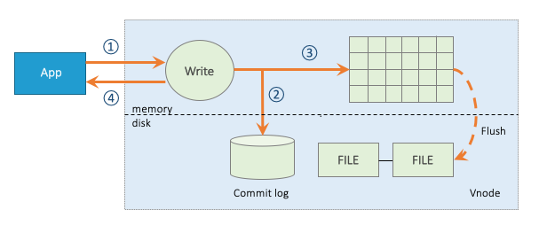

# 数据模型和设计

## 数据模型

### 物联网典型场景

在典型的物联网、车联网、运维监测场景中，往往有多种不同类型的数据采集设备，采集一个到多个不同的物理量。而同一种采集设备类型，往往又有多个具体的采集设备分布在不同的地点。大数据处理系统就是要将各种采集的数据汇总，然后进行计算和分析。对于同一类设备，其采集的数据类似如下的表格：

| Device ID |  Time Stamp   | Value 1 | Value 2 | Value 3 | Tag 1 | Tag 2 |
| :-------: | :-----------: | :-----: | :-----: | :-----: | :---: | :---: |
|   D1001   | 1538548685000 |  10.3   |   219   |  0.31   |  Red  | Tesla |
|   D1002   | 1538548684000 |  10.2   |   220   |  0.23   | Blue  |  BMW  |
|   D1003   | 1538548686500 |  11.5   |   221   |  0.35   | Black | Honda |
|   D1004   | 1538548685500 |  13.4   |   223   |  0.29   |  Red  | Volvo |
|   D1001   | 1538548695000 |  12.6   |   218   |  0.33   |  Red  | Tesla |
|   D1004   | 1538548696600 |  11.8   |   221   |  0.28   | Black | Honda |

每一条记录都有设备ID，时间戳，采集的物理量，还有与每个设备相关的静态标签。每个设备是受外界的触发，或按照设定的周期采集数据。采集的数据点是时序的，是一个数据流。

### 数据特征 

除时序特征外，仔细研究发现，物联网、车联网、运维监测类数据还具有很多其他明显的特征。

1. 数据是结构化的；
2. 数据极少有更新或删除操作；
3. 无需传统数据库的事务处理；
4. 相对互联网应用，写多读少；
5. 流量平稳，根据设备数量和采集频次，可以预测出来；
6. 用户关注的是一段时间的趋势，而不是某一特点时间点的值；
7. 数据是有保留期限的；
8. 数据的查询分析一定是基于时间段和地理区域的；
9. 除存储查询外，还往往需要各种统计和实时计算操作；
10. 数据量巨大，一天采集的数据就可以超过100亿条。

充分利用上述特征，TDengine采取了一特殊的优化的存储和计算设计来处理时序数据，能将系统处理能力显著提高。

### 关系型数据库模型

因为采集的数据一般是结构化数据，而且为降低学习门槛，TDengine采用传统的关系型数据库模型管理数据。因此用户需要先创建库，然后创建表，之后才能插入或查询数据。

### 一个设备一张表 

为充分利用其数据的时序性和其他数据特点，TDengine要求**对每个数据采集点单独建表**（比如有一千万个智能电表，就需创建一千万张表，上述表格中的D1001, D1002, D1003, D1004都需单独建表），用来存储这个采集点所采集的时序数据。这种设计能保证一个采集点的数据在存储介质上是一块一块连续的，大幅减少随机读取操作，成数量级的提升读取和查询速度。而且由于不同数据采集设备产生数据的过程完全独立，每个设备只产生属于自己的数据，一张表也就只有一个写入者。这样每个表就可以采用无锁方式来写，写入速度就能大幅提升。同时，对于一个数据采集点而言，其产生的数据是时序的，因此写的操作可用追加的方式实现，进一步大幅提高数据写入速度。

### 数据建模最佳实践

**表(Table)**：TDengine 建议用数据采集点的名字(如上表中的D1001)来做表名。每个数据采集点可能同时采集多个物理量(如上表中的value1, value2, value3)，每个物理量对应一张表中的一列，数据类型可以是整型、浮点型、字符串等。除此之外，表的第一列必须是时间戳，即数据类型为 timestamp。有的设备有多组采集量，每一组的采集频次是不一样的，这是需要对同一个设备建多张表。对采集的数据，TDengine将自动按照时间戳建立索引，但对采集的物理量不建任何索引。数据是用列式存储方式保存。 

**超级表(Super Table)**：对于同一类型的采集点，为保证Schema的一致性，而且为便于聚合统计操作，可以先定义超级表STable(详见第10章)，然后再定义表。每个采集点往往还有静态标签信息(如上表中的Tag 1, Tag 2)，比如设备型号、颜色等，这些静态信息不会保存在存储采集数据的数据节点中，而是通过超级表保存在元数据节点中。这些静态标签信息将作为过滤条件，用于采集点之间的数据聚合统计操作。

**库(DataBase)**：不同的数据采集点往往具有不同的数据特征，包括数据采集频率高低，数据保留时间长短，备份数目，单个字段大小等等。为让各种场景下TDengine都能最大效率的工作，TDengine建议将不同数据特征的表创建在不同的库里。创建一个库时，除SQL标准的选项外，应用还可以指定保留时长、数据备份的份数、cache大小、文件块大小、是否压缩等多种参数(详见第19章)。

**Schemaless vs Schema**: 与NoSQL的各种引擎相比，由于应用需要定义schema，插入数据的灵活性降低。但对于物联网、金融这些典型的时序数据场景，schema会很少变更，因此这个灵活性不够的设计就不成问题。相反，TDengine采用结构化数据来进行处理的方式将让查询、分析的性能成数量级的提升。

TDengine对库的数量、超级表的数量以及表的数量没有做任何限制，而且其多少不会对性能产生影响，应用按照自己的场景创建即可。

## 主要模块
如图所示，TDengine服务主要包含两大模块：**管理节点模块(MGMT)** 和 **数据节点模块(DNODE)**。整个TDengine还包含**客户端模块**。

  

 图 1 TDengine架构示意图  

### 管理节点模块
管理节点模块主要负责元数据的存储和查询等工作，其中包括用户信息的管理、数据库和表信息的创建、删除以及查询等。应用连接TDengine时会首先连接到管理节点。在创建/删除数据库和表时，请求也会首先发送请求到管理节点模块。由管理节点模块首先创建/删除元数据信息，然后发送请求到数据节点模块进行分配/删除所需要的资源。在数据写入和查询时，应用同样会首先访问管理节点模块，获取元数据信息。然后根据元数据管理信息访问数据节点模块。

### 数据节点模块
写入数据的存储和查询工作是由数据节点模块负责。 为了更高效地利用资源，以及方便将来进行水平扩展，TDengine内部对数据节点进行了虚拟化，引入了虚拟节点(virtual node, 简称vnode）的概念，作为存储、资源分配以及数据备份的单元。如图2所示，在一个dnode上，通过虚拟化，可以将该dnode视为多个虚拟节点的集合。

创建一个库时，系统会自动分配vnode。每个vnode存储一定数量的表中的数据，但一个表只会存在于一个vnode里，不会跨vnode。一个vnode只会属于一个库，但一个库会有一到多个vnode。不同的vnode之间资源互不共享。每个虚拟节点都有自己的缓存，在硬盘上也有自己的存储目录。而同一vnode内部无论是缓存还是硬盘的存储都是共享的。通过虚拟化，TDengine可以将dnode上有限的物理资源合理地分配给不同的vnode，大大提高资源的利用率和并发度。一台物理机器上的虚拟节点个数可以根据其硬件资源进行配置。

   

 图 2 TDengine虚拟化  

### 客户端模块
TDengine客户端模块主要负责将应用传来的请求（SQL语句）进行解析，转化为内部结构体再发送到服务端。TDengine的各种接口都是基于TDengine的客户端模块进行开发的。客户端模块与管理模块使用TCP/UDP通讯，端口号由系统参数mgmtShellPort配置, 缺省值为6030。客户端与数据节点模块也是使用TCP/UDP通讯，端口号由系统参数vnodeShellPort配置, 缺省值为6035。两个端口号均可通过<a href="../administrator/#Configuration-on-Server">系统配置文件taos.cfg</a>进行个性化设置。

## 写入流程
TDengine的完整写入流程如图3所示。为了保证写入数据的安全性和完整性，TDengine在写入数据时采用[预写日志算法]。客户端发来的数据在经过验证以后，首先会写入预写日志中，以保证TDengine能够在断电等因素导致的服务重启时从预写日志中恢复数据，避免数据的丢失。写入预写日志后，数据会被写到对应的vnode的缓存中。随后，服务端会发送确认信息给客户端表示写入成功。TDengine中存在两种机制可以促使缓存中的数据写入到硬盘上进行持久化存储：

   

 图 3 TDengine写入流程  

1. **时间驱动的落盘**：TDengine服务会定时将vnode缓存中的数据写入到硬盘上，默认为一个小时落一次盘。落盘间隔可在配置文件taos.cfg中通过参数commitTime配置。
2. **数据驱动的落盘**：当vnode中缓存的数据达到一定规模时，为了不阻塞后续数据的写入，TDengine也会拉起落盘线程将缓存中的数据清空。数据驱动的落盘会刷新定时落盘的时间。

TDengine在数据落盘时会打开新的预写日志文件，在落盘后则会删除老的预写日志文件，避免日志文件无限制的增长。TDengine对缓存按照先进先出的原则进行管理，以保证每个表的最新数据都在缓存中。

## 数据存储

TDengine将所有数据存储在/var/lib/taos/目录下，您可以通过系统配置参数dataDir进行个性化配置。

TDengine中的元数据信息包括TDengine中的数据库、表、用户等信息。每个超级表、以及每个表的标签数据也存放在这里。为提高访问速度，元数据全部有缓存。

TDengine中写入的数据在硬盘上是按时间维度进行分片的。同一个vnode中的表在同一时间范围内的数据都存放在同一文件组中。这一数据分片方式可以大大简化数据在时间维度的查询，提高查询速度。在默认配置下，硬盘上的每个数据文件存放10天数据。用户可根据需要修改系统配置参数daysPerFile进行个性化配置。

表中的数据都有保存时间，一旦超过保存时间（缺省是3650天），数据将被系统自动删除。您可以通过系统配置参数daysToKeep进行个性化设置。

数据在文件中是按块存储的。每个数据块只包含一张表的数据，且数据是按照时间主键递增排列的。数据在数据块中按列存储，这样使得同列的数据存放在一起，对于不同的数据类型还采用不同的压缩方法，大大提高压缩的比例，节省存储空间。

数据文件总共有三类文件，一类是data文件，它存放了真实的数据块，该文件只进行追加操作；一类文件是head文件, 它存放了其对应的data文件中数据块的索引信息；第三类是last文件，专门存储最后写入的数据，每次落盘操作时，这部分数据会与内存里的数据合并，并决定是否写入data文件还是last文件。