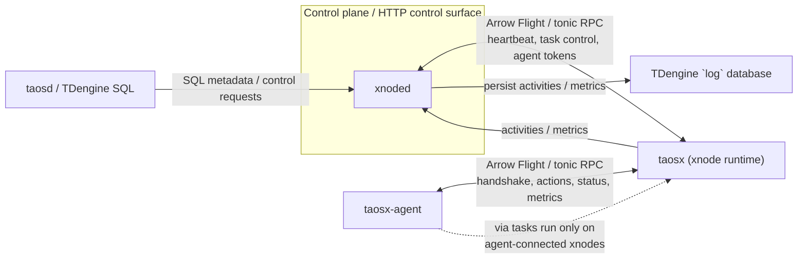

# AGENTS.md

This file provides guidance to WARP (warp.dev) when working with code in this repository.

## Project Overview

taosX is a zero-code data ingestion pipeline for TDengine, built in Rust. It provides offline data import/export, real-time replication, and external data source integration from various databases, message queues, and industrial protocols.

**Key Components:**
- `taosx`: Main data integration service
- `taos-explorer`: Web-based UI for database management
- `taosx-agent`: Agent for distributed deployments
- `taosx-core`: Core library with shared functionality
- `crates/`: Modular source/sink implementations for different data sources

## Build System

The project uses `cargo-make` as the primary build orchestrator. All commands should go through `make` or `cargo make`:

```bash
# Core build commands
cargo make build-all              # Build taosx + taos-explorer
cargo make build-all-with-agent   # Build all including taosx-agent
cargo make build -p taosx         # Build specific package

# Build with different profiles
BUILD_PROFILE=release cargo make build-all
BUILD_PROFILE=production cargo make build-all  # Optimized for production

# External plugins (require Java/Go)
cargo make plugins                # Build InfluxDB, OpenTSDB, OPC plugins
```

**Important:** The UI build (explorer) is required and runs automatically before building. To skip: `NO_BUILD_UI=true cargo make build-all`

### Prerequisites
- **Rust**: 1.90.0+ (install via `rustup`)
- **Node.js**: v16 (for UI, via nvm)
- **Java SDK**: 11+ with Maven (for InfluxDB/OpenTSDB plugins)
- **Go**: 1.20+ (for OPC-UA/DA plugins)

## Testing

The project uses `nextest` for Rust tests and `pytest` for E2E tests. Tests are organized by data source and can be run independently.

### Quick Testing Commands

```bash
# Fast pre-commit checks (no external dependencies)
cargo make pre-commit             # Runs fmt, clippy, core tests

# Core tests (no data sources required)
cargo make test-core

# Test specific data source
cargo make test-datasource-kafka
cargo make test-datasource-mysql
cargo make test-datasource-postgres

# E2E tests
cargo make e2e-sanity             # Smoke tests
cargo make e2e-kafka              # Kafka scenarios
cargo make e2e-mysql              # MySQL scenarios

# Test groups
cargo make test-all-relational-db         # All SQL databases
cargo make test-all-message-queue         # Kafka, MQTT
cargo make test-all-industrial-protocol   # OPC-UA/DA, PI, Historian
```

### Running Individual Tests

```bash
# List all test cases
cargo nextest list

# Run specific test
cargo nextest run --workspace <test-name>

# Run tests with specific features
cargo nextest run -p taosx-integration-tests --features test-mysql

# Run Python E2E test
cd tests/e2e
poetry run pytest -m sanity
poetry run pytest -sv opcua_test.py::test_sanity
```

### Test Organization

Tests are categorized by data source with feature flags:
- `test-kafka`, `test-mqtt` - Message queues
- `test-mysql`, `test-oracle`, `test-postgres`, `test-mssql` - Relational databases
- `test-mongodb` - NoSQL
- `test-opcua`, `test-opcda`, `test-pi`, `test-historian` - Industrial protocols

Tests that require external data sources use feature flags and can be skipped if the data source is unavailable.

## Code Coverage

```bash
# Install coverage tools
cargo install cargo-llvm-cov

# Generate coverage report
cargo llvm-cov --html --open nextest run --workspace

# Integration tests with coverage
cargo make test-integration-with-coverage
```

## Linting & Formatting

```bash
# Format code
cargo fmt --all

# Check formatting
cargo make fmt

# Run clippy
cargo make clippy
```

## Local Installation

```bash
# Install locally (systemd services)
cargo make install-locally

# Install agent
cargo make install-agent

# Install plugins
cargo make install-plugins        # All plugins
cargo make install-plugin-opc     # Specific plugin
```

## Running Services

```bash
# After installation
sudo systemctl start taosx
sudo systemctl start taos-explorer
sudo systemctl start taosx-agent

# Or use the helper script
./start_services.sh --agent_name=my_agent

# Without installation
./target/release/taosx --help
./target/release/taos-explorer --help
```

Access the web UI at: http://localhost:6060

## Architecture Overview

### Modular Source/Sink System
The project is organized around pluggable data sources and sinks in `crates/`:

**Sources:**
- `source-{kafka,mqtt,pulsar}`: Message queues
- `source-{mysql,oracle,postgres,mssql,mongodb}`: Databases
- `source-{opcua,opcda,pi,historian,kinghistorian}`: Industrial protocols
- `source-{csv,parquet,orc,influxdb,opentsdb,sparkplugb}`: File formats & other systems

**Sinks:**
- `sink-{kafka,mqtt,parquet}`: Output destinations
- `tmq-to-td`, `tmq-to-local`: TDengine TMQ consumers
- `local-to-taos`, `legacy-to-taos`: TDengine writers
- `taos-to-local`: TDengine readers

### Core Components
- **taosx-core**: Shared types, connectors, transformation engine
- **taosx-ipc**: IPC stream, ack, and typed payload format for internal data pipelines
- **taosx-metrics**: Metrics collection plus channel/snapshot recorders
- **taosx-task**: Task management
- **ha-core**: High availability core
- **archive**: Data archival functionality

### Runtime Service Boundaries
- `taosx serve` starts three execution domains in one process: the main Actix REST API, a dedicated scheduler runtime, and a dedicated Arrow Flight RPC runtime. The default REST port is `6050`; the default Flight RPC port is `6055`.
- Task execution has two spawn paths. Without `via`, jobs run locally inside the xnode process; with `via`, the scheduler delegates planning, validation, and runtime actions through `AgentWorker` to a connected `taosx-agent`.
- Scheduler, agent integration, and RPC streaming are connected with `tokio::sync::broadcast` and `flume` channels. When state looks stale, investigate channel backpressure or lagged receivers in addition to task logic.

### Xnode / Xnoded Architecture Notes



- `xnoded` is the control-plane service in this repo. Its HTTP API is defined in `xnoded/src/api.rs` and exposes routes for xnode, task, agent, and rebalance operations such as `/xnode`, `/task/{id}`, `/task/check`, `/agents`, and rebalance endpoints.
- `xnoded` bootstraps its in-memory state from TDengine metadata by querying `SHOW XNODES`, `SHOW XNODE TASKS`, `SHOW XNODE JOBS`, and `SHOW XNODE AGENTS`, then keeps TDengine metadata synchronized with runtime state through SQL such as `ALTER XNODE TASK ...`, `ALTER XNODE JOB ...`, and agent status updates.
- In this codebase, an `xnode` is a remote `taosx` instance managed by `xnoded`. `xnoded` connects to each xnode with `ha_rpc_client::HaRpcClient`, tracks online/offline/drain state, refreshes heartbeat metrics, reconnects dropped nodes, and replays agent/task state after reconnection.
- The `xnoded` <-> `taosx` and `taosx-agent` <-> `taosx` data planes use Apache Arrow Flight over `tonic` channels with handshake and token headers. Treat this path as RPC/Flight, not as the HTTP routes defined in `xnoded/src/api.rs`.
- Task lifecycle control flows through `xnoded` into `taosx` RPC handlers under `src/serve/rpc/processor/xnode/api.rs`. `xnoded` plans tasks, starts/stops task jobs, checks data-source validity, lists task state, and propagates agent tokens by calling `HaRpcClient` methods such as `plan_task`, `start_task_job`, `stop_task_job`, `check_valid`, `add_agents`, and `list_agents`.
- The `via` field is part of xnode task/job config. When `via` is set, `taosx` routes planning, validation, sample fetching, and runtime execution through the target agent, and `xnoded` only schedules that work onto xnodes where the agent is currently connected.
- `taosx` and agents push runtime activities and metrics back over Flight. `xnoded` persists task activities, agent activities, and task metrics into the TDengine `log` database and also uses those events to update `SHOW XNODE TASKS` / `SHOW XNODE JOBS` state in TDengine.
- Agent registration is token-driven. `xnoded` loads agent tokens from `SHOW XNODE AGENTS`, forwards them to connected xnodes, and `taosx` only accepts an agent connection when the presented token decodes to a known agent. The agent-side examples and startup scripts expect users to copy the returned token into `agent.toml`.
- The structured debugging path for control RPC now lives at the boundaries: `xnoded/src/api.rs` owns HTTP request/response logs, `crates/ha-rpc-client/src/client.rs` owns outbound Flight request/response/failure logs, and `src/serve/rpc/processor/received.rs` owns the taosx receive-side Flight receive/handled/failure logs. Correlate the Flight path with `action` and `req_id` first, then use `xnoded_id`, `agent_id`, and `client_type` when needed.
- This repository does not contain `taosd` source, so `taosd` parent/child process management for `xnoded` is not directly verifiable here. For code work in this repo, rely on the implementation-backed boundary above: `xnoded` exposes an HTTP control surface, while `taosx`/agents communicate through Arrow Flight RPC.

### Explorer / IPC / Plugin Notes
- `explorer/server` is a separate Actix backend from the Explorer frontend. It maintains taosadapter connection pools, reads xnode metadata with SQL such as `SHOW XNODES`, and bridges browser operations into xnode RPC or HTTP through `x_api` helpers like `get_client()` and `get_x_http_port()`.
- `taosx-ipc` defines the internal stream schema used by IPC-oriented pipelines, including reserved metadata fields such as `__tables__`, `__attrs__`, `__records__`, `__table_name__`, and `__control__`.
- `taosx-metrics` provides two complementary recorders: `ChannelRecorder` forwards metric events into channels for downstream transport, while `TaosXRecorder` keeps snapshot/export state and evicts idle metrics with generational storage.
- External runners under `taosx-core/src/plugins/runners` execute many non-Rust connectors as subprocesses from `${PLUGINS_HOME}` / `${TAOSX_PLUGINS_HOME}` instead of loading them in-process. Plugin failures often come from executable paths, environment setup, version probes, or stdout/stderr parsing.
- `src/replica` is a control-plane CLI over the taosx HTTP task API, defaulting to `http://localhost:6050`, and manages active-standby replication by creating and operating replica-labelled tasks rather than exposing a separate replication daemon.

### Test Infrastructure
- `tests/integration/`: Rust integration tests organized by data source
- `tests/e2e/`: Python E2E scenario tests using pytest
- `tests/performance/`: Performance benchmarks

Test documentation is in `docs/dev/`:
- `TEST_QUICKSTART.md`: Common test commands
- `TEST_REFACTORING_PLAN.md`: Test architecture design
- `TEST_MIGRATION_EXAMPLE.md`: Test migration guide

## Development Workflow

1. **Check dependencies**: Ensure required data sources are running before testing
2. **Format first**: Run `cargo fmt --all` before committing
3. **Pre-commit**: Run `cargo make pre-commit` to validate changes
4. **Test incrementally**: Use specific test tasks rather than running all tests
5. **Coverage**: Check coverage when adding new features

## Important Notes

- **TDengine Required**: Most functionality requires TDengine v3.0+ to be installed
- **Data Sources**: Tests requiring external data sources (MySQL, Kafka, etc.) need those services to be running and configured in `tests/e2e/config/env.yaml`
- **Build Profile**: Default profile is `release`. Use `BUILD_PROFILE=dev` for debug builds
- **Workspace**: This is a Cargo workspace with 50+ member crates
- **Rust Edition**: 2024 edition, requires Rust 1.90.0+
- **Memory Allocator**: Uses `mimalloc` by default (can switch to `jemallocator`)
- **TLS**: Supports both `rustls` (default) and `native-tls`

## CI/CD

GitHub Actions workflows in `.github/workflows/`:
- `pr-ci.yaml`: PR validation (lint, format, core tests)
- `3.0-qa-ci.yaml`: Full test suite with coverage

## Packaging & Release

```bash
# Package for distribution
cd packaging
python3 release.py -o taosx        # taosx + explorer + plugins
python3 release.py -ba 1           # taosx-agent + plugins

# Release location
# Internal NAS: http://192.168.1.252:5000/ under /Release/TDengine/
```

## Documentation

- [Development Guide](docs/dev/README.md)
- [Contributing Guidelines](CONTRIBUTING.md)
- [Test Quick Start](docs/dev/TEST_QUICKSTART.md)
- [Coverage Usage](docs/dev/COVERAGE_USAGE.md)

## Common Issues

**Java/Go plugin errors**: Install JDK 11+ with Maven, and Go 1.20+ for external plugins.

**UI build failures**: Ensure Node.js 16 is installed. Use `nvm use 16` to switch versions.

**Test data source unavailable**: Use `cargo make check-datasources` to verify. Skip with feature flags if needed.

**Memory issues during tests**: At least 4 cores and 16GB RAM recommended for full test suite.
