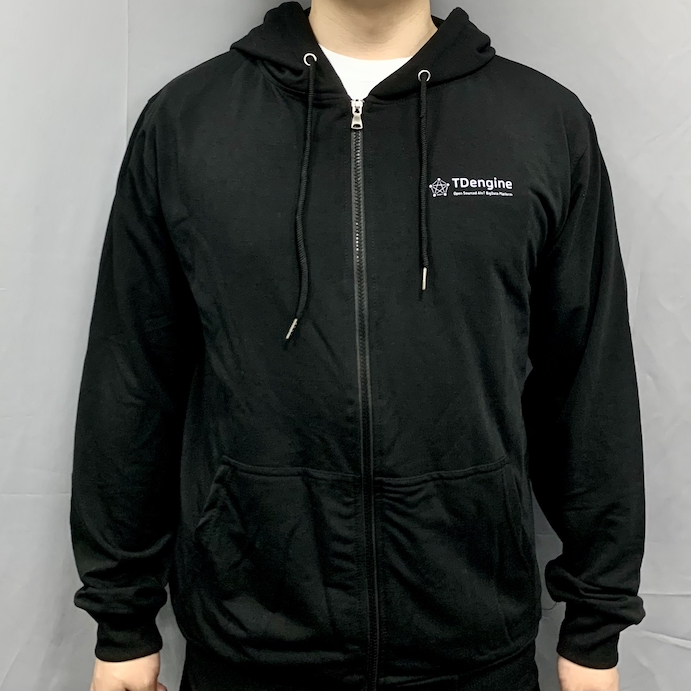

# 贡献指南

我们感谢所有开发者提交贡献。随时关注我们，Fork 存储库，报告错误，以及在 GitHub 上提交您的代码。但是，我们希望开发者遵循我们的指南，才能更好的做出贡献。

## 报告错误

- 任何用户都可以通过 **[GitHub issue tracker](https://github.com/taosdata/TDengine/issues)** 向我们报告错误。请您对所遇到的问题进行**详细描述**，最好提供重现错误的详细步骤。
- 欢迎提供包含由 Bug 生成的日志文件的附录。

## 需要强调的代码提交规则

- 在提交代码之前，需要**同意贡献者许可协议（CLA）**。点击 [TaosData CLA](https://cla-assistant.io/taosdata/TDengine) 阅读并签署协议。如果您不接受该协议，请停止提交。
- 请在 [GitHub issue tracker](https://github.com/taosdata/TDengine/issues) 中解决问题或添加注册功能。
- 如果在 [GitHub issue tracker](https://github.com/taosdata/TDengine/issues) 中没有找到相应的问题或功能，请**创建一个新的 issue**。
- 将代码提交到我们的存储库时，请创建**包含问题编号的 PR**。

## 贡献指南

1. 请用友好的语气书写。

2. **主动语态**总体上优于被动语态。主动语态中的句子会突出执行动作的人，而不是被动语态突出动作的接受者。

3. 文档写作建议

- 正确拼写产品名称 “TDengine”。 “TD” 用大写字母，“TD” 和 “engine” 之间没有空格 **（正确拼写：TDengine）**。
- 在句号或其他标点符号后只留一个空格。

4. 尽量**使用简单句**，而不是复杂句。

## 给贡献者的礼品

只要您是为 TDengine 做贡献的开发者，不管是代码贡献、修复 bug 或功能请求，还是文档更改，您都将会获得一份**特别的贡献者纪念品礼物**！

  
  
  

TDengine 社区致力于让更多的开发者理解和使用它。
请填写**贡献者提交表**以选择您想收到的礼物。

- [贡献者提交表](https://page.ma.scrmtech.com/form/index?pf_uid=27715_2095&id=12100)

## 联系我们

如果您有什么问题需要解决，或者有什么问题需要解答，可以添加微信：TDengineECO
