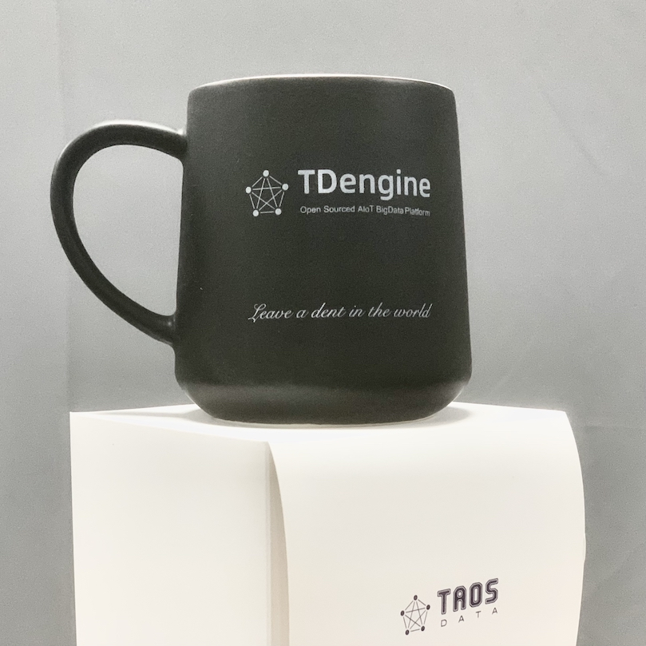

# Contributing to TDengine

TDengine Community Edition is free, open-source software. Its development is led by the TDengine Team, but we welcome contributions from all community members and open-source developers. This document describes how you can contribute, no matter whether you're a user or a developer yourself.

## Bug reports

All users can report bugs to us through the **[GitHub issue tracker](https://github.com/taosdata/TDengine/issues)**. To ensure that the development team can locate and resolve the issue that you experienced, please include the following in your bug report:

- A detailed description of the issue, including the steps to reproduce it.
- Any log files that may be relevant to the issue.

## Code contributions

Developers are encouraged to submit patches to the project, and all contributions, from minor documentation changes to bug fixes, are appreciated by our team. To ensure that your code can be merged successfully and improve the experience for other community members, we ask that you go through the following procedure before submitting a pull request: 

1. Read and accept the terms of the TAOS Data Contributor License Agreement (CLA) located at [https://cla-assistant.io/taosdata/TDengine](https://cla-assistant.io/taosdata/TDengine).

2. For bug fixes, search the [GitHub issue tracker](https://github.com/taosdata/TDengine/issues) to check whether the bug has already been filed.
   - If the bug that you want to fix already exists in the issue tracker, review the previous discussion before submitting your patch.
   - If the bug that you want to fix does not exist in the issue tracker, click **New issue** and file a report.
   - Ensure that you note the issue number in your pull request when you submit your patch.
	
3. Fork our repository to your GitHub account and create a branch for your patch.
   **Important:** The `main` branch is for stable versions and cannot accept patches directly. For all code and documentation changes, create your own branch from the development branch `3.0` and not from `main`.
   Note: For a documentation change, ensure that the branch name starts with `docs/` so that the change can be merged without running tests.
   
4. Create a pull request to merge your changes into the development branch `3.0`, and our team members will review the request as soon as possible.

If you encounter any difficulties or problems in contributing your code, you can join our [Discord server](https://discord.com/invite/VZdSuUg4pS) and receive assistance from members of the TDengine Team.

## Expressing our thanks

To thank community members for your support, we are offering a free gift to any developer who submits at least one contribution. You can choose one of the following items:

  
  
  

If you would like to claim your gift, send an email to [developer@tdengine.com](mailto:developer@tdengine.com?subject=Claiming&20my%20developer%20gift) including the following information:

- Your GitHub account name
- Your name and mailing address
- Your preferred gift

Note: Limit one per person.