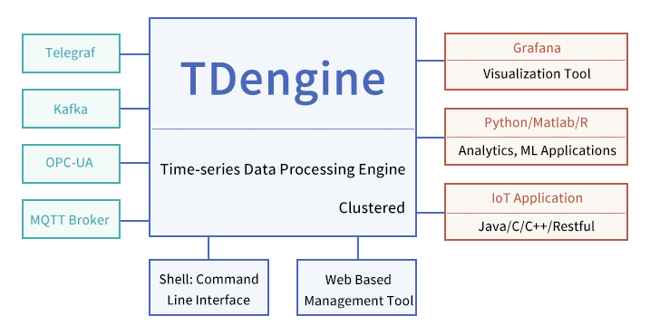

TDengine 是一款高性能、分布式、支持 SQL 的时序数据库 (Database)，其核心代码，包括集群功能全部开源（开源协议，AGPL v3.0）。TDengine 能被广泛运用于物联网、工业互联网、车联网、IT 运维、金融等领域。除核心的时序数据库 (Database) 功能外，TDengine 还提供[缓存](/develop/cache/)、[数据订阅](/develop/subscribe)、[流式计算](/develop/continuous-query)等大数据平台所需要的系列功能，最大程度减少研发和运维的复杂度。

本章节介绍TDengine的主要功能、竞争优势、适用场景、与其他数据库的对比测试等等，让大家对TDengine有个整体的了解。

## 主要功能

TDengine的主要功能如下：

1. 高速数据写入，除 [SQL 写入](/develop/insert-data/sql-writing)外，还支持 [Schemaless 写入](/reference/schemaless/)，支持 [InfluxDB LINE 协议](/develop/insert-data/influxdb-line)，[OpenTSDB Telnet](/develop/insert-data/opentsdb-telnet), [OpenTSDB JSON ](/develop/insert-data/opentsdb-json)等协议写入；
2. 第三方数据采集工具 [Telegraf](/third-party/telegraf)，[Prometheus](/third-party/prometheus)，[StatsD](/third-party/statsd)，[collectd](/third-party/collectd)，[icinga2](/third-party/icinga2), [TCollector](/third-party/tcollector), [EMQ](/third-party/emq-broker), [HiveMQ](/third-party/hive-mq-broker) 等都可以进行配置后，不用任何代码，即可将数据写入；
3. 支持[各种查询](/develop/query-data),包括聚合查询、嵌套查询、降采样查询、插值等
4. 支持[用户自定义函数](/develop/udf)
5. 支持[缓存](/develop/cache)，将每张表的最后一条记录缓存起来，这样无需 Redis
6. 支持[连续查询](/develop/continuous-query)(Continuous Query)
7. 支持[数据订阅](/develop/subscribe)，而且可以指定过滤条件
8. 支持[集群](/cluster/)，可以通过多节点进行水平扩展，并通过多副本实现高可靠
9. 提供[命令行程序](/reference/taos-shell)，便于管理集群，检查系统状态，做即席查询
10. 提供多种数据的[导入](/operation/import)、[导出](/operation/export)
11. 支持对[TDengine 集群本身的监控](/operation/monitor)
12. 提供 [C/C++](/reference/connector/cpp), [Java](/reference/connector/java), [Python](/reference/connector/python), [Go](/reference/connector/go), [Rust](/reference/connector/rust), [Node.js](/reference/connector/node) 等多种编程语言的[连接器](/reference/connector/)
13. 支持 [REST 接口](/reference/rest-api/)
14. 支持与[ Grafana 无缝集成](/third-party/grafana)
15. 支持与 Google Data Studio 无缝集成

更多细小的功能，请阅读整个文档。

## 竞争优势

由于 TDengine 充分利用了[时序数据特点](https://www.taosdata.com/blog/2019/07/09/105.html)，比如结构化、无需事务、很少删除或更新、写多读少等等，设计了全新的针对时序数据的存储引擎和计算引擎，因此与其他时序数据库相比，TDengine 有以下特点：

- **[高性能](https://www.taosdata.com/fast)**：通过创新的存储引擎设计，无论是数据写入还是查询，TDengine 的性能比通用数据库快 10 倍以上，也远超其他时序数据库，而且存储空间也大为节省。

- **[分布式](https://www.taosdata.com/scalable)**：通过原生分布式的设计，TDengine 提供了水平扩展的能力，只需要增加节点就能获得更强的数据处理能力，同时通过多副本机制保证了系统的高可用。

- **[支持 SQL](https://www.taosdata.com/sql-support)**：TDengine 采用 SQL 作为数据查询语言，减少学习和迁移成本，同时提供 SQL 扩展来处理时序数据特有的分析，而且支持方便灵活的 schemaless 数据写入。

- **All in One**：将数据库、消息队列、缓存、流式计算等功能融合一起，应用无需再集成 Kafka/Redis/HBase/Spark 等软件，大幅降低应用开发和维护成本。

- **零管理**：安装、集群几秒搞定，无任何依赖，不用分库分表，系统运行状态监测能与 Grafana 或其他运维工具无缝集成。

- **零学习成本**：采用 SQL 查询语言，支持 C/C++、Python、Java、Go、Rust、Node.js、C#、Lua（社区贡献）、PHP（社区贡献） 等多种编程语言,与 MySQL 相似，零学习成本。

- **无缝集成**：不用一行代码，即可与 Telegraf、Grafana、Prometheus、EMQX、HiveMQ、StatsD、collectd、icinga、TCollector、Matlab、R 等第三方工具无缝集成。

- **互动 Console**: 通过命令行 console，不用编程，执行 SQL 语句就能做即席查询、各种数据库的操作、管理以及集群的维护.

采用 TDengine，可将典型的物联网、车联网、工业互联网大数据平台的总拥有成本大幅降低。表现在几个方面：

1. 由于其超强性能，它能将系统需要的计算资源和存储资源大幅降低
2. 因为采用 SQL 接口，能与众多第三放软件无缝集成，学习迁移成本大幅下降
3. 因为其 All In One 的特性，系统复杂度降低，能降研发成本
4. 因为运维维护简单，运营维护成本能大幅降低

## 技术生态

在整个时序大数据平台中，TDengine 在其中扮演的角色如下：

<figure>

</figure>

图 1. TDengine技术生态图

上图中，左侧是各种数据采集或消息队列，包括 OPC-UA、MQTT、Telegraf、也包括 Kafka, 他们的数据将被源源不断的写入到 TDengine。右侧则是可视化、BI 工具、组态软件、应用程序。下侧则是 TDengine 自身提供的命令行程序 (CLI) 以及可视化管理管理。

## 总体适用场景

作为一个高性能、分布式、支持 SQL 的时序数据库 （Database)，TDengine 的典型适用场景包括但不限于 IoT、工业互联网、车联网、IT 运维、能源、金融证券等领域。需要指出的是，TDengine 是针对时序数据场景设计的专用数据库和专用大数据处理工具，因充分利用了时序大数据的特点，它无法用来处理网络爬虫、微博、微信、电商、ERP、CRM 等通用型数据。本文对适用场景做更多详细的分析。

### 数据源特点和需求

从数据源角度，设计人员可以从下面几个角度分析 TDengine 在目标应用系统里面的适用性。

| 数据源特点和需求             | 不适用 | 可能适用 | 非常适用 | 简单说明                                                                                                                        |
| ---------------------------- | ------ | -------- | -------- | ------------------------------------------------------------------------------------------------------------------------------- |
| 总体数据量巨大               |        |          | √        | TDengine 在容量方面提供出色的水平扩展功能，并且具备匹配高压缩的存储结构，达到业界最优的存储效率。                               |
| 数据输入速度偶尔或者持续巨大 |        |          | √        | TDengine 的性能大大超过同类产品，可以在同样的硬件环境下持续处理大量的输入数据，并且提供很容易在用户环境里面运行的性能评估工具。 |
| 数据源数目巨大               |        |          | √        | TDengine 设计中包含专门针对大量数据源的优化，包括数据的写入和查询，尤其适合高效处理海量（千万或者更多量级）的数据源。           |

### 系统架构要求

| 系统架构要求           | 不适用 | 可能适用 | 非常适用 | 简单说明                                                                                              |
| ---------------------- | ------ | -------- | -------- | ----------------------------------------------------------------------------------------------------- |
| 要求简单可靠的系统架构 |        |          | √        | TDengine 的系统架构非常简单可靠，自带消息队列，缓存，流式计算，监控等功能，无需集成额外的第三方产品。 |
| 要求容错和高可靠       |        |          | √        | TDengine 的集群功能，自动提供容错灾备等高可靠功能。                                                   |
| 标准化规范             |        |          | √        | TDengine 使用标准的 SQL 语言提供主要功能，遵守标准化规范。                                            |

### 系统功能需求

| 系统功能需求               | 不适用 | 可能适用 | 非常适用 | 简单说明                                                                                                              |
| -------------------------- | ------ | -------- | -------- | --------------------------------------------------------------------------------------------------------------------- |
| 要求完整的内置数据处理算法 |        | √        |          | TDengine 的实现了通用的数据处理算法，但是还没有做到妥善处理各行各业的所有要求，因此特殊类型的处理还需要应用层面处理。 |
| 需要大量的交叉查询处理     |        | √        |          | 这种类型的处理更多应该用关系型数据系统处理，或者应该考虑 TDengine 和关系型数据系统配合实现系统功能。                  |

### 系统性能需求

| 系统性能需求           | 不适用 | 可能适用 | 非常适用 | 简单说明                                                                                               |
| ---------------------- | ------ | -------- | -------- | ------------------------------------------------------------------------------------------------------ |
| 要求较大的总体处理能力 |        |          | √        | TDengine 的集群功能可以轻松地让多服务器配合达成处理能力的提升。                                        |
| 要求高速处理数据       |        |          | √        | TDengine 的专门为 IoT 优化的存储和数据处理的设计，一般可以让系统得到超出同类产品多倍数的处理速度提升。 |
| 要求快速处理小粒度数据 |        |          | √        | 这方面 TDengine 性能可以完全对标关系型和 NoSQL 型数据处理系统。                                        |

### 系统维护需求

| 系统维护需求           | 不适用 | 可能适用 | 非常适用 | 简单说明                                                                                                              |
| ---------------------- | ------ | -------- | -------- | --------------------------------------------------------------------------------------------------------------------- |
| 要求系统可靠运行       |        |          | √        | TDengine 的系统架构非常稳定可靠，日常维护也简单便捷，对维护人员的要求简洁明了，最大程度上杜绝人为错误和事故。         |
| 要求运维学习成本可控   |        |          | √        | 同上。                                                                                                                |
| 要求市场有大量人才储备 | √      |          |          | TDengine 作为新一代产品，目前人才市场里面有经验的人员还有限。但是学习成本低，我们作为厂家也提供运维的培训和辅助服务。 |

## 与其他数据库的对比测试

- [用 InfluxDB 开源的性能测试工具对比 InfluxDB 和 TDengine](https://www.taosdata.com/blog/2020/01/13/1105.html)
- [TDengine 与 OpenTSDB 对比测试](https://www.taosdata.com/blog/2019/08/21/621.html)
- [TDengine 与 Cassandra 对比测试](https://www.taosdata.com/blog/2019/08/14/573.html)
- [TDengine VS InfluxDB ，写入性能大 PK ！](https://www.taosdata.com/2021/11/05/3248.html)
- [TDengine 和 InfluxDB 查询性能对比测试报告](https://www.taosdata.com/2022/02/22/5969.html)
- [TDengine 与 InfluxDB、OpenTSDB、Cassandra、MySQL、ClickHouse 等数据库的对比测试报告](https://www.taosdata.com/downloads/TDengine_Testing_Report_cn.pdf)
