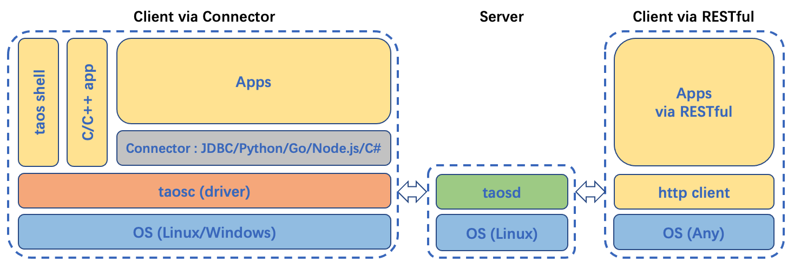

TDengine 提供了丰富的应用程序开发接口，为了便于用户快速开发自己的应用，TDengine 支持了多种编程语言的连接器，其中官方连接器包括支持 C/C++、Java、Python、Go、Node.js、C# 和 Rust 的连接器。这些连接器支持使用原生接口（taosc）和 REST 接口（部分语言暂不支持）连接 TDengine 集群。社区开发者也贡献了多个非官方连接器，例如 ADO.NET 连接器、Lua 连接器和 PHP 连接器。

## 支持的平台

目前 TDengine 的原生接口连接器可支持的平台包括：X64/X86/ARM64/ARM32/MIPS/Alpha 等硬件平台，以及 Linux/Win64/Win32 等开发环境。对照矩阵如下：

| **CPU**        | **OS**    | **JDBC** | **Python** | **Go** | **Node.js** | **C#** | **Rust** | C/C++ |
| -------------- | --------- | -------- | ---------- | ------ | ----------- | ------ | -------- | ----- |
| **X86 64bit**  | **Linux** | ●        | ●          | ●      | ●           | ●      | ●        | ●     |
| **X86 64bit**  | **Win64** | ●        | ●          | ●      | ●           | ●      | ●        | ●     |
| **X86 64bit**  | **Win32** | ●        | ●          | ●      | ●           | ○      | ○        | ●     |
| **X86 32bit**  | **Win32** | ○        | ○          | ○      | ○           | ○      | ○        | ●     |
| **ARM64**      | **Linux** | ●        | ●          | ●      | ●           | ○      | ○        | ●     |
| **ARM32**      | **Linux** | ●        | ●          | ●      | ●           | ○      | ○        | ●     |
| **MIPS 龙芯**  | **Linux** | ○        | ○          | ○      | ○           | ○      | ○        | ○     |
| **Alpha 申威** | **Linux** | ○        | ○          | --     | --          | --     | --       | ○     |
| **X86 海光**   | **Linux** | ○        | ○          | ○      | --          | --     | --       | ○     |

其中 ● 表示官方测试验证通过，○ 表示非官方测试验证通过，-- 表示未经验证。

使用 REST 连接由于不依赖客户端驱动可以支持更广泛的操作系统。

## 版本支持

TDengine 版本更新往往会增加新的功能特性，列表中的连接器版本为连接器最佳适配版本。

| **TDengine 版本**     | **Java** | **Python** | **Go**       | **C#**        | **Node.js**     | **Rust** |
| --------------------- | -------- | ---------- | ------------ | ------------- | --------------- | -------- |
| **2.4.0.14 及以上**   | 2.0.38   | 当前版本   | develop 分支 | 1.0.2 - 1.0.6 | 2.0.10 - 2.0.12 | 当前版本 |
| **2.4.0.6 及以上**    | 2.0.37   | 当前版本   | develop 分支 | 1.0.2 - 1.0.6 | 2.0.10 - 2.0.12 | 当前版本 |
| **2.4.0.4 - 2.4.0.5** | 2.0.37   | 当前版本   | develop 分支 | 1.0.2 - 1.0.6 | 2.0.10 - 2.0.12 | 当前版本 |
| **2.2.x.x **          | 2.0.36   | 当前版本   | master 分支  | n/a           | 2.0.7 - 2.0.9   | 当前版本 |
| **2.0.x.x **          | 2.0.34   | 当前版本   | master 分支  | n/a           | 2.0.1 - 2.0.6   | 当前版本 |

## 功能特性

连接器对 TDengine 功能特性的支持对照如下：

### 使用原生接口（taosc）

| **功能特性**   | **Java** | **Python** | **Go** | **C#** | **Node.js** | **Rust** |
| -------------- | -------- | ---------- | ------ | ------ | ----------- | -------- |
| **连接管理**   | 支持     | 支持       | 支持   | 支持   | 支持        | 支持     |
| **普通查询**   | 支持     | 支持       | 支持   | 支持   | 支持        | 支持     |
| **连续查询**   | 支持     | 支持       | 支持   | 支持   | 支持        | 支持     |
| **参数绑定**   | 支持     | 支持       | 支持   | 支持   | 支持        | 支持     |
| **订阅功能**   | 支持     | 支持       | 支持   | 支持   | 支持        | 暂不支持 |
| **Schemaless** | 支持     | 支持       | 支持   | 支持   | 支持        | 支持     |
| **DataFrame**  | 不支持   | 支持       | 不支持 | 不支持 | 不支持      | 不支持   |

:::info
由于不同编程语言数据库框架规范不同，并不意味着所有 C/C++ 接口都需要对应封装支持。
:::

### 使用 REST 接口

| **功能特性**                   | **Java** | **Python** | **Go**   | **C#（暂不支持）** | **Node.js** | **Rust** |
| ------------------------------ | -------- | ---------- | -------- | ------------------ | ----------- | -------- |
| **连接管理**                   | 支持     | 支持       | 支持     | N/A                | 支持        | 支持     |
| **普通查询**                   | 支持     | 支持       | 支持     | N/A                | 支持        | 支持     |
| **连续查询**                   | 支持     | 支持       | 支持     | N/A                | 支持        | 支持     |
| **参数绑定**                   | 不支持   | 不支持     | 不支持   | N/A                | 不支持      | 不支持   |
| **订阅功能**                   | 不支持   | 不支持     | 不支持   | N/A                | 不支持      | 不支持   |
| **Schemaless**                 | 暂不支持 | 暂不支持   | 暂不支持 | N/A                | 暂不支持    | 暂不支持 |
| **批量拉取（基于 WebSocket）** | 支持     | 暂不支持   | 暂不支持 | N/A                | 暂不支持    | 暂不支持 |
| **DataFrame**                  | 不支持   | 支持       | 不支持   | N/A                | 不支持      | 不支持   |

:::warning

- 无论选用何种编程语言的连接器，2.0 及以上版本的 TDengine 推荐数据库应用的每个线程都建立一个独立的连接，或基于线程建立连接池，以避免连接内的“USE statement”状态量在线程之间相互干扰（但连接的查询和写入操作都是线程安全的）。

:::

import Tabs from "@theme/Tabs";
import TabItem from "@theme/TabItem";
import InstallOnWindows from "./_linux_install.mdx";
import InstallOnLinux from "./_windows_install.mdx";
import VerifyWindows from "./_verify_windows.mdx";
import VerifyLinux from "./_verify_linux.mdx";

## 安装客户端驱动

:::info
只有在没有安装 TDengine 服务端软件的系统上使用原生接口连接器才需要安装客户端驱动。

:::

### 安装步骤

<Tabs defaultValue="linux" groupId="os">
  <TabItem value="linux" label="Linux">
    <InstallOnWindows />
  </TabItem>
  <TabItem value="windows" label="Windows">
    <InstallOnLinux />
  </TabItem>
</Tabs>

### 安装验证

以上安装和配置完成后，并确认 TDengine 服务已经正常启动运行，此时可以执行 TDengine CLI 工具进行登录。

<Tabs defaultValue="linux" groupId="os">
  <TabItem value="linux" label="Linux">
    <VerifyLinux />
  </TabItem>
  <TabItem value="windows" label="Windows">
    <VerifyWindows />
  </TabItem>
</Tabs>

