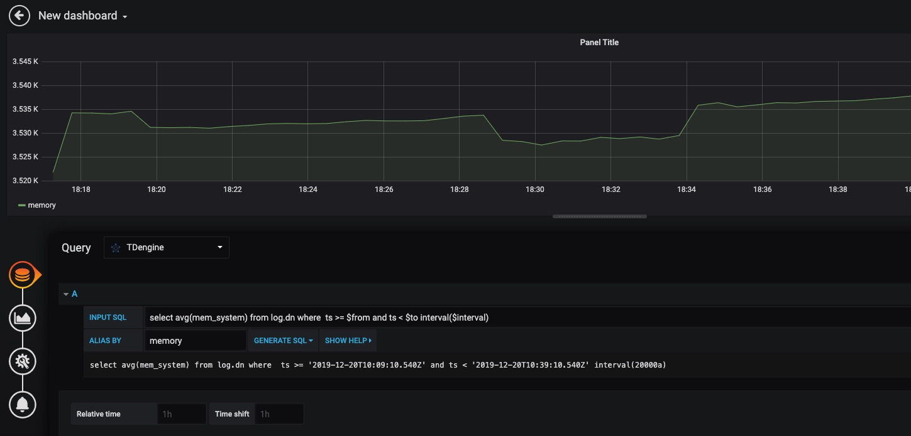

TDengine 能够与开源数据可视化系统 [Grafana](https://www.grafana.com/) 快速集成搭建数据监测报警系统，整个过程无需任何代码开发，TDengine 中数据表的内容可以在仪表盘(DashBoard)上进行可视化展现。关于 TDengine 插件的使用您可以在[GitHub](https://github.com/taosdata/grafanaplugin/blob/master/README.md)中了解更多。

## 前置条件

要让 Grafana 能正常添加 TDengine 数据源，需要以下几方面的准备工作。

- TDengine 集群已经部署并正常运行
- taosAdapter 已经安装并正常运行。具体细节请参考 [taosAdapter 的使用手册](/reference/taosadapter)

记录以下信息：

- TDengine 集群 REST API 地址，如：`http://tdengine.local:6041`。
- TDengine 集群认证信息，可使用用户名及密码。

## 安装 Grafana

目前 TDengine 支持 Grafana 7.5 以上的版本。用户可以根据当前的操作系统，到 Grafana 官网下载安装包，并执行安装。下载地址如下：<https://grafana.com/grafana/download>。

## 配置 Grafana

将集群信息设置为环境变量（也可以使用 [`.env`(dotenv) 文件](https://hexdocs.pm/dotenvy/dotenv-file-format.html) ）：

```sh
export TDENGINE_API=http://tdengine.local:6041
# user + password
export TDENGINE_USER=user
export TDENGINE_PASSWORD=password
```

运行安装脚本：

```sh
bash -c "$(curl -fsSL https://raw.githubusercontent.com/taosdata/grafanaplugin/master/install.sh)"
```

该脚本将自动安装 Grafana 插件并配置数据源。安装完毕后，需要重启 Grafana 服务后生效。

### 创建 Dashboard

回到主界面创建 Dashboard，点击 Add Query 进入面板查询页面：


如上图所示，在 Query 中选中 `TDengine` 数据源，在下方查询框可输入相应 SQL 进行查询，具体说明如下：

- INPUT SQL：输入要查询的语句（该 SQL 语句的结果集应为两列多行），例如：`select avg(mem_system) from log.dn where ts >= $from and ts < $to interval($interval)` ，其中，from、to 和 interval 为 TDengine 插件的内置变量，表示从 Grafana 插件面板获取的查询范围和时间间隔。除了内置变量外，`也支持可以使用自定义模板变量`。
- ALIAS BY：可设置当前查询别名。
- GENERATE SQL： 点击该按钮会自动替换相应变量，并生成最终执行的语句。

按照默认提示查询当前 TDengine 部署所在服务器指定间隔系统内存平均使用量如下：



> 关于如何使用 Grafana 创建相应的监测界面以及更多有关使用 Grafana 的信息，请参考 Grafana 官方的[文档](https://grafana.com/docs/)。

### 导入 Dashboard

在数据源配置页面，您可以为该数据源导入 TDinsight 面板，作为 TDengine 集群的监控可视化工具。该 Dashboard 已发布在 Grafana：[Dashboard 15167 - TDinsight](https://grafana.com/grafana/dashboards/15167)) 。其他安装方式和相关使用说明请见 [TDinsight 用户手册](/reference/tdinsight/)。

使用 TDengine 作为数据源的其他面板，可以[在此搜索](https://grafana.com/grafana/dashboards/?dataSource=tdengine-datasource)。以下是一份不完全列表：

- [15146](https://grafana.com/grafana/dashboards/15146): 监控多个 TDengine 集群
- [15155](https://grafana.com/grafana/dashboards/15155): TDengine 告警示例
- [15167](https://grafana.com/grafana/dashboards/15167): TDinsight
- [16388](https://grafana.com/grafana/dashboards/16388): Telegraf 采集节点信息的数据展示
