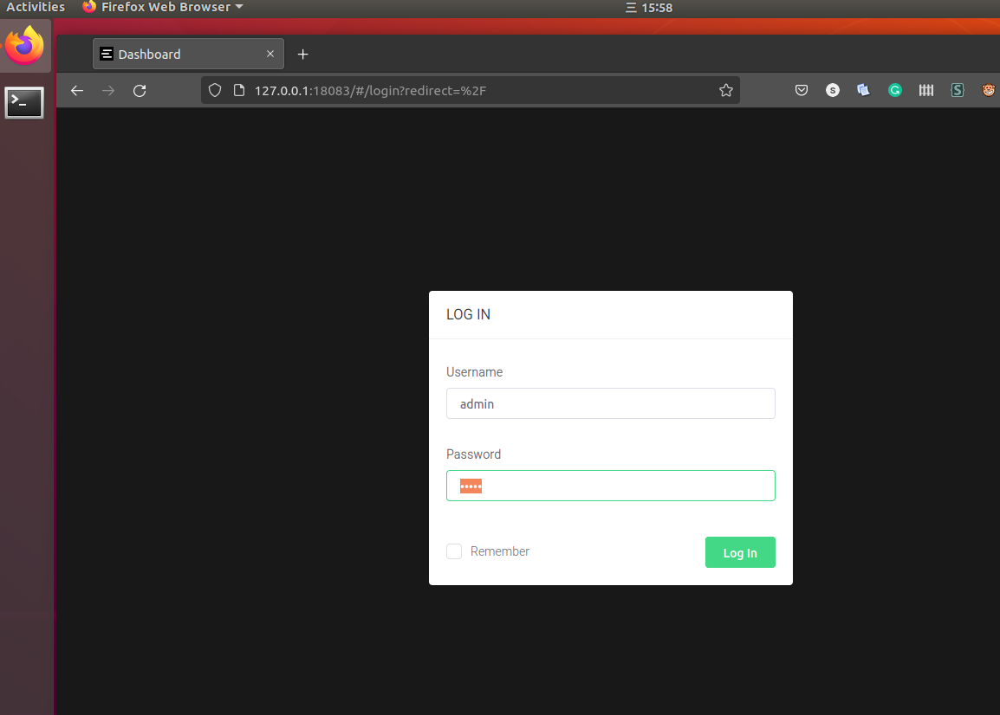
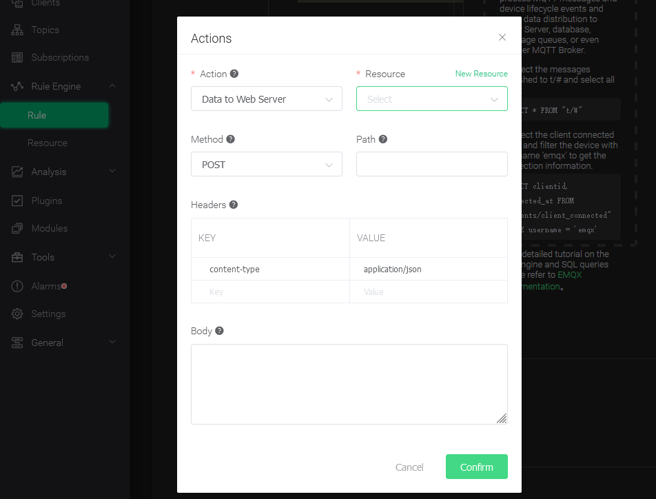
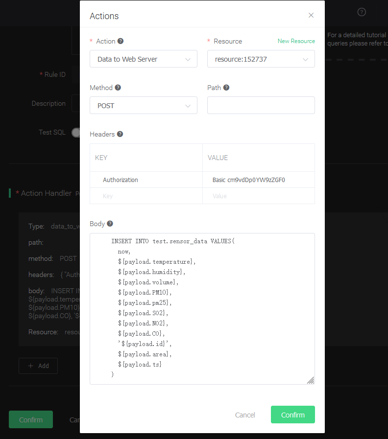
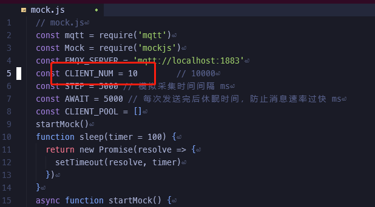
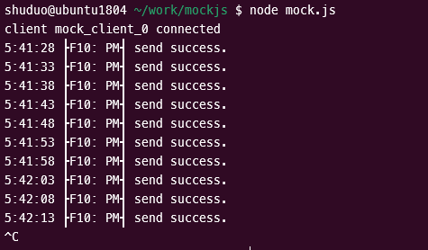
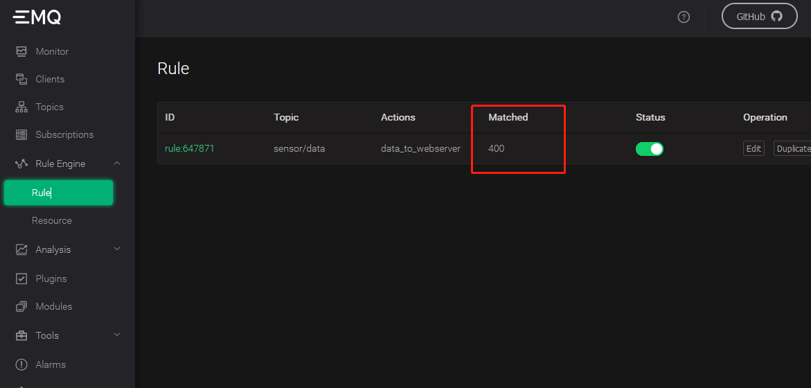

MQTT 是流行的物联网数据传输协议，[EMQX](https://github.com/emqx/emqx)是一开源的 MQTT Broker 软件，无需任何代码，只需要在 EMQX Dashboard 里使用“规则”做简单配置，即可将 MQTT 的数据直接写入 TDengine。EMQX 支持通过 发送到 Web 服务的方式保存数据到 TDengine，也在企业版上提供原生的 TDengine 驱动实现直接保存。

## 前置条件

要让 EMQX 能正常添加 TDengine 数据源，需要以下几方面的准备工作。
- TDengine 集群已经部署并正常运行
- taosAdapter 已经安装并正常运行。具体细节请参考 [taosAdapter 的使用手册](/reference/taosadapter)
- 如果使用后文介绍的模拟写入程序，需要安装合适版本的 Node.js，推荐安装 v12。

## 安装并启动 EMQX

用户可以根据当前的操作系统，到 EMQX 官网下载安装包，并执行安装。下载地址如下：<https://www.emqx.io/zh/downloads>。安装后使用 `sudo emqx start` 或 `sudo systemctl start emqx` 启动 EMQX 服务。

## 在 TDengine 中为接收 MQTT 数据创建相应数据库和表结构

### 以 Docker 安装 TDengine 为例

```bash
    docker exec -it tdengine bash
    taos
```

### 创建数据库和表

```sql
    create database test;
    use test;
    create table:

    CREATE TABLE sensor_data (ts timestamp, temperature float, humidity float, volume float, PM10 float, pm25 float, SO2 float, NO2 float, CO float, sensor_id NCHAR(255), area TINYINT, coll_time timestamp);
```

注：表结构以博客[数据传输、存储、展现，EMQX + TDengine 搭建 MQTT 物联网数据可视化平台](https://www.taosdata.com/blog/2020/08/04/1722.html)为例。后续操作均以此博客场景为例进行，请你根据实际应用场景进行修改。

## 配置 EMQX 规则

由于 EMQX 不同版本配置界面所有不同，这里仅以 v4.4.3 为例，其他版本请参考相应官网文档。

### 登录 EMQX Dashboard

使用浏览器打开网址 http://IP:18083 并登录 EMQX Dashboard。初次安装用户名为 `admin` 密码为：`public`



### 创建规则（Rule）

选择左侧“规则引擎（Rule Engine）”中的“规则（Rule）”并点击“创建（Create）”按钮：


### 编辑 SQL 字段


### 新增“动作（action handler）”


### 新增“资源（Resource）”



选择“发送数据到 Web 服务“并点击“新建资源”按钮：

### 编辑“资源（Resource）”

选择“发送数据到 Web 服务“并填写 请求 URL 为 运行 taosAdapter 的服务器地址和端口（默认为 6041）。其他属性请保持默认值。


### 编辑“动作（action）”

编辑资源配置，增加 Authorization 认证的键/值配对项，相关文档请参考[ TDengine REST API 文档](https://docs.taosdata.com/reference/rest-api/)。在消息体中输入规则引擎替换模板。



## 编写模拟测试程序

```javascript
    // mock.js
    const mqtt = require('mqtt')
    const Mock = require('mockjs')
    const EMQX_SERVER = 'mqtt://localhost:1883'
    const CLIENT_NUM = 10
    const STEP = 5000 // 模拟采集时间间隔 ms
    const AWAIT = 5000 // 每次发送完后休眠时间，防止消息速率过快 ms
    const CLIENT_POOL = []
    startMock()
    function sleep(timer = 100) {
      return new Promise(resolve => {
        setTimeout(resolve, timer)
      })
    }
    async function startMock() {
      const now = Date.now()
      for (let i = 0; i < CLIENT_NUM; i++) {
        const client = await createClient(`mock_client_${i}`)
        CLIENT_POOL.push(client)
      }
      // last 24h every 5s
      const last = 24 * 3600 * 1000
      for (let ts = now - last; ts <= now; ts += STEP) {
        for (const client of CLIENT_POOL) {
          const mockData = generateMockData()
          const data = {
            ...mockData,
            id: client.clientId,
            area: 0,
            ts,
          }
          client.publish('sensor/data', JSON.stringify(data))
        }
        const dateStr = new Date(ts).toLocaleTimeString()
        console.log(`${dateStr} send success.`)
        await sleep(AWAIT)
      }
      console.log(`Done, use ${(Date.now() - now) / 1000}s`)
    }
    /**
     * Init a virtual mqtt client
     * @param {string} clientId ClientID
     */
    function createClient(clientId) {
      return new Promise((resolve, reject) => {
        const client = mqtt.connect(EMQX_SERVER, {
          clientId,
        })
        client.on('connect', () => {
          console.log(`client ${clientId} connected`)
          resolve(client)
        })
        client.on('reconnect', () => {
          console.log('reconnect')
        })
        client.on('error', (e) => {
          console.error(e)
          reject(e)
        })
      })
    }
    /**
    * Generate mock data
    */
    function generateMockData() {
     return {
       "temperature": parseFloat(Mock.Random.float(22, 100).toFixed(2)),
       "humidity": parseFloat(Mock.Random.float(12, 86).toFixed(2)),
       "volume": parseFloat(Mock.Random.float(20, 200).toFixed(2)),
       "PM10": parseFloat(Mock.Random.float(0, 300).toFixed(2)),
       "pm25": parseFloat(Mock.Random.float(0, 300).toFixed(2)),
       "SO2": parseFloat(Mock.Random.float(0, 50).toFixed(2)),
       "NO2": parseFloat(Mock.Random.float(0, 50).toFixed(2)),
       "CO": parseFloat(Mock.Random.float(0, 50).toFixed(2)),
       "area": Mock.Random.integer(0, 20),
       "ts": 1596157444170,
     }
    }
```

注意：代码中 CLIENT_NUM 在开始测试中可以先设置一个较小的值，避免硬件性能不能完全处理较大并发客户端数量。



## 执行测试模拟发送 MQTT 数据

```
npm install mqtt mockjs --save --registry=https://registry.npm.taobao.org
node mock.js
```



## 验证 EMQX 接收到数据

在 EMQX Dashboard 规则引擎界面进行刷新，可以看到有多少条记录被正确接收到：



## 验证数据写入到 TDengine

使用 TDengine CLI 程序登录并查询相应数据库和表，验证数据是否被正确写入到 TDengine 中：


TDengine 详细使用方法请参考 [TDengine 官方文档](https://docs.taosdata.com/)。
EMQX 详细使用方法请参考 [EMQX 官方文档](https://www.emqx.io/docs/zh/v4.4/rule/rule-engine.html)。

