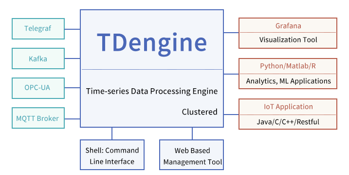

TDengine is a high-performance, scalable time-series database with SQL support. Its code, including its cluster feature is open source under GNU AGPL v3.0. Besides the database engine, it provides [caching](/develop/cache), [stream processing](/develop/continuous-query), [data subscription](/develop/subscribe)  and other functionalities to reduce the complexity and cost of development and operation.

This section introduces the major features, competitive advantages, typical use-cases and benchmarks to help you get a high level overview of TDengine.

## Major Features

The major features are listed below:

1. While TDengine supports [using SQL to insert](/develop/insert-data/sql-writing), it also supports [Schemaless writing](/reference/schemaless/) just like NoSQL databases. TDengine also supports standard protocols like [InfluxDB LINE](/develop/insert-data/influxdb-line)，[OpenTSDB Telnet](/develop/insert-data/opentsdb-telnet), [OpenTSDB JSON ](/develop/insert-data/opentsdb-json) among others.
2. TDengine supports seamless integration with third-party data collection agents like [Telegraf](/third-party/telegraf)，[Prometheus](/third-party/prometheus)，[StatsD](/third-party/statsd)，[collectd](/third-party/collectd)，[icinga2](/third-party/icinga2), [TCollector](/third-party/tcollector), [EMQX](/third-party/emq-broker), [HiveMQ](/third-party/hive-mq-broker). These agents can write data into TDengine with simple configuration and without a single line of code. 
3. Support for [all kinds of queries](/develop/query-data), including aggregation, nested query, downsampling, interpolation and others.
4. Support for [user defined functions](/develop/udf).
5. Support for [caching](/develop/cache). TDengine always saves the last data point in cache, so Redis is not needed in some scenarios.
6. Support for [continuous query](/develop/continuous-query).
7. Support for [data subscription](/develop/subscribe) with the capability to specify filter conditions.
8. Support for [cluster](/cluster/), with the capability of increasing processing power by adding more nodes. High availability is supported by replication. 
9. Provides an interactive [command-line interface](/reference/taos-shell) for management, maintenance and ad-hoc queries.
10. Provides many ways to [import](/operation/import) and [export](/operation/export) data.
11. Provides [monitoring](/operation/monitor) on running instances of TDengine.
12. Provides [connectors](/reference/connector/) for [C/C++](/reference/connector/cpp), [Java](/reference/connector/java), [Python](/reference/connector/python), [Go](/reference/connector/go), [Rust](/reference/connector/rust), [Node.js](/reference/connector/node) and other programming languages.
13. Provides a [REST API](/reference/rest-api/).
14. Supports seamless integration with [Grafana](/third-party/grafana) for visualization.
15. Supports seamless integration with Google Data Studio.

For more details on features, please read through the entire documentation. 

## Competitive Advantages

Time-series data is structured, not transactional, and is rarely deleted or updated. TDengine makes full use of [these characteristics of time series data](https://tdengine.com/2019/07/09/86.html) to build its own innovative storage engine and computing engine to differentiate itself from other time series databases, with the following advantages.

- **[High Performance](https://tdengine.com/fast)**: With an innovatively designed and purpose-built storage engine, TDengine outperforms other time series databases in data ingestion and querying while significantly reducing storage costs and compute costs.

- **[Scalable](https://tdengine.com/scalable)**: TDengine provides out-of-box scalability and high-availability through its native distributed design. Nodes can be added through simple configuration to achieve greater data processing power. In addition, this feature is open source.

- **[SQL Support](https://tdengine.com/sql-support)**: TDengine uses SQL as the query language, thereby reducing learning and migration costs, while adding SQL extensions to better handle time-series. Keeping NoSQL developers in mind, TDengine also supports convenient and flexible, schemaless data ingestion.

- **All in One**: TDengine has built-in caching, stream processing and data subscription functions. It is no longer necessary to integrate Kafka/Redis/HBase/Spark or other software in some scenarios. It makes the system architecture much simpler, cost-effective and easier to maintain.

- **Seamless Integration**: Without a single line of code, TDengine provide seamless, configurable integration with third-party tools such as Telegraf, Grafana, EMQX, Prometheus, StatsD, collectd, etc. More third-party tools are being integrated.

- **Zero Management**: Installation and cluster setup can be done in seconds. Data partitioning and sharding are executed automatically. TDengine’s running status can be monitored via Grafana or other DevOps tools.

- **Zero Learning Costs**: With SQL as the query language and support for ubiquitous tools like Python, Java, C/C++, Go, Rust, and Node.js connectors, and a REST API, there are zero learning costs.

- **Interactive Console**: TDengine provides convenient console access to the database, through a CLI, to run ad hoc queries, maintain the database, or manage the cluster, without any programming.

With TDengine, the total cost of ownership of your time-series data platform can be greatly reduced. 1: With its superior performance, the computing and storage resources are reduced significantly 2: With SQL support, it can be seamlessly integrated with many third party tools, and learning costs/migration costs are reduced significantly 3: With its simple architecture and zero management, the operation and maintenance costs are reduced. 

## Technical Ecosystem
This is how TDengine would be situated, in a typical time-series data processing platform:

Figure 1. TDengine Technical Ecosystem

On the left-hand side, there are data collection agents like OPC-UA, MQTT, Telegraf and Kafka. On the right-hand side, visualization/BI tools, HMI, Python/R, and IoT Apps can be connected. TDengine itself provides an interactive command-line interface and a web interface for management and maintenance.

## Typical Use Cases

As a high-performance, scalable and SQL supported time-series database, TDengine's typical use case include but are not limited to IoT, Industrial Internet, Connected Vehicles, IT operation and maintenance, energy, financial markets and other fields. TDengine is a purpose-built database optimized for the characteristics of time series data. As such, it cannot be used to process data from web crawlers, social media, e-commerce, ERP, CRM and so on. More generally TDengine is not a suitable storage engine for non-time-series data. This section makes a more detailed analysis of the applicable scenarios.

### Characteristics and Requirements of Data Sources

| **Data Source Characteristics and Requirements**         | **Not Applicable** | **Might Be Applicable** | **Very Applicable** | **Description**                                              |
| -------------------------------------------------------- | ------------------ | ----------------------- | ------------------- | :----------------------------------------------------------- |
| A massive amount of total data                              |                    |                         | √                   | TDengine provides excellent scale-out functions in terms of capacity, and has a storage structure with matching high compression ratio to achieve the best storage efficiency in the industry.|
| Data input velocity is extremely high |                    |                         | √                   | TDengine's performance is much higher than that of other similar products. It can continuously process larger amounts of input data in the same hardware environment, and provides a performance evaluation tool that can easily run in the user environment. |
| A huge number of data sources                            |                    |                         | √                   | TDengine is optimized specifically for a huge number of data sources. It is especially suitable for efficiently ingesting, writing and querying data from billions of data sources. |

### System Architecture Requirements

| **System Architecture Requirements**              | **Not Applicable** | **Might Be Applicable** | **Very Applicable** | **Description**                                              |
| ------------------------------------------------- | ------------------ | ----------------------- | ------------------- | ------------------------------------------------------------ |
| A simple and reliable system architecture |                    |                         | √                   | TDengine's system architecture is very simple and reliable, with its own message queue, cache, stream computing, monitoring and other functions. There is no need to integrate any additional third-party products. |
| Fault-tolerance and high-reliability      |                    |                         | √                   | TDengine has cluster functions to automatically provide high-reliability and high-availability functions such as fault tolerance and disaster recovery. |
| Standardization support                    |                    |                         | √                   | TDengine supports standard SQL and provides SQL extensions for time-series data analysis. |

### System Function Requirements

| **System Function Requirements**              | **Not Applicable** | **Might Be Applicable** | **Very Applicable** | **Description**                                              |
| ------------------------------------------------- | ------------------ | ----------------------- | ------------------- | ------------------------------------------------------------ |
| Complete data processing algorithms built-in |                    | √                    |                     | While TDengine implements various general data processing algorithms, industry specific algorithms and special types of processing will need to be implemented at the application level.|
| A large number of crosstab queries             |                    | √                    |                     | This type of processing is better handled by general purpose relational database systems but TDengine can work in concert with relational database systems to provide more complete solutions. |

### System Performance Requirements

| **System Performance Requirements**              | **Not Applicable** | **Might Be Applicable** | **Very Applicable** | **Description**                                              |
| ------------------------------------------------- | ------------------ | ----------------------- | ------------------- | ------------------------------------------------------------ |
| Very large total processing capacity     |                    |                      | √                   | TDengine’s cluster functions can easily improve processing capacity via multi-server coordination. |
| Extremely high-speed data processing           |                    |                      | √                   | TDengine’s storage and data processing are optimized for IoT, and can process data many times faster than similar products.|
| Extremely fast processing of high resolution data |                    |                      | √                   | TDengine has achieved the same or better performance than other relational and NoSQL data processing systems. |

### System Maintenance Requirements

| **System Maintenance Requirements**              | **Not Applicable** | **Might Be Applicable** | **Very Applicable** | **Description**                                              |
| ------------------------------------------------- | ------------------ | ----------------------- | ------------------- | ------------------------------------------------------------ |
| Native high-reliability         |                    |                      | √                   | TDengine has a very robust, reliable and easily configurable system architecture to simplify routine operation. Human errors and accidents are eliminated to the greatest extent, with a streamlined experience for operators. |
| Minimize learning and maintenance costs |                    |                      | √                   | In addition to being easily configurable, standard SQL support and the Taos shell for ad hoc queries makes maintenance simpler, allows reuse and reduces learning costs.|
| Abundant talent supply               | √                  |                      |                     | Given the above, and given the extensive training and professional services provided by TDengine, it is easy to migrate from existing solutions or create a new and lasting solution based on TDengine.|

## Comparison with other databases

- [Writing Performance Comparison of TDengine and InfluxDB ](https://tdengine.com/2022/02/23/4975.html)
- [Query Performance Comparison of TDengine and InfluxDB](https://tdengine.com/2022/02/24/5120.html)
- [TDengine vs InfluxDB、OpenTSDB、Cassandra、MySQL、ClickHouse](https://www.tdengine.com/downloads/TDengine_Testing_Report_en.pdf)
- [TDengine vs OpenTSDB](https://tdengine.com/2019/09/12/710.html)
- [TDengine vs Cassandra](https://tdengine.com/2019/09/12/708.html)
- [TDengine vs InfluxDB](https://tdengine.com/2019/09/12/706.html)
