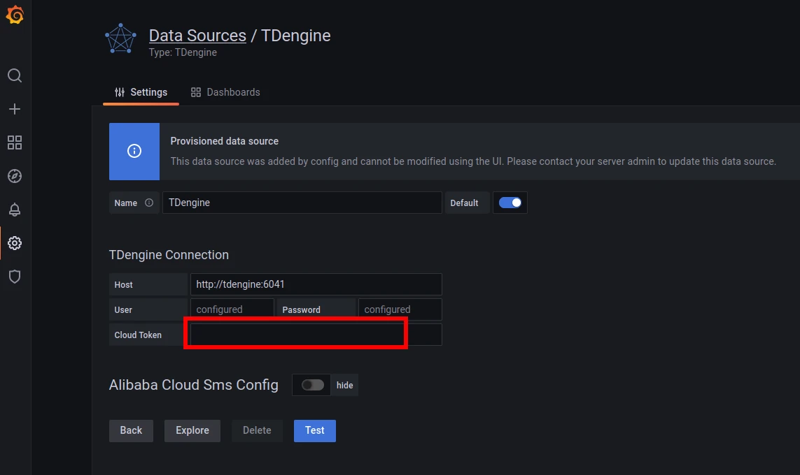
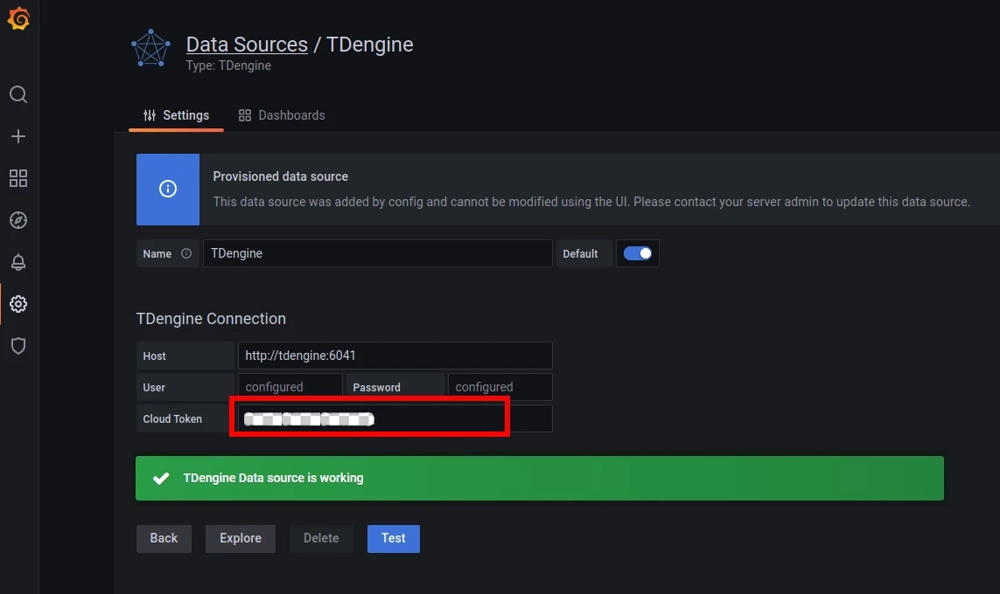

TDengine can be quickly integrated with the open-source data visualization system [Grafana](https://www.grafana.com/) to build a data monitoring and alerting system. The whole process does not require any code development. And you can visualize the contents of the data tables in TDengine on a dashboard.

You can learn more about using the TDengine plugin on [GitHub](https://github.com/taosdata/grafanaplugin/blob/master/README.md).

## Installing Grafana

TDengine currently supports Grafana versions 7.5 and above. Users can go to the Grafana official website to download the installation package and execute the installation according to the current operating system. The download address is as follows: <https://grafana.com/grafana/download>.

## Configuring Grafana

Follow the installation steps in [Grafana](https://grafana.com/grafana/plugins/tdengine-datasource/?tab=installation) with the [``grafana-cli`` command-line tool](https://grafana.com/docs/grafana/latest/administration/cli/) for plugin installation.

```bash
grafana-cli plugins install tdengine-datasource
# with sudo
sudo -u grafana grafana-cli plugins install tdengine-datasource
```

Alternatively, you can manually download the .zip file from [GitHub](https://github.com/taosdata/grafanaplugin/releases/tag/latest) or [Grafana](https://grafana.com/grafana/plugins/tdengine-datasource/?tab=installation) and unpack it into your grafana plugins directory.

```bash
GF_VERSION=3.2.3
# from GitHub
wget https://github.com/taosdata/grafanaplugin/releases/download/v$GF_VERSION/tdengine-datasource-$GF_VERSION.zip
# from Grafana
wget -O tdengine-datasource-$GF_VERSION.zip https://grafana.com/api/plugins/tdengine-datasource/versions/$GF_VERSION/download
```

Take CentOS 7.2 for example, extract the plugin package to /var/lib/grafana/plugins directory, and restart grafana.

```bash
sudo unzip tdengine-datasource-$GF_VERSION.zip -d /var/lib/grafana/plugins/
```

If Grafana is running in a Docker environment, the TDengine plugin can be automatically installed and set up using the following environment variable settings:

```bash
GF_INSTALL_PLUGINS=tdengine-datasource
```

## Using Grafana

### Configuring Data Sources

Users can log in to the Grafana server (username/password: admin/admin) directly through the URL `http://localhost:3000` and add a datasource through `Configuration -> Data Sources` on the left side, as shown in the following figure.


Click `Add data source` to enter the Add data source page, and enter TDengine in the query box to add it, as shown in the following figure.


Enter the datasource configuration page, and follow the default prompts to modify the corresponding configuration.



- Host: The URL string the TDengine Cloud assigns for the registered user.
- User: leave it as default.
- Password: leave it as default.
- Cloud Token: The token string the TDengine Cloud assigns for the registered user.

Click `Save & Test` to test. You should see a success message if the test worked.



Please refer to the [documentation](https://docs.tdengine.com/third-party/grafana#create-dashboard) for more details.
