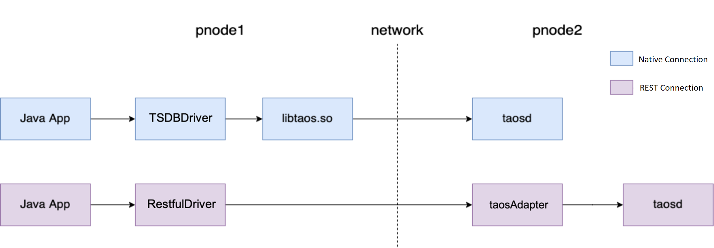

import Tabs from '@theme/Tabs';
import TabItem from '@theme/TabItem';

'taos-jdbcdriver' is TDengine's official Java language connector, which allows Java developers to develop applications that access the TDengine database. 'taos-jdbcdriver' implements the interface of the JDBC driver standard and provides two forms of connectors. One is to connect to a TDengine instance natively through the TDengine client driver (taosc), which supports functions including data writing, querying, subscription, schemaless writing, and bind interface. And the other is to connect to a TDengine instance through the REST interface provided by taosAdapter (2.4.0.0 and later). REST connections implement has a slight differences to compare the set of features implemented and native connections.



The preceding diagram shows two ways for a Java app to access TDengine via connector:

- JDBC native connection: Java applications use TSDBDriver on physical node 1 (pnode1) to call client-driven directly (`libtaos.so` or `taos.dll`) APIs to send writing and query requests to taosd instances located on physical node 2 (pnode2).
- JDBC REST connection: The Java application encapsulates the SQL as a REST request via RestfulDriver, sends it to the REST server of physical node 2 (taosAdapter), requests TDengine server through the REST server, and returns the result.

Using REST connection, which does not rely on TDengine client drivers.It can be cross-platform more convenient and flexible but introduce about 30% lower performance than native connection.

:::info
TDengine's JDBC driver implementation is as consistent as possible with the relational database driver. Still, there are differences in the use scenarios and technical characteristics of TDengine and relational object databases, so 'taos-jdbcdriver' also has some differences from traditional JDBC drivers. You need to pay attention to the following points when using:

- TDengine does not currently support delete operations for individual data records.
- Transactional operations are not currently supported.

:::

## Supported platforms

Native connection supports the same platform as TDengine client-driven support.
REST connection supports all platforms that can run Java.

## Version support

Please refer to [Version Support List](/reference/connector#version-support).

## TDengine DataType vs. Java DataType

TDengine currently supports timestamp, number, character, Boolean type, and the corresponding type conversion with Java is as follows:

| TDengine DataType | JDBCType (driver version < 2.0.24) | JDBCType (driver version > = 2.0.24) |
| ----------------- | --------------------------------- | ---------------------------------- |
| TIMESTAMP         | java.lang.Long                    | java.sql.Timestamp                 |
| INT               | java.lang.Integer                 | java.lang.Integer                  |
| BIGINT            | java.lang.Long                    | java.lang.Long                     |
| FLOAT             | java.lang.Float                   | java.lang.Float                    |
| DOUBLE            | java.lang.Double                  | java.lang.Double                   |
| SMALLINT          | java.lang.Short                   | java.lang.Short                    |
| TINYINT           | java.lang.Byte                    | java.lang.Byte                     |
| BOOL              | java.lang.Boolean                 | java.lang.Boolean                  |
| BINARY            | java.lang.String                  | byte array                         |
| NCHAR             | java.lang.String                  | java.lang.String                   |
| JSON              | -                                 | java.lang.String                   |

**Note**: Only TAG supports JSON types

## Installation steps

### Pre-installation preparation

Before using Java Connector to connect to the database, the following conditions are required.

- Java 1.8 or above runtime environment and Maven 3.6 or above installed
- TDengine client driver installed (required for native connections, not required for REST connections), please refer to [Installing Client Driver](/reference/connector#Install-Client-Driver)

### Install the connectors

<Tabs defaultValue="maven">
<TabItem value="maven" label="install via Maven">

- [sonatype](https://search.maven.org/artifact/com.taosdata.jdbc/taos-jdbcdriver)
- [mvnrepository](https://mvnrepository.com/artifact/com.taosdata.jdbc/taos-jdbcdriver)
- [maven.aliyun](https://maven.aliyun.com/mvn/search)

Add following dependency in the `pom.xml` file of your Maven project:

```xml-dtd
<dependency>
 <groupId>com.taosdata.jdbc</groupId>
 <artifactId>taos-jdbcdriver</artifactId>
 <version>2.0.**</version>
</dependency>
```

</TabItem>
<TabItem value="source" label="Build from source code">

You can build Java connector from source code after clone TDengine project:

```shell
git clone https://github.com/taosdata/TDengine.git
cd TDengine/src/connector/jdbc
mvn clean install -Dmaven.test.skip=true
```

After compilation, a jar package of taos-jdbcdriver-2.0.XX-dist .jar is generated in the target directory, and the compiled jar file is automatically placed in the local Maven repository.

</TabItem>
</Tabs>

## Establish a connection

TDengine's JDBC URL specification format is:
`jdbc:[TAOS| TAOS-RS]://[host_name]:[port]/[database_name]? [user={user}|&password={password}|&charset={charset}|&cfgdir={config_dir}|&locale={locale}|&timezone={timezone}]`

For establishing connections, native connections differ slightly from REST connections.

<Tabs defaultValue="native">
<TabItem value="native" label="Native connection">

```java
Class.forName("com.taosdata.jdbc.TSDBDriver");
String jdbcUrl = "jdbc:TAOS://taosdemo.com:6030/test?user=root&password=taosdata";
Connection conn = DriverManager.getConnection(jdbcUrl);
```

In the above example, TSDBDriver, which uses a JDBC native connection, establishes a connection to a hostname `taosdemo.com`, port `6030` (the default port for TDengine), and a database named `test`. In this URL, the user name `user` is specified as `root`, and the `password` is `taosdata`.

Note: With JDBC native connections, taos-jdbcdriver relies on the client driver (`libtaos.so` on Linux; `taos.dll` on Windows).

The configuration parameters in the URL are as follows:

- user: Log in to the TDengine username. The default value is 'root'.
- password: User login password, the default value is 'taosdata'.
- cfgdir: client configuration file directory path, default '/etc/taos' on Linux OS, 'C:/TDengine/cfg' on Windows OS.
- charset: The character set used by the client, the default value is the system character set.
- locale: Client locale, by default, use the system's current locale.
- timezone: The time zone used by the client, the default value is the system's current time zone.
- batchfetch: true: pulls result sets in batches when executing queries; false: pulls result sets row by row. The default value is: false. Enabling batch pulling and obtaining a batch of data can improve query performance when the query data volume is large.
- batchErrorIgnore:true: When executing statement executeBatch, if there is a SQL execution failure in the middle, the following SQL will continue to be executed. false: No more statements after the failed SQL are executed. The default value is: false.

For more information about JDBC native connections, see [Video Tutorial](https://www.taosdata.com/blog/2020/11/11/1955.html).

**Connect using the TDengine client-driven configuration file **

When you use a JDBC native connection to connect to a TDengine cluster, you can use the TDengine client driver configuration file to specify parameters such as `firstEp` and `secondEp` of the cluster in the configuration file as below:

1. Do not specify hostname and port in Java applications.

```java
public Connection getConn() throws Exception{
  Class.forName("com.taosdata.jdbc.TSDBDriver");
  String jdbcUrl = "jdbc:TAOS://:/test?user=root&password=taosdata";
  Properties connProps = new Properties();
  connProps.setProperty(TSDBDriver.PROPERTY_KEY_CHARSET, "UTF-8");
  connProps.setProperty(TSDBDriver.PROPERTY_KEY_LOCALE, "en_US.UTF-8");
  connProps.setProperty(TSDBDriver.PROPERTY_KEY_TIME_ZONE, "UTC-8");
  Connection conn = DriverManager.getConnection(jdbcUrl, connProps);
  return conn;
}
```

2. specify the firstEp and the secondEp in the configuration file taos.cfg

```shell
# first fully qualified domain name (FQDN) for TDengine system
firstEp               cluster_node1:6030

# second fully qualified domain name (FQDN) for TDengine system, for cluster only
secondEp              cluster_node2:6030

# default system charset
# charset               UTF-8

# system locale
# locale                en_US.UTF-8
```

In the above example, JDBC uses the client's configuration file to establish a connection to a hostname `cluster_node1`, port 6030, and a database named `test`. When the firstEp node in the cluster fails, JDBC attempts to connect to the cluster using secondEp.

In TDengine, as long as one node in firstEp and secondEp is valid, the connection to the cluster can be established normally.

> **Note**: The configuration file here refers to the configuration file on the machine where the application that calls the JDBC Connector is located, the default path is `/etc/taos/taos.cfg` on Linux, and the default path is `C://TDengine/cfg/taos.cfg` on Windows.

</TabItem>
<TabItem value="rest" label="REST connection">

```java
Class.forName("com.taosdata.jdbc.rs.RestfulDriver");
String jdbcUrl = "jdbc:TAOS-RS://taosdemo.com:6041/test?user=root&password=taosdata";
Connection conn = DriverManager.getConnection(jdbcUrl);
```

In the above example, a RestfulDriver with a JDBC REST connection is used to establish a connection to a database named `test` with hostname `taosdemo.com` on port `6041`. The URL specifies the user name as `root` and the password as `taosdata`.

There is no dependency on the client driver when Using a JDBC REST connection. Compared to a JDBC native connection, only the following are required: 1.

1. driverClass specified as "com.taosdata.jdbc.rs.RestfulDriver".
2. jdbcUrl starting with "jdbc:TAOS-RS://".
3. use 6041 as the connection port.

The configuration parameters in the URL are as follows.

- user: Login TDengine user name, default value 'root'.
- password: user login password, default value 'taosdata'.
- batchfetch: true: pull the result set in batch when executing the query; false: pull the result set row by row. The default value is false. batchfetch uses HTTP for data transfer. The JDBC REST connection supports bulk data pulling function in taos-jdbcdriver-2.0.38 and TDengine 2.4.0.12 and later versions. taos-jdbcdriver and TDengine transfer data via WebSocket connection. Compared with HTTP, WebSocket enables JDBC REST connection to support large data volume querying and improve query performance.
- batchErrorIgnore: true: when executing executeBatch of Statement, if one SQL execution fails in the middle, continue to execute the following SQL. false: no longer execute any statement after the failed SQL. The default value is: false.

**Note**: Some configuration items (e.g., locale, timezone) do not work in the REST connection.

:::note

- Unlike the native connection method, the REST interface is stateless. When using the JDBC REST connection, you need to specify the database name of the table and super table in SQL. For example.

```sql
INSERT INTO test.t1 USING test.weather (ts, temperature) TAGS('beijing') VALUES(now, 24.6);
```

- Starting from taos-jdbcdriver-2.0.36 and TDengine 2.2.0.0, if dbname is specified in the URL, JDBC REST connections will use `/rest/sql/dbname` as the URL for REST requests by default, and there is no need to specify dbname in SQL. For example, if the URL is `jdbc:TAOS-RS://127.0.0.1:6041/test`, then the SQL can be executed: insert into t1 using weather(ts, temperature) tags('beijing') values(now, 24.6);

:::

</TabItem>
</Tabs>

### Specify the URL and Properties to get the connection

In addition to getting the connection from the specified URL, you can use Properties to specify parameters when the connection is established.

**Note**:

- The client parameter set in the application is process-level. If you want to update the parameters of the client, you need to restart the application. This is because the client parameter is a global parameter that takes effect only the first time the application is set.
- The following sample code is based on taos-jdbcdriver-2.0.36.

```java
public Connection getConn() throws Exception{
  Class.forName("com.taosdata.jdbc.TSDBDriver");
  String jdbcUrl = "jdbc:TAOS://taosdemo.com:6030/test?user=root&password=taosdata";
  Properties connProps = new Properties();
  connProps.setProperty(TSDBDriver.PROPERTY_KEY_CHARSET, "UTF-8");
  connProps.setProperty(TSDBDriver.PROPERTY_KEY_LOCALE, "en_US.UTF-8");
  connProps.setProperty(TSDBDriver.PROPERTY_KEY_TIME_ZONE, "UTC-8");
  connProps.setProperty("debugFlag", "135");
  connProps.setProperty("maxSQLLength", "1048576");
  Connection conn = DriverManager.getConnection(jdbcUrl, connProps);
  return conn;
}

public Connection getRestConn() throws Exception{
  Class.forName("com.taosdata.jdbc.rs.RestfulDriver");
  String jdbcUrl = "jdbc:TAOS-RS://taosdemo.com:6041/test?user=root&password=taosdata";
  Properties connProps = new Properties();
  connProps.setProperty(TSDBDriver.PROPERTY_KEY_BATCH_LOAD, "true");
  Connection conn = DriverManager.getConnection(jdbcUrl, connProps);
  return conn;
}
```

In the above example, a connection is established to `taosdemo.com`, port is 6030/6041, and database named `test`. The connection specifies the user name as `root` and the password as `taosdata` in the URL and specifies the character set, language environment, time zone, and whether to enable bulk fetching in the connProps.

The configuration parameters in properties are as follows.

- TSDBDriver.PROPERTY_KEY_USER: Login TDengine user name, default value 'root'.
- TSDBDriver.PROPERTY_KEY_PASSWORD: user login password, default value 'tasdata'.
- TSDBDriver.PROPERTY_KEY_BATCH_LOAD: true: pull the result set in batch when executing query; false: pull the result set row by row. The default value is: false.
- TSDBDriver.PROPERTY_KEY_BATCH_ERROR_IGNORE: true: when executing executeBatch of Statement, if there is a SQL execution failure in the middle, continue to execute the following sq. false: no longer execute any statement after the failed SQL. The default value is: false.
- TSDBDriver.PROPERTY_KEY_CONFIG_DIR: Only works when using JDBC native connection. Client configuration file directory path, default value `/etc/taos` on Linux OS, default value `C:/TDengine/cfg` on Windows OS.
- TSDBDriver.PROPERTY_KEY_CHARSET: takes effect only when using JDBC native connection. In the character set used by the client, the default value is the system character set.
- TSDBDriver.PROPERTY_KEY_LOCALE: this only takes effect when using JDBC native connection. Client language environment, the default value is system current locale.
- TSDBDriver.PROPERTY_KEY_TIME_ZONE: only takes effect when using JDBC native connection. In the time zone used by the client, the default value is the system's current time zone.
For JDBC native connections, you can specify other parameters, such as log level, SQL length, etc., by specifying URL and Properties. For more detailed configuration, please refer to [Client Configuration](/reference/config/#Client-Only).

### Priority of configuration parameters

If the configuration parameters are duplicated in the URL, Properties, or client configuration file, the `priority` of the parameters, from highest to lowest, are as follows:

1. JDBC URL parameters, as described above, can be specified in the parameters of the JDBC URL.
2. Properties connProps
3. the configuration file taos.cfg of the TDengine client driver when using a native connection

For example, if you specify the password as `taosdata` in the URL and specify the password as `taosdemo` in the Properties simultaneously. In this case, JDBC will use the password in the URL to establish the connection.

## Usage examples

### Create database and tables

```java
Statement stmt = conn.createStatement();

// create database
stmt.executeUpdate("create database if not exists db");

// use database
stmt.executeUpdate("use db");

// create table
stmt.executeUpdate("create table if not exists tb (ts timestamp, temperature int, humidity float)");
```

> **Note**: If you do not use `use db` to specify the database, all subsequent operations on the table need to add the database name as a prefix, such as db.tb.

### Insert data

```java
// insert data
int affectedRows = stmt.executeUpdate("insert into tb values(now, 23, 10.3) (now + 1s, 20, 9.3)");

System.out.println("insert " + affectedRows + " rows.");
```

> now is an internal function. The default is the current time of the client's computer.
> `now + 1s` represents the current time of the client plus 1 second, followed by the number representing the unit of time: a (milliseconds), s (seconds), m (minutes), h (hours), d (days), w (weeks), n (months), y (years).

### Querying data

```java
// query data
ResultSet resultSet = stmt.executeQuery("select * from tb");

Timestamp ts = null;
int temperature = 0;
float humidity = 0;
while(resultSet.next()){

    ts = resultSet.getTimestamp(1);
    temperature = resultSet.getInt(2);
    humidity = resultSet.getFloat("humidity");

    System.out.printf("%s, %d, %s\n", ts, temperature, humidity);
}
```

> The query is consistent with operating a relational database. When using subscripts to get the contents of the returned fields, starting from 1, it is recommended to use the field names to get them.

### Handling exceptions

After an error is reported, the error message and error code can be obtained through SQLException.

```java
try (Statement statement = connection.createStatement()) {
    // executeQuery
    ResultSet resultSet = statement.executeQuery(sql);
    // print result
    printResult(resultSet);
} catch (SQLException e) {
    System.out.println("ERROR Message: " + e.getMessage());
    System.out.println("ERROR Code: " + e.getErrorCode());
    e.printStackTrace();
}
```

There are three types of error codes that the JDBC connector can report:

- Error code of the JDBC driver itself (error code between 0x2301 and 0x2350)
- Error code of the native connection method (error code between 0x2351 and 0x2400)
- Error code of other TDengine function modules

For specific error codes, please refer to.

- [TDengine Java Connector](https://github.com/taosdata/TDengine/blob/develop/src/connector/jdbc/src/main/java/com/taosdata/jdbc/TSDBErrorNumbers.java)
- [TDengine_ERROR_CODE](https://github.com/taosdata/TDengine/blob/develop/src/inc/taoserror.h)

### Writing data via parameter binding

TDengine's native JDBC connection implementation has significantly improved its support for data writing (INSERT) scenarios via bind interface with version 2.1.2.0 and later versions. Writing data in this way avoids the resource consumption of SQL syntax parsing, resulting in significant write performance improvements in many cases.

**Note**.

- JDBC REST connections do not currently support bind interface
- The following sample code is based on taos-jdbcdriver-2.0.36
- The setString method should be called for binary type data, and the setNString method should be called for nchar type data
- both setString and setNString require the user to declare the width of the corresponding column in the size parameter of the table definition

```java
public class ParameterBindingDemo {

    private static final String host = "127.0.0.1";
    private static final Random random = new Random(System.currentTimeMillis());
    private static final int BINARY_COLUMN_SIZE = 20;
    private static final String[] schemaList = {
            "create table stable1(ts timestamp, f1 tinyint, f2 smallint, f3 int, f4 bigint) tags(t1 tinyint, t2 smallint, t3 int, t4 bigint)",
            "create table stable2(ts timestamp, f1 float, f2 double) tags(t1 float, t2 double)",
            "create table stable3(ts timestamp, f1 bool) tags(t1 bool)",
            "create table stable4(ts timestamp, f1 binary(" + BINARY_COLUMN_SIZE + ")) tags(t1 binary(" + BINARY_COLUMN_SIZE + "))",
            "create table stable5(ts timestamp, f1 nchar(" + BINARY_COLUMN_SIZE + ")) tags(t1 nchar(" + BINARY_COLUMN_SIZE + "))"
    };
    private static final int numOfSubTable = 10, numOfRow = 10;

    public static void main(String[] args) throws SQLException {

        String jdbcUrl = "jdbc:TAOS://" + host + ":6030/";
        Connection conn = DriverManager.getConnection(jdbcUrl, "root", "taosdata");

        init(conn);

        bindInteger(conn);

        bindFloat(conn);

        bindBoolean(conn);

        bindBytes(conn);

        bindString(conn);

        conn.close();
    }

    private static void init(Connection conn) throws SQLException {
        try (Statement stmt = conn.createStatement()) {
            stmt.execute("drop database if exists test_parabind");
            stmt.execute("create database if not exists test_parabind");
            stmt.execute("use test_parabind");
            for (int i = 0; i < schemaList.length; i++) {
                stmt.execute(schemaList[i]);
            }
        }
    }

    private static void bindInteger(Connection conn) throws SQLException {
        String sql = "insert into ? using stable1 tags(?,?,?,?) values(?,?,?,?,?)";

        try (TSDBPreparedStatement pstmt = conn.prepareStatement(sql).unwrap(TSDBPreparedStatement.class)) {

            for (int i = 1; i <= numOfSubTable; i++) {
                // set table name
                pstmt.setTableName("t1_" + i);
                // set tags
                pstmt.setTagByte(0, Byte.parseByte(Integer.toString(random.nextInt(Byte.MAX_VALUE))));
                pstmt.setTagShort(1, Short.parseShort(Integer.toString(random.nextInt(Short.MAX_VALUE))));
                pstmt.setTagInt(2, random.nextInt(Integer.MAX_VALUE));
                pstmt.setTagLong(3, random.nextLong());
                // set columns
                ArrayList<Long> tsList = new ArrayList<>();
                long current = System.currentTimeMillis();
                for (int j = 0; j < numOfRow; j++)
                    tsList.add(current + j);
                pstmt.setTimestamp(0, tsList);

                ArrayList<Byte> f1List = new ArrayList<>();
                for (int j = 0; j < numOfRow; j++)
                    f1List.add(Byte.parseByte(Integer.toString(random.nextInt(Byte.MAX_VALUE))));
                pstmt.setByte(1, f1List);

                ArrayList<Short> f2List = new ArrayList<>();
                for (int j = 0; j < numOfRow; j++)
                    f2List.add(Short.parseShort(Integer.toString(random.nextInt(Short.MAX_VALUE))));
                pstmt.setShort(2, f2List);

                ArrayList<Integer> f3List = new ArrayList<>();
                for (int j = 0; j < numOfRow; j++)
                    f3List.add(random.nextInt(Integer.MAX_VALUE));
                pstmt.setInt(3, f3List);

                ArrayList<Long> f4List = new ArrayList<>();
                for (int j = 0; j < numOfRow; j++)
                    f4List.add(random.nextLong());
                pstmt.setLong(4, f4List);

                // add column
                pstmt.columnDataAddBatch();
            }
            // execute column
            pstmt.columnDataExecuteBatch();
        }
    }

    private static void bindFloat(Connection conn) throws SQLException {
        String sql = "insert into ? using stable2 tags(?,?) values(?,?,?)";

        TSDBPreparedStatement pstmt = conn.prepareStatement(sql).unwrap(TSDBPreparedStatement.class);

        for (int i = 1; i <= numOfSubTable; i++) {
            // set table name
            pstmt.setTableName("t2_" + i);
            // set tags
            pstmt.setTagFloat(0, random.nextFloat());
            pstmt.setTagDouble(1, random.nextDouble());
            // set columns
            ArrayList<Long> tsList = new ArrayList<>();
            long current = System.currentTimeMillis();
            for (int j = 0; j < numOfRow; j++)
                tsList.add(current + j);
            pstmt.setTimestamp(0, tsList);

            ArrayList<Float> f1List = new ArrayList<>();
            for (int j = 0; j < numOfRow; j++)
                f1List.add(random.nextFloat());
            pstmt.setFloat(1, f1List);

            ArrayList<Double> f2List = new ArrayList<>();
            for (int j = 0; j < numOfRow; j++)
                f2List.add(random.nextDouble());
            pstmt.setDouble(2, f2List);

            // add column
            pstmt.columnDataAddBatch();
        }
        // execute
        pstmt.columnDataExecuteBatch();
        // close if no try-with-catch statement is used
        pstmt.close();
    }

    private static void bindBoolean(Connection conn) throws SQLException {
        String sql = "insert into ? using stable3 tags(?) values(?,?)";

        try (TSDBPreparedStatement pstmt = conn.prepareStatement(sql).unwrap(TSDBPreparedStatement.class)) {
            for (int i = 1; i <= numOfSubTable; i++) {
                // set table name
                pstmt.setTableName("t3_" + i);
                // set tags
                pstmt.setTagBoolean(0, random.nextBoolean());
                // set columns
                ArrayList<Long> tsList = new ArrayList<>();
                long current = System.currentTimeMillis();
                for (int j = 0; j < numOfRow; j++)
                    tsList.add(current + j);
                pstmt.setTimestamp(0, tsList);

                ArrayList<Boolean> f1List = new ArrayList<>();
                for (int j = 0; j < numOfRow; j++)
                    f1List.add(random.nextBoolean());
                pstmt.setBoolean(1, f1List);

                // add column
                pstmt.columnDataAddBatch();
            }
            // execute
            pstmt.columnDataExecuteBatch();
        }
    }

    private static void bindBytes(Connection conn) throws SQLException {
        String sql = "insert into ? using stable4 tags(?) values(?,?)";

        try (TSDBPreparedStatement pstmt = conn.prepareStatement(sql).unwrap(TSDBPreparedStatement.class)) {

            for (int i = 1; i <= numOfSubTable; i++) {
                // set table name
                pstmt.setTableName("t4_" + i);
                // set tags
                pstmt.setTagString(0, new String("abc"));

                // set columns
                ArrayList<Long> tsList = new ArrayList<>();
                long current = System.currentTimeMillis();
                for (int j = 0; j < numOfRow; j++)
                    tsList.add(current + j);
                pstmt.setTimestamp(0, tsList);

                ArrayList<String> f1List = new ArrayList<>();
                for (int j = 0; j < numOfRow; j++) {
                    f1List.add(new String("abc"));
                }
                pstmt.setString(1, f1List, BINARY_COLUMN_SIZE);

                // add column
                pstmt.columnDataAddBatch();
            }
            // execute
            pstmt.columnDataExecuteBatch();
        }
    }

    private static void bindString(Connection conn) throws SQLException {
        String sql = "insert into ? using stable5 tags(?) values(?,?)";

        try (TSDBPreparedStatement pstmt = conn.prepareStatement(sql).unwrap(TSDBPreparedStatement.class)) {

            for (int i = 1; i <= numOfSubTable; i++) {
                // set table name
                pstmt.setTableName("t5_" + i);
                // set tags
                pstmt.setTagNString(0, "北京-abc");

                // set columns
                ArrayList<Long> tsList = new ArrayList<>();
                long current = System.currentTimeMillis();
                for (int j = 0; j < numOfRow; j++)
                    tsList.add(current + j);
                pstmt.setTimestamp(0, tsList);

                ArrayList<String> f1List = new ArrayList<>();
                for (int j = 0; j < numOfRow; j++) {
                    f1List.add("北京-abc");
                }
                pstmt.setNString(1, f1List, BINARY_COLUMN_SIZE);

                // add column
                pstmt.columnDataAddBatch();
            }
            // execute
            pstmt.columnDataExecuteBatch();
        }
    }
}
```

The methods to set TAGS values:

```java
public void setTagNull(int index, int type)
public void setTagBoolean(int index, boolean value)
public void setTagInt(int index, int value)
public void setTagByte(int index, byte value)
public void setTagShort(int index, short value)
public void setTagLong(int index, long value)
public void setTagTimestamp(int index, long value)
public void setTagFloat(int index, float value)
public void setTagDouble(int index, double value)
public void setTagString(int index, String value)
public void setTagNString(int index, String value)
```

The methods to set VALUES columns:

```java
public void setInt(int columnIndex, ArrayList<Integer> list) throws SQLException
public void setFloat(int columnIndex, ArrayList<Float> list) throws SQLException
public void setTimestamp(int columnIndex, ArrayList<Long> list) throws SQLException
public void setLong(int columnIndex, ArrayList<Long> list) throws SQLException
public void setDouble(int columnIndex, ArrayList<Double> list) throws SQLException
public void setBoolean(int columnIndex, ArrayList<Boolean> list) throws SQLException
public void setByte(int columnIndex, ArrayList<Byte> list) throws SQLException
public void setShort(int columnIndex, ArrayList<Short> list) throws SQLException
public void setString(int columnIndex, ArrayList<String> list, int size) throws SQLException
public void setNString(int columnIndex, ArrayList<String> list, int size) throws SQLException
```

### Schemaless Writing

Starting with version 2.2.0.0, TDengine has added the ability to schemaless writing. It is compatible with InfluxDB's Line Protocol, OpenTSDB's telnet line protocol, and OpenTSDB's JSON format protocol. See [schemaless writing](/reference/schemaless/) for details.

**Note**.

- JDBC REST connections do not currently support schemaless writes
- The following sample code is based on taos-jdbcdriver-2.0.36

```java
public class SchemalessInsertTest {
    private static final String host = "127.0.0.1";
    private static final String lineDemo = "st,t1=3i64,t2=4f64,t3=\"t3\" c1=3i64,c3=L\"passit\",c2=false,c4=4f64 1626006833639000000";
    private static final String telnetDemo = "stb0_0 1626006833 4 host=host0 interface=eth0";
    private static final String jsonDemo = "{\"metric\": \"meter_current\",\"timestamp\": 1346846400,\"value\": 10.3, \"tags\": {\"groupid\": 2, \"location\": \"Beijing\", \"id\": \"d1001\"}}";

    public static void main(String[] args) throws SQLException {
        final String url = "jdbc:TAOS://" + host + ":6030/?user=root&password=taosdata";
        try (Connection connection = DriverManager.getConnection(url)) {
            init(connection);

            SchemalessWriter writer = new SchemalessWriter(connection);
            writer.write(lineDemo, SchemalessProtocolType.LINE, SchemalessTimestampType.NANO_SECONDS);
            writer.write(telnetDemo, SchemalessProtocolType.TELNET, SchemalessTimestampType.MILLI_SECONDS);
            writer.write(jsonDemo, SchemalessProtocolType.JSON, SchemalessTimestampType.NOT_CONFIGURED);
        }
    }

    private static void init(Connection connection) throws SQLException {
        try (Statement stmt = connection.createStatement()) {
            stmt.executeUpdate("drop database if exists test_schemaless");
            stmt.executeUpdate("create database if not exists test_schemaless");
            stmt.executeUpdate("use test_schemaless");
        }
    }
}
```

### Subscriptions

The TDengine Java Connector supports subscription functionality with the following application API.

#### Create subscriptions

```java
TSDBSubscribe sub = ((TSDBConnection)conn).subscribe("topic", "select * from meters", false);
```

The three parameters of the `subscribe()` method have the following meanings.

- topic: the subscribed topic (i.e., name). This parameter is the unique identifier of the subscription
- sql: the query statement of the subscription, this statement can only be `select` statement, only the original data should be queried, and you can query only the data in the positive time order
- restart: if the subscription already exists, whether to restart or continue the previous subscription

The above example will use the SQL command `select * from meters` to create a subscription named `topic`. If the subscription exists, it will continue the progress of the previous query instead of consuming all the data from the beginning.

#### Subscribe to consume data

```java
int total = 0;
while(true) {
    TSDBResultSet rs = sub.consume();
    int count = 0;
    while(rs.next()) {
        count++;
    }
    total += count;
    System.out.printf("%d rows consumed, total %d\n", count, total);
    Thread.sleep(1000);
}
```

The `consume()` method returns a result set containing all new data from the last `consume()`. Be sure to choose a reasonable frequency for calling `consume()` as needed (e.g. `Thread.sleep(1000)` in the example). Otherwise, it will cause unnecessary stress on the server-side.

#### Close subscriptions

```java
sub.close(true);
```

The `close()` method closes a subscription. If its argument is `true` it means that the subscription progress information is retained, and the subscription with the same name can be created to continue consuming data; if it is `false` it does not retain the subscription progress.

### Closing resources

```java
resultSet.close();
stmt.close();
conn.close();
```

> **Be sure to close the connection**, otherwise, there will be a connection leak.

### Use with connection pool

#### HikariCP

Example usage is as follows.

```java
 public static void main(String[] args) throws SQLException {
    HikariConfig config = new HikariConfig();
    // jdbc properties
    config.setJdbcUrl("jdbc:TAOS://127.0.0.1:6030/log");
    config.setUsername("root");
    config.setPassword("taosdata");
    // connection pool configurations
    config.setMinimumIdle(10);           //minimum number of idle connection
    config.setMaximumPoolSize(10);      //maximum number of connection in the pool
    config.setConnectionTimeout(30000); //maximum wait milliseconds for get connection from pool
    config.setMaxLifetime(0);       // maximum life time for each connection
    config.setIdleTimeout(0);       // max idle time for recycle idle connection
    config.setConnectionTestQuery("select server_status()"); //validation query

    HikariDataSource ds = new HikariDataSource(config); //create datasource

    Connection  connection = ds.getConnection(); // get connection
    Statement statement = connection.createStatement(); // get statement

    //query or insert
    // ...

    connection.close(); // put back to conneciton pool
}
```

> getConnection(), you need to call the close() method after you finish using it. It doesn't close the connection. It just puts it back into the connection pool.
> For more questions about using HikariCP, please see the [official instructions](https://github.com/brettwooldridge/HikariCP).

#### Druid

Example usage is as follows.

```java
public static void main(String[] args) throws Exception {

    DruidDataSource dataSource = new DruidDataSource();
    // jdbc properties
    dataSource.setDriverClassName("com.taosdata.jdbc.TSDBDriver");
    dataSource.setUrl(url);
    dataSource.setUsername("root");
    dataSource.setPassword("taosdata");
    // pool configurations
    dataSource.setInitialSize(10);
    dataSource.setMinIdle(10);
    dataSource.setMaxActive(10);
    dataSource.setMaxWait(30000);
    dataSource.setValidationQuery("select server_status()");

    Connection  connection = dataSource.getConnection(); // get connection
    Statement statement = connection.createStatement(); // get statement
    //query or insert
    // ...

    connection.close(); // put back to conneciton pool
}
```

> For more questions about using druid, please see [Official Instructions](https://github.com/alibaba/druid).

**Caution:**

- TDengine `v1.6.4.1` provides a special function `select server_status()` for heartbeat detection, so it is recommended to use `select server_status()` for Validation Query when using connection pooling.

As you can see below, `select server_status()` returns `1` on successful execution.

```sql
taos> select server_status();
server_status()|
================
1 |
Query OK, 1 row(s) in set (0.000141s)
```

### More sample programs

The source code of the sample application is under `TDengine/examples/JDBC`:

- JDBCDemo: JDBC sample source code.
- JDBCConnectorChecker: JDBC installation checker source and jar package.
- connectionPools: using taos-jdbcdriver in connection pools such as HikariCP, Druid, dbcp, c3p0, etc.
- SpringJdbcTemplate: using taos-jdbcdriver in Spring JdbcTemplate.
- mybatisplus-demo: using taos-jdbcdriver in Springboot + Mybatis.

Please refer to: [JDBC example](https://github.com/taosdata/TDengine/tree/develop/examples/JDBC)

## Recent update logs

| taos-jdbcdriver version | major changes |
| :------------------: | :----------------------------: |
| 2.0.38 | JDBC REST connections add bulk pull function |
| 2.0.37 | Added support for json tags |
| 2.0.36 | Add support for schemaless writing |

## Frequently Asked Questions

1. Why is there no performance improvement when using Statement's `addBatch()` and `executeBatch()` to perform `batch data writing/update`?

   **Cause**: In TDengine's JDBC implementation, SQL statements submitted by `addBatch()` method are executed sequentially in the order they are added, which does not reduce the number of interactions with the server and does not bring performance improvement.

   **Solution**: 1. splice multiple values in a single insert statement; 2. use multi-threaded concurrent insertion; 3. use parameter-bound writing

2. java.lang.UnsatisfiedLinkError: no taos in java.library.path

   **Cause**: The program did not find the dependent native library `taos`.

   **Solution**: On Windows you can copy `C:\TDengine\driver\taos.dll` to the `C:\Windows\System32` directory, on Linux the following soft link will be created `ln -s /usr/local/taos/driver/libtaos.so.x.x.x.x /usr/lib/libtaos.so` will work.

3. java.lang.UnsatisfiedLinkError: taos.dll Can't load AMD 64 bit on an IA 32-bit platform

   **Cause**: Currently, TDengine only supports 64-bit JDK.

   **Solution**: Reinstall the 64-bit JDK. 4.

For other questions, please refer to [FAQ](/train-faq/faq)

## API Reference

[taos-jdbcdriver doc](https://docs.taosdata.com/api/taos-jdbcdriver)
