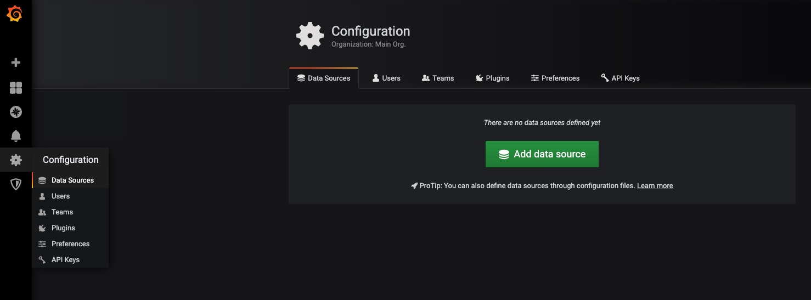
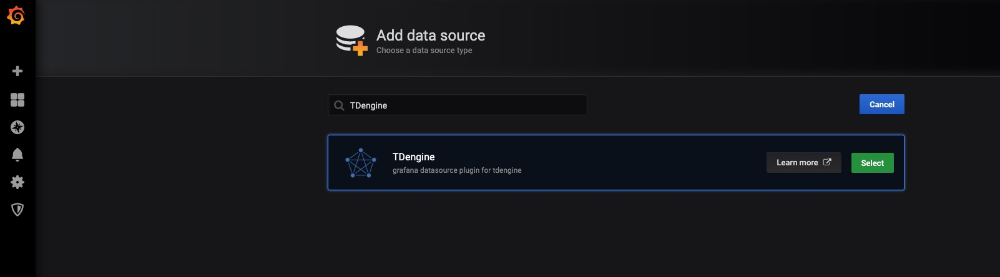
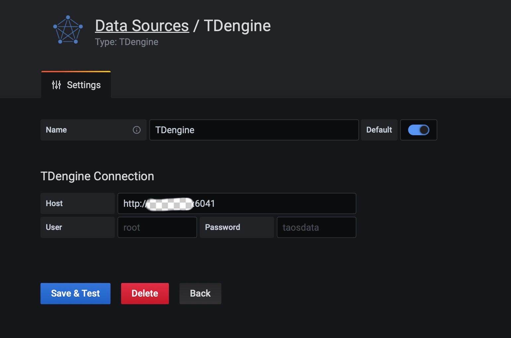
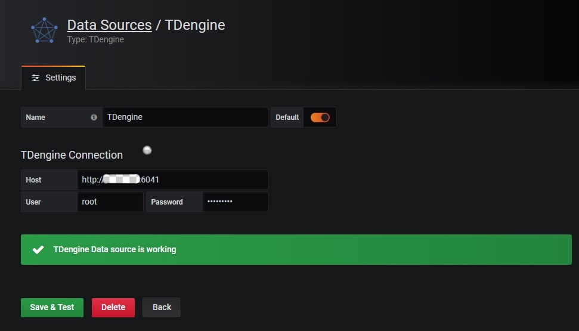
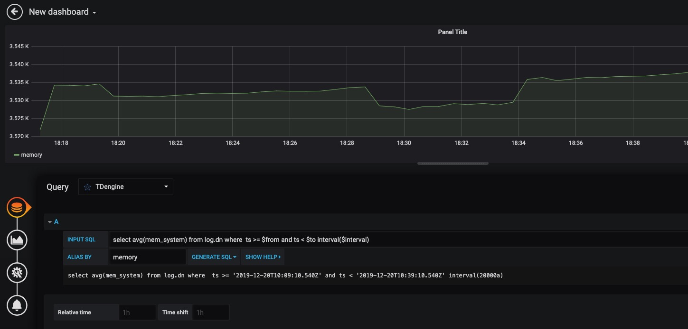

TDengine can be quickly integrated with the open-source data visualization system [Grafana](https://www.grafana.com/) to build a data monitoring and alerting system. The whole process does not require any code development. And you can visualize the contents of the data tables in TDengine on a dashboard.

You can learn more about using the TDengine plugin on [GitHub](https://github.com/taosdata/grafanaplugin/blob/master/README.md).

## Prerequisites

In order for Grafana to add the TDengine data source successfully, the following preparations are required:

1. The TDengine cluster is deployed and functioning properly
2. taosAdapter is installed and running properly. Please refer to the taosAdapter manual for details.

## Installing Grafana

TDengine currently supports Grafana versions 7.0 and above. Users can go to the Grafana official website to download the installation package and execute the installation according to the current operating system. The download address is as follows: <https://grafana.com/grafana/download>.

## Configuring Grafana

Follow the installation steps in [Grafana](https://grafana.com/grafana/plugins/tdengine-datasource/?tab=installation) with the [``grafana-cli`` command-line tool](https://grafana.com/docs/grafana/latest/administration/cli/) for plugin installation.

```bash
grafana-cli plugins install tdengine-datasource
# with sudo
sudo -u grafana grafana-cli plugins install tdengine-datasource
```

Alternatively, you can manually download the .zip file from [GitHub](https://github.com/taosdata/grafanaplugin/releases/tag/latest) or [Grafana](https://grafana.com/grafana/plugins/tdengine-datasource/?tab=installation) and unpack it into your grafana plugins directory.

```bash
GF_VERSION=3.2.2
# from GitHub
wget https://github.com/taosdata/grafanaplugin/releases/download/v$GF_VERSION/tdengine-datasource-$GF_VERSION.zip
# from Grafana
wget -O tdengine-datasource-$GF_VERSION.zip https://grafana.com/api/plugins/tdengine-datasource/versions/$GF_VERSION/download
```

Take CentOS 7.2 for example, extract the plugin package to /var/lib/grafana/plugins directory, and restart grafana.

```bash
sudo unzip tdengine-datasource-$GF_VERSION.zip -d /var/lib/grafana/plugins/
```

If Grafana is running in a Docker environment, the TDengine plugin can be automatically installed and set up using the following environment variable settings:

```bash
GF_INSTALL_PLUGINS=tdengine-datasource
```

## Using Grafana

### Configuring Data Sources

Users can log in to the Grafana server (username/password: admin/admin) directly through the URL `http://localhost:3000` and add a datasource through `Configuration -> Data Sources` on the left side, as shown in the following figure.



Click `Add data source` to enter the Add data source page, and enter TDengine in the query box to add it, as shown in the following figure.



Enter the datasource configuration page, and follow the default prompts to modify the corresponding configuration.



- Host: IP address of the server where the components of the TDengine cluster provide REST service (offered by taosd before 2.4 and by taosAdapter since 2.4) and the port number of the TDengine REST service (6041), by default use `http://localhost:6041`.
- User: TDengine user name.
- Password: TDengine user password.

Click `Save & Test` to test. You should see a success message if the test worked.



### Create Dashboard

Go back to the main interface to create a dashboard and click Add Query to enter the panel query page:


As shown above, select the `TDengine` data source in the `Query` and enter the corresponding SQL in the query box below for query.

- INPUT SQL: enter the statement to be queried (the result set of the SQL statement should be two columns and multiple rows), for example: `select avg(mem_system) from log.dn where ts >= $from and ts < $to interval($interval)`, where, from, to and interval are built-in variables of the TDengine plugin, indicating the range and time interval of queries fetched from the Grafana plugin panel. In addition to the built-in variables, custom template variables are also supported.
- ALIAS BY: This allows you to set the current query alias.
- GENERATE SQL: Clicking this button will automatically replace the corresponding variables and generate the final executed statement.

Follow the default prompt to query the average system memory usage for the specified interval on the server where the current TDengine deployment is located as follows.



> For more information on how to use Grafana to create the appropriate monitoring interface and for more details on using Grafana, refer to the official Grafana [documentation](https://grafana.com/docs/).

### Importing the Dashboard

In version 2.3.3.0 and above, you can import the TDinsight Dashboard (Grafana Dashboard ID: [15167](https://grafana.com/grafana/dashboards/15167)) as a monitoring visualization tool for TDengine clusters. You can find installation and usage instructions in the TDinsight User Manual (/reference/tdinsight/).
