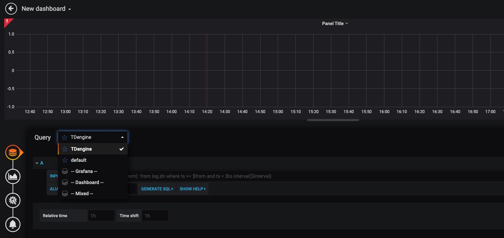

TDengine can be quickly integrated with the open-source data visualization system [Grafana](https://www.grafana.com/) to build a data monitoring and alerting system. The whole process does not require any code development. And you can visualize the contents of the data tables in TDengine on a dashboard.

You can learn more about using the TDengine plugin on [GitHub](https://github.com/taosdata/grafanaplugin/blob/master/README.md).

## Prerequisites

In order for Grafana to add the TDengine data source successfully, the following preparations are required:

1. The TDengine cluster is deployed and functioning properly
2. taosAdapter is installed and running properly. Please refer to the taosAdapter manual for details.

Record these values:

- TDengine REST API url: `http://tdengine.local:6041`.
- TDengine cluster authorization, with user + password.

## Installing Grafana

TDengine currently supports Grafana versions 7.5 and above. Users can go to the Grafana official website to download the installation package and execute the installation according to the current operating system. The download address is as follows: <https://grafana.com/grafana/download>.

## Configuring Grafana

Set the url and authorization environment variables by `export` or a [`.env`(dotenv) file](https://hexdocs.pm/dotenvy/dotenv-file-format.html):

```sh
export TDENGINE_API=http://tdengine.local:6041
# user + password
export TDENGINE_USER=user
export TDENGINE_PASSWORD=password
```

Run `install.sh`:

```sh
bash -c "$(curl -fsSL https://raw.githubusercontent.com/taosdata/grafanaplugin/master/install.sh)"
```

With this script, TDengine data source plugin and the Grafana data source will be installed and created automatically with Grafana provisioning configurations.

And then, restart Grafana service and open Grafana in web-browser, usually <http://localhost:3000>.

### Create Dashboard

Go back to the main interface to create a dashboard and click Add Query to enter the panel query page:



As shown above, select the `TDengine` data source in the `Query` and enter the corresponding SQL in the query box below for query.

- INPUT SQL: enter the statement to be queried (the result set of the SQL statement should be two columns and multiple rows), for example: `select avg(mem_system) from log.dn where ts >= $from and ts < $to interval($interval)`, where, from, to and interval are built-in variables of the TDengine plugin, indicating the range and time interval of queries fetched from the Grafana plugin panel. In addition to the built-in variables, custom template variables are also supported.
- ALIAS BY: This allows you to set the current query alias.
- GENERATE SQL: Clicking this button will automatically replace the corresponding variables and generate the final executed statement.

Follow the default prompt to query the average system memory usage for the specified interval on the server where the current TDengine deployment is located as follows.


> For more information on how to use Grafana to create the appropriate monitoring interface and for more details on using Grafana, refer to the official Grafana [documentation](https://grafana.com/docs/).

### Importing the Dashboard

You can install TDinsight dashboard in data source configuration page (like `http://localhost:3000/datasources/edit/1/dashboards`) as a monitoring visualization tool for TDengine cluster. The dashboard is published in Grafana as [Dashboard 15167 - TDinsight](https://grafana.com/grafana/dashboards/15167). Check the [TDinsight User Manual](/reference/tdinsight/) for the details.

For more dashboards using TDengine data source, [search here in Grafana](https://grafana.com/grafana/dashboards/?dataSource=tdengine-datasource). Here is a sub list:

- [15146](https://grafana.com/grafana/dashboards/15146): Monitor multiple TDengine clusters.
- [15155](https://grafana.com/grafana/dashboards/15155): TDengine alert demo.
- [15167](https://grafana.com/grafana/dashboards/15167): TDinsight.
- [16388](https://grafana.com/grafana/dashboards/16388): Telegraf node metrics dashboard using TDengine data source.
