MQTT is a popular IoT data transfer protocol, [EMQX](https://github.com/emqx/emqx) is an open-source MQTT Broker software, without any code, only need to use "rules" in EMQX Dashboard to do simple configuration. You can write MQTT data directly to TDengine. EMQX supports saving data to TDengine by sending it to web services and provides a native TDengine driver for direct saving in the Enterprise Edition. Please refer to the [EMQX official documentation](https://www.emqx.io/docs/en/v4.4/rule/rule-engine.html) for details on how to use it. tdengine).

## Prerequisites

The following preparations are required for EMQX to add TDengine data sources correctly.
- The TDengine cluster is deployed and working properly
- taosAdapter is installed and running properly. Please refer to the [taosAdapter manual](/reference/taosadapter) for details.
- If you use the emulated writers described later, you need to install the appropriate version of Node.js. V12 is recommended.

## Install and start EMQX

Depending on the current operating system, users can download the installation package from the [EMQX official website](https://www.emqx.io/downloads) and execute the installation. After installation, use `sudo emqx start` or `sudo systemctl start emqx` to start the EMQX service.

## Create the appropriate database and table schema in TDengine for receiving MQTT data

### Take the Docker installation of TDengine as an example

```bash
    docker exec -it tdengine bash
    taos
```

### Create Database and Table

```sql
    CREATE DATABASE test;
    USE test;

    CREATE TABLE sensor_data (ts timestamp, temperature float, humidity float, volume float, PM10 float, pm25 float, SO2 float, NO2 float, CO float, sensor_id NCHAR(255), area TINYINT, coll_time timestamp);
```

Note: The table schema is based on the blog [(In Chinese) Data Transfer, Storage, Presentation, EMQX + TDengine Build MQTT IoT Data Visualization Platform](https://www.taosdata.com/blog/2020/08/04/1722.html) as an example. Subsequent operations are carried out with this blog scenario too. Please modify it according to your actual application scenario.

## Configuring EMQX Rules

Since the configuration interface of EMQX differs from version to version, here is v4.4.3 as an example. For other versions, please refer to the corresponding official documentation.

### Login EMQX Dashboard

Use your browser to open the URL `http://IP:18083` and log in to EMQX Dashboard. The initial installation username is `admin` and the password is: `public`.

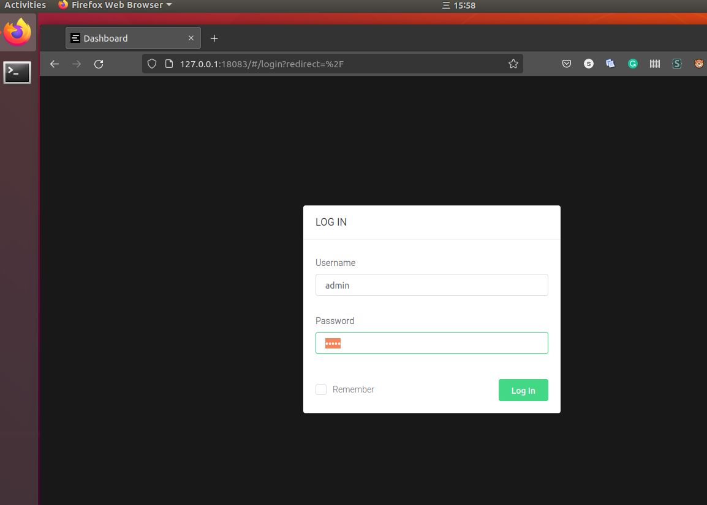

### Creating Rule

Select "Rule" in the "Rule Engine" on the left and click the "Create" button: !

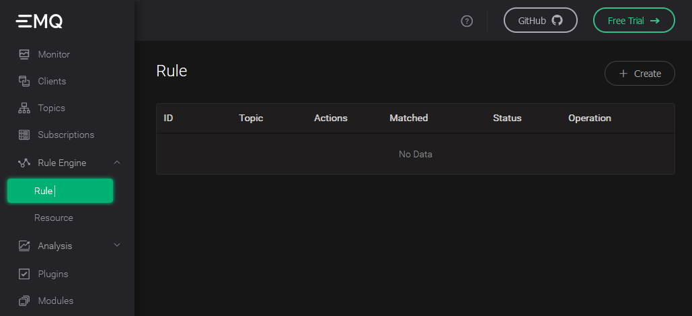

### Edit SQL fields

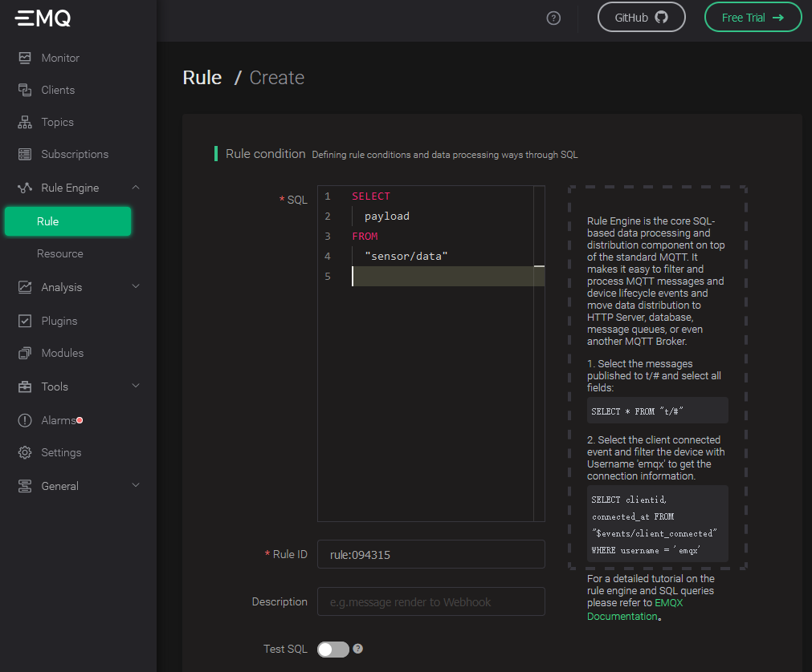

### Add "action handler"

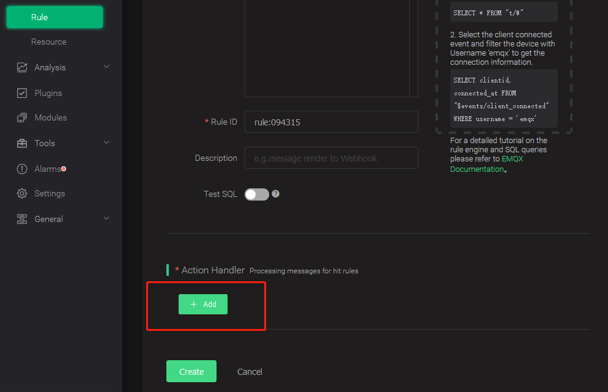

### Add "Resource"

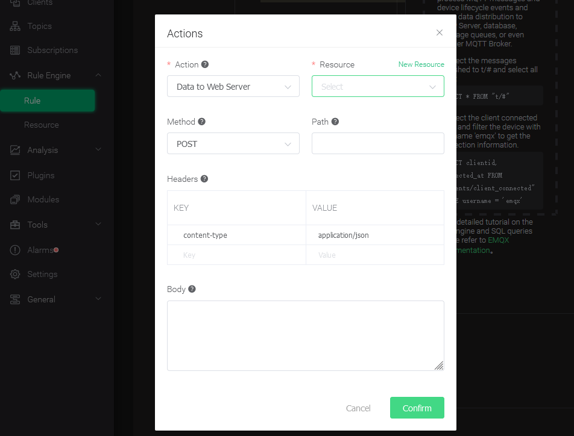

Select "Data to Web Service" and click the "New Resource" button.

### Edit "Resource"

Select "Data to Web Service" and fill in the request URL as the address and port of the server running taosAdapter (default is 6041). Leave the other properties at their default values.

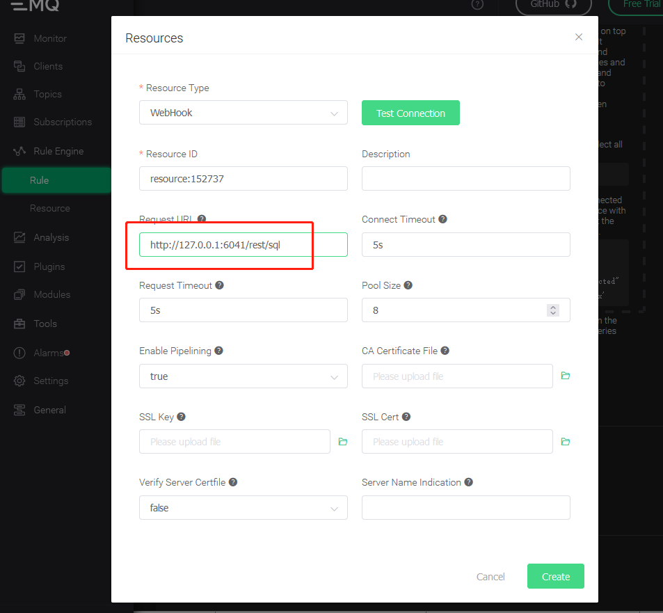

### Edit "action"

Edit the resource configuration to add the key/value pairing for Authorization. Please refer to the [ TDengine REST API documentation ](https://docs.taosdata.com/reference/rest-api/) for the authorization in details. Enter the rule engine replacement template in the message body.

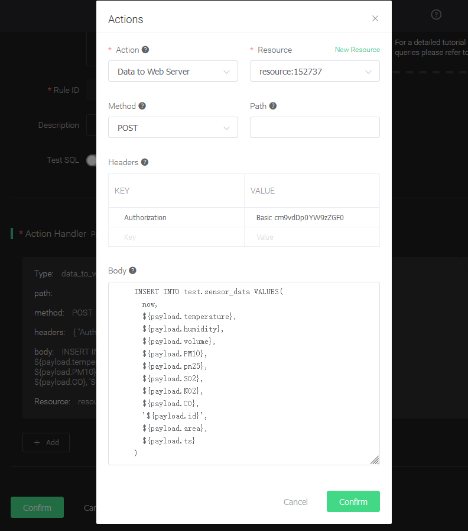

## Compose program to mock data

```javascript
    // mock.js
    const mqtt = require('mqtt')
    const Mock = require('mockjs')
    const EMQX_SERVER = 'mqtt://localhost:1883'
    const CLIENT_NUM = 10
    const STEP = 5000 // Data interval in ms
    const AWAIT = 5000 // Sleep time after data be written once to avoid data writing too fast
    const CLIENT_POOL = []
    startMock()
    function sleep(timer = 100) {
      return new Promise(resolve => {
        setTimeout(resolve, timer)
      })
    }
    async function startMock() {
      const now = Date.now()
      for (let i = 0; i < CLIENT_NUM; i++) {
        const client = await createClient(`mock_client_${i}`)
        CLIENT_POOL.push(client)
      }
      // last 24h every 5s
      const last = 24 * 3600 * 1000
      for (let ts = now - last; ts <= now; ts += STEP) {
        for (const client of CLIENT_POOL) {
          const mockData = generateMockData()
          const data = {
            ...mockData,
            id: client.clientId,
            area: 0,
            ts,
          }
          client.publish('sensor/data', JSON.stringify(data))
        }
        const dateStr = new Date(ts).toLocaleTimeString()
        console.log(`${dateStr} send success.`)
        await sleep(AWAIT)
      }
      console.log(`Done, use ${(Date.now() - now) / 1000}s`)
    }
    /**
     * Init a virtual mqtt client
     * @param {string} clientId ClientID
     */
    function createClient(clientId) {
      return new Promise((resolve, reject) => {
        const client = mqtt.connect(EMQX_SERVER, {
          clientId,
        })
        client.on('connect', () => {
          console.log(`client ${clientId} connected`)
          resolve(client)
        })
        client.on('reconnect', () => {
          console.log('reconnect')
        })
        client.on('error', (e) => {
          console.error(e)
          reject(e)
        })
      })
    }
    /**
    * Generate mock data
    */
    function generateMockData() {
     return {
       "temperature": parseFloat(Mock.Random.float(22, 100).toFixed(2)),
       "humidity": parseFloat(Mock.Random.float(12, 86).toFixed(2)),
       "volume": parseFloat(Mock.Random.float(20, 200).toFixed(2)),
       "PM10": parseFloat(Mock.Random.float(0, 300).toFixed(2)),
       "pm25": parseFloat(Mock.Random.float(0, 300).toFixed(2)),
       "SO2": parseFloat(Mock.Random.float(0, 50).toFixed(2)),
       "NO2": parseFloat(Mock.Random.float(0, 50).toFixed(2)),
       "CO": parseFloat(Mock.Random.float(0, 50).toFixed(2)),
       "area": Mock.Random.integer(0, 20),
       "ts": 1596157444170,
     }
    }
```

Note: `CLIENT_NUM` in the code can be set to a smaller value at the beginning of the test to avoid hardware performance be not capable to handle a more significant number of concurrent clients.

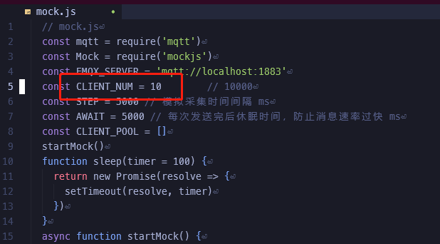

## Execute tests to simulate sending MQTT data

```
npm install mqtt mockjs --save ---registry=https://registry.npm.taobao.org
node mock.js
```

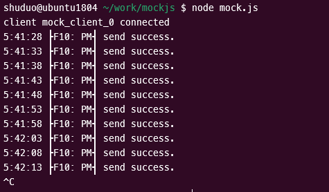

## Verify that EMQX is receiving data

Refresh the EMQX Dashboard rules engine interface to see how many records were received correctly:

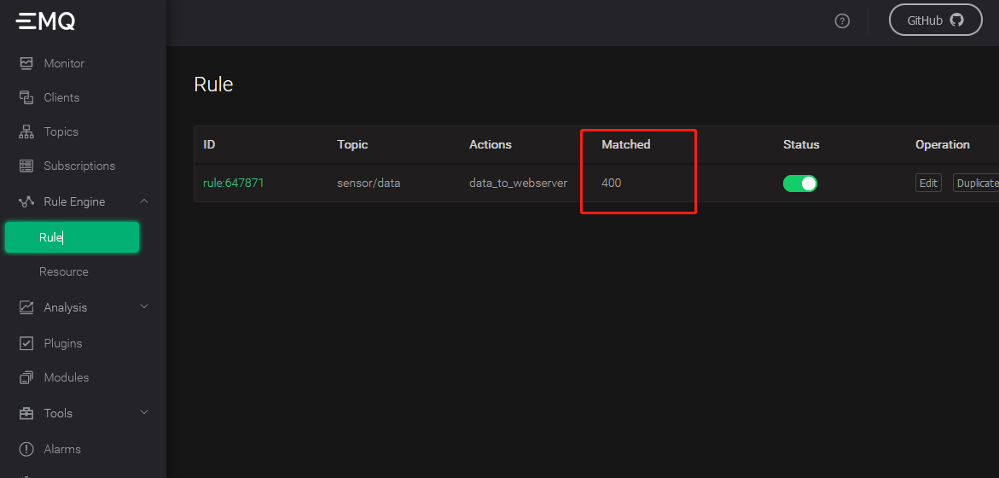

## Verify that data writing to TDengine

Use the TDengine CLI program to log in and query the appropriate databases and tables to verify that the data is being written to TDengine correctly:

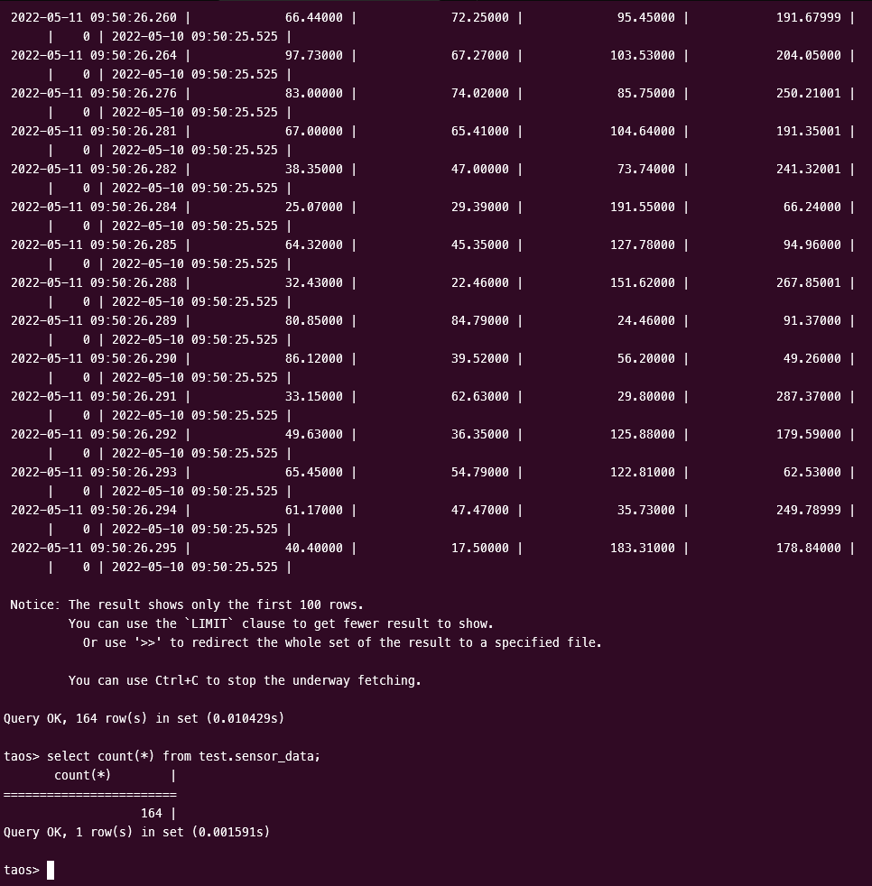

Please refer to the [TDengine official documentation](https://docs.taosdata.com/) for more details on how to use TDengine.
EMQX Please refer to the [EMQX official documentation](https://www.emqx.io/docs/en/v4.4/rule/rule-engine.html) for details on how to use EMQX.
