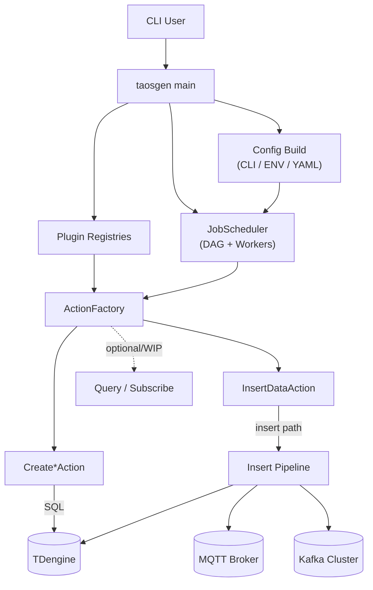
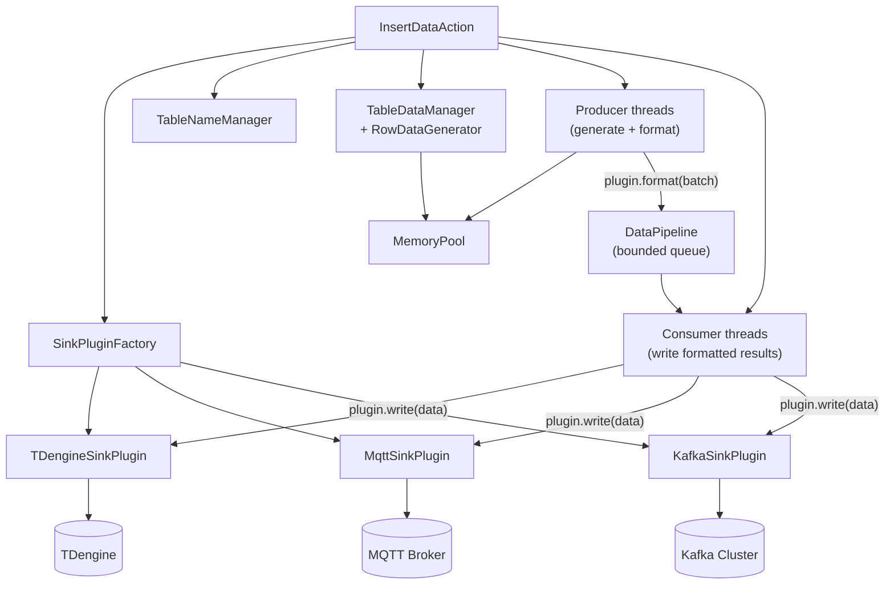
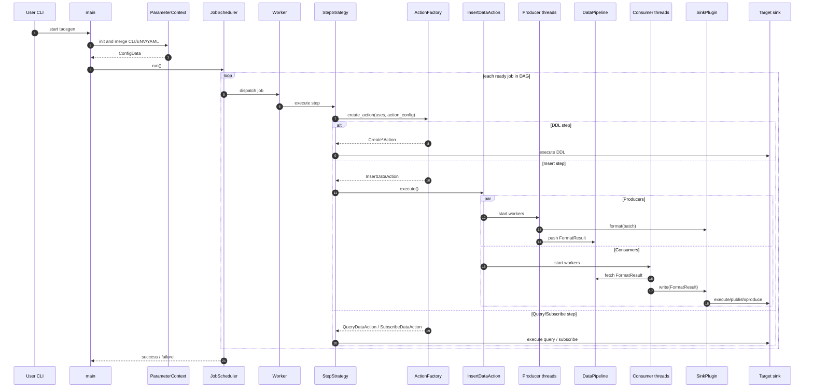

# taosgen 架构设计

## 1. 设计哲学与权衡

本文档说明 **taosgen 为什么这样设计**、做了哪些取舍，以及数据在系统中的流转方式。面向初次接触 taosgen 的贡献者，帮助先建立整体认知，再深入代码。

### 1.1 设计哲学

- **配置驱动执行**：用户通过 CLI、ENV、YAML 描述 jobs/steps，运行时构建 DAG 并执行。
- **可插拔输出架构**：同一套数据生成核心可通过插件输出到 TDengine、MQTT、Kafka（以及后续 sink）。
- **吞吐优先的数据路径**：生产者/消费者并发 + 有界队列，在生成与写入之间做平衡。
- **关注点分离**：调度、动作创建、数据生成、sink 写入通过接口解耦。
- **跨平台开发**：架构与构建流程同时支持 Linux、macOS、Windows。

### 1.2 设计权衡

- **DAG 调度 vs 线性流程**
  - 收益：支持带依赖关系的复杂作业编排。
  - 代价：运行时和排障复杂度更高。

- **Factory + Plugin 抽象 vs 直接调用实现**
  - 收益：sink/action 扩展更容易。
  - 代价：间接层更多，新人理解成本增加。

- **多线程生产/消费流水线 vs 单线程写入**
  - 收益：吞吐更高，sink 利用率更好。
  - 代价：同步开销与调优成本上升。

- **有界队列（`DataPipeline`）vs 无界缓冲**
  - 收益：可控背压，内存更稳定。
  - 代价：sink 变慢时生产侧可能阻塞。

- **统一 Insert 动作支持多 sink vs 各 sink 独立流水线**
  - 收益：减少重复逻辑，行为更一致。
  - 代价：sink 特化优化不够直观。

## 2. 系统上下文

### 2.1 模块职责说明

- **`main`**：进程入口；完成插件挂载、配置解析与调度启动。
- **`Config Build`**：将 CLI、ENV、YAML 合并为可执行运行时配置（含全局/插件/job 参数）。
- **`Plugin Registries`**：维护可用 action/sink 插件实现，供工厂查找。
- **`JobScheduler`**：按 DAG 就绪关系调度作业并组织 worker 执行。
- **`ActionFactory`**：根据步骤 `uses` + `action_config` 构建具体动作。
- **`Create*Action`**：执行建库建表等 DDL 动作。
- **`InsertDataAction`**：高吞吐写入/发布/生产核心流程。

### 2.2 为什么这样拆分

- 将解析、调度、写入分离，降低模块耦合，便于局部演进。
- 新增 sink 多数只需扩展插件层，无需改动调度核心。
- 控制面（`JobScheduler` + `ActionFactory`）稳定，数据面（`SinkPlugin`）可替换。

## 3. Insert 流水线（数据面）

### 3.1 关键模块细节

- **`SinkPluginFactory`**
  - 职责：根据步骤配置创建 sink 插件实例。
  - 输入：sink 类型与 sink 配置。
  - 输出：`SinkPlugin` 实现对象。

- **`TableNameManager`**
  - 职责：生成并管理目标表名策略。
  - 输入：表名模板/规则与作业上下文。
  - 输出：解析后的目标表名。

- **`TableDataManager` + `RowDataGenerator`**
  - 职责：按配置规则生成行与批次数据。
  - 输入：schema、列定义、生成表达式、随机约束。
  - 输出：供格式化使用的行集/批次。

- **`MemoryPool`**
  - 职责：降低热点路径上的频繁分配开销。
  - 输入：生成/格式化路径的内存请求。
  - 输出：可复用内存块。

- **生产者线程**
  - 职责：生成数据并调用 `plugin.format(batch)`。
  - 输入：生成任务与数据模板。
  - 输出：写入 `DataPipeline` 的 `FormatResult`。

- **`DataPipeline<FormatResult>`**
  - 职责：作为生成与写入之间的有界队列。
  - 输入：生产者写入的格式化结果。
  - 输出：消费者可读取的数据，具备背压语义。

- **消费者线程**
  - 职责：从队列取数并调用 `plugin.write(data)` 写入 sink。
  - 输入：`FormatResult`。
  - 输出：目标 sink 的写入/发布/生产行为。

### 3.2 错误与背压行为

- sink 变慢：队列趋于满载，生产侧通过阻塞实现限流。
- sink 写失败：在消费路径处理，并回传到 action/scheduler 状态。
- 流结束信号：生产侧推送 sentinel/EOF，保证消费者有序退出。

## 4. 核心时序（推荐先读）

以下时序仅保留 **核心控制流与数据流**。如资源释放等非核心细节，刻意省略，以提高可读性。

### 4.1 时序文字解读

- **启动阶段**：`main` 完成配置解析后，将执行权交给调度器。
- **调度阶段**：由 DAG 就绪关系决定 job 何时被派发。
- **步骤执行**：`StepStrategy` 向 `ActionFactory` 请求具体 action。
- **Insert 执行**：生产/消费并发，通过 `DataPipeline` 解耦。
- **结束回传**：状态从 action 回传到 scheduler，最终决定进程退出结果。

## 5. 非核心生命周期说明（可选）

下列内容很重要，但不在上面的核心时序图中展开：

- 插件 `connect()/prepare()/close()` 细节
- 多消费者场景下 sentinel/EOF 的清空与终止策略
- 重试策略与失败升级策略
- 资源释放顺序与清理时机

当实现层面对可靠性或性能有影响时，建议在此章节补充。

## 6. 贡献者快速阅读路径

如果你刚接触 taosgen，建议按以下顺序阅读：

1. 第1节（为什么这么设计）
2. 第2节（控制面模块）
3. 第3节（Insert 数据面）
4. 第4节（端到端核心流程）

随后可进入以下源码目录：

- `src/workflow/`：调度与执行流程
- `src/actions/`：动作实现
- `src/plugins/`：sink 插件实现
- `src/parameter/`：配置解析与合并逻辑
