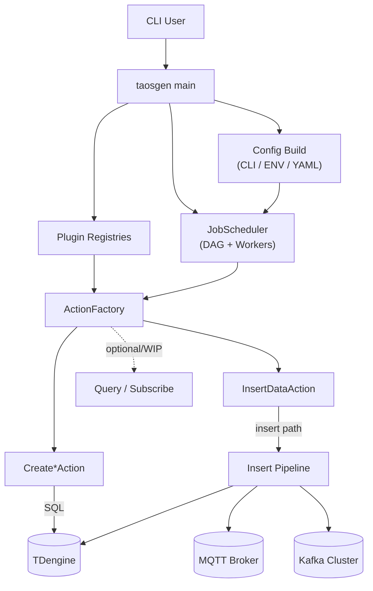
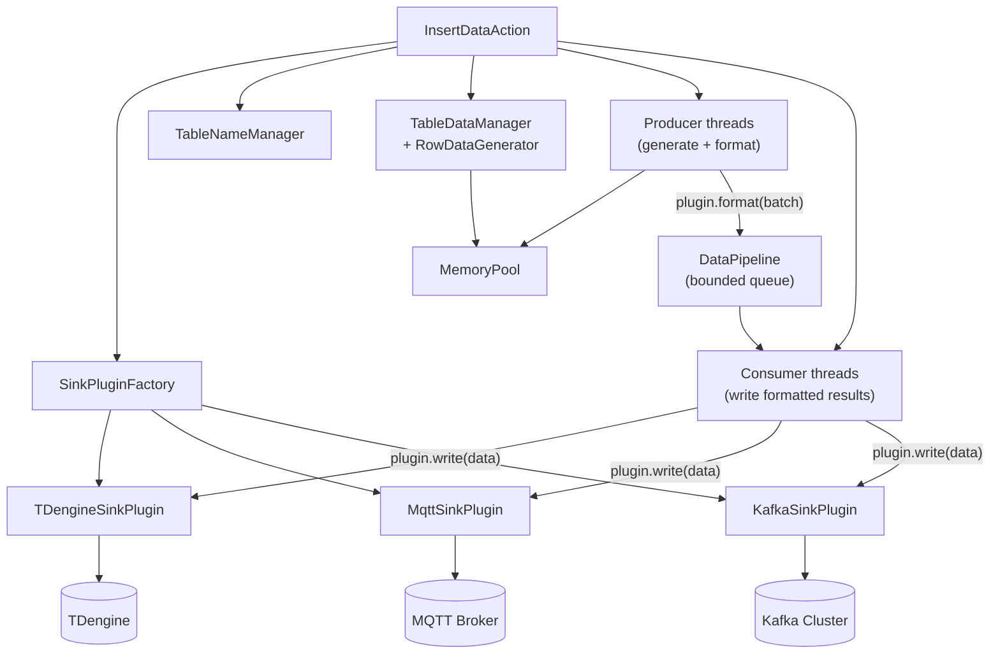
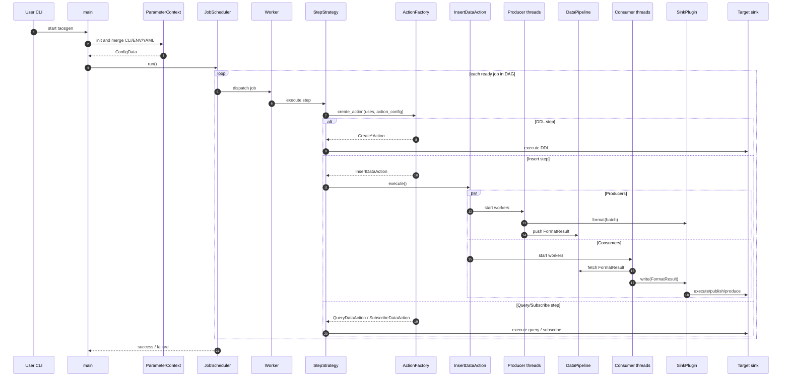

# taosgen Architecture Design

## 1. Design Philosophy and Trade-offs

This document explains **why taosgen is designed this way**, what trade-offs were made, and how data moves through the system. It is intended for contributors who are new to taosgen and need a practical mental model before reading code.

### 1.1 Philosophy

- **Configuration-driven execution**: users describe jobs/steps in CLI, ENV, and YAML; runtime builds a DAG and executes it.
- **Pluggable output architecture**: one data generation core can target TDengine, MQTT, Kafka (and future sinks) through plugins.
- **Throughput-first pipeline**: producer/consumer concurrency with bounded queues balances generation and write speed.
- **Separation of concerns**: scheduling, action creation, data generation, and sink writing are isolated by interfaces.
- **Cross-platform development**: architecture and build flow support Linux, macOS, and Windows.

### 1.2 Design Trade-offs

- **DAG scheduler vs simple linear flow**
  - Benefit: supports complex workloads with dependencies.
  - Trade-off: higher runtime and debugging complexity.

- **Factory + plugin abstraction vs direct implementation calls**
  - Benefit: easy extensibility for sinks/actions.
  - Trade-off: more indirection and learning cost for newcomers.

- **Multi-threaded producer/consumer pipeline vs single-threaded writes**
  - Benefit: better throughput and improved sink utilization.
  - Trade-off: synchronization overhead and operational tuning effort.

- **Bounded queue (`DataPipeline`) vs unbounded buffering**
  - Benefit: backpressure control and stable memory usage.
  - Trade-off: potential producer blocking under slow sinks.

- **Unified insert action for multiple sinks vs sink-specific pipelines**
  - Benefit: less duplicated logic and consistent behavior.
  - Trade-off: sink-specific optimizations may be less explicit.

## 2. System Context

### 2.1 What each module does

- **`main`**: process entrypoint; initializes plugin hooks and starts configuration parsing + scheduler runtime.
- **`Config Build`**: merges CLI, ENV, YAML into executable runtime config, including global/plugin/job parameters.
- **`Plugin Registries`**: stores available action/sink plugin implementations for factory resolution.
- **`JobScheduler`**: executes jobs by DAG readiness with worker orchestration.
- **`ActionFactory`**: maps step `uses` + `action_config` to concrete actions.
- **`Create*Action`**: DDL-style operations (database/table creation).
- **`InsertDataAction`**: core high-throughput write/publish/produce flow.

### 2.2 Why this decomposition

- Keeps parsing/scheduling/writing independent, so contributors can change one area with lower coupling.
- Makes new sink support mostly a plugin task, not a scheduler redesign task.
- Provides a stable control plane (`JobScheduler` + `ActionFactory`) with a replaceable data plane (`SinkPlugin`).

## 3. Insert Pipeline (Data Plane)

### 3.1 Module details

- **`SinkPluginFactory`**
  - Responsibility: create sink-specific plugin instance from runtime step config.
  - Input: sink type + sink config.
  - Output: `SinkPlugin` implementation.

- **`TableNameManager`**
  - Responsibility: generate and manage target table naming strategy.
  - Input: table template/rules and job context.
  - Output: resolved target table names.

- **`TableDataManager` + `RowDataGenerator`**
  - Responsibility: build rows and batches from configured data generation rules.
  - Input: schema, columns, generation expressions, randomness constraints.
  - Output: row sets / table batches for formatting.

- **`MemoryPool`**
  - Responsibility: reduce allocation churn in hot path.
  - Input: allocation requests from generation/formatting path.
  - Output: reusable memory blocks.

- **Producer threads**
  - Responsibility: generate data and call `plugin.format(batch)`.
  - Input: generation tasks and data templates.
  - Output: `FormatResult` pushed into `DataPipeline`.

- **`DataPipeline<FormatResult>`**
  - Responsibility: bounded queue between generation and sink write.
  - Input: formatted payloads from producers.
  - Output: payloads fetched by consumers with backpressure semantics.

- **Consumer threads**
  - Responsibility: write formatted payloads to sink by calling `plugin.write(data)`.
  - Input: `FormatResult` from queue.
  - Output: sink-side writes/publishes/producers.

### 3.2 Error and backpressure behavior

- Slow sink: queue fills, producer side slows via bounded queue blocking.
- Sink write failures: handled in consumer path and reflected into action/scheduler status.
- End-of-stream signaling: producer side pushes sentinel/EOF markers for clean consumer completion.

## 4. Core Sequence (Recommended Reading)

The following sequence keeps only **core control and data path**. Non-core details (for example, explicit resource release internals) are intentionally omitted here for readability.

### 4.1 Sequence walkthrough

- **Startup**: `main` resolves runtime config and hands execution to scheduler.
- **Scheduling**: DAG readiness determines which job runs next.
- **Step execution**: `StepStrategy` asks `ActionFactory` for the concrete action.
- **Insert action**: producer/consumer paths run concurrently through `DataPipeline`.
- **Completion**: status propagates from action to scheduler, then back to process exit.

## 5. Non-core Lifecycle Notes (Optional)

These concerns are real and important, but are intentionally not shown in the core sequence above:

- plugin `connect()/prepare()/close()` details
- sentinel/EOF drain behavior across multiple consumers
- retry policy and failure escalation policy
- resource release ordering and cleanup timing

Use this section to document implementation-specific lifecycle changes when they affect reliability or performance.

## 6. Contributor Quick Path

If you are new to taosgen, read in this order:

1. Section 1 (why this design exists)
2. Section 2 (control-plane modules)
3. Section 3 (insert data plane)
4. Section 4 (end-to-end core flow)

After that, jump into source directories:

- `src/workflow/` for scheduler and execution flow
- `src/actions/` for action implementations
- `src/plugins/` for sink plugin implementations
- `src/parameter/` for configuration parsing and merge behavior
