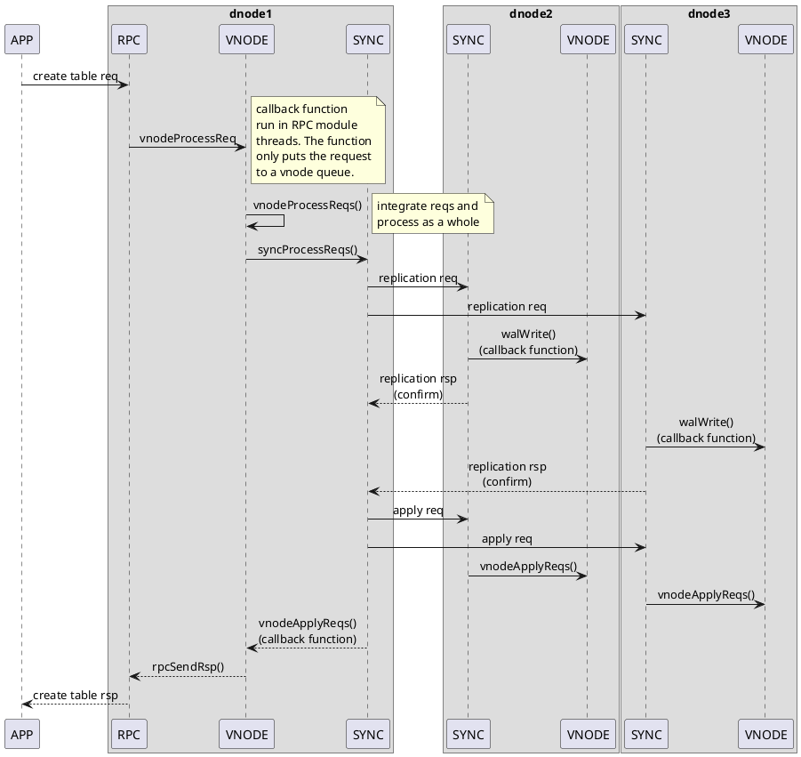
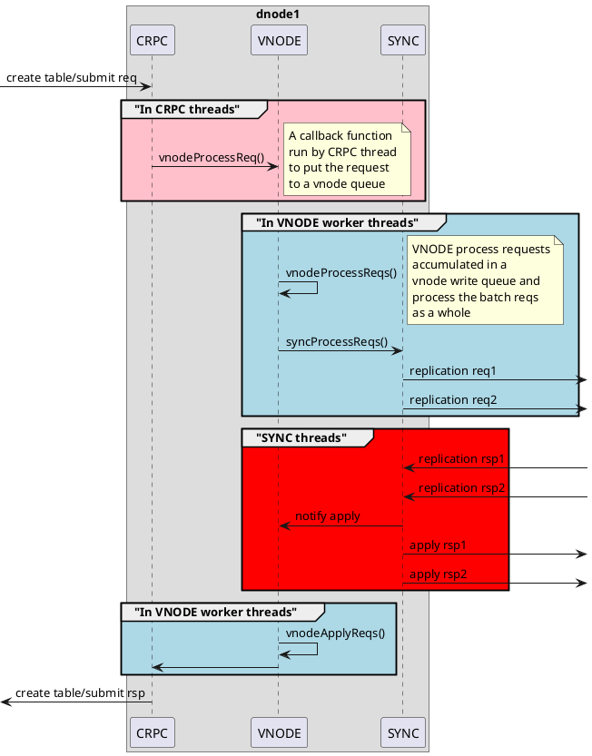
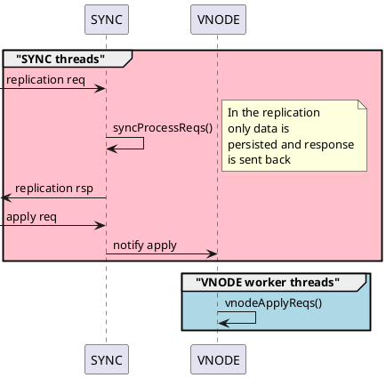
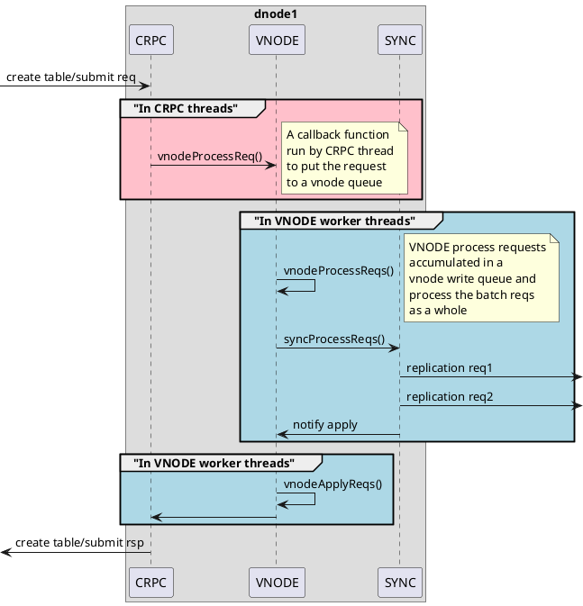
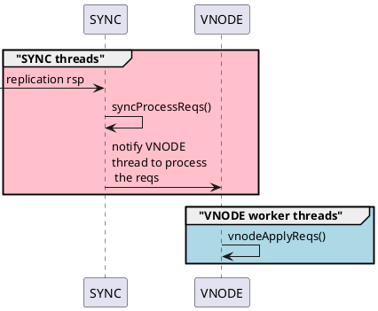

```plantuml
    @startuml create_table
    skinparam sequenceMessageAlign center
    skinparam responseMessageBelowArrow true

    participant APP as app
    box "dnode1"
        participant RPC as rpc
        participant VNODE as vnode
        participant SYNC as sync
    end box

    box "dnode2"
        participant SYNC as sync2
        participant VNODE as vnode2
    end box

    box "dnode3"
        participant SYNC as sync3
        participant VNODE as vnode3
    end box

    ' APP send request to dnode and RPC in dnode recv the request
    app ->rpc: create table req

    ' RPC call vnodeProcessReq() function to process the request
    rpc -> vnode: vnodeProcessReq
    note right
    callback function 
    run in RPC module 
    threads. The function
    only puts the request
    to a vnode queue.
    end note

    ' VNODE call vnodeProcessReqs() function to integrate requests and process as a whole
    vnode -> vnode: vnodeProcessReqs()
    note right
    integrate reqs and 
    process as a whole
    end note


    ' sync the request to other nodes
    vnode -> sync: syncProcessReqs()

    ' make request persistent
    ' sync -->vnode: walWrite()\n(callback function)

    ' replicate requests to other DNODES
    sync -> sync2: replication req
    sync -> sync3: replication req
    sync2 -> vnode2: walWrite()\n(callback function)
    sync2 --> sync: replication rsp\n(confirm)
    sync3 -> vnode3: walWrite()\n(callback function)

    sync3 --> sync: replication rsp\n(confirm)

    ' send apply request
    sync -> sync2: apply req
    sync -> sync3: apply req

    ' vnode apply
    sync2 -> vnode2: vnodeApplyReqs()
    sync3 -> vnode3: vnodeApplyReqs()

    ' call apply request
    sync --> vnode: vnodeApplyReqs()\n(callback function)

    ' send response
    vnode --> rpc: rpcSendRsp()

    ' dnode send response to APP
    rpc --> app: create table rsp
    @enduml
```

## Leader处理强一致写入请求

```plantuml
    @startuml leader_process_stict_consistency
    box "dnode1"
        participant CRPC as crpc
        participant VNODE as vnode
        participant SYNC as sync
    end box

    -> crpc: create table/submit req

    ' In CRPC threads
    group #pink "In CRPC threads"
        crpc -> vnode:vnodeProcessReq()
        note right
            A callback function
            run by CRPC thread
            to put the request
            to a vnode queue
        end note
    end

    ' In VNODE worker threads
    group #lightblue "In VNODE worker threads"
        vnode -> vnode: vnodeProcessReqs()
        note right
            VNODE process requests
            accumulated in a 
            vnode write queue and
            process the batch reqs
            as a whole
        end note

        vnode -> sync: syncProcessReqs()

        sync -> : replication req1
        sync -> : replication req2
    end

    group #red "SYNC threads"
        sync <- : replication rsp1
        sync <- : replication rsp2
        sync -> vnode: notify apply
        sync -> : apply rsp1
        sync -> : apply rsp2
    end

    group #lightblue "In VNODE worker threads"
        vnode -> vnode: vnodeApplyReqs()
        vnode -> crpc:
    end

    <- crpc: create table/submit rsp

    @enduml
```

## Follower处理强一致写入请求

```plantuml
    @startuml follower_process_strict_consistency
    participant SYNC as sync
    participant VNODE as vnode

    group #pink "SYNC threads"
        -> sync: replication req

        sync -> sync: syncProcessReqs()
        note right
            In the replication
            only data is
            persisted and response
            is sent back
        end note

        <- sync: replication rsp

        -> sync: apply req

        sync -> vnode: notify apply
    end

    group #lightblue "VNODE worker threads"
        vnode -> vnode: vnodeApplyReqs()
    end

    @enduml
```

## Leader处理最终一致写入请求

```plantuml
    @startuml leader_process_eventual_consistency
    box "dnode1"
        participant CRPC as crpc
        participant VNODE as vnode
        participant SYNC as sync
    end box

    -> crpc: create table/submit req

    ' In CRPC threads
    group #pink "In CRPC threads"
        crpc -> vnode:vnodeProcessReq()
        note right
            A callback function
            run by CRPC thread
            to put the request
            to a vnode queue
        end note
    end

    ' In VNODE worker threads
    group #lightblue "In VNODE worker threads"
        vnode -> vnode: vnodeProcessReqs()
        note right
            VNODE process requests
            accumulated in a 
            vnode write queue and
            process the batch reqs
            as a whole
        end note

        vnode -> sync: syncProcessReqs()

        sync -> : replication req1
        sync -> : replication req2

        sync -> vnode: notify apply
    end


    group #lightblue "In VNODE worker threads"
        vnode -> vnode: vnodeApplyReqs()
        vnode -> crpc:
    end

    <- crpc: create table/submit rsp

    @enduml
```

## Follower处理最终一致写入请求

```plantuml
    @startuml follower_process_eventual_consistency
    participant SYNC as sync
    participant VNODE as vnode

    group #pink "SYNC threads"
        -> sync: replication rsp

        sync -> sync: syncProcessReqs()

        sync -> vnode: notify VNODE \nthread to process\n the reqs
    end

    group #lightblue "VNODE worker threads"
        vnode -> vnode: vnodeApplyReqs()
    end
    @enduml
```