# Small Materialized Aggragates

**SMA** (**S**mall **M**aterialized **A**ggrates) is used to speed up the query process on materialized data cube in TDengine. TDengine 3.0 gives more flexibility on the SMA configurations.

There are two kinds of SMA in TDengine:
1. Block-wise SMA
2. Time-range-wise SMA

```plantuml
    @startmindmap mind_map_test
    * SMA
    ** Block-wise SMA
    ** Time-range-wise SMA
    @endmindmap
```  -->

![SMA in TDengine 3.0](http://www.plantuml.com/plantuml/png/Kr1GK70eBaaiAidDp4l9JInG0D7nG4PyIMfn2HTGMa5B8TZN4SBIKd3AoK_ErYtFB4v55Wt9p4tLBKhCIqz5bN981HeACHW0)
## Block-wise SMA
Block-wise SMA is created by default when the data are committed. Since time-series data are saved as block data in files, a corresponding SMA is create when the data block is written. The default block-wise SMA includes:
1. sum(*)
2. max(*)
3. min(*)

By default, the system will create SMA for each column except those columns with type *binary* and *nchar*. However, users can change the behavior by the keyword **NOSMA** to disable the SMA for a certain column like below:
```SQL
# create a super table with the SMA on column b disabled
create table st (ts timestamp, a int, b int NOSMA, c double) tags (tg1 binary(10), tg2 int);
```

<!-- 


## Time-range-wise SMA
In addition to the default block-wise SMA, users can create their own SMAs ondemand. Below is an example to create a SMA.
```SQL
# create a SMA every 10 minutes with SMA of sum, max and min
create sma_indx sma_10min on st (sum(*), max(*), min(*), twa(*)) interval(10m);
```
Users can also drop a time-range-wise SMA like below:
```SQL
# drop the sma index
drop sma_index sma_5min on st;
```
**NOTE: Creating an SMA index is a heavy operation which may take a long time and block the write operation. So create the time-range-wise SMA when creating the table or when there are not too much data.**