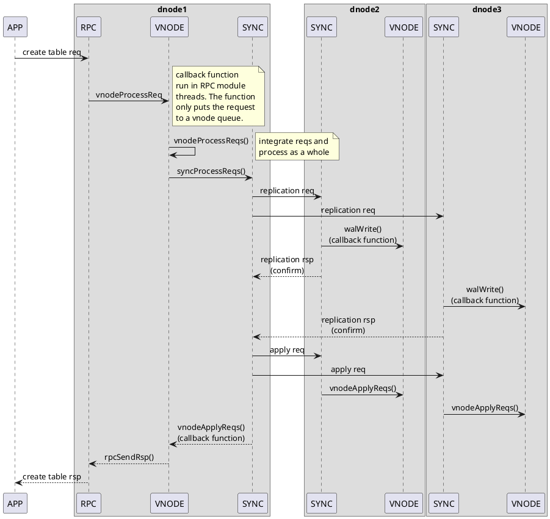
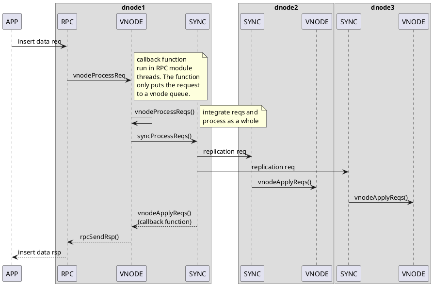
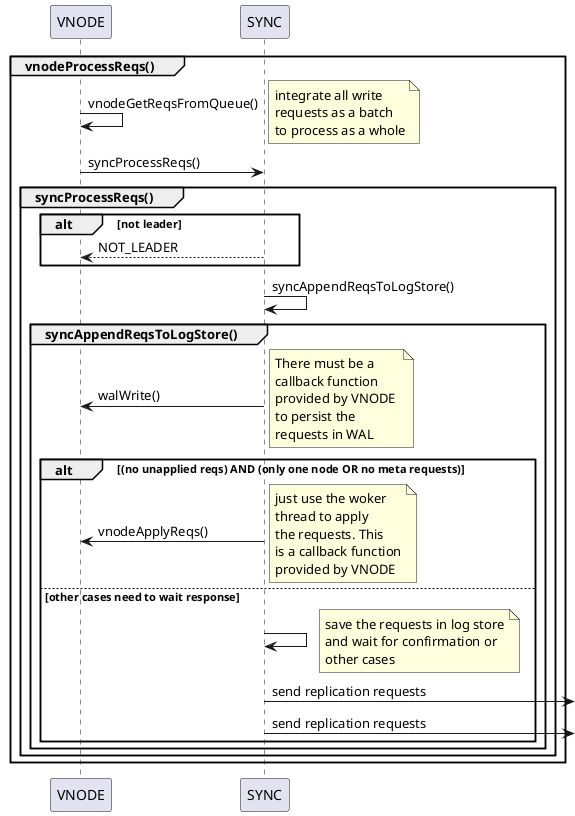

<h1>VNODE Write Processes</h1>

## META Operations
META data write operations including:

1. create table
2. drop table
3. alter table

We take create table as an example to figure out the whole process.

## Time-series data Operations
There are only one operations for time-series data: data insert. We will figure out the whole process.

## vnodeProcessReqs()

<!-- ## syncProcessReplicationReq()

<!-- meta操作：建表，删表，改表（队队列/同步）

```plantuml
@startuml syncProcessReplicationReq
participant SYNC as s
participant VNODE as v

-> s: replication request
s -> s:
note right
process the request
to get the request
batch
end note

s -> s: syncAppendReqToLogStore()

s -> v: walWrite()

alt has meta req
    <- s: confirmation
else
    s -> v: vnodeApplyReqs()
end

@enduml -->
<!-- ``` -->

## vnodeApplyReqs()
The function *vnodeApplyReqs()* is the actual function running by a vnode to process the requests.
```plantuml
@startuml vnodeApplyReqs()
skinparam sequenceMessageAlign left
skinparam responseMessageBelowArrow true

participant VNODE as vnode
participant TQ as tq
participant TSDB as tsdb
participant META as meta

group vnodeApplyReqs()
    autonumber
    loop nReqs
        ' Copy request message to vnode buffer pool
        vnode -> vnode: vnodeCopyReq()
        note right
        copy request to 
        vnode buffer pool
        end note

        vnode -> tq: tqPush()
        note right
        push the request 
        to TQ so consumers 
        can consume
        end note
        alt META_REQ
            autonumber 3
            vnode -> meta: metaApplyReq()
        else TS_REQ
            autonumber 3
            vnode -> tsdb: tsdbApplyReq()
        end

    end

    ' Check if need to commit
    alt vnode buffer pool is full
        group vnodeCommit()
            autonumber 4.1
            vnode -> tq: tqCommit()
            note right
            tqCommit may renew wal
            end note
            vnode -> meta: metaCommit();
            note right
            commit meta data
            end note
            vnode -> tsdb: tsdbCommit();
            note right
            commit time-series data
            end note
        end
    end
end
@enduml
```

数据写入
快照文件与sync的结合
vnodeOpen（）
vnodeClose（）
sync.h  -->
