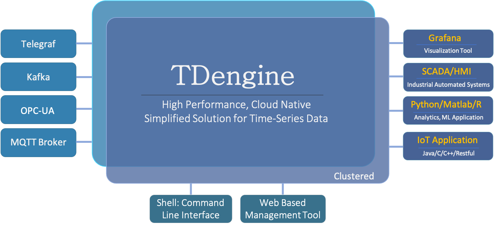

TDengine Cloud, is the fast, elastic, serverless and cost effective time-series data processing service based on the popular open source time-series database, TDengine. With TDengine Cloud you get the highly optimized and purpose-built for IoT time-series platform, for which TDengine is known.

This section introduces the major features, competitive advantages and typical use-cases to help you get a high level overview of TDengine cloud service.

## Major Features

The major features are listed below:

1. Data In
   - Supports [using SQL to insert](../programming/insert/).
   - Supports [Telegraf](../data-in/telegraf/).
   - Supports [Prometheus](../data-in/prometheus/).
2. Data Out
   - Supports standard [SQL](../programming/query/), including nested query.
   - Supports exporting data via tool [taosDump](../data-out/taosdump/).
   - Supports writing data to [Prometheus](../data-out/prometheus/).
   - Supports exporting data via [data subscription](../data-subscription/).
3. Data Explorer: browse through databases and even run SQL queries once you login.
4. Visualization:
   - Supports [Grafana](../visual/grafana/)
   - Supports Google Data Studio
   - Supports Grafana Cloud (to be released soon)
5. [Data Subscription](../data-subscription/):  Application can subscribe a table or a set of tables. API is the same as Kafka, but you can specify filter conditions and you can share the topic with other users and user groups in TDengien Cloud.
6. [Stream Processing](../stream/): Not only is the continuous query is supported, but TDengine also supports event driven stream processing, so Flink or Spark is not needed for time-series data processing.
7. Enterprise
   - Supports backuping data everyday.
   - Supports replicating a database to another region or cloud.
   - Supports VPC peering.
   - Supports Allowed IP list for security.
9. Tools
   - Provides an interactive [Command-line Interface (CLI)](../tools/cli/) for management and ad-hoc queries.
   - Provides a tool [taosBenchmark](../tools/taosbenchmark/) for testing the performance of TDengine.
10. Programming
    - Provides [connectors](../programming/connector/) for Java, Python, Go, Rust, Node.js and other programming languages.
    - Provides a [REST API](../programming/connector/rest-api/).

For more details on features, please read through the entire documentation.

## Competitive Advantages

By making full use of [characteristics of time series data](https://tdengine.com/tsdb/characteristics-of-time-series-data/) and its cloud native design, TDengine Cloud differentiates itself from other time series data cloud services, with the following advantages.

- **Worry Free**: TDengine Cloud is a fast, elastic, serverless purpose built cloud platform for time-series data. It provides worry-free operations with a fully managed cloud service. You pay as you go.

- **[Simplified Solution](https://tdengine.com/tdengine/simplified-time-series-data-solution/)**: Through built-in caching, stream processing and data subscription features, TDengine provides a simplified solution for time-series data processing. It reduces system design complexity and operation costs significantly.

- **[High-Performance](https://tdengine.com/tdengine/high-performance-time-series-database/)**: It is the only time-series platform to solve the high cardinality issue to support billions of data collection points while outperforming other time-series platforms for data ingestion, querying and data compression.

- **[Ease of Use](https://tdengine.com/tdengine/easy-time-series-data-platform/)**: For administrators, TDengine Cloud provides worry-free operations with a fully managed cloud native solution. For developers, it provides a simple interface, simplified solution and seamless integration with third party tools. For data users, it provides SQL support with powerful time series extensions built for data analytics.

- **[Easy Data Analytics](https://tdengine.com/tdengine/time-series-data-analytics-made-easy/)**: Through super tables, storage and compute separation, data partitioning by time interval, pre-computation and other means, TDengine makes it easy to explore, format, and get access to data in a highly efficient way.

- **Enterprise Ready**: It supports backup, multi-cloud/multi-region database replication, VPC peering and IP whitelisting.

With TDengine cloud, the **total cost of ownership of your time-series data platform can be greatly reduced**.

1. With its built-in caching, stream processing and data subscription, system complexity and operation cost are highly reduced.
2. With SQL support, it can be seamlessly integrated with many third party tools, and learning costs/migration costs are reduced significantly.
3. With the elastic, serverless and fully managed service, the operation and maintenance costs are reduced significantly.

## Technical Ecosystem

This is how TDengine would be situated, in a typical time-series data processing platform:

<figure>

<figcaption>Figure 1. TDengine Technical Ecosystem</figcaption>

</figure>

On the left-hand side, there are data collection agents like OPC-UA, MQTT, Telegraf and Kafka. On the right-hand side, visualization/BI tools, HMI, Python/R, and IoT Apps can be connected. TDengine itself provides an interactive command-line interface and a web interface for management and maintenance.

## Typical Use Cases

As a high-performance and cloud native time-series database, TDengine's typical use case include but are not limited to IoT, Industrial Internet, Connected Vehicles, IT operation and maintenance, energy, financial markets and other fields. TDengine is a purpose-built database optimized for the characteristics of time series data. As such, it cannot be used to process data from web crawlers, social media, e-commerce, ERP, CRM and so on. More generally TDengine is not a suitable storage engine for non-time-series data.
