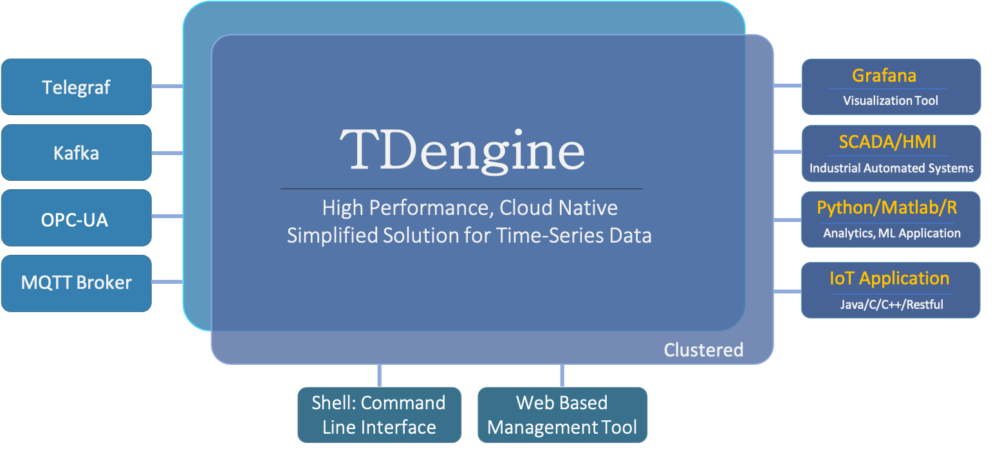

TDengine is a big data platform designed and optimized for IoT (Internet of Things) and Industrial Internet. It can safely and effetively converge, store, process and distribute high volume data (TB or even PB) generated everyday by a lot of devices and data acquisition units, monitor and alert business operation status in real time and provide real time business insight. The core component of TDengine is TDengine OSS, which is a high performance, open source, cloud native and simplified time series database. 

This section introduces the major features, competitive advantages, typical use-cases and benchmarks to help you get a high level overview of TDengine.

## Major Features of TDengine OSS

The major features are listed below:

1. Insert data
   - Supports [using SQL to insert](../develop/insert-data/sql-writing).
   - Supports [schemaless writing](../reference/schemaless/) just like NoSQL databases. It also supports standard protocols like [InfluxDB Line](../develop/insert-data/influxdb-line), [OpenTSDB Telnet](../develop/insert-data/opentsdb-telnet), [OpenTSDB JSON ](../develop/insert-data/opentsdb-json) among others.
   - Supports seamless integration with third-party tools like [Telegraf](../third-party/telegraf/), [Prometheus](../third-party/prometheus/), [collectd](../third-party/collectd/), [StatsD](../third-party/statsd/), [TCollector](../third-party/tcollector/), [EMQX](../third-party/emq-broker), [HiveMQ](../third-party/hive-mq-broker), and [Icinga2](../third-party/icinga2/), they can write data into TDengine with simple configuration and without a single line of code.
2. Query data
   - Supports standard [SQL](../taos-sql/), including nested query.
   - Supports [time series specific functions](../taos-sql/function/#time-series-extensions) and [time series specific queries](../taos-sql/distinguished), like downsampling, interpolation, cumulated sum, time weighted average, state window, session window and many others.
   - Supports [User Defined Functions (UDF)](../taos-sql/udf).
3. [Caching](../develop/cache/): TDengine always saves the last data point in cache, so Redis is not needed for time-series data processing.
4. [Stream Processing](../develop/stream/): Not only is the continuous query is supported, but TDengine also supports event driven stream processing, so Flink or Spark is not needed for time-series data processing.
5. [Data Subscription](../develop/tmq/): Application can subscribe a table or a set of tables. API is the same as Kafka, but you can specify filter conditions.
6. Visualization
   - Supports seamless integration with [Grafana](../third-party/grafana/).
   - Supports seamless integration with [Google Data Studio](../third-party/google-data-studio/).
7. Cluster
   - Supports [cluster](../deployment/) with the capability of increasing processing power by adding more nodes.
   - Supports [deployment on Kubernetes](../deployment/k8s/).
   - Supports high availability via data replication.
8. Administration
   - Provides [monitoring](../operation/monitor) on running instances of TDengine.
   - Provides many ways to [import](../operation/import) and [export](../operation/export) data.
9. Tools
   - Provides an interactive [Command Line Interface (CLI)](../reference/taos-shell) for management, maintenance and ad-hoc queries.
   - Provides a tool [taosBenchmark](../reference/taosbenchmark/) for testing the performance of TDengine.
10. Programming
    - Provides [client libraries](../client-libraries/) for [C/C++](../client-libraries/cpp), [Java](../client-libraries/java), [Python](../client-libraries/python), [Go](../client-libraries/go), [Rust](../client-libraries/rust), [Node.js](../client-libraries/node) and other programming languages.
    - Provides a [REST API](../reference/rest-api/).

For more details on features, please read through the entire documentation.

## Competitive Advantages

By making full use of [characteristics of time series data](https://tdengine.com/characteristics-of-time-series-data/), TDengine differentiates itself from other time series databases with the following advantages.

- **[High-Performance](https://tdengine.com/high-performance/)**: TDengine is the only time-series database to solve the high cardinality issue to support billions of data collection points while out performing other time-series databases for data ingestion, querying and data compression.

- **[Simplified Solution](https://tdengine.com/comprehensive-industrial-data-solution/)**: Through built-in caching, stream processing and data subscription features, TDengine provides a simplified solution for time-series data processing. It reduces system design complexity and operation costs significantly.

- **[Cloud Native](https://tdengine.com/cloud-native/)**: Through native distributed design, sharding and partitioning, separation of compute and storage, RAFT, support for Kubernetes deployment and full observability, TDengine is a cloud native Time-series Database and can be deployed on public, private or hybrid clouds.

- **[Ease of Use](https://tdengine.com/easy-to-use/)**: For administrators, TDengine significantly reduces the effort to deploy and maintain. For developers, it provides a simple interface, simplified solution and seamless integrations for third party tools. For data users, it gives easy data access.

- **[Easy Data Analytics](https://tdengine.com/simplifying-time-series-analysis-for-data-scientists/)**: Through super tables, storage and compute separation, data partitioning by time interval, pre-computation and other means, TDengine makes it easy to explore, format, and get access to data in a highly efficient way.

- **[Open Source](https://tdengine.com/open-source/)**: TDengine's core modules, including cluster feature, are all available under open source licenses. It has gathered over 22k stars on GitHub. There is an active developer community, and over 400k running instances worldwide.

With TDengine, the total cost of ownership of your time-series data platform can be greatly reduced.

1. With its superior performance, the computing and storage resources are reduced significantly.
2. With SQL support, it can be seamlessly integrated with many third party tools, and learning costs/migration costs are reduced significantly.
3. With its simplified solution and nearly zero management, the operation and maintenance costs are reduced significantly.

## Technical Ecosystem

This is how TDengine would be situated, in a typical time-series data processing platform:

<figure>

<figcaption>Figure 1. TDengine Technical Ecosystem</figcaption>

</figure>

On the left-hand side, there are data collection agents like OPC-UA, MQTT, Telegraf and Kafka. On the right-hand side, visualization/BI tools, HMI, Python/R, and IoT Apps can be connected. TDengine itself provides an interactive command-line interface and a web interface for management and maintenance.

## Typical Use Cases

As a high-performance, scalable and SQL supported time-series database, TDengine's typical use case include but are not limited to IoT, Industrial Internet, Connected Vehicles, IT operation and maintenance, energy, financial markets and other fields. TDengine is a purpose-built database optimized for the characteristics of time series data. As such, it cannot be used to process data from web crawlers, social media, e-commerce, ERP, CRM and so on. More generally TDengine is not a suitable storage engine for non-time-series data. This section makes a more detailed analysis of the applicable scenarios.

### Characteristics and Requirements of Data Sources

| **Data Source Characteristics and Requirements** | **Not Applicable** | **Might Be Applicable** | **Very Applicable** | **Description**                                                                                                                                                                                                                                               |
| ------------------------------------------------ | ------------------ | ----------------------- | ------------------- | :------------------------------------------------------------------------------------------------------------------------------------------------------------------------------------------------------------------------------------------------------------ |
| A massive amount of total data                   |                    |                         | √                   | TDengine provides excellent scale-out functions in terms of capacity, and has a storage structure with matching high compression ratio to achieve the best storage efficiency in the industry.                                                                |
| Data input velocity is extremely high            |                    |                         | √                   | TDengine's performance is much higher than that of other similar products. It can continuously process larger amounts of input data in the same hardware environment, and provides a performance evaluation tool that can easily run in the user environment. |
| A huge number of data sources                    |                    |                         | √                   | TDengine is optimized specifically for a huge number of data sources. It is especially suitable for efficiently ingesting, writing and querying data from billions of data sources.                                                                           |

### System Architecture Requirements

| **System Architecture Requirements**      | **Not Applicable** | **Might Be Applicable** | **Very Applicable** | **Description**                                                                                                                                                                                                     |
| ----------------------------------------- | ------------------ | ----------------------- | ------------------- | ------------------------------------------------------------------------------------------------------------------------------------------------------------------------------------------------------------------- |
| A simple and reliable system architecture |                    |                         | √                   | TDengine's system architecture is very simple and reliable, with its own message queue, cache, stream computing, monitoring and other functions. There is no need to integrate any additional third-party products. |
| Fault-tolerance and high-reliability      |                    |                         | √                   | TDengine has cluster functions to automatically provide high-reliability and high-availability functions such as fault tolerance and disaster recovery.                                                             |
| Standardization support                   |                    |                         | √                   | TDengine supports standard SQL and provides SQL extensions for time-series data analysis.                                                                                                                           |

### System Function Requirements

| **System Function Requirements**             | **Not Applicable** | **Might Be Applicable** | **Very Applicable** | **Description**                                                                                                                                                                                |
| -------------------------------------------- | ------------------ | ----------------------- | ------------------- | ---------------------------------------------------------------------------------------------------------------------------------------------------------------------------------------------- |
| Complete data processing algorithms built-in |                    | √                       |                     | While TDengine implements various general data processing algorithms, industry specific algorithms and special types of processing will need to be implemented at the application level.       |
| A large number of crosstab queries           |                    | √                       |                     | This type of processing is better handled by general purpose relational database systems but TDengine can work in concert with relational database systems to provide more complete solutions. |

### System Performance Requirements

| **System Performance Requirements**               | **Not Applicable** | **Might Be Applicable** | **Very Applicable** | **Description**                                                                                                             |
| ------------------------------------------------- | ------------------ | ----------------------- | ------------------- | --------------------------------------------------------------------------------------------------------------------------- |
| Very large total processing capacity              |                    |                         | √                   | TDengine's cluster functions can easily improve processing capacity via multi-server coordination.                          |
| Extremely high-speed data processing              |                    |                         | √                   | TDengine's storage and data processing are optimized for IoT, and can process data many times faster than similar products. |
| Extremely fast processing of high resolution data |                    |                         | √                   | TDengine has achieved the same or better performance than other relational and NoSQL data processing systems.               |

### System Maintenance Requirements

| **System Maintenance Requirements**     | **Not Applicable** | **Might Be Applicable** | **Very Applicable** | **Description**                                                                                                                                                                                                                |
| --------------------------------------- | ------------------ | ----------------------- | ------------------- | ------------------------------------------------------------------------------------------------------------------------------------------------------------------------------------------------------------------------------ |
| Native high-reliability                 |                    |                         | √                   | TDengine has a very robust, reliable and easily configurable system architecture to simplify routine operation. Human errors and accidents are eliminated to the greatest extent, with a streamlined experience for operators. |
| Minimize learning and maintenance costs |                    |                         | √                   | In addition to being easily configurable, standard SQL support and the TDengine CLI for ad hoc queries makes maintenance simpler, allows reuse and reduces learning costs.                                                     |
| Abundant talent supply                  | √                  |                         |                     | Given the above, and given the extensive training and professional services provided by TDengine, it is easy to migrate from existing solutions or create a new and lasting solution based on TDengine.                        |

## Comparison with other databases

- [TDengine vs. InfluxDB](https://tdengine.com/tsdb-comparison-influxdb-vs-tdengine/)
- [TDengine vs. TimescaleDB](https://tdengine.com/tsdb-comparison-timescaledb-vs-tdengine/)

## Products

For information about our paid offerings, see: 
- [TDengine Enterprise](https://tdengine.com/enterprise/)
- [TDengine Cloud](https://cloud.tdengine.com)