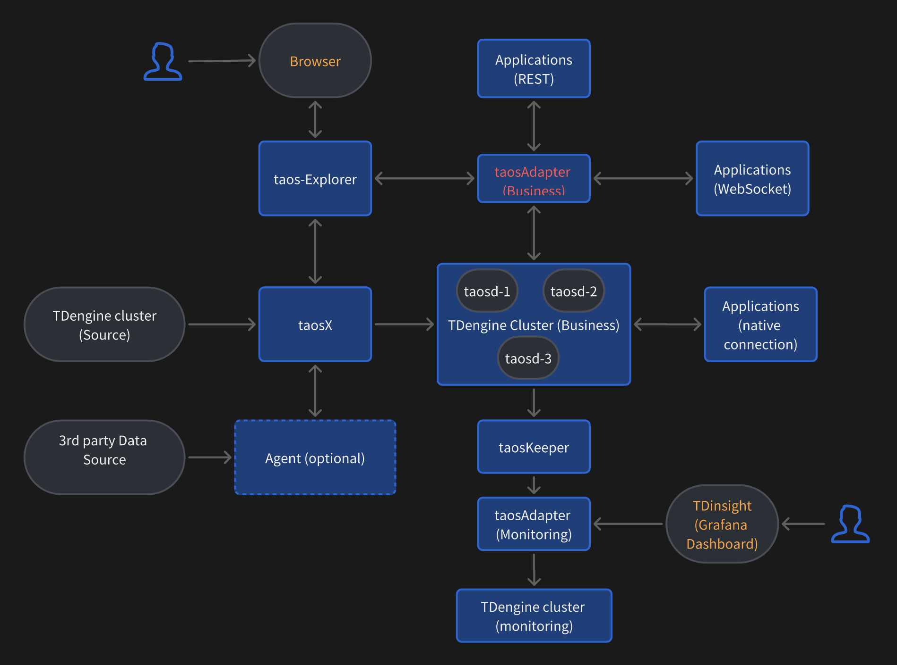

This article describes the TDengine Enterprise architecture and its main components.

## Architecture

The following figure shows the architecture of the TDengine ecosystem. The components displayed are installed with TDengine Server or taosX.

## Description

The figure is described as follows:

1. The business cluster is the target cluster for storing business data. This cluster is also the source of monitoring data and is managed by taosExplorer.

2. taosAdapter (business) provides RESTful and WebSocket access interfaces to the business cluster. It can be deployed as a cluster of multiple instances behind a reverse proxy server such as nginx.

3. taosKeeper collects monitoring data from the business cluster and stores it in the monitoring cluster.

4. The monitoring cluster is the target cluster for storing monitoring data. This cluster can use the same physical machines as the business cluster if desired. If you are monitoring multiple business clusters, deploy a monitoring cluster that is physically independent from any business cluster. However, if hardware resources are limited, you can deploy your monitoring cluster and business cluster on the same hardware.

5. taosAdapter (monitoring) provides RESTful and WebSocket access interfaces to the monitoring cluster. If your business and monitoring clusters use the same physical machines, you can use a single taosAdapter cluster for business and monitoring. However, if your business and monitoring clusters use independent hardware, you must deploy independent taosAdapter clusters for your business and monitoring clusters.. taosAdapter (monitoring) can also be deployed as a cluster of multiple instances behind a reverse proxy server such as nginx.

6. taosX is a zero-code platform for transmitting information between data sources and the TDengine cluster. Data sources include MQTT, InfluxDB, OpenTSDB, Kafka, PI System, OPC-UA, OPC-DA, and other TDengine clusters. Single taosX service can connect to multiple kinds of data sources and can support multiple concurrent transfer tasks for each data source.

7. taosX agent is required for ingesting data from certain sources into TDengine. It is used as agent service when taosX service can't connect to the data source directly.

8. The rules when deploying taosX and Agent, there are a few different scenarios:
  1) taosX can connect to the data source directly
    - Agent is not applicable to TDengine 3.0 (using data subscription), old version TDengine (2.6 or earlier versions), and CSV files.
    - If taosX is running on Linux system, then Agent is required for Pi and OPC-DA data source and the Agent must be running on Windows system as Pi and OPC-DA. Agent is not required for other data sources.
    - If taosX is running on Windows system, Agent is optional for all kinds of data sources. 
    
    
  2) taosX can't connect to the data source directly
    In this case, Agent is required and needs to be deployed in a network that can connect to the data source directly and can connect to the gRPC port listened by taosX (default is 6055).

  3) Relationship between taosX and Agent
    - Single taosX can connect to multiple kinds of data sources, and can connect to multiple Agents too
    - Single Agent can connect to multiple data sources一个 Agent
    - In such cases that Agent is optional, it's recommended not to use it to simplify your environment

9. taosExplorer is a Web-based management tool for your TDengine cluster and data transmission tasks.

10. Grafana is a tool for displaying monitoring metrics stored in the monitoring cluster.

11. Applications include all programs that write data to or query data from the business cluster. Applications (native connection) refers to programs that use native connections to the business cluster. Applications (RESTful) refers to programs that use the REST API to connect to the business cluster. Applications (WebSocket) refers to applications that use WebSocket to connect to the business cluster. RESTful and WebSocket access requires taosAdapter.