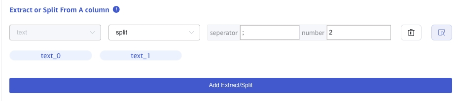

CSV data source is the process of writing data from a file or a collection of files in CSV format to the currently selected TDengine Cloud instance via a connection agent.

## Prerequisites

- Create an empty database to store your CSV data. For more information, see [Database](../../../programming/model/#create-database).

## Procedure

### 1. Add Source

In TDengine Cloud, open **Data In** page. On the **Data Sources** tab, click **Add Data Source** button to open the new data source page. In the **Name** input, fill in the name of the data source and select the type of **CSV**.
In the **Target DB**, select the database of the current TDengine Cloud instance as the target database.

### 2. Configure CSV Options

**Include Header:** If including header, the first row will be treated as column information.

**Skip the first N lines:**，Skip the first N lines for each CSV file.

**Delimiter Char:** The field separator in a CSV line,The default value is `,`.

**Quote Char:** The quote is used to enclose field values,The default value is `"`.

**Comment Prefix:** If a line begins with the character given here, then that line will be ignored by the CSV parser,The default value is `#`.

### 3. Configure Parsing CSV files

Upload a CSV file locally, such as test-json.csv, and then use the sample csv file to configure the extraction and filtering criteria.

#### 3.1 Parse

Click **Select File**, select test-json.csv, and click **Parse** to preview the identified columns.

**Preview parsing results**

#### 3.2 Extract or Split From A column

In the **Extract or Split From A column** field, fill in the fields to be extracted or split from the message body, for
example: split the text field into `text_0` and `text_1` fields, select split Extractor, seperator fill in -, number fill in 2.

Click the **Delete** button to delete the current extraction rule.

Click the **Add** button to add more extraction rules.

Click the **Preview** button to view the split result.

#### 3.3 Mapping

In the **Target Super Table** drop-down list, select a target super table, or click the **+Create STable** button on the
right to [Create Super Table](#Create STable).

In the **Mapping** area, fill in the sub-table name in the target super table, for example: `t_${groupid}`。

Click the **Preview** button to view the mapping result.

### 4. Finish

After filling in the above information, click the **Submit** button to start the data synchronization from CSV to TDengine.
