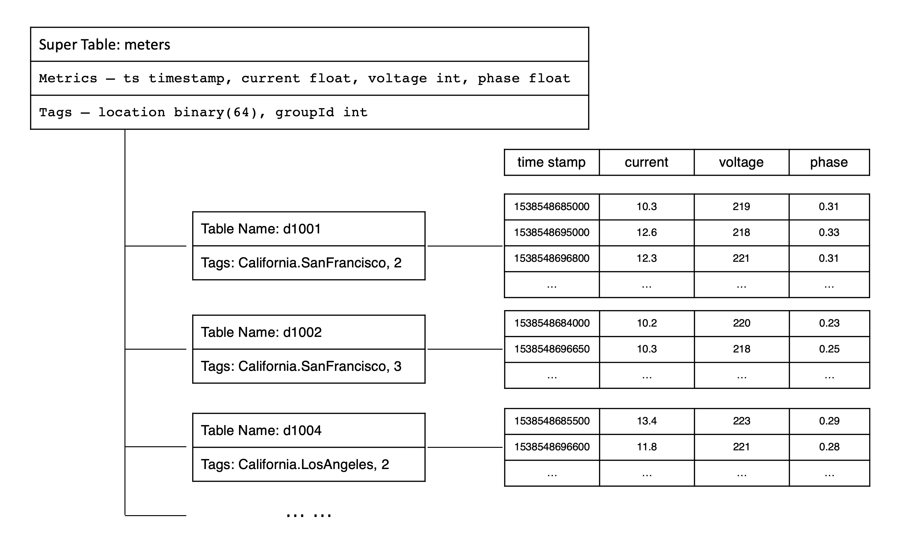

To clearly explain the concepts of time-series data and facilitate the writing of example programs, the TDengine documentation uses smart meters as an example. These example smart meters can collect three metrics: current, voltage, and phase. In addition, each smart meter also has two static attributes: location and group ID. The data collected by these smart meters is shown in the table below.

|Device ID| Timestamp | Current | Voltage | Phase | Location | Group ID |
|:-------:|:---------:|:-------:|:-------:|:-----:|:--------:|:--------:|
|d1001 |1538548685000 | 10.3 | 219 | 0.31 | California.SanFrancisco |2|
|d1002 | 1538548684000 | 10.2 | 220 | 0.23 | California.SanFrancisco |3|
|d1003 | 1538548686500 | 11.5 | 221 | 0.35 | California.LosAngeles | 3 |
|d1004 | 1538548685500 | 13.4 | 223 | 0.29 | California.LosAngeles | 2 |
|d1001 | 1538548695000 | 12.6 | 218 | 0.33 | California.SanFrancisco |2|
|d1004 | 1538548696600 | 11.8 | 221 | 0.28 | California.LosAngeles | 2 |
|d1002 | 1538548696650 | 10.3 | 218 | 0.25 | California.SanFrancisco | 3 |
|d1001 | 1538548696800 | 12.3 | 221 | 0.31 | California.SanFrancisco | 2 |

These smart meters collect data based on external trigger events or preset periods, ensuring the continuity and temporality of the data, thus forming a continuously updated data stream.

## Basic Concepts

If you only need basic modeling first, focus on metrics, tags, data collection points, tables, supertables, and subtables. Virtual tables are for more complex analysis scenarios and can be explored later when needed.

### Metric

A metric refers to a physical quantity, such as current, voltage, or temperature, obtained from a sensor, device, or other data collection point. Since these physical quantities change over time, the types of data collected are diverse, including integers, floating-point numbers, and strings. As time passes, the stored data will continue to grow. For example, in smart meters, current, voltage, and phase are typical metrics collected.

### Tag

A tag refers to a static attribute associated with a sensor, device, or other data collection point. These are attributes that do not change over time, such as device model, color, or location. The data type of tags can be any type. Although tags themselves are static, in practical applications, you may need to modify, delete, or add tags. Unlike quantities collected, the amount of tag data stored remains relatively stable over time and does not show a significant growth trend. In the example of smart meters, location and group ID are typical tags.

### Data Collection Point

A data collection point (DCP) refers to a hardware or software device responsible for collecting metrics at a certain preset time period or when triggered by specific events. A data collection point can collect one or more quantities at the same time, but these quantities are obtained at the same moment and have the same timestamp. Complex structured devices typically include multiple data collection points, each with different collection cycles, and they operate independently without interference. For example, a car might have a dedicated data collection point for collecting location information, some for monitoring engine status, and others focused on monitoring the interior environment. Thus, a car could contain three different types of data collection points. In the example of smart meters, identifiers such as d1001, d1002, and d1003 represent different data collection points.

### Table

Given that the time-series data collected from DCPs is usually structured, TDengine uses the traditional relational database model to manage data. At the same time, to fully utilize the characteristics of time-series data, TDengine adopts a "one table per device" design, requiring a separate table for each data collection point. For example, if there are millions of smart meters, a corresponding number of tables need to be created in TDengine. In the example data of smart meters, the smart meter with device ID d1001 corresponds to a table in TDengine, and all the time-series data collected by this meter is stored in this table. This design approach retains the usability of relational databases while fully utilizing the unique advantages of time-series data:

1. Since the data generation process at different data collection points is completely independent, and each data collection point has a unique data source, there is only one writer per table. This allows for lock-free data writing, significantly increasing the write speed.

2. For a data collection point, the data it generates is in chronological order, so the write operation can be implemented in an append-only manner, further greatly enhancing the data writing speed.

3. The data from a data collection point is stored continuously in blocks. Thus, reading data from a specific time period can significantly reduce random read operations, dramatically improving the speed of data reading and querying.

4. Within a data block, columnar storage is used, and different compression algorithms can be applied to different data types to improve the compression ratio. Moreover, since the rate of data collection changes is usually slow, the compression ratio will be higher.

If the traditional method of writing data from multiple data collection points into a single table is used, due to uncontrollable network latency, the sequence of data arrival at the server from different data collection points cannot be guaranteed, and the write operation needs to be protected by locks. Moreover, it is difficult to ensure that the data from one data collection point is stored continuously together. Using the method of one data collection point per table can ensure to the greatest extent that the performance of insertion and querying for a single data collection point is optimal, and the data compression ratio is the highest.

In TDengine, the name of the data collection point (e.g., d1001) is usually used as the table name, and each data collection point can have multiple metrics (such as current, voltage, phase, etc.), each corresponding to a column in a table. The data type of the metrics can be integer, floating-point, string, etc.

Additionally, the first column of the table must be a timestamp. For each metric, TDengine will use the first column timestamp to build an index and use columnar storage. For complex devices, such as cars, which have multiple data collection points, multiple tables need to be created for one car.

### Supertable

Although the "one table per device" design helps to manage each collection point specifically, as the number of devices increases, the number of tables also increases dramatically, posing challenges for database management and data analysis. When performing aggregation operations across data collection points, users need to deal with a large number of tables, making the work exceptionally cumbersome.

To solve this problem, TDengine introduces the supertable. A supertable is a data structure that can aggregate certain types of data collection points together into a logically unified table. These data collection points have the same table structure, but their static properties (such as tags) may differ. When creating a supertable, in addition to defining the metrics, it is also necessary to define the tags of the supertable. A supertable must contain at least one timestamp column, one or more metric columns, and one or more tag columns. Moreover, the tags of the supertable can be flexibly added, modified, or deleted.

In TDengine, a table represents a specific data collection point, while a supertable represents a collection of data collection points with the same attributes. Taking smart meters as an example, we can create a supertable for this type of meter, which includes all the common properties and metrics of smart meters. This design not only simplifies table management but also facilitates aggregation operations across data collection points, thereby improving the efficiency of data processing.

### Subtable

A subtable is a logical abstraction of a data collection point and is a specific table belonging to a supertable. You can use the definition of the supertable as a template and create subtables by specifying the tag values of the subtables. Thus, tables generated through the supertable are referred to as subtables. The relationship between the supertable and subtables is mainly reflected in the following aspects.

- A supertable contains multiple subtables, which have the same table structure but different tag values.
- The table structure of subtables cannot be directly modified, but the columns and tags of the supertable can be modified, and the modifications take effect immediately for all subtables.
- A supertable defines a template and does not store any data or tag information itself.

In TDengine, query operations can be performed on both subtables and supertables. For queries on supertables, TDengine treats the data from all subtables as a whole, first filtering out the tables that meet the query conditions through tags, then querying the time-series data on these subtables separately, and finally merging the query results from each subtable. Essentially, by supporting queries on supertables, TDengine achieves efficient aggregation of multiple similar data collection points. To better understand the relationship between metrics, tags, supertables, and subtables, taking smart meters as an example, refer to the following diagram.

### Virtual Tables

The design of "one table per data collection point" and "supertables" addresses most challenges in time-series data management and analysis for industrial and IoT scenarios. However, in real-world scenarios, a single device often has multiple sensors with varying collection frequencies. For example, a wind turbine may have electrical parameters, environmental parameters, and mechanical parameters, each collected by different sensors at different intervals. This makes it difficult to describe a device with a single table, often requiring multiple tables. When analyzing data across multiple sensors, multi-level join queries become necessary, which can lead to usability and performance issues. From a user perspective, "one table per device" is more intuitive. However, directly implementing this model would result in excessive NULL values at each timestamp due to varying collection frequencies, reducing storage and query efficiency.

To resolve this, TDengine introduces **Virtual Tables** (VTables). A virtual table is a logical entity that does not store physical data but enables analytical computations by dynamically combining columns from multiple source tables (subtables or regular tables). Like physical tables, virtual tables can be categorized into **virtual supertables**, **virtual subtables**, and **virtual regular tables**. A virtual supertable can represent a complete dataset for a device or group of devices, while each virtual subtable can flexibly reference columns from different sources. Virtual tables cannot be written to or deleted from but are queried like physical tables. The key distinction is that virtual table data is dynamically generated during queries; only columns referenced in a query are merged into the virtual table. Thus, the same virtual table may present entirely different datasets across different queries.

This mechanism makes **write first, model later** practical. During collection and ingestion, you do not need to design table structures for complex analytics up front; you can write data in a form close to the device protocol (for example, a single-column model). After data is stored, create virtual tables for the business view you need. That reduces ingestion complexity and early modeling burden.

#### Key Features of Virtual Supertables

1. **Column Selection & Merging**: Users can select specific columns from multiple source tables and combine them into a unified view.
2. **Timestamp-Based Alignment**: Data is aligned by timestamp. If multiple tables have data at the same timestamp, their column values are merged into a single row. Missing values are filled with NULL.
3. **Dynamic Updates**: Virtual tables automatically reflect changes in source tables, ensuring real-time data without physical storage.

By introducing virtual tables, TDengine simplifies the management of complex device data. Regardless of how individual collection points are modeled (single-column or multi-column) or distributed across databases/tables, users can freely define data sources through virtual supertables. This enables cross-collection-point aggregation and analysis, making "one table per device" a practical reality.

### Database

A database in TDengine is used to manage a collection of tables. TDengine allows a running instance to contain multiple databases, and each database can be configured with different storage strategies. Since different types of data collection points usually have different data characteristics, such as data collection frequency, data retention period, number of replicas, data block size, etc., it is recommended to create supertables with different data characteristics in different databases.

In a database, one to many supertables can be included, but each supertable can only belong to one database. At the same time, all subtables owned by a supertable are also stored in that database. This design helps to achieve more fine-grained data management and optimization, ensuring that TDengine can provide the best processing performance based on different data characteristics.

### Timestamps

Timestamps play a crucial role in time-series data processing, especially when applications need to access the database from multiple time zones. Before delving into how TDengine handles timestamps and time zones, here are a few basic concepts.

- Local date and time: The local time of a specific region, usually expressed as a string in the format `yyyy-MM-dd hh:mm:ss.SSS`, without time zone information, such as `2021-07-21 12:00:00.000`.
- Time zone: Standard time for different geographic locations. Coordinated Universal Time (UTC) or Greenwich Mean Time is the international time standard; other time zones are usually expressed as an offset from UTC, such as `UTC+8` for UTC+08:00.
- UTC timestamp: The number of milliseconds since the UNIX epoch (UTC 1970-01-01 00:00:00). For example, `1700000000000` corresponds to `2023-11-14 22:13:20 (UTC+0)`.

When TDengine stores time-series data, it stores UTC timestamps. When writing data, TDengine handles timestamps in two ways:

- RFC-3339 format: TDengine correctly parses time strings with time zone information into UTC timestamps. For example, `2018-10-03T14:38:05.000+08:00` is converted to a UTC timestamp.
- Non-RFC-3339 format: If the time string has no time zone information, TDengine uses the application’s time zone setting to convert the time into a UTC timestamp automatically.

When querying data, the TDengine client automatically converts stored UTC timestamps to local time according to the application’s current time zone setting, so users in different time zones see the correct local time.

## Continue Reading

After understanding these concepts, continue with [Data Modeling](./03-data-modeling.md) to create databases, supertables, subtables, and virtual tables with SQL.
