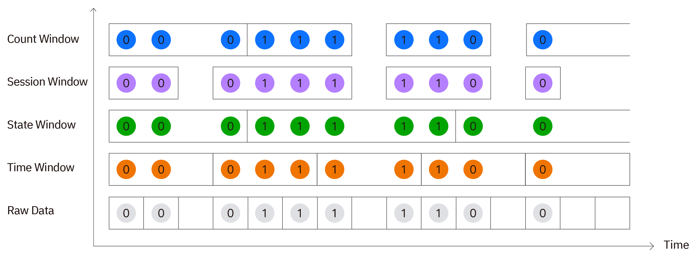

Compared with many time-series and real-time databases, TDengine has supported standard SQL queries since its first release. This lowers the learning cost for querying and analyzing time-series data.

This chapter uses the smart meter data model and the `test` database written by `taosBenchmark -y` in the quick start. In the shell you will try common queries: filter by condition, sort, limit rows, aggregate by tag or subtable, and summarize by time window. Each query type includes SQL and a representative result so you can see the shape of the output. The section below gives a capability overview first; for full syntax and advanced features, follow the links there or see “Continue Reading” at the end.

## Query Capability Overview

On top of standard SQL, TDengine extends querying for time-series and IoT scenarios with tag filtering, per-device partitioning, multiple time windows, interpolation, and join queries.

- **Basic retrieval**
  `SELECT` / `WHERE` / `ORDER BY` / `LIMIT`, time-range filters, regular expressions, `CASE`, and more. See [Data Querying](../05-tdengine-sql/04-data-query/01-query.md).

- **Operators and expressions**
  Arithmetic, comparison, logical, bitwise, JSON, and set operators. See [Operators](../05-tdengine-sql/04-data-query/02-operators.md).

- **Aggregation and functions**
  Statistical aggregates such as `COUNT` / `AVG` / `MAX`, plus selection, math, time, and time-series–specific built-ins. See [Functions](../05-tdengine-sql/04-data-query/03-function.md).

- **Tags and partitioning**
  Filter by tags; use `GROUP BY` / `PARTITION BY` / `tbname` / `SLIMIT` to aggregate and limit by device or tag. See [Data Querying](../05-tdengine-sql/04-data-query/01-query.md).

- **Time-series extensions**
  `INTERVAL` / `SLIDING` time windows, plus state, session, event, count, and external windows; `FILL` / `INTERP` for gap filling and interpolation. See [Time-Series Extensions](../05-tdengine-sql/04-data-query/04-distinguished.md) and [Data Querying](../05-tdengine-sql/04-data-query/01-query.md) (`FILL` / `INTERP`).

- **Join queries**
  Standard joins, plus time-series–oriented ASOF Join and Window Join. See [Join Queries](../05-tdengine-sql/04-data-query/05-join.md).

- **Window functions**
  `OVER` window functions. See [Window Functions](../05-tdengine-sql/04-data-query/06-window-function.md).

- **UDFs and read cache**
  User-defined functions (UDFs); accelerate latest-row reads with the read cache. See [UDFs](../05-tdengine-sql/04-data-query/07-udf.md) and [Read Cache](../05-tdengine-sql/04-data-query/08-cache-query.md).

- **Execution plans**
  Inspect plans with `EXPLAIN` / `EXPLAIN ANALYZE`. See [EXPLAIN](../05-tdengine-sql/04-data-query/09-explain.md).

Compared with general-purpose databases, time-series queries especially benefit from **querying a supertable across many devices in one statement**, **narrowing devices with tags**, and **windowing by time or state for downsampling and aggregation**. The rest of this chapter starts with the most common filters, aggregates, and time windows.

## Prerequisites

Confirm the following:

1. The TDengine service is running and you can connect with the shell.
2. You have run `taosBenchmark -y` in the Download and Install quick start, which created the `test` database and `meters` supertable. If not, run `taosBenchmark -y` in a terminal first.

By default that command writes about 100 million rows: 10,000 subtables (`d0`–`d9999`), 10,000 rows each, with timestamps from `2017-07-14 10:40:00.000` to `2017-07-14 10:40:09.999` (about 10 seconds at 1 ms intervals). The window examples below therefore use second-level windows rather than minute-level windows.

After entering the shell, switch to the `test` database.

```sql
USE test;
```

## Basic Query

Run the following SQL to query rows in the supertable `meters` where voltage is greater than 250V, and return the first 5 rows in descending time order.

```sql
SELECT tbname, ts, current, voltage
FROM meters
WHERE voltage > 250 and tbname = 'd1'
ORDER BY ts DESC
LIMIT 5;
```

Notes:

- `WHERE voltage > 250` filters rows with voltage greater than 250V.
- `ORDER BY ts DESC` returns results in descending timestamp order.
- `LIMIT 5` returns only the first 5 rows.

`tbname` is a pseudocolumn that identifies the source subtable.
The result looks like the following; exact subtable names and values may vary slightly with the `taosBenchmark` version or random data.

```text
 tbname |           ts            | current  | voltage |
========================================================
 d1     | 2017-07-14 10:40:09.998 |  11.7984 |     253 |
 d1     | 2017-07-14 10:40:09.998 |  11.7984 |     253 |
 d1     | 2017-07-14 10:40:09.998 |  11.7984 |     253 |
 d1     | 2017-07-14 10:40:09.998 |  11.7984 |     253 |
 d1     | 2017-07-14 10:40:09.998 |  11.7984 |     253 |

Query OK, 5 row(s) in set
```

## Filter by Tag

Tags describe static attributes of a device, such as location and group. The following SQL queries meter data in `California.SanFrancisco`.

```sql
SELECT tbname, ts, current, voltage, phase
FROM meters
WHERE location = "California.SanFrancisco"
ORDER BY ts DESC
LIMIT 5;
```

You can combine tag conditions with ordinary column conditions.

```sql
SELECT tbname, ts, current, voltage, phase
FROM meters
WHERE location = "California.SanFrancisco" AND voltage > 250
ORDER BY ts DESC
LIMIT 5;
```

A representative result:

```text
 tbname |           ts            | current  | voltage | phase |
===============================================================
 d3737  | 2017-07-14 10:40:09.998 |  11.7984 |     253 |   147 |
 d8742  | 2017-07-14 10:40:09.998 |  11.7984 |     253 |   147 |
 d8745  | 2017-07-14 10:40:09.998 |  11.7984 |     253 |   147 |
 d6259  | 2017-07-14 10:40:09.998 |  11.7984 |     253 |   147 |
 d6252  | 2017-07-14 10:40:09.998 |  11.7984 |     253 |   147 |

Query OK, 5 row(s) in set
```

## Aggregate Query

Aggregate functions help you compute statistics quickly. The following SQL returns the average voltage, maximum voltage, and total row count across all meters.

```sql
SELECT AVG(voltage), MAX(voltage), COUNT(*)
FROM meters;
```

The result is a single summary row over the full dataset.

```text
 avg(voltage) | max(voltage) |  count(*)  |
===========================================
     243.9314 |          258 |  100000000 |

Query OK, 1 row(s) in set
```

To group statistics, use `GROUP BY`. In the quick-start sample data, the group tag column is `groupId`.

```sql
SELECT groupId, AVG(voltage), COUNT(*)
FROM meters
GROUP BY groupId
ORDER BY groupId;
```

The result has one row per `groupId`.

```text
 groupId | avg(voltage) | count(*) |
====================================
       1 |     243.9314 |  9800000 |
       2 |     243.9314 |  9940000 |
       3 |     243.9314 |  9800000 |
       4 |     243.9314 | 10040000 |
       5 |     243.9314 | 10310000 |
     ...
Query OK, 10 row(s) in set
```

`GROUP BY` does not guarantee a fixed order unless you sort. To order by a statistic, use `ORDER BY`.

```sql
SELECT groupId, AVG(voltage) AS avg_voltage
FROM meters
GROUP BY groupId
ORDER BY avg_voltage DESC;
```

## Aggregate by Subtable

To compute per meter, use `PARTITION BY tbname`. The following SQL averages voltage per subtable and uses `SLIMIT` to return only the first few partitions, avoiding 10,000 rows of output.

```sql
SELECT tbname, AVG(voltage), COUNT(*)
FROM meters
PARTITION BY tbname
SLIMIT 3;
```

The result is split by subtable. Partition order may vary slightly by environment.

```text
 tbname | avg(voltage) | count(*) |
===================================
 d0     |     243.9314 |    10000 |
 d1     |     243.9314 |    10000 |
 d2     |     243.9314 |    10000 |

Query OK, 3 row(s) in set
```

`PARTITION BY` first splits supertable data by the specified dimension, then runs the calculation in each partition. It is commonly used for “per-device statistics”.

## Window Query

Window queries split time-series data by time, state, event, or row count, then compute within each window. For a quick start, focus on the following window types:



- Time window: fixed intervals with `INTERVAL`.
- Sliding window: add a slide step with `SLIDING`.
- State window: split on state changes with `STATE_WINDOW`.
- Session window: split on gaps between adjacent timestamps with `SESSION`.
- Event window: open and close on start/end conditions with `EVENT_WINDOW`.
- Count window: fixed row counts with `COUNT_WINDOW`.
- External window: window ranges from a subquery with `EXTERNAL_WINDOW`.

The examples below cover the full time range of `test.meters`.

### Time Window

The following SQL computes average voltage per meter in 1-second windows.

```sql
SELECT tbname, _wstart, _wend, AVG(voltage)
FROM meters
WHERE ts >= "2017-07-14 10:40:00" AND ts < "2017-07-14 10:40:10"
PARTITION BY tbname
INTERVAL(1s)
SLIMIT 2;
```

Notes:

- `INTERVAL(1s)` splits data into 1-second windows.
- `_wstart` and `_wend` are the window start and end times.
- `PARTITION BY tbname` runs window aggregation independently per subtable.
- `SLIMIT 2` returns only the first 2 partitions to keep output short.

Each result row is one time window. A sample:

```text
 tbname |        _wstart         |         _wend          | avg(voltage) |
==========================================================================
 d0     | 2017-07-14 10:40:00.000 | 2017-07-14 10:40:01.000 |     244.003 |
 d0     | 2017-07-14 10:40:01.000 | 2017-07-14 10:40:02.000 |     243.872 |
 d0     | 2017-07-14 10:40:02.000 | 2017-07-14 10:40:03.000 |     244.261 |
 d1     | 2017-07-14 10:40:00.000 | 2017-07-14 10:40:01.000 |     244.003 |
 d1     | 2017-07-14 10:40:01.000 | 2017-07-14 10:40:02.000 |     243.872 |
 ...
```

### Sliding Window

To slide the window by a shorter step, add `SLIDING`. The following SQL uses a 1-second window that slides every 500 milliseconds.

```sql
SELECT tbname, _wstart, AVG(voltage)
FROM meters
WHERE ts >= "2017-07-14 10:40:00" AND ts < "2017-07-14 10:40:10"
PARTITION BY tbname
INTERVAL(1s)
SLIDING(500a)
SLIMIT 1;
```

In the result, `_wstart` advances by 500 milliseconds, showing the 1-second window sliding in 500 ms steps.

```text
 tbname |        _wstart         | avg(voltage) |
==================================================
 d0     | 2017-07-14 10:39:59.500 |     243.808 |
 d0     | 2017-07-14 10:40:00.000 |     244.003 |
 d0     | 2017-07-14 10:40:00.500 |     244.089 |
 d0     | 2017-07-14 10:40:01.000 |     243.872 |
 d0     | 2017-07-14 10:40:01.500 |     244.019 |
 ...
```

### Fill Missing Windows

When a window has no data, use `FILL` to specify how to fill it. The following SQL fills missing windows with the previous non-NULL value.

```sql
SELECT _wstart, _wend, AVG(voltage)
FROM d0
WHERE ts >= "2017-07-14 10:40:00" AND ts < "2017-07-14 10:40:10"
INTERVAL(1s)
FILL(prev);
```

Sample data in this chapter is fairly continuous, so the result mainly shows the shape of a `FILL` query. If a window has no data, `FILL(prev)` fills it with the previous non-NULL window result.

```text
        _wstart         |         _wend          | avg(voltage) |
================================================================
 2017-07-14 10:40:00.000 | 2017-07-14 10:40:01.000 |     244.003 |
 2017-07-14 10:40:01.000 | 2017-07-14 10:40:02.000 |     243.872 |
 2017-07-14 10:40:02.000 | 2017-07-14 10:40:03.000 |     244.261 |
 2017-07-14 10:40:03.000 | 2017-07-14 10:40:04.000 |     243.479 |
 2017-07-14 10:40:04.000 | 2017-07-14 10:40:05.000 |     243.972 |
 ...
```

### State Window

State windows split data when state changes. The following SQL windows by whether voltage is in the 240V–250V range.

```sql
SELECT _wstart, _wend, COUNT(*),
    CASE WHEN voltage >= 240 AND voltage <= 250 THEN 1 ELSE 0 END AS status
FROM d0
WHERE ts >= "2017-07-14 10:40:00" AND ts < "2017-07-14 10:40:03"
STATE_WINDOW(
    CASE WHEN voltage >= 240 AND voltage <= 250 THEN 1 ELSE 0 END
)
LIMIT 4;
```

Adjacent windows have different `status` values when the state changes.

```text
        _wstart         |         _wend          | count(*) | status |
=====================================================================
 2017-07-14 10:40:00.000 | 2017-07-14 10:40:00.001 |        2 |      0 |
 2017-07-14 10:40:00.002 | 2017-07-14 10:40:00.002 |        1 |      1 |
 2017-07-14 10:40:00.003 | 2017-07-14 10:40:00.006 |        4 |      0 |
 2017-07-14 10:40:00.007 | 2017-07-14 10:40:00.014 |        8 |      1 |

Query OK, 4 row(s) in set
```

### Session Window

Session windows split data by the gap between adjacent timestamps. The following SQL groups rows whose gap is at most 30 seconds into one session. Because adjacent points in `d0` are 1 ms apart, the whole range falls into a single session window.

```sql
SELECT _wstart, _wend, COUNT(*)
FROM d0
WHERE ts >= "2017-07-14 10:40:00" AND ts < "2017-07-14 10:40:10"
SESSION(ts, 30s);
```

Result:

```text
        _wstart         |         _wend          | count(*) |
=============================================================
 2017-07-14 10:40:00.000 | 2017-07-14 10:40:09.999 |    10000 |

Query OK, 1 row(s) in set
```

### Event Window

Event windows open when a start condition is met and close when an end condition is met. For example, start observing when voltage rises above a threshold, and stop when it falls below another.

```sql
SELECT _wstart, _wend, COUNT(*)
FROM d0
WHERE ts >= "2017-07-14 10:40:00" AND ts < "2017-07-14 10:40:10"
EVENT_WINDOW START WITH voltage >= 250 END WITH voltage < 245
LIMIT 4;
```

Each result row is one event interval from open to close.

```text
        _wstart         |         _wend          | count(*) |
=============================================================
 2017-07-14 10:40:00.000 | 2017-07-14 10:40:00.001 |        2 |
 2017-07-14 10:40:00.004 | 2017-07-14 10:40:00.005 |        2 |
 2017-07-14 10:40:00.006 | 2017-07-14 10:40:00.011 |        6 |
 2017-07-14 10:40:00.016 | 2017-07-14 10:40:00.017 |        2 |

Query OK, 4 row(s) in set
```

### Count Window

Count windows group by a fixed number of rows. The following SQL creates a window every 100 rows.

```sql
SELECT _wstart, _wend, COUNT(*)
FROM d0
WHERE ts >= "2017-07-14 10:40:00" AND ts < "2017-07-14 10:40:10"
COUNT_WINDOW(100)
LIMIT 5;
```

Each window contains at most 100 rows.

```text
        _wstart         |         _wend          | count(*) |
=============================================================
 2017-07-14 10:40:00.000 | 2017-07-14 10:40:00.099 |      100 |
 2017-07-14 10:40:00.100 | 2017-07-14 10:40:00.199 |      100 |
 2017-07-14 10:40:00.200 | 2017-07-14 10:40:00.299 |      100 |
 2017-07-14 10:40:00.300 | 2017-07-14 10:40:00.399 |      100 |
 2017-07-14 10:40:00.400 | 2017-07-14 10:40:00.499 |      100 |

Query OK, 5 row(s) in set
```

### External Window

External windows are useful when an event table, schedule, or maintenance plan already defines the window ranges. The following SQL uses a subquery to define two window boundaries, then computes average voltage in `d0` for each window.

```sql
SELECT _wstart, _wend, AVG(voltage)
FROM d0
EXTERNAL_WINDOW (
    (SELECT CAST("2017-07-14 10:40:00" AS TIMESTAMP) AS ws,
            CAST("2017-07-14 10:40:01" AS TIMESTAMP) AS we
     UNION ALL
     SELECT CAST("2017-07-14 10:40:01" AS TIMESTAMP),
            CAST("2017-07-14 10:40:02" AS TIMESTAMP)
     ORDER BY ws) w
);
```

In the result, window boundaries come from the subquery rather than automatic `INTERVAL` splitting.

```text
        _wstart         |         _wend          | avg(voltage) |
=================================================================
 2017-07-14 10:40:00.000 | 2017-07-14 10:40:01.000 |  244.206793 |
 2017-07-14 10:40:01.000 | 2017-07-14 10:40:02.000 |  244.367632 |

Query OK, 2 row(s) in set
```

You can also generate ordered windows with an `INTERVAL` subquery:

```sql
SELECT _wstart, _wend, AVG(voltage)
FROM d0
EXTERNAL_WINDOW (
    (SELECT _wstart, _wend
     FROM d0
     WHERE ts >= "2017-07-14 10:40:00" AND ts < "2017-07-14 10:40:02"
     INTERVAL(1s)) w
);
```

## Common Query Patterns

Here are a few patterns that are useful in the quick-start stage.

Latest row of a subtable:

```sql
SELECT * FROM d0 ORDER BY ts DESC LIMIT 1;
```

Row count by location:

```sql
SELECT location, COUNT(*)
FROM meters
GROUP BY location
ORDER BY location;
```

Maximum voltage per meter (`SLIMIT` limits how many partitions are returned):

```sql
SELECT tbname, MAX(voltage)
FROM meters
PARTITION BY tbname
SLIMIT 3;
```

Average current over a time range:

```sql
SELECT AVG(current)
FROM meters
WHERE ts >= "2017-07-14 10:40:00" AND ts < "2017-07-14 10:40:10";
```

## Continue Reading

This chapter covers only the most common queries for a quick start. For more advanced capabilities, continue with:

- [Data Querying](../05-tdengine-sql/04-data-query/01-query.md): `SELECT` syntax, common clauses, and examples
- [Operators](../05-tdengine-sql/04-data-query/02-operators.md): arithmetic, bitwise, comparison, logical, and related operators
- [Functions](../05-tdengine-sql/04-data-query/03-function.md): function categories, syntax, and usage
- [Time-Series Extensions](../05-tdengine-sql/04-data-query/04-distinguished.md): time-series query features such as multiple window types
- [Join Queries](../05-tdengine-sql/04-data-query/05-join.md): JOIN concepts, types, syntax, and limits
- [Window Functions](../05-tdengine-sql/04-data-query/06-window-function.md): `OVER` clause and standard SQL window functions
- [UDFs](../05-tdengine-sql/04-data-query/07-udf.md): create, manage, and invoke user-defined functions
- [Read Cache](../05-tdengine-sql/04-data-query/08-cache-query.md): cache recent subtable data with `CACHEMODEL` to speed up `LAST` / `LAST_ROW`
- [EXPLAIN](../05-tdengine-sql/04-data-query/09-explain.md): use `EXPLAIN` / `EXPLAIN ANALYZE` for plans and runtime metrics
