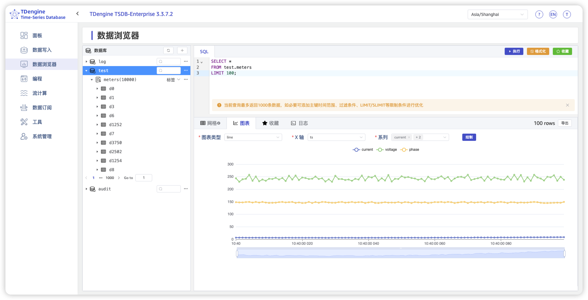

TDengine TSDB Explorer is the web-based visual management tool for TDengine. Compared with running commands only in the shell, Explorer is better for browsing database objects, running SQL, viewing client library examples, and discovering tools that integrate with TDengine.

This chapter continues with the smart meter data from earlier chapters. You will complete a basic browser walkthrough: log in to Explorer, browse databases and tables, run a query, and find programming and visualization entry points.

## Prerequisites

Confirm the following:

1. The TDengine service is running.
2. The taosExplorer service is running and reachable in a browser.
3. You have created the `power` database, `meters` supertable, and subtables such as `d1001` and `d1002`, or you have generated `test` database data with `taosBenchmark -y` in the quick start.

If you started TDengine with the Docker option in this quick start, the container already maps the default Explorer port `6060`.

## Open TDengine TSDB Explorer

In a web browser, open the Explorer URL.

```text
http://localhost:6060
```

If TDengine is on a remote host, replace `localhost` with that host and ensure security groups, firewalls, or container port mappings allow `6060`.

On the login page, enter the username and password. Defaults:

```text
Username: root
Password: taosdata
```

If you have not logged in to Explorer before, you may need to register first. Enter your name and email address, click **Get verification code**, then enter the code from your email and click **Submit**.

After login, the main Explorer interface appears.

## Browse Databases and Tables

Open the **Explorer** (data browser) page to view databases, supertables, subtables, and basic tables in the current instance.

<!-- TODO: add English Explorer screenshot
<!--  -->
-->

If you use the smart meter examples from earlier chapters, expand in order:

1. The `test` database (or `power`, depending on which sample you created).
2. The `meters` supertable.
3. Subtables such as `d1001` and `d1002`.

Here you can see the object hierarchy and inspect table schemas, tags, and sample data.

## Run SQL Queries

Explorer also provides a SQL query entry. Copy the following SQL and run it on the page to view meter data.

```sql
SELECT tbname, ts, current, voltage, phase
FROM test.meters
WHERE tbname = 'd1'
ORDER BY ts DESC
LIMIT 10;
```

Results appear as a table. Compared with the shell, the grid view is often easier for ad-hoc filtering, inspecting column values, and copying results.

## Programming Examples and Tools

Explorer is not only for browsing data. It also provides getting-started entry points:

- On the **Programming** page, view client library examples for languages such as Java, Go, Python, JavaScript/Node.js, C#, Rust, and R. Many examples can be copied and run directly.
- On the **Tools** page, find integration entry points for Grafana, Power BI, Superset, Tableau, Excel, and similar tools. Follow the on-screen guidance to build dashboards and reports.
- Click the **?** icon in the upper-right corner to open built-in help and documentation. Local docs do not require an internet connection.

These entry points are useful after the quick start when you connect applications, BI tools, or dashboards.

## Troubleshooting

If the browser cannot open Explorer, check the following:

- Whether the taosExplorer service is started.
- Whether the URL and port are correct (default `6060`).
- Whether Docker, cloud security groups, or the local firewall allow port `6060`.
- Whether the `cluster` setting in Explorer points to a reachable taosAdapter address (default `http://localhost:6041`).

If you log in but do not see data from earlier chapters, confirm you are connected to the same TDengine instance and that the database name is `power` or `test`.

## Next Steps

This chapter covers only basic Explorer usage. For installation, configuration, and integrations, continue with:

- [taosExplorer Reference](../12-operations-and-tooling/03-components/04-explorer.md): Installation, configuration, and advanced features.
- [Get Started with Docker](./01-download-and-install/01-docker.md): Port mappings and service startup.
- [Data Querying](./05-query-and-aggregate.md): Continue running SQL in the shell or Explorer.
- [Grafana Integration](./09-grafana-integration.md): Build monitoring panels in Grafana.
- [Zero-Code Data Ingestion](./10-no-code-ingestion.md): Configure data ingestion visually.
