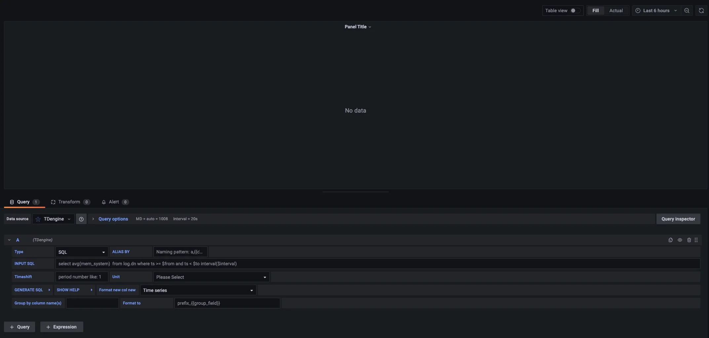

[Grafana](https://grafana.com/grafana/) is a popular open-source visualization and monitoring platform. TDengine integrates with Grafana through a data source plugin so you can build charts, dashboards, and alerts without writing application code.

This chapter uses the `test` database meter data written by `taosBenchmark -y` in the quick start. You will complete a minimal integration: confirm data, install the TDengine Grafana plugin, configure a data source, and create a panel that shows average current over time.

## Prerequisites

Confirm the following:

1. The TDengine service is running.
2. taosAdapter is running and Grafana can reach its WebSocket/REST port (default `6041`).
3. Grafana is installed and running. TDengine supports Grafana 8.0 and later.
4. You have run `taosBenchmark -y` in the Download and Install quick start so the `test` database and `meters` supertable exist. If not, run `taosBenchmark -y` in a terminal first.

If you started TDengine with the Docker option in this quick start, port `6041` is already mapped and you can use `http://localhost:6041` as the TDengine data source URL.

:::tip

To generate fresher sample data for Grafana’s default “Last 1 hour” range instead of the historical `2017-07-14` timestamps from `taosBenchmark -y`, you can also run:

```bash
taosBenchmark --start-timestamp=$(date --date="1 hours ago" +%s%3N) \
  --time-step=1000 --records=1000 \
  --tables=100 --answer-yes
```

This creates a `meters` supertable in the `test` database with 100 subtables and 1,000 records each, starting from one hour ago.

:::

## Prepare Sample Data

In the shell, confirm that `test.meters` already has data.

```sql
USE test;

SELECT tbname, ts, current, voltage
FROM meters
WHERE voltage > 250 and tbname = 'd1'
ORDER BY ts DESC
LIMIT 5;
```

The result looks similar to the following.

```text
 tbname |           ts            | current  | voltage |
========================================================
 d1     | 2017-07-14 10:40:09.998 |  11.7984 |     253 |
 d1     | 2017-07-14 10:40:09.998 |  11.7984 |     253 |
 d1     | 2017-07-14 10:40:09.998 |  11.7984 |     253 |
 d1     | 2017-07-14 10:40:09.998 |  11.7984 |     253 |
 d1     | 2017-07-14 10:40:09.998 |  11.7984 |     253 |

Query OK, 5 row(s) in set
```

For data written by `taosBenchmark -y`, timestamps fall between `2017-07-14 10:40:00.000` and `2017-07-14 10:40:09.999`. In Grafana, set an absolute time range that covers this interval instead of the default “Last 1 hour”.

## Install the Grafana Plugin

Grafana talks to TDengine through the TDengine Datasource plugin. On Linux, run the following install script on the Grafana host:

```bash
bash -c "$(curl -fsSL https://raw.githubusercontent.com/taosdata/grafanaplugin/master/install.sh)"
```

For other platforms, see the plugin [installation guide](https://github.com/taosdata/grafanaplugin/blob/master/INSTALLATION.md).

After installation, restart Grafana:

```bash
sudo systemctl restart grafana-server.service
```

If you run Grafana in Docker or need a manual install, see the Grafana integration document linked at the end of this page.

## Configure the TDengine Data Source

Open Grafana in a browser.

```text
http://localhost:3000
```

On first login, the default username and password are usually `admin` / `admin`. Then add a TDengine data source:

1. Go to **Connections** > **Add new connection**.
2. Search for `TDengine` and select the TDengine data source plugin.
3. Click **Add new data source**.
4. Fill in the connection settings on the configuration page.

Common settings:

- **TDengine Host**: `http://localhost:6041`. For a remote TDengine host, use that address and port.
- **TDengine Authentication**: Database username and password (default `root` / `taosdata`).

Click **Save & test**. If you see `TDengine Data source is working`, Grafana can reach TDengine.

## Create a Dashboard

After the data source is configured, create a panel that shows average current over time.

1. Click **Build a dashboard**, or go to **Dashboards** > **New** / **New dashboard**.
2. Click **Add visualization** or **Add a new panel**.
3. Select the TDengine data source you configured.
4. In the **Input SQL** field, enter the following query.

```sql
SELECT _wstart AS time, AVG(current) AS avg_current
FROM test.meters
WHERE groupId = 1 AND ts >= $from AND ts < $to
INTERVAL($interval)
FILL(NULL);
```

Where:

- `$from` and `$to` are the start and end of the current Grafana time range.
- `$interval` is the window size Grafana derives from the time range.
- `INTERVAL($interval)` aggregates points using that window size.
- In the quick-start sample data, the grouping tag column is `groupId`.

Before clicking **Run query** or **Apply**, set an absolute time range in the upper-right corner of Grafana when using `taosBenchmark -y` data, for example:

- **From**: `2017-07-14 10:40:00`
- **To**: `2017-07-14 10:40:10`

Then run the query. Grafana shows how average current changes over that period.



If the chart is empty, confirm the time range covers your sample data and that `test.meters` contains the quick-start writes.

For more details, see [Grafana](../13-ecosystem-integrations/02-visual/01-grafana.mdx).

## Troubleshooting

If **Save & test** fails, check the following:

- Whether taosAdapter is running.
- Whether the Grafana host can reach `http://localhost:6041`. If Grafana is not on the same machine as TDengine, do not use `localhost`; use the TDengine server address.
- Whether the username and password are correct (default `root` / `taosdata`).
- Whether Docker, cloud security groups, or firewalls allow port `6041`.

If the dashboard has no data, check the following:

- Whether the Grafana time range covers your sample timestamps (for `taosBenchmark -y`, `2017-07-14 10:40:00` to `2017-07-14 10:40:10`).
- Whether the database, supertable, and tag column in SQL match the data (tag column `groupId`).
- Whether `groupId = 1` matches any rows; you can remove that filter to verify the overall series.

## Next Steps

This chapter covers only a minimal Grafana integration. For plugin install options, variables, dashboard tips, and performance guidance, continue with:

- [Integrate with Grafana](../13-ecosystem-integrations/02-visual/01-grafana.mdx): Full plugin install, data source setup, and dashboard guide.
- [taosAdapter Reference](../12-operations-and-tooling/03-components/03-taosadapter.md): WebSocket/REST ports and configuration.
- [Data Querying](./05-query-and-aggregate.md): `INTERVAL`, `FILL`, `GROUP BY`, and time-range queries.
- [Visual Management](./08-visual-management.md): Query and manage data in Explorer.
