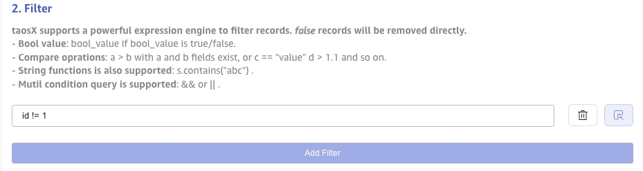

In real workloads, device data may come from MQTT, Kafka, OPC, PI System, CSV files, or relational databases. Hand-written collectors are flexible but must handle connection, parsing, field mapping, checkpointing, and error recovery.

TDengine can ingest data through taosX and TDengine TSDB Explorer with zero code. You configure the data source, parsing rules, and target table mapping in the web UI, and external data is written into TDengine continuously.

Supported sources include PI System, OPC, InfluxDB, MQTT, Kafka, CSV, MySQL, PostgreSQL, Oracle, MongoDB, and more.

This chapter uses MQTT as an example with a public MQTT broker and one JSON meter message, from configuring a task to querying ingested rows.

## Prerequisites

Confirm the following:

1. The TDengine service is running.
2. TDengine TSDB Explorer is reachable in a browser.
3. taosX-related services are running, and the left menu in Explorer includes **Data In**.
4. You can reach an external MQTT broker. This chapter uses the public MQTT broker provided by EMQX.

If you started TDengine with the Docker option in this quick start, Explorer and taosX are usually included. If pages are unavailable, check container ports and service status.

## Create an MQTT Ingestion Task

Open TDengine TSDB Explorer, go to **Data In** on the left, and click **+ Add Source** (or **Create New Task**) to open the task configuration page.

Under basic information, set:

- **Name**: `quick_mqtt_meter` (must be unique).
- **Type**: **MQTT**.
- **Target DB**: `test_mqtt`. If the database does not exist, click **+ Create Database** / **Create Database**.

**Agent** is optional; leave it blank for this example.

## Configure the Broker Address

Under broker / connection settings, use the public MQTT broker:

- **MQTT Host**: `broker.emqx.io`
- **Port**: `1883`


## Configure Connection and Authentication

Under connection / protocol settings:

- **MQTT Protocol Version**: `3.1` (page default; `3.1.1` or `5.0` are also available).
- **Client ID**: Use the auto-generated value such as `taosx_client_<8 random chars>`, or set a custom unique ID on that broker.
- **Keep Alive** / **Clean Session**: Keep the defaults (keep-alive often `60` seconds; clean session on).

Under authentication:

- **Username** / **Password**: Leave blank. The public broker does not require authentication.
- **TLS Verification**: **Disable**.

Under collection / topic settings:

- **Topics QoS Config**: `tdengine/quickstart/meter::0`

The format is `<topic>::<QoS>`, where QoS is `0`, `1`, or `2`. The example subscribes to topic `tdengine/quickstart/meter` with QoS `0`. Separate multiple topics with commas, for example `topic1::0,topic2::1`.

Leave advanced items such as topic parsing, compression, and character encoding at their defaults.

Click **Check Connectivity**. If you see **Your data source is reachable** (or an equivalent success message), taosX can reach the MQTT broker.

## Configure Payload Transformation

In **Payload Transformation**, find the sample message body and enter the following JSON for one smart meter reading.

```json
{
  "ts": "2026-07-27T14:30:00+08:00",
  "id": 1,
  "current": 10.42,
  "phase": 1.38,
  "voltage": 220,
  "groupid": 7,
  "location": "beijing"
}
```

Click **Identify** / the preview icon under parsing to confirm JSON fields are extracted.


Then under **Mapping**, select or create the target supertable `meters`.

If you create a new supertable, configure columns and tags as follows:

| Data Type | Name | Kind | Description |
| --- | --- | --- | --- |
| `TIMESTAMP` | `ts` | Column | Timestamp |
| `DOUBLE` | `current` | Column | Current |
| `DOUBLE` | `phase` | Column | Phase |
| `INT` | `voltage` | Column | Voltage |
| `INT` | `groupid` | Tag | Group ID |
| `VARCHAR(128)` | `location` | Tag | Location |

After the supertable is created and selected, complete mapping:

1. On the **SubTableName** (`Tablename`) row, set Expression to `t_{id}` so the subtable name is built from the message `id` (for example `id` `1` → `t_1`).
2. Map the remaining columns to the matching JSON fields (`ts`, `current`, `voltage`, `phase`, `groupid`, `location`).



Click **Submit**. You return to the **Data In Task** list.

## Check Task Status

After submit, watch **Status** in the list. When it becomes **Running**, the task is subscribed to the MQTT topic and waiting to write into TDengine.

You can also view write rate, errors, and recent status in the list. If the status is abnormal, open the task details for error messages.

## Send Test Data

When the task is **Running**, publish a test message with `mosquitto_pub` ([Eclipse Mosquitto](https://mosquitto.org/) client). If it is not installed, run `sudo apt install mosquitto-clients` on Debian/Ubuntu, or install the Mosquitto clients package for your platform.

Example publish:

```bash
mosquitto_pub -h broker.emqx.io -p 1883 -t 'tdengine/quickstart/meter' -q 0 -m '{
  "ts": "2026-07-27T14:31:00+08:00",
  "id": 1,
  "current": 10.58,
  "phase": 1.41,
  "voltage": 221,
  "groupid": 7,
  "location": "beijing"
}'
```

Parameters:

- `-h` / `-p`: Broker host and port (`broker.emqx.io:1883`).
- `-t`: Publish topic; must match the topic in **Topics QoS Config** (without the `::QoS` suffix).
- `-q`: QoS (`0` in this example).
- `-m`: Message body; fields must match the sample body and mapping rules.

To avoid overwriting the same timestamp, change `ts` to the current time when retesting. You can also use a GUI client such as [MQTTX](https://mqttx.app/) to publish the same topic and payload. See the [EMQX getting started docs](https://docs.emqx.com/en/emqx/latest/getting-started/getting-started.html) for related broker background.

## Verify Ingested Data

After publishing, query results in Explorer’s data browser or in the shell.

```sql
SELECT tbname, ts, current, voltage, phase, groupid, location
FROM test_mqtt.meters
ORDER BY ts DESC
LIMIT 5;
```

The result looks similar to:

```text
 tbname |           ts            | current | voltage | phase | groupid | location |
==================================================================================
 t_1    | 2026-07-27 14:31:00.000 | 10.5800 |     221 | 1.410 |       7 | beijing  |
 t_1    | 2026-07-27 14:30:00.000 | 10.4200 |     220 | 1.380 |       7 | beijing  |
```

If rows are returned, MQTT messages were written to TDengine through taosX.

You can also review task status, ingestion rate, and error logs on the **Data In** page.

## Troubleshooting

If connectivity check fails, check the following:

- Whether the host running taosX can reach `broker.emqx.io:1883`.
- Whether **MQTT Host**, **Port**, **TLS Verification**, and authentication are correct.
- Whether corporate networks or cloud security groups block outbound MQTT.

If the task is running but queries return no data, check the following:

- Whether the published topic exactly matches the topic in **Topics QoS Config**.
- Whether the sample body can be identified and field names match the mapping.
- Whether **SubTableName** is set (for example `t_{id}`).
- Whether the target database and supertable were created successfully.
- Whether you query database `test_mqtt`.

## Next Steps

This chapter demonstrates a minimal MQTT ingestion flow. For more sources and advanced options, continue with:

- [Data Ingest and Delivery](../08-data-ingest-and-delivery/index.md): Overview of zero-code ingestion, delivery, and edge–cloud sync.
- [Zero-Code Data Ingestion](../08-data-ingest-and-delivery/01-no-code-ingestion/index.md): Supported sources, ETL rules, health, and resume.
- [MQTT](../08-data-ingest-and-delivery/01-no-code-ingestion/07-mqtt.mdx): Full MQTT ingestion configuration.
- [Kafka](../08-data-ingest-and-delivery/01-no-code-ingestion/08-kafka.mdx): Full Kafka ingestion configuration.
- [CSV](../08-data-ingest-and-delivery/01-no-code-ingestion/11-csv.mdx): Import data from CSV files.
- [OPC UA](../08-data-ingest-and-delivery/01-no-code-ingestion/05-opcua/index.md): Industrial OPC UA ingestion.
- [Visual Management](./08-visual-management.md): Browse data, run SQL, and open tool entry points in Explorer.
