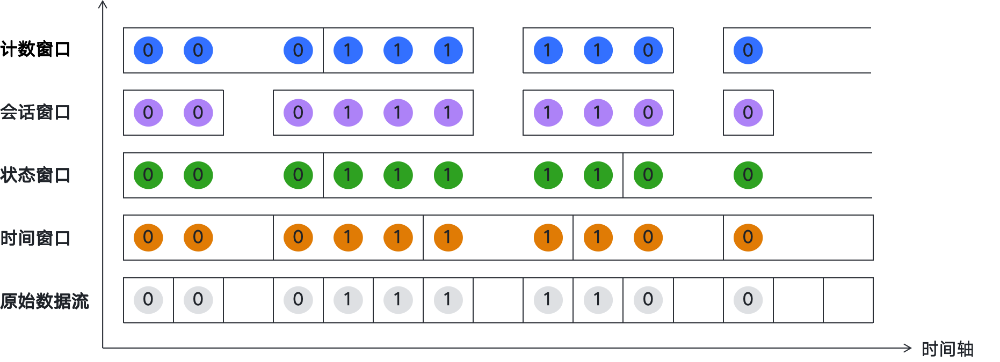
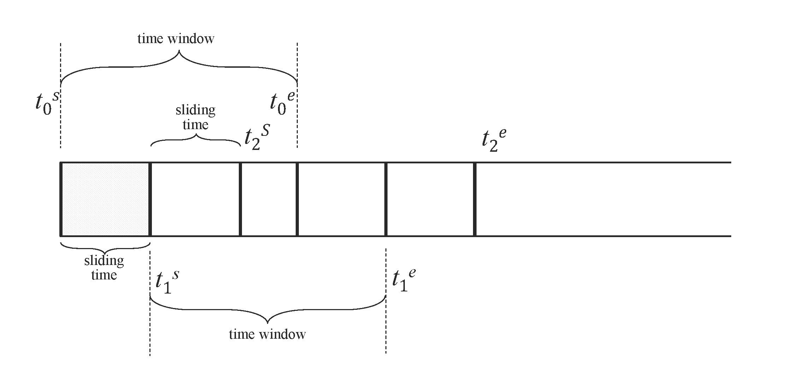
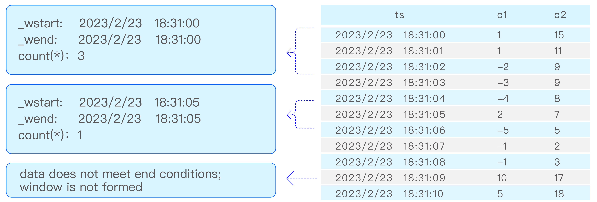

Compared to many other time-series and real-time databases, a unique advantage of TDengine since its first release is its support for standard SQL queries. This feature significantly reduces the learning curve for users. This chapter will use the data model of smart meters as an example to demonstrate how to use SQL queries in TDengine to handle time-series data. For further details and features of SQL syntax, it is recommended to refer to the official TDengine documentation. By studying this chapter, you will be able to master TDengine's SQL querying techniques and efficiently operate and analyze time-series data.

## Basic Query

To better introduce TDengine data querying, use the following taosBenchmark command to generate the time-series data needed for this chapter.

```shell
taosBenchmark --start-timestamp=1600000000000 --tables=100 --records=10000000 --time-step=10000
```

The above command, the taosBenchmark tool generates a test database in TDengine, producing a total of 1 billion time-series data entries. The timestamp of the time-series data starts from `1600000000000` (2020-09-13T20:26:40+08:00), includes `100` devices (subtables), each device has `10000000` data entries, and the data collection frequency is 10 seconds per entry.

In TDengine, users can specify conditions through the WHERE statement to query time-series data. Taking the data of smart meters as an example:

```sql
SELECT * FROM meters 
WHERE voltage > 230 
ORDER BY ts DESC
LIMIT 5;
```

The above SQL queries records from the supertable `meters` where the `voltage` is greater than 230V, sorted in descending order by time, and only outputs the first 5 rows. The query results are as follows:

```text
          ts            |  current   | voltage |    phase    | groupid |          location        |
===================================================================================================
2023-11-15 06:13:10.000 | 14.0601978 |     232 | 146.5000000 |      10 | California.Sunnyvale     |
2023-11-15 06:13:10.000 | 14.0601978 |     232 | 146.5000000 |       1 | California.LosAngles     |
2023-11-15 06:13:10.000 | 14.0601978 |     232 | 146.5000000 |      10 | California.Sunnyvale     |
2023-11-15 06:13:10.000 | 14.0601978 |     232 | 146.5000000 |       5 | California.Cupertino     |
2023-11-15 06:13:10.000 | 14.0601978 |     232 | 146.5000000 |       4 | California.SanFrancisco  |
Query OK, 5 row(s) in set (0.145403s)
```

## Aggregate Query

TDengine supports aggregate queries through the GROUP BY clause. When an SQL statement includes a GROUP BY clause, the SELECT list can only contain the following expressions:

1. Constants
1. Aggregate functions
1. Expressions identical to those after GROUP BY
1. Expressions containing the above expressions

The GROUP BY clause is used to group data and return a summary row for each group. In the GROUP BY clause, any column from tables or views can be used as the basis for grouping, and these columns do not need to appear in the select list. Additionally, users can directly perform aggregate queries on supertables without the need to create subtables beforehand. Taking the data model of smart meters as an example, the SQL using the GROUP BY clause is as follows:

```sql
SELECT groupid, avg(voltage) 
FROM meters 
WHERE ts >= "2022-01-01T00:00:00+08:00" 
AND ts < "2023-01-01T00:00:00+08:00" 
GROUP BY groupid;
```

The SQL above queries the supertable `meters` for data where the timestamp is greater than or equal to `2022-01-01T00:00:00+08:00` and less than `2023-01-01T00:00:00+08:00`, grouped by `groupid`, to calculate the average voltage for each group. The query results are as follows:

```text
 groupid   |   avg(voltage)        |
======================================
         8 |   243.961981544901079 |
         5 |   243.961981544901079 |
         1 |   243.961981544901079 |
         7 |   243.961981544901079 |
         9 |   243.961981544901079 |
         6 |   243.961981544901079 |
         4 |   243.961981544901079 |
        10 |   243.961981544901079 |
         2 |   243.961981544901079 |
         3 |   243.961981544901079 |
Query OK, 10 row(s) in set (0.042446s)
```

:::note

The group by clause does not guarantee that the results are ordered in a specific sequence when aggregating data. To obtain an ordered result set, you can use the order by clause to sort the results. This allows you to adjust the order of the output results as needed to meet specific business requirements or reporting needs.

:::

TDengine provides a variety of built-in aggregation functions. The table below shows:

| Aggregation Function | Description |
|:----------------------:|:--------------------------------------------------------------:|
|APERCENTILE | Calculates the approximate percentile of a specified column in a table/supertable, similar to the PERCENTILE function, but returns an approximate result. |
|AVG | Calculates the average value of a specified field |
|COUNT | Counts the number of records for a specified field |
|ELAPSED| The elapsed function expresses the continuous duration within a statistical period, and when used with the twa function, it can calculate the area under the statistical curve. When specifying a window with the INTERVAL clause, it calculates the time range covered by data in each window within the given time range; if there is no INTERVAL clause, it returns the time range covered by data for the entire given time range. Note that ELAPSED returns not the absolute value of the time range, but the number of units obtained by dividing the absolute value by time_unit.|
|LEASTSQUARES | Calculates the fitted line equation for a column in the table. start_val is the initial value of the independent variable, and step_val is the step value of the independent variable. |
|SPREAD | Calculates the difference between the maximum and minimum values of a column in the table.|
|STDDEV | Calculates the standard deviation of a column in the table. |
|SUM | Calculates the sum of a column in a table/supertable. |
|HYPERLOGLOG | Uses the hyperloglog algorithm to return the cardinality of a column. This algorithm significantly reduces memory usage in large data volumes, producing an estimated cardinality with a standard error of 0.81%. The algorithm is not very accurate with smaller data volumes, and the method `select count(data) from (select unique(col) as data from table)` can be used instead. |
|HISTOGRAM | Calculates the distribution of data according to user-specified intervals. |
|PERCENTILE | Calculates the percentile of a column's values in the table.|

## Data Partitioning Query

TDengine supports the PARTITION BY clause. When you need to partition data by certain dimensions and then perform a series of calculations within the partitioned data space, you can use the PARTITION BY clause to query, with the syntax as follows:

```sql
PARTITION BY part_list
```

`part_list` can be any scalar expression, including columns, constants, scalar functions, and their combinations.

TDengine processes the data partitioning clause as follows:

1. The data partitioning clause is placed after the WHERE clause;
1. The data partitioning clause divides the table data by the specified dimensions, and each partitioned shard undergoes specified calculations. The calculations are defined by subsequent clauses (window clause, GROUP BY clause, or SELECT clause);
1. The data partitioning clause can be used together with a window partitioning clause (or GROUP BY clause), in which case the subsequent clauses apply to each partitioned shard.

The SQL for data partitioning is as follows:

```sql
SELECT location, avg(voltage) 
FROM meters 
PARTITION BY location;
```

The example SQL above queries the supertable `meters`, grouping the data by the label `location`, and calculates the average voltage for each group. The query results are as follows:

```text
          location          |     avg(voltage)      |
======================================================
 California.SantaClara      |   243.962050000000005 |
 California.SanFrancisco    |   243.962050000000005 |
 California.SanJose         |   243.962050000000005 |
 California.LosAngles       |   243.962050000000005 |
 California.SanDiego        |   243.962050000000005 |
 California.Sunnyvale       |   243.962050000000005 |
 California.PaloAlto        |   243.962050000000005 |
 California.Cupertino       |   243.962050000000005 |
 California.MountainView    |   243.962050000000005 |
 California.Campbell        |   243.962050000000005 |
Query OK, 10 row(s) in set (2.415961s)
```

## Window Partition Query

In TDengine, you can use the window clause to perform aggregation queries by time window partitioning, which is particularly suitable for scenarios requiring analysis of large amounts of time-series data, such as smart meters collecting data every 10s but needing to query the average temperature every 1min.

The window clause allows you to partition the queried data set by windows and aggregate the data within each window. The logic of window partitioning is shown in the following image:



- Time Window: Data is divided based on time intervals, supporting sliding and tumbling time windows, suitable for data aggregation over fixed time periods.
- State Window: Windows are divided based on changes in device status values, with data of the same status value grouped into one window, which closes when the status value changes.
- Session Window: Sessions are divided based on the differences in record timestamps, with records having a timestamp interval less than the predefined value belonging to the same session.
- Event Window: Windows are dynamically divided based on the start and end conditions of events, opening when the start condition is met and closing when the end condition is met.
- Count Window: Windows are divided based on the number of data rows, with each window consisting of a specified number of rows for aggregation calculations.

The syntax for the window clause is as follows:

```sql
window_clause: {
    SESSION(ts_col, tol_val)
  | STATE_WINDOW(col [, extend]) [TRUE_FOR(duration_time)]
  | INTERVAL(interval_val [, interval_offset]) [SLIDING (sliding_val)] [FILL(fill_mod_and_val)]
  | EVENT_WINDOW START WITH start_trigger_condition END WITH end_trigger_condition
}
```

:::note

When using the window clause, the following rules should be observed:

1. The window clause is located after the data partitioning clause and cannot be used together with the GROUP BY clause.
1. The window clause partitions the data by windows and performs calculations on the expressions in the SELECT list for each window. The expressions in the SELECT list can only include: constants; pseudocolumns: \_wstart pseudo-column,\_wend pseudo-column, and \_wduration pseudo-column; aggregate functions (including selection functions and time-series specific functions that can determine the number of output rows by parameters)
1. WHERE statements can specify the start and end times of the query and other filtering conditions.

:::

### Timestamp Pseudocolumns

In the window aggregation query results, if the SQL does not specify the timestamp column in the output query results, the final results will not automatically include the time column information of the window. However, if you need to output the time window information corresponding to the aggregated query results in the results, you can use the timestamp-related pseudocolumns in the select clause, such as the start time of the time window (`_wstart`), the end time of the time window (`_wend`), the duration of the time window (`_wduration`), and the pseudocolumns related to the overall query window, such as the start time of the query window (`_qstart`) and the end time of the query window (`_qend`). It should be noted that, except that the end time of the INTERVAL window is an open interval, the start time and end time of other time windows are both closed intervals, and the duration of the time window is the value under the current time resolution of the data. For example, if the current database's time precision is milliseconds (ms), then 500 in the results represents the duration of the current time window is 500ms.

### Time Windows

Time windows can be divided into: sliding time windows and tumbling time windows. The syntax for the time window clause is as follows:

```sql
INTERVAL(interval_val [, interval_offset]) 
[SLIDING (sliding_val)] 
[FILL(fill_mod_and_val)]
```

The time window clause includes 3 sub-clauses:

- INTERVAL clause: used to generate windows of equal time periods, where interval_val specifies the size of each time window, and interval_offset specifies its starting offset. By default, windows begin at Unix time 0 (1970-01-01 00:00:00 UTC). If interval_offset is specified, the windows start from "Unix time 0 + interval_offset";
- SLIDING clause: used to specify the time the window slides forward;
- FILL: used to specify the filling mode of data in case of missing data in the window interval.

For time windows, both interval_val and sliding_val represent time periods, and syntactically support three ways. For example:

1. INTERVAL(1s, 500a) SLIDING(1s), with time units, where the time units are represented by single characters, respectively: a (milliseconds), b (nanoseconds), d (days), h (hours), m (minutes), n (months), s (seconds), u (microseconds), w (weeks), y (years);
1. INTERVAL(1000, 500) SLIDING(1000), without time units, will use the time precision of the query database as the default time unit, and when there are multiple databases, the one with higher precision will be used by default;
1. INTERVAL('1s', '500a') SLIDING('1s'), with time units in string form, where the string cannot contain any spaces or other characters.

Example SQL is as follows:

```sql
SELECT tbname, _wstart, _wend, avg(voltage) 
FROM meters 
WHERE ts >= "2022-01-01T00:00:00+08:00" 
AND ts < "2022-01-01T00:05:00+08:00" 
PARTITION BY tbname 
INTERVAL(1m, 5s) 
SLIMIT 2;
```

The above SQL queries the supertable `meters` for data with timestamps greater than or equal to `2022-01-01T00:00:00+08:00` and less than `2022-01-01T00:05:00+08:00`; data is first partitioned by subtable name `tbname`, then partitioned by a 1-minute time window, with each time window offset by 5 seconds; finally, only the data from the first 2 partitions is taken as the result. The query results are as follows:

```text
 tbname |         _wstart         |          _wend          |     avg(voltage)      |
======================================================================================
 d2     | 2021-12-31 23:59:05.000 | 2022-01-01 00:00:05.000 |   253.000000000000000 |
 d2     | 2022-01-01 00:00:05.000 | 2022-01-01 00:01:05.000 |   244.166666666666657 |
 d2     | 2022-01-01 00:01:05.000 | 2022-01-01 00:02:05.000 |   241.833333333333343 |
 d2     | 2022-01-01 00:02:05.000 | 2022-01-01 00:03:05.000 |   243.166666666666657 |
 d2     | 2022-01-01 00:03:05.000 | 2022-01-01 00:04:05.000 |   240.833333333333343 |
 d2     | 2022-01-01 00:04:05.000 | 2022-01-01 00:05:05.000 |   244.800000000000011 |
 d26    | 2021-12-31 23:59:05.000 | 2022-01-01 00:00:05.000 |   253.000000000000000 |
 d26    | 2022-01-01 00:00:05.000 | 2022-01-01 00:01:05.000 |   244.166666666666657 |
 d26    | 2022-01-01 00:01:05.000 | 2022-01-01 00:02:05.000 |   241.833333333333343 |
 d26    | 2022-01-01 00:02:05.000 | 2022-01-01 00:03:05.000 |   243.166666666666657 |
 d26    | 2022-01-01 00:03:05.000 | 2022-01-01 00:04:05.000 |   240.833333333333343 |
 d26    | 2022-01-01 00:04:05.000 | 2022-01-01 00:05:05.000 |   244.800000000000011 |
Query OK, 12 row(s) in set (0.021265s)
```

#### Sliding Window

Each query execution is a time window, and the time window slides forward as time progresses. When defining a continuous query, it is necessary to specify the size of the time window (time window) and the forward increment time (forward sliding times). As shown in the figure below, [t0s, t0e], [t1s, t1e], [t2s, t2e] are the time window ranges for three consecutive queries, and the time range of the window's forward sliding is indicated by sliding time. Query filtering, aggregation, and other operations are performed independently for each time window.



:::note

1. INTERVAL and SLIDING clauses need to be used in conjunction with aggregation and selection functions, therefore, the following SQL statement is illegal:

```sql
SELECT COUNT(*) FROM temp_tb_1 INTERVAL(1m) SLIDING(2m);
```

1. The forward sliding time of SLIDING cannot exceed the time range of a window, therefore, the following SQL statement is also illegal:

```sql
SELECT COUNT(*) FROM temp_tb_1 INTERVAL(1m) SLIDING(2m);
```

:::

Points to note when using time windows:

1. The window width of the aggregation period is specified by the keyword INTERVAL, with a minimum interval of 10 milliseconds (10a); it also supports an offset (offset must be less than the interval), which is the offset of the time window division compared to "UTC moment 0". The SLIDING statement is used to specify the forward increment of the aggregation period, i.e., the duration of each window's forward slide.
1. When using the INTERVAL statement, unless in very special circumstances, it is required to configure the timezone parameter in the taos.cfg configuration file of both client and server to the same value, to avoid frequent cross-time zone conversions by time handling functions, which could lead to severe performance impacts.
1. The returned results have a strictly monotonically increasing time sequence.

Example:

```sql
SELECT tbname, _wstart, avg(voltage)
FROM meters
WHERE ts >= "2022-01-01T00:00:00+08:00" 
AND ts < "2022-01-01T00:05:00+08:00" 
PARTITION BY tbname
INTERVAL(1m) SLIDING(30s)
SLIMIT 1;
```

The above SQL queries the supertable `meters` for data with timestamps greater than or equal to `2022-01-01T00:00:00+08:00` and less than `2022-01-01T00:05:00+08:00`. Data is first partitioned by subtable name `tbname`, then divided into 1-minute time windows, with the time windows sliding every 30 seconds; finally, only the data from the first partition is taken as the result. The query results are as follows:

```text
 tbname |         _wstart         |     avg(voltage)      |
=============================================================
 d2     | 2021-12-31 23:59:30.000 |   248.333333333333343 |
 d2     | 2022-01-01 00:00:00.000 |   246.000000000000000 |
 d2     | 2022-01-01 00:00:30.000 |   244.666666666666657 |
 d2     | 2022-01-01 00:01:00.000 |   240.833333333333343 |
 d2     | 2022-01-01 00:01:30.000 |   239.500000000000000 |
 d2     | 2022-01-01 00:02:00.000 |   243.833333333333343 |
 d2     | 2022-01-01 00:02:30.000 |   243.833333333333343 |
 d2     | 2022-01-01 00:03:00.000 |   241.333333333333343 |
 d2     | 2022-01-01 00:03:30.000 |   241.666666666666657 |
 d2     | 2022-01-01 00:04:00.000 |   244.166666666666657 |
 d2     | 2022-01-01 00:04:30.000 |   244.666666666666657 |
Query OK, 11 row(s) in set (0.013153s)
```

#### Tumbling Window

When SLIDING is equal to INTERVAL, the sliding window becomes a tumbling window. The difference between a tumbling window and a sliding window is that in a sliding window, due to different interval_val and sliding_val, there is data overlap between different time windows, whereas in a tumbling window, there is no data overlap. Essentially, a tumbling window divides the time window according to interval_val, and INTERVAL(1m) with INTERVAL(1m) SLIDING(1m) are equivalent.

Example:

```sql
SELECT tbname, _wstart, _wend, avg(voltage)
FROM meters
WHERE ts >= "2022-01-01T00:00:00+08:00" 
AND ts < "2022-01-01T00:05:00+08:00" 
PARTITION BY tbname
INTERVAL(1m) SLIDING(1m)
SLIMIT 1;
```

The above SQL queries the supertable `meters` for data with timestamps greater than or equal to `2022-01-01T00:00:00+08:00` and less than `2022-01-01T00:05:00+08:00`. The data is first partitioned by the subtable name `tbname`, then divided into 1-minute time windows, with each time window also being 1 minute long; finally, only the data from the first partition is taken as the result. The query results are as follows:

```text
 tbname |         _wstart         |          _wend          |     avg(voltage)      |
======================================================================================
 d2     | 2022-01-01 00:00:00.000 | 2022-01-01 00:01:00.000 |   246.000000000000000 |
 d2     | 2022-01-01 00:01:00.000 | 2022-01-01 00:02:00.000 |   240.833333333333343 |
 d2     | 2022-01-01 00:02:00.000 | 2022-01-01 00:03:00.000 |   243.833333333333343 |
 d2     | 2022-01-01 00:03:00.000 | 2022-01-01 00:04:00.000 |   241.333333333333343 |
 d2     | 2022-01-01 00:04:00.000 | 2022-01-01 00:05:00.000 |   244.166666666666657 |
Query OK, 5 row(s) in set (0.016812s)
```

#### FILL Clause

The FILL clause is used to specify the fill mode when data is missing in a window interval. The fill modes include the following:

1. No fill: NONE (default fill mode).
1. VALUE fill: Fixed value fill, where the fill value must be specified. For example: FILL(VALUE, 1.23). Note that the final fill value is determined by the type of the corresponding column, such as FILL(VALUE, 1.23) for an INT type column, the fill value would be 1.
1. PREV fill: Fill with the previous non-NULL value. For example: FILL(PREV).
1. NULL fill: Fill with NULL. For example: FILL(NULL).
1. LINEAR fill: Perform linear interpolation based on the nearest non-NULL values before and after. For example: FILL(LINEAR).
1. NEXT fill: Fill with the next non-NULL value. For example: FILL(NEXT).

Among these fill modes, except for the NONE mode which does not fill by default, other modes will be ignored if there is no data in the entire query time range, resulting in no fill data and an empty query result. This behavior is reasonable under some modes (PREV, NEXT, LINEAR) because no data means no fill value can be generated.

For other modes (NULL, VALUE), theoretically, fill values can be generated. Whether to output fill values depends on the application's requirements. To meet the needs of applications that require forced filling of data or NULL, and to maintain compatibility with existing fill modes, TDengine also supports two new fill modes:

1. NULL_F: Force fill with NULL values
1. VALUE_F: Force fill with VALUE

The differences between NULL, NULL_F, VALUE, and VALUE_F for different scenarios are as follows:

1. INTERVAL clause: NULL_F, VALUE_F are forced fill modes; NULL, VALUE are non-forced modes. In this mode, their semantics match their names.
1. Stream computing's INTERVAL clause: NULL_F and NULL behave the same, both are non-forced modes; VALUE_F and VALUE behave the same, both are non-forced modes. That is, there is no forced mode in stream computing's INTERVAL.
1. INTERP clause: NULL and NULL_F behave the same, both are forced modes; VALUE and VALUE_F behave the same, both are forced modes. That is, there is no non-forced mode in INTERP.

:::note

1. Using the FILL statement may generate a large amount of filled output, be sure to specify the time range for the query.
1. For each query, the system can return no more than 10 million results with interpolation.
1. In time dimension aggregation, the returned results have a strictly monotonic increasing time sequence.
1. If the query target is a supertable, the aggregate function will apply to the data of all tables under the supertable that meet the value filtering conditions. If the query does not use a PARTITION BY statement, the results are returned in a strictly monotonic increasing time sequence; if the query uses a PARTITION BY statement for grouping, the results within each PARTITION are strictly monotonic increasing in time sequence.

:::

Example:

```sql
SELECT tbname, _wstart, _wend, avg(voltage)
FROM meters
WHERE ts >= "2022-01-01T00:00:00+08:00" 
AND ts < "2022-01-01T00:05:00+08:00" 
PARTITION BY tbname
INTERVAL(1m) FILL(prev)
SLIMIT 2;
```

The above SQL queries the supertable `meters` for data with timestamps greater than or equal to `2022-01-01T00:00:00+08:00` and less than `2022-01-01T00:05:00+08:00`; data is first partitioned by subtable name `tbname`, then by each 1-minute time window. If data is missing within a window, it is filled with the previous non-NULL value; finally, only the data from the first 2 partitions is taken as the result. The query results are as follows:

```text
 tbname |         _wstart         |          _wend          |     avg(voltage)      |
=======================================================================================
 d2     | 2022-01-01 00:00:00.000 | 2022-01-01 00:01:00.000 |   246.000000000000000 |
 d2     | 2022-01-01 00:01:00.000 | 2022-01-01 00:02:00.000 |   240.833333333333343 |
 d2     | 2022-01-01 00:02:00.000 | 2022-01-01 00:03:00.000 |   243.833333333333343 |
 d2     | 2022-01-01 00:03:00.000 | 2022-01-01 00:04:00.000 |   241.333333333333343 |
 d2     | 2022-01-01 00:04:00.000 | 2022-01-01 00:05:00.000 |   244.166666666666657 |
 d26    | 2022-01-01 00:00:00.000 | 2022-01-01 00:01:00.000 |   246.000000000000000 |
 d26    | 2022-01-01 00:01:00.000 | 2022-01-01 00:02:00.000 |   240.833333333333343 |
 d26    | 2022-01-01 00:02:00.000 | 2022-01-01 00:03:00.000 |   243.833333333333343 |
 d26    | 2022-01-01 00:03:00.000 | 2022-01-01 00:04:00.000 |   241.333333333333343 |
 d26    | 2022-01-01 00:04:00.000 | 2022-01-01 00:05:00.000 |   244.166666666666657 |
Query OK, 10 row(s) in set (0.022866s)
```

### State Window

Use integers (boolean values) or strings to identify the state of the device when the record is generated. Records with the same state value belong to the same state window, and the window closes when the value changes. TDengine also supports using CASE expressions on state values, which can express that the start of a state is triggered by meeting a certain condition, and the end of the state is triggered by meeting another condition. For example, with smart meters, if the voltage is within the normal range of 225V to 235V, you can monitor the voltage to determine if the circuit is normal.

```sql
SELECT tbname, _wstart, _wend,_wduration, CASE WHEN voltage >= 225 and voltage <= 235 THEN 1 ELSE 0 END status 
FROM meters 
WHERE ts >= "2022-01-01T00:00:00+08:00" 
AND ts < "2022-01-01T00:05:00+08:00" 
PARTITION BY tbname 
STATE_WINDOW(
    CASE WHEN voltage >= 225 and voltage <= 235 THEN 1 ELSE 0 END
)
SLIMIT 2;
```

The above SQL queries data from the supertable `meters`, where the timestamp is greater than or equal to `2022-01-01T00:00:00+08:00` and less than `2022-01-01T00:05:00+08:00`. Data is first partitioned by the subtable name `tbname`. It then divides into state windows based on whether the voltage is within the normal range. Finally, it retrieves data from the first 2 partitions as the result. The query results are as follows: (Since the data is randomly generated, the number of data entries in the result set may vary)

```text
 tbname |         _wstart         |          _wend          |  _wduration   |    status     |
===============================================================================================
 d2     | 2022-01-01 00:00:00.000 | 2022-01-01 00:01:20.000 |         80000 |             0 |
 d2     | 2022-01-01 00:01:30.000 | 2022-01-01 00:01:30.000 |             0 |             1 |
 d2     | 2022-01-01 00:01:40.000 | 2022-01-01 00:01:40.000 |             0 |             0 |
 d2     | 2022-01-01 00:01:50.000 | 2022-01-01 00:01:50.000 |             0 |             1 |
 d2     | 2022-01-01 00:02:00.000 | 2022-01-01 00:02:20.000 |         20000 |             0 |
 d2     | 2022-01-01 00:02:30.000 | 2022-01-01 00:02:30.000 |             0 |             1 |
 d2     | 2022-01-01 00:02:40.000 | 2022-01-01 00:03:00.000 |         20000 |             0 |
 d2     | 2022-01-01 00:03:10.000 | 2022-01-01 00:03:10.000 |             0 |             1 |
 d2     | 2022-01-01 00:03:20.000 | 2022-01-01 00:03:40.000 |         20000 |             0 |
 d2     | 2022-01-01 00:03:50.000 | 2022-01-01 00:03:50.000 |             0 |             1 |
 d2     | 2022-01-01 00:04:00.000 | 2022-01-01 00:04:50.000 |         50000 |             0 |
 d26    | 2022-01-01 00:00:00.000 | 2022-01-01 00:01:20.000 |         80000 |             0 |
 d26    | 2022-01-01 00:01:30.000 | 2022-01-01 00:01:30.000 |             0 |             1 |
 d26    | 2022-01-01 00:01:40.000 | 2022-01-01 00:01:40.000 |             0 |             0 |
 d26    | 2022-01-01 00:01:50.000 | 2022-01-01 00:01:50.000 |             0 |             1 |
 d26    | 2022-01-01 00:02:00.000 | 2022-01-01 00:02:20.000 |         20000 |             0 |
 d26    | 2022-01-01 00:02:30.000 | 2022-01-01 00:02:30.000 |             0 |             1 |
 d26    | 2022-01-01 00:02:40.000 | 2022-01-01 00:03:00.000 |         20000 |             0 |
 d26    | 2022-01-01 00:03:10.000 | 2022-01-01 00:03:10.000 |             0 |             1 |
 d26    | 2022-01-01 00:03:20.000 | 2022-01-01 00:03:40.000 |         20000 |             0 |
 d26    | 2022-01-01 00:03:50.000 | 2022-01-01 00:03:50.000 |             0 |             1 |
 d26    | 2022-01-01 00:04:00.000 | 2022-01-01 00:04:50.000 |         50000 |             0 |
Query OK, 22 row(s) in set (0.153403s)
```

### Session Window

The session window determines whether records belong to the same session based on the value of the timestamp primary key. As shown in the figure below, if the interval between consecutive timestamps is set to be less than or equal to 12 seconds, the following 6 records form 2 session windows: [2019-04-28 14:22:10, 2019-04-28 14:22:30] and [2019-04-28 14:23:10, 2019-04-28 14:23:30]. This is because the interval between 2019-04-28 14:22:30 and 2019-04-28 14:23:10 is 40 seconds, which exceeds the continuous interval (12 seconds).


Within the tol_value time interval, results are considered to belong to the same window. If the time between two consecutive records exceeds tol_val, a new window is automatically started.

```sql
SELECT COUNT(*), FIRST(ts) FROM temp_tb_1 SESSION(ts, tol_val);
```

Example:

```sql
SELECT tbname, _wstart, _wend, _wduration, count(*)
FROM meters 
WHERE ts >= "2022-01-01T00:00:00+08:00" 
AND ts < "2022-01-01T00:10:00+08:00" 
PARTITION BY tbname
SESSION(ts, 10m)
SLIMIT 10;
```

The above SQL queries the supertable meters for data with timestamps greater than or equal to 2022-01-01T00:00:00+08:00 and less than 2022-01-01T00:10:00+08:00; data is first partitioned by the subtable name tbname, then split according to a 10-minute session window; finally, data from the first 10 partitions is returned, showing subtable name, window start time, window end time, window duration, and the number of records within the window. The query results are as follows:

```text
 tbname |         _wstart         |          _wend          |  _wduration   |   count(*)    |
===============================================================================================
 d2     | 2022-01-01 00:00:00.000 | 2022-01-01 00:09:50.000 |        590000 |            60 |
 d26    | 2022-01-01 00:00:00.000 | 2022-01-01 00:09:50.000 |        590000 |            60 |
 d52    | 2022-01-01 00:00:00.000 | 2022-01-01 00:09:50.000 |        590000 |            60 |
 d64    | 2022-01-01 00:00:00.000 | 2022-01-01 00:09:50.000 |        590000 |            60 |
 d76    | 2022-01-01 00:00:00.000 | 2022-01-01 00:09:50.000 |        590000 |            60 |
 d28    | 2022-01-01 00:00:00.000 | 2022-01-01 00:09:50.000 |        590000 |            60 |
 d4     | 2022-01-01 00:00:00.000 | 2022-01-01 00:09:50.000 |        590000 |            60 |
 d88    | 2022-01-01 00:00:00.000 | 2022-01-01 00:09:50.000 |        590000 |            60 |
 d77    | 2022-01-01 00:00:00.000 | 2022-01-01 00:09:50.000 |        590000 |            60 |
 d54    | 2022-01-01 00:00:00.000 | 2022-01-01 00:09:50.000 |        590000 |            60 |
Query OK, 10 row(s) in set (0.043489s)
```

### Event Window

Event windows are defined by start and end conditions. The window starts when the `start_trigger_condition` is met and closes when the `end_trigger_condition` is satisfied. Both `start_trigger_condition` and `end_trigger_condition` can be any condition expression supported by TDengine and can include different columns.

An event window can contain only one data point. That is, when a single data point meets both the `start_trigger_condition` and `end_trigger_condition` and is not currently within a window, it alone constitutes a window.

If an event window cannot be closed, it does not form a window and will not be output. That is, if data meets the `start_trigger_condition` and the window opens, but subsequent data does not meet the `end_trigger_condition`, the window cannot be closed. This data does not form a window and will not be output.

If event window queries are performed directly on a supertable, TDengine will aggregate the data of the supertable into a single timeline and then perform the event window calculation. If you need to perform event window queries on the result set of a subquery, the result set of the subquery needs to meet the requirements of outputting along a timeline and can output a valid timestamp column.

Consider the following SQL statement, the event window segmentation is illustrated in the diagram below.

```sql
select _wstart, _wend, count(*) from t event_window start with c1 > 0 end with c2 < 10 
```



Example SQL:

```sql
SELECT tbname, _wstart, _wend, _wduration, count(*)
FROM meters 
WHERE ts >= "2022-01-01T00:00:00+08:00" 
AND ts < "2022-01-01T00:10:00+08:00" 
PARTITION BY tbname
EVENT_WINDOW START WITH voltage >= 225 END WITH voltage < 235
LIMIT 5;
```

The above SQL queries the supertable meters for data with timestamps greater than or equal to 2022-01-01T00:00:00+08:00 and less than 2022-01-01T00:10:00+08:00; data is first partitioned by subtable name tbname, then segmented according to the event window conditions: voltage greater than or equal to 225V and less than 235V; finally, the first 5 rows of data from each partition are taken as the result, returning the subtable name, window start time, window end time, window duration, and the number of data points in the window. The query results are as follows:

```text
 tbname |         _wstart         |          _wend          |  _wduration   |   count(*)    |
==============================================================================================
 d0     | 2022-01-01 00:00:00.000 | 2022-01-01 00:01:30.000 |         90000 |            10 |
 d0     | 2022-01-01 00:01:40.000 | 2022-01-01 00:02:30.000 |         50000 |             6 |
 d0     | 2022-01-01 00:02:40.000 | 2022-01-01 00:03:10.000 |         30000 |             4 |
 d0     | 2022-01-01 00:03:20.000 | 2022-01-01 00:07:10.000 |        230000 |            24 |
 d0     | 2022-01-01 00:07:20.000 | 2022-01-01 00:07:50.000 |         30000 |             4 |
 d1     | 2022-01-01 00:00:00.000 | 2022-01-01 00:01:30.000 |         90000 |            10 |
 d1     | 2022-01-01 00:01:40.000 | 2022-01-01 00:02:30.000 |         50000 |             6 |
 d1     | 2022-01-01 00:02:40.000 | 2022-01-01 00:03:10.000 |         30000 |             4 |
 d1     | 2022-01-01 00:03:20.000 | 2022-01-01 00:07:10.000 |        230000 |            24 |
...
Query OK, 500 row(s) in set (0.328557s)
```

### Count Window

Count window is a method of dividing windows based on a fixed number of data rows. By default, the count window first sorts the data by timestamp, then divides the data into multiple windows based on the value of count_val, and finally performs aggregation calculations.

count_val represents the maximum number of data rows in each count window. When the total number of data rows is not divisible by count_val, the number of rows in the last window will be less than count_val.
sliding_val is a constant that represents the number of sliding windows, similar to the sliding function of interval. By adjusting sliding_val, you can control the degree of overlap between windows, thus achieving detailed analysis of the data.
For example, using the data model of a smart meter, the query SQL is as follows.

```sql
select _wstart, _wend, count(*)
from meters
where ts >= "2022-01-01T00:00:00+08:00" and ts < "2022-01-01T00:30:00+08:00"
count_window(1000);
```

The above SQL query returns the data from the supertable meters where the timestamp is greater than or equal to 2022-01-01T00:00:00+08:00 and less than 2022-01-01T00:10:00+08:00. It groups every 1000 data rows and returns the start time, end time, and count of each group. The query results are as follows:

```text
         _wstart         |          _wend          |   count(*)    |
=====================================================================
 2022-01-01 00:00:00.000 | 2022-01-01 00:01:30.000 |          1000 |
 2022-01-01 00:01:40.000 | 2022-01-01 00:03:10.000 |          1000 |
 2022-01-01 00:03:20.000 | 2022-01-01 00:04:50.000 |          1000 |
 2022-01-01 00:05:00.000 | 2022-01-01 00:06:30.000 |          1000 |
 2022-01-01 00:06:40.000 | 2022-01-01 00:08:10.000 |          1000 |
 2022-01-01 00:08:20.000 | 2022-01-01 00:09:50.000 |          1000 |
 2022-01-01 00:10:00.000 | 2022-01-01 00:11:30.000 |          1000 |
 2022-01-01 00:11:40.000 | 2022-01-01 00:13:10.000 |          1000 |
 2022-01-01 00:13:20.000 | 2022-01-01 00:14:50.000 |          1000 |
 2022-01-01 00:15:00.000 | 2022-01-01 00:16:30.000 |          1000 |
Query OK, 10 row(s) in set (0.062794s)
```

## Time Range Expression

In queries of time series databases, it is often necessary to query based on the time range of the primary key column. TDengine provides a series of functions and expressions to facilitate users in expressing time ranges. Here, common time range expressions and their differences from MySQL and PostgreSQL are listed:

| Time Range          |   MySQL Expression                                                    |  PostgreSQL Expression   |   TDengine Expression   |
|:------------:|:--------------------------------------------------------------------:|:-----------------------------------:|:--------------------------------:|
| Yesterday​ | CURDATE() - INTERVAL 1 DAY,<br/> CURDATE() | CURRENT_DATE - INTERVAL '1 day',<br/> CURRENT_DATE | TODAY() - 1d,<br/> TODAY() |
| Today |​ CURDATE(),<br/> CURDATE() + INTERVAL 1 DAY | CURRENT_DATE,<br/> CURRENT_DATE + INTERVAL '1 day' | TODAY(),<br/> TODAY() + 1d |
| Last Week | DATE_SUB(CURDATE(), INTERVAL WEEKDAY(CURDATE()) + 7 DAY),<br/> DATE_SUB(CURDATE(), INTERVAL WEEKDAY(CURDATE()) DAY) | DATE_TRUNC('week', CURRENT_DATE - INTERVAL '1 week'),<br/> DATE_TRUNC('week', CURRENT_DATE) | TIMETRUNCATE(NOW(), 1d) - (7 + WEEKDAY(TO_CHAR(NOW(), 'YYYY-MM-DD'))) &ast; 24 &ast; 3600000,<br/> TIMETRUNCATE(NOW(), 1d) - WEEKDAY(TO_CHAR(NOW(), 'YYYY-MM-DD')) &ast; 24 &ast; 3600000 |
| This Week | DATE_SUB(CURDATE(), INTERVAL WEEKDAY(CURDATE()) DAY),<br/> DATE_SUB(CURDATE(), INTERVAL WEEKDAY(CURDATE()) DAY) + INTERVAL 7 DAY | DATE_TRUNC('week', CURRENT_DATE),<br/> DATE_TRUNC('week', CURRENT_DATE + INTERVAL '1 week') | TIMETRUNCATE(NOW(), 1d) - WEEKDAY(TO_CHAR(NOW(), 'YYYY-MM-DD')) &ast; 24 &ast; 3600000,<br/> TIMETRUNCATE(NOW(), 1d) + (7 - WEEKDAY(TO_CHAR(NOW(), 'YYYY-MM-DD'))) &ast; 24 &ast; 3600000 |
| Last Month | DATE_FORMAT(CURDATE() - INTERVAL 1 MONTH, '%Y-%m-01'),<br/> DATE_FORMAT(CURDATE(), '%Y-%m-01') | DATE_TRUNC('month', CURRENT_DATE - INTERVAL '1 month'),<br/> DATE_TRUNC('month', CURRENT_DATE) |TO_TIMESTAMP(TO_CHAR(NOW() -1n, 'YYYY-MM'), 'YYYY-MM'),<br/> TO_TIMESTAMP(TO_CHAR(NOW(), 'YYYY-MM'), 'YYYY-MM') |
| This Month | DATE_FORMAT(CURDATE(), '%Y-%m-01'),<br/> DATE_FORMAT(CURDATE() + INTERVAL 1 MONTH, '%Y-%m-01') | DATE_TRUNC('month', CURRENT_DATE),<br/> DATE_TRUNC('month', CURRENT_DATE + INTERVAL '1 month') |TO_TIMESTAMP(TO_CHAR(NOW(), 'YYYY-MM'), 'YYYY-MM'),<br/> TO_TIMESTAMP(TO_CHAR(NOW() + 1n, 'YYYY-MM'), 'YYYY-MM') |
| Last Quarter | MAKEDATE(YEAR(CURDATE()), 1) + INTERVAL (QUARTER(CURDATE()) - 2) &ast; 3 MONTH,<br/> MAKEDATE(YEAR(CURDATE()), 1) + INTERVAL (QUARTER(CURDATE()) - 1) &ast; 3 MONTH | DATE_TRUNC('quarter', CURRENT_DATE - INTERVAL '3 months'),<br/> DATE_TRUNC('quarter', CURRENT_DATE) | TO_TIMESTAMP(CASE WHEN TO_CHAR(NOW(), 'MM') < 4 THEN CONCAT(CAST(TO_CHAR(NOW(), 'YYYY') - 1 AS VARCHAR(5)), "-", CAST(FLOOR((TO_CHAR(NOW(), 'MM') + 8) / 3) &ast; 3 + 1 AS VARCHAR(3))) ELSE CONCAT(TO_CHAR(NOW(), 'YYYY'), "-", CAST(FLOOR((TO_CHAR(NOW(), 'MM') - 4) / 3) &ast; 3 + 1 AS VARCHAR(3))) END, 'YYYY-MM'),<br/>TO_TIMESTAMP(CONCAT(TO_CHAR(NOW(), 'YYYY'), "-", CAST(FLOOR((TO_CHAR(NOW(), 'MM') - 1) / 3) &ast; 3 + 1 AS VARCHAR)), 'YYYY-MM') |
| This Quarter | MAKEDATE(YEAR(CURDATE()), 1) + INTERVAL (QUARTER(CURDATE()) - 1) &ast; 3 MONTH,<br/> MAKEDATE(YEAR(CURDATE()), 1) + INTERVAL QUARTER(CURDATE()) &ast; 3 MONTH | DATE_TRUNC('quarter', CURRENT_DATE),<br/> DATE_TRUNC('quarter', CURRENT_DATE + INTERVAL '3 months') | TO_TIMESTAMP(CONCAT(TO_CHAR(NOW(), 'YYYY'), "-", CAST(FLOOR((TO_CHAR(NOW(), 'MM') - 1) / 3) &ast; 3 + 1 AS VARCHAR)), 'YYYY-MM'),<br/> TO_TIMESTAMP(CONCAT(CAST(TO_CHAR(NOW(), 'YYYY') + CASE WHEN TO_CHAR(NOW(), 'MM') > 9 THEN 1 ELSE 0 END AS VARCHAR), "-", CAST((FLOOR((TO_CHAR(NOW(), 'MM') + 2) / 3) &ast; 3 + 1) % 12 AS VARCHAR)), 'YYYY-MM') |
| Last Year | MAKEDATE(YEAR(CURDATE()) - 1, 1),<br/> MAKEDATE(YEAR(CURDATE()), 1) | DATE_TRUNC('year', CURRENT_DATE - INTERVAL '1 year'),<br/> DATE_TRUNC('year', CURRENT_DATE) | TO_TIMESTAMP(TO_CHAR(NOW() - 1y, 'YYYY'), 'YYYY'),<br/> TO_TIMESTAMP(TO_CHAR(NOW(), 'YYYY'), 'YYYY') |
| This Year | MAKEDATE(YEAR(CURDATE()), 1),<br/> MAKEDATE(YEAR(CURDATE()) + 1, 1) | DATE_TRUNC('year', CURRENT_DATE), <br/> DATE_TRUNC('year', CURRENT_DATE + INTERVAL '1 year') | TO_TIMESTAMP(TO_CHAR(NOW(), 'YYYY'), 'YYYY'),<br/> TO_TIMESTAMP(TO_CHAR(NOW() + 1y, 'YYYY'), 'YYYY') |

### Description

1. Each time range interval is left-closed and right-open.
2. The writing style is not unique, and this is provided here as an example for reference only.
3. Here, Monday is used as the start of the week, and scenarios that do not start on Monday need to be adjusted.
4. Here, the timestamp in the TDengine example uses milliseconds as the time unit.

## Time-Series Extensions

Time-series extensions are a set of functions specially designed by TDengine for time-series data query scenarios. In general databases, similar functions usually require complex query statements and are less efficient. To reduce user costs and simplify the query process, TDengine provides these functions in the form of built-in functions, thus achieving efficient and easy-to-use time series data processing capabilities. The time series specific functions are as follows.

| Function       |   Description                                                              |
|:--------------:|:------------------------------------------------------------------------:|
|CSUM  | Cumulative sum, ignoring NULL values. |
|DERIVATIVE | Calculates the rate of change per unit of a column in the table. The unit time interval can be specified by the time_interval parameter, with a minimum of 1 second (1s); the ignore_negative parameter can be 0 or 1, with 1 meaning negative values are ignored. |
|DIFF | Calculates the difference between the value of a column and the corresponding value of the previous row. ignore_negative can be 0 or 1, default is 0, not ignoring negative values. When ignore_negative is 1, it means negative values are ignored.|
|IRATE | Calculates the instantaneous growth rate using the last two samples in the time interval; if these two values are decreasing, only the last value is used for calculation, not the difference between them. |
|MAVG | Calculates the moving average of consecutive k values. If the number of input rows is less than k, no result is output. The valid input range for parameter k is 1 ≤ k ≤ 1000.|
|STATECOUNT | Returns the number of consecutive records that meet a certain condition, appending the result as a new column at the end of each row. The condition is calculated based on the parameter, adding 1 if true, resetting to -1 if false, and skipping if the data is NULL. |
|STATEDURATION | Returns the duration of consecutive records that meet a certain condition, appending the result as a new column at the end of each row. The condition is calculated based on the parameter, adding the time length between two records if true (the time length of the first record meeting the condition is counted as 0), resetting to -1 if false, and skipping if the data is NULL.|
|TWA | Time Weighted Average function. Calculates the time-weighted average of a column over a period of time. |

## Nested Queries

Nested queries, also known as subqueries, refer to a structure in SQL where the result of an inner query can be used as the input for an outer query. TDengine supports non-correlated subqueries within the from clause. Non-correlated means that the subquery does not use parameters from the parent query. After the from clause in a select query, an independent select statement can be included, which is enclosed in parentheses. By using nested queries, you can reference the result of another query within a single query, thus enabling more complex data processing and analysis. For example, consider the following SQL for smart meters:

```sql
SELECT max(voltage),* 
FROM (
    SELECT tbname,last_row(ts),voltage,current,phase,groupid,location 
    FROM meters 
    PARTITION BY tbname
) 
GROUP BY groupid;
```

The above SQL performs an inner query on the supertable meters, grouping by subtable name, and querying the latest data for each subtable; the outer query takes the result of the inner query as input and aggregates by groupid, querying the maximum voltage for each group.

TDengine's nested queries follow these rules:

1. The result of the inner query serves as a "virtual table" for the outer query to use, and it is recommended to alias this virtual table for easy reference in the outer query.
1. The outer query supports direct referencing of columns or pseudocolumns from the inner query by column name or alias.
1. Both inner and outer queries support regular joins between tables/supertables. The result of the inner query can also participate in joins with data subtables.
1. The features supported by the inner query are consistent with those of non-nested queries. The ORDER BY clause in the inner query generally has no meaning and is recommended to be avoided to prevent unnecessary resource consumption.
1. Compared to non-nested queries, the outer query has the following limitations in supported features:
1. If the result data of the inner query does not provide timestamps, then functions implicitly dependent on timestamps will not work properly in the outer query. Examples include: INTERP, DERIVATIVE, IRATE, LAST_ROW, FIRST, LAST, TWA, STATEDURATION, TAIL, UNIQUE.
1. If the result data of the inner query is not ordered by timestamp, then functions dependent on data being ordered by time will not work properly in the outer query. Examples include: LEASTSQUARES, ELAPSED, INTERP, DERIVATIVE, IRATE, TWA, DIFF, STATECOUNT, STATEDURATION, CSUM, MAVG, TAIL, UNIQUE.
1. Functions that require two passes of scanning will not work properly in the outer query. Such functions include: PERCENTILE.

## UNION Clause

In TDengine, the UNION [ALL] operator is used to combine the results of multiple SELECT clauses. When using this operator, the multiple SELECT clauses must satisfy the following two conditions:

1. Each SELECT clause must return results with the same number of columns;
2. Columns in corresponding positions must be in the same order and have the same or compatible data types.

After combination, the column names of the result set are determined by those defined in the first SELECT clause.

Example:

```sql
(SELECT tbname,* FROM d1 limit 1) 
UNION ALL 
(SELECT tbname,* FROM d11 limit 2) 
UNION ALL 
(SELECT tbname,* FROM d21 limit 3);
```

The above SQL queries 1 record from subtable d1, 2 records from subtable d11, and 3 records from subtable d21, and combines the results. The returned results are as follows:

```text
 tbname |           ts            |    current     |   voltage   |    phase       |
====================================================================================
 d11    | 2020-09-13 20:26:40.000 |     11.5680809 |         247 |    146.5000000 |
 d11    | 2020-09-13 20:26:50.000 |     14.2392311 |         234 |    148.0000000 |
 d1     | 2020-09-13 20:26:40.000 |     11.5680809 |         247 |    146.5000000 |
 d21    | 2020-09-13 20:26:40.000 |     11.5680809 |         247 |    146.5000000 |
 d21    | 2020-09-13 20:26:50.000 |     14.2392311 |         234 |    148.0000000 |
 d21    | 2020-09-13 20:27:00.000 |     10.0999422 |         251 |    146.0000000 |
Query OK, 6 row(s) in set (0.006438s)
```

In the same SQL statement, a maximum of 100 UNION clauses are supported.

## Association Query

### Join Concept

1. Driving Table

In association queries, the role of the driving table depends on the type of join used: in the Left Join series, the left table acts as the driving table; in the Right Join series, the right table acts as the driving table.

1. Join Condition

In TDengine, the join condition refers to the condition specified for table association. For all association queries (except ASOF Join and Window Join), a join condition must be specified, usually appearing after `on`. In ASOF Join, conditions appearing after `where` can also be considered as join conditions, while Window Join specifies join conditions through `window_offset`.

Except for ASOF Join, all Join types supported by TDengine must explicitly specify join conditions. ASOF Join, because it defines implicit join conditions by default, does not need to explicitly specify join conditions if the default conditions meet the requirements.

For types of joins other than ASOF Join and Window Join, the join conditions can include not only the primary join condition but also any number of other join conditions. There must be an `and` relationship between the primary join condition and other join conditions, but there is no such restriction among other join conditions. Other join conditions can include any logical operation combination of primary key columns, tag columns, ordinary columns, constants, and their scalar functions or operations.

For example, with smart meters, the following SQL statements all contain valid join conditions.

```sql
select a.* from meters a left join meters b on a.ts = b.ts and a.ts > '2023-10-18 10:00:00.000';
select a.* from meters a left join meters b on a.ts = b.ts and (a.ts > '2023-10-18 10:00:00.000' or a.ts < '2023-10-17 10:00:00.000');
select a.* from meters a left join meters b on timetruncate(a.ts, 1s) = timetruncate(b.ts, 1s) and (a.ts + 1s > '2023-10-18 10:00:00.000' or a.groupId > 0);
select a.* from meters a left asof join meters b on timetruncate(a.ts, 1s) < timetruncate(b.ts, 1s) and a.groupId = b.groupId;
```

1. Primary Join Condition

As a time-series database, all association queries in TDengine revolve around the primary key column. Therefore, for all association queries except ASOF Join and Window Join, an equality join condition on the primary key column must be included. The first appearing primary key column equality join condition in the join conditions will be considered as the primary join condition. The primary join condition of ASOF Join can include non-equality conditions, while the primary join condition of Window Join is specified through `window_offset`.

Except for Window Join, TDengine supports performing `timetruncate` function operations in the primary join condition, such as `on timetruncate(a.ts, 1s) = timetruncate(b.ts, 1s)`. Apart from this, other functions and scalar operations are currently not supported.

1. Grouping Condition

The time-series database features of ASOF Join and Window Join support grouping the input data of the association query first, and then performing association operations for each group. Grouping only applies to the input of the association query, and the output results will not contain grouping information. Equality conditions appearing after `on` in ASOF Join and Window Join (except for the primary join condition of ASOF Join) will be treated as grouping conditions.

1. Primary Key Timeline

As a time-series database, TDengine requires each table (subtable) to have a primary key timestamp column, which will serve as the primary key timeline of the table for many time-related operations, and in the results of subqueries or Join operations, it is also necessary to clearly identify which column will be considered as the primary key timeline for subsequent time-related operations. In subqueries, the first appearing ordered primary key column (or its operation) or pseudo primary key column (_wstart,_wend) in the query results will be considered as the primary key timeline of the output table. The selection of the primary key timeline in Join output results follows these rules:

- In the Left Join and Right Join series, the primary key column of the driving table (subquery) will be used as the primary key timeline for subsequent queries. Additionally, in the Window Join window, since both tables are ordered, any table's primary key column can be used as the primary key timeline within the window, with a preference for the primary key column of the local table.
- Inner Join can use the primary key column of any table as the primary key timeline, and when there are grouping conditions similar to tag column equality conditions and they are in an `and` relationship with the primary join condition, a primary key timeline cannot be produced.
- Full Join, because it cannot produce any valid primary key time-series, does not have a primary key timeline, which also means that operations related to the timeline cannot be performed in Full Join.

### Syntax Explanation

In the following content, we will introduce the Left Join and Right Join series in a unified and parallel manner. Therefore, in the subsequent introduction of the Outer, Semi, Anti-Semi, ASOF, Window series, etc., we have adopted the expression "Left/Right" to cover both Left Join and Right Join related knowledge simultaneously. The "/" symbol here specifically refers to Left Join before the slash, and Right Join after the slash. By using this expression, we can more clearly demonstrate the characteristics and usage of these two types of Join operations.

For example, when we mention "left / right table", for Left Join, it specifically refers to the left table, and for Right Join, it specifically refers to the right table. Similarly, when we mention "right / left table", for Left Join, it specifically refers to the right table, and for Right Join, it specifically refers to the left table.

### Join Features

The table below lists the types of Joins supported in TDengine and their definitions.

| Join Type                 | Definition                                                     |
|:------------------------:|:--------------------------------------------------------:|
|Inner Join | Inner join, only data that meets the join conditions in both the left and right tables are returned, can be seen as the intersection of data that meets the join conditions in both tables |
|Left/Right Outer Join | Left / Right (outer) join, includes both the set of data that meets the join conditions in both tables and the set of data in the left / right table that does not meet the join conditions |
|Left/Right Semi Join | Left / Right semi join, usually expresses the meaning of in, exists, i.e., for any data in the left / right table, it returns the left / right table row data only if there is any data in the right / left table that meets the join conditions |
|Left/Right Anti-Semi Join | Left / Right anti join, the logic is exactly opposite to that of the left / right semi join, usually expresses the meaning of not in, not exists, i.e., for any data in the left / right table, it returns the left / right table row data only if there is no data in the right / left table that meets the join conditions |
|Left/Right ASOF Join | Left / Right approximate match join, unlike other traditional join operations that require exact matches, ASOF Join allows for approximate matching in a specified matching mode, i.e., matching by the closest primary key timestamp |
|Left/Right Window Join | Left / Right window join, constructs windows based on the primary key timestamp of each row in the left / right table and the window boundaries and performs window joining, supports projection, scalar, and aggregation operations within the window |
|Full Outer Join | Full (outer) join, includes both the set of data that meets the join conditions in both tables and the set of data in both tables that does not meet the join conditions |

### Constraints and Limitations

1. Input Timeline Limitation

Currently, all Join operations in TDengine require the input data to contain a valid primary key timeline. For all table queries, this requirement is usually met. However, for subqueries, it is necessary to ensure that the output data contains a valid primary key timeline.

1. Join Condition Limitations

The limitations on join conditions include the following.

- Except for ASOF Join and Window Join, other join operations must include the primary join condition of the primary key column.
- Only and operations are supported between the primary join condition and other conditions.
- The primary key column as the primary join condition only supports the timetruncate function operation, not other functions and scalar operations, while there are no restrictions when used as other conditions.

1. Grouping Condition Limitations

The limitations on grouping conditions include the following.

- Only supports equality conditions for label columns and ordinary columns other than the primary key column.
- Does not support scalar operations.
- Supports multiple grouping conditions, only and operations are supported between conditions.

1. Query Result Order Limitations

The limitations on the order of query results include the following.

- In scenarios of basic tables, subtables, subqueries with no grouping conditions and no sorting, the query results will be output in the order of the primary key column of the driving table.
- Due to supertable queries, Full Join or scenarios with grouping conditions and no sorting, there is no fixed order of output for the query results, therefore, in scenarios where sorting is required and the output order is not fixed, sorting operations need to be performed. Some functions that depend on the timeline may not be executable due to the lack of a valid timeline output.
