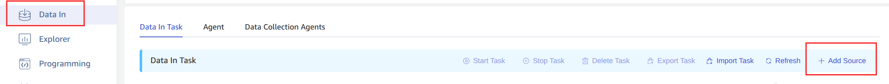
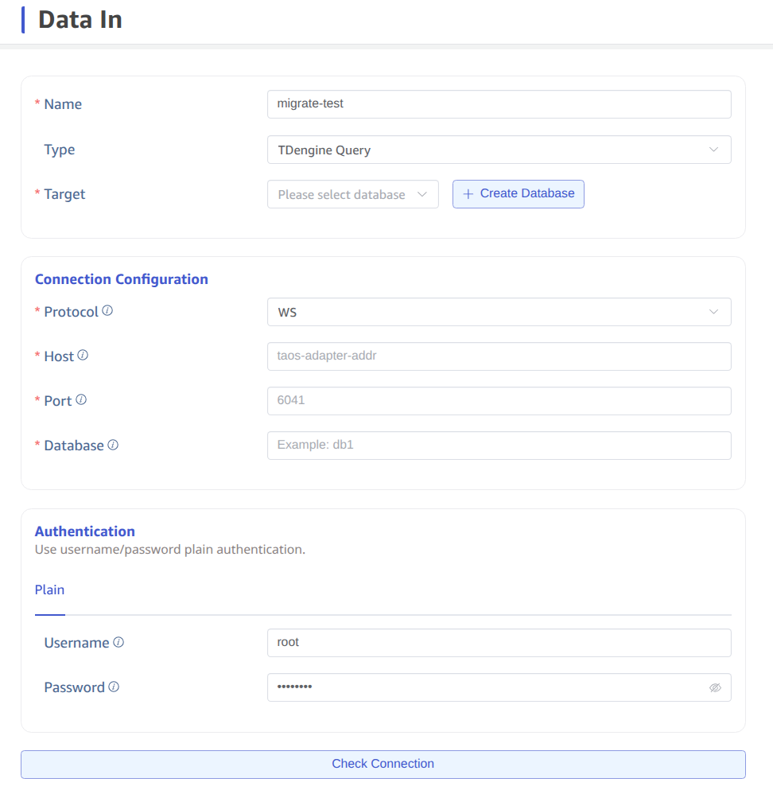

This section explains how to create a data migration task through the Explorer interface to migrate data from the TDengine 2.x to the current cluster.

## Feature Overview

`taosX` uses SQL queries to retrieve data from the source cluster and writes the query results to the target database. Specifically, `taosX` treats a subtable's data for a specific time period as the basic unit of the query, and the data to be migrated is written to the target database in batches.

`taosX` supports three migration modes:

1. **history** mode: Migrates data within a specified time range. If no time range is specified, it migrates all data up to the task creation time. Once the migration is complete, the task stops.
2. **realtime** mode: Synchronizes data from the task creation time onward. The task will continue running unless manually stopped.
3. **both** mode: Executes history mode first, then switches to realtime mode.

In each migration mode, you can specify whether to migrate the table structure. If "always" is selected, the table structure will be synced to the target database before migrating the data. If there are many subtables, this process may take a while. If you are sure that the target database already has the same table schema as the source database, it is recommended to select "none" to save time.

During task execution, progress is saved to disk, so if a task is paused and restarted, or automatically recovers from an error, it will not restart from the beginning.

For more detailed information, we recommend reading the description of each form field on the task creation page.

## Steps

First, click the "Data Ingestion" menu on the left, then click the "Add Data Source" button on the right.

Next, enter the task name, such as "migrate-test", and select the type "TDengine2". At this point, the form will switch to the dedicated TDengine2 migration form, which contains many options, each with a detailed description, as shown in the images below.

After clicking the "Submit" button to submit the task, return to the "Data Source" task list page, where you can monitor the task's execution status.
