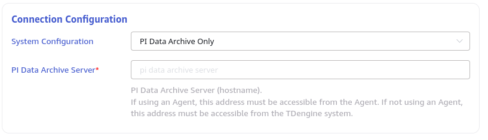
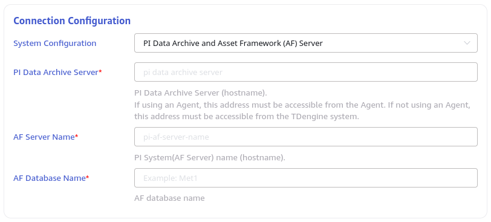

This section explains how to create a task through the Explorer interface to migrate data from PI System to TDengine.

## Overview

PI System is a suite of software products for data collection, retrieval, analysis, transmission, and visualization. It can serve as the infrastructure for enterprise-level systems that manage real-time data and events. The `taosX` PI System connector plugin can extract both real-time and historical data from PI System.

From a data timeliness perspective, PI System data source tasks are divided into two types: **real-time tasks** and **backfill tasks**. In the task type dropdown list, these two types are labeled: **PI** and **PI backfill**.

From a data model perspective, PI System data source tasks are divided into **single-column model** tasks and **multi-column model** tasks:

1. **Single-column model** tasks map a PI Point to a TDengine table.
2. **Multi-column model** tasks map a PI AF element to a TDengine table.

For the type of connected data source, PI System data source tasks are divided into **Archive Server** data sources and **AF Server** data sources. For **Archive Server** data sources, only the **single-column model** can be used. For **AF Server** data sources, both **single-column model** and **multi-column model** can be selected.

Users configure data mapping rules from PI System to TDengine via a CSV file, referred to as the **model configuration file**:

1. For tasks using the AF Server's single-column model, `taosX` automatically identifies which attributes of an element reference PI Point data, mapping a PI Point attribute to a table.
2. For tasks using the AF Server's multi-column model, one element corresponds to one table. By default, `taosX` maps PI Point attributes to TDengine metric columns and other attributes to TDengine tag columns.

## Creating a Task

### Add Data Source

In the "Data Ingestion" page, click the **+Add Data Source** button to go to the add data source page.


### Basic Configuration

Enter a task name in the **Name** field, such as: "test."

Select **PI** or **PI backfill** from the **Type** dropdown list.

If the `taosX` service runs on the same server as the PI system or can connect directly to it (requires PI AF SDK), an agent is not necessary. Otherwise, configure an agent: select a specified agent from the dropdown, or click the **+Create New Agent** button on the right to create a new agent, following the prompts to configure it. `taosX` or its agent must be deployed on a host that can directly connect to the PI System.

Select a target database from the **Target Database** dropdown list, or click the **+Create Database** button on the right to create a new one.


### Connection Configuration

The PI System connector supports two connection methods:

1. **PI Data Archive Only**: Does not use the AF model. In this mode, fill in the **PI Service Name** (server address, typically the hostname).

   

2. **PI Data Archive and Asset Framework (AF) Server**: Uses the AF SDK. In this mode, in addition to configuring the service name, you also need to configure the PI System (AF Server) name (hostname) and the AF Database name.

   

Click the **Connectivity Check** button to check if the data source is available.

### Data Model Configuration

This section has two tabs corresponding to the single-column model configuration and the multi-column model configuration. If this is your first time configuring it, whether you choose the single-column model or the multi-column model, be sure to click the "Download Default Configuration" button. This will generate the default **model configuration file**, which will also be downloaded to your local machine, where you can view or edit it. After editing, you can re-upload it to override the default configuration.

If you want to synchronize all points or all elements of a template, the default configuration is sufficient. If you want to filter specific naming patterns of points or element templates, you need to fill in the filter conditions before clicking "Download Default Configuration."

#### Multi-Column Model Configuration File

Below is an example of a multi-column model configuration file. This configuration file includes configurations for two supertables: one for the `metertemplate` table, whose data comes from the `MeterTemplate` element, and another for the `farm` table, whose data comes from the `Farm` element.

```csv
SuperTable,metertemplate
SubTable,${element_name}_${element_id}
Template,MeterTemplate
Filter,
ts,KEY,TIMESTAMP,$ts
voltage,COLUMN,DOUBLE,$voltage
voltage_status,COLUMN,INT,$voltage_status
current,COLUMN,DOUBLE,$current
current_status,COLUMN,INT,$current_status
element_id,TAG,VARCHAR(100),$element_id
element_name,TAG,VARCHAR(100),$element_name
path,TAG,VARCHAR(100),$path
categories,TAG,VARCHAR(100),$categories

SuperTable,farm
SubTable,${element_name}_${element_id}
Template,Farm
Filter,
ts,KEY,TIMESTAMP,$ts
wind_speed,COLUMN,FLOAT,$wind_speed
wind_speed_status,COLUMN,INT,$wind_speed_status
power_production,COLUMN,FLOAT,$power_production
power_production_status,COLUMN,INT,$power_production_status
lost_power,COLUMN,FLOAT,$lost_power
lost_power_status,COLUMN,INT,$lost_power_status
farm_lifetime_production__weekly_,COLUMN,FLOAT,$farm_lifetime_production__weekly_
farm_lifetime_production__weekly__status,COLUMN,INT,$farm_lifetime_production__weekly__status
farm_lifetime_production__hourly_,COLUMN,FLOAT,$farm_lifetime_production__hourly_
farm_lifetime_production__hourly__status,COLUMN,INT,$farm_lifetime_production__hourly__status
element_id,TAG,VARCHAR(100),$element_id
element_name,TAG,VARCHAR(100),$element_name
path,TAG,VARCHAR(100),$path
categories,TAG,VARCHAR(100),$categories
```

A multi-column model configuration file consists of one or more supertable definitions. Each supertable configuration includes:

1. The mapping between supertables and templates.
2. The mapping between attributes and TDengine metric columns.
3. The mapping between attributes and TDengine TAG columns.
4. Source data filtering conditions.
5. For each column, whether it is a metric column or a TAG column, you can configure a mapping rule. For details, see [Zero-Code Third-Party Data Integration](../), "Data Extraction, Filtering, and Transformation."

#### Single-Column Model Configuration File

Below is an example of a single-column model configuration file.

```csv
SuperTable,volt_float32
SubTable,${point_name}
Filter,
ts,KEY,TIMESTAMP,$ts
value,COLUMN,FLOAT,$value
status,COLUMN,INT,$status
path,TAG,VARCHAR(200),$path
point_name,TAG,VARCHAR(100),$point_name
ptclassname,TAG,VARCHAR(100),$ptclassname
sourcetag,TAG,VARCHAR(100),$sourcetag
tag,TAG,VARCHAR(100),$tag
descriptor,TAG,VARCHAR(100),$descriptor
exdesc,TAG,VARCHAR(100),$exdesc
engunits,TAG,VARCHAR(100),$engunits
pointsource,TAG,VARCHAR(100),$pointsource
step,TAG,VARCHAR(100),$step
future,TAG,VARCHAR(100),$future
element_paths,TAG,VARCHAR(512),`$element_paths.replace("\\", ".")`

SuperTable,milliampere_float32
SubTable,${point_name}
Filter,
ts,KEY,TIMESTAMP,$ts
value,COLUMN,FLOAT,$value
status,COLUMN,INT,$status
path,TAG,VARCHAR(200),$path
point_name,TAG,VARCHAR(100),$point_name
ptclassname,TAG,VARCHAR(100),$ptclassname
sourcetag,TAG,VARCHAR(100),$sourcetag
tag,TAG,VARCHAR(100),$tag
descriptor,TAG,VARCHAR(100),$descriptor
exdesc,TAG,VARCHAR(100),$exdesc
engunits,TAG,VARCHAR(100),$engunits
pointsource,TAG,VARCHAR(100),$pointsource
step,TAG,VARCHAR(100),$step
future,TAG,VARCHAR(100),$future
element_paths,TAG,VARCHAR(512),`$element_paths.replace("\\", ".")`

Meter_1000004_Voltage,POINT,volt_float32
Meter_1000004_Current,POINT,milliampere_float32
Meter_1000001_Voltage,POINT,volt_float32
Meter_1000001_Current,POINT,milliampere_float32
Meter_1000474_Voltage,POINT,volt_float32
Meter_1000474_Current,POINT,milliampere_float32
```

A single-column model configuration file is divided into two parts. The first part is similar to the multi-column model configuration file and consists of several supertable definitions. The second part is the point list, which configures the mapping between points and supertables. The default configuration maps points with the same UOM and data type to the same supertable.

### Backfill Configuration

1. For PI tasks, a "restart compensation time" can be configured. If the task is interrupted unexpectedly, this parameter is useful upon restart, as it allows `taosX` to automatically backfill a period of data.
2. For PI backfill tasks, you must configure the start and end times for the backfill.

### Advanced Options

The advanced options differ for different task types. The common advanced options are:

1. Connector log level.
2. Batch size for querying and sending data.
3. Maximum delay for a single read.

For **multi-column real-time tasks**, there are the following toggle options:

1. Sync new elements. If enabled, the PI connector will monitor new elements in the template. Without restarting the task, it can automatically synchronize the data for new elements.
2. Sync static attribute changes. If enabled, the PI connector will sync changes to all static attributes (non-PI Point attributes). This means that if a static attribute of an element is modified in the PI AF Server, the corresponding TAG value in the TDengine table will also be modified.
3. Sync delete element operations. If enabled, the PI connector will listen for element deletion events in the configured template and sync the deletion of the corresponding subtable in TDengine.
4. Sync delete historical data operations. If enabled, for the time-series data of an element, if data from a certain time is deleted in PI, the corresponding column data in TDengine for that time will be set to null.
5. Sync historical data modifications. If enabled, for the time-series data of an element, if historical data is modified in PI, the corresponding data in TDengine will also be updated.
