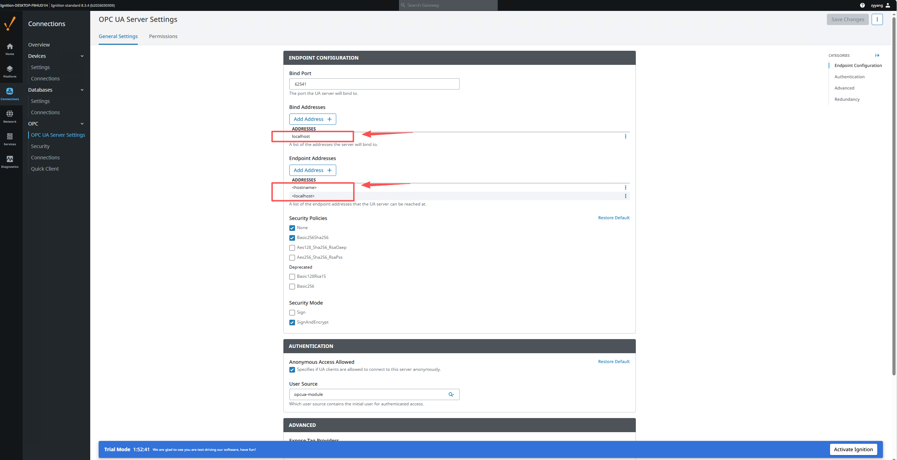

This page describes how to ingest data from an Ignition Gateway into TDengine TSDB through OPC UA. It covers two typical scenarios:

- **Scenario 1: cross-server anonymous connection** (intended for short-lived internal testing only)
- **Scenario 2: cross-server certificate-encrypted connection with username authentication** (recommended for production)

OPC UA security has two distinct layers; understanding the split makes troubleshooting much easier.

### Secure Channel

Provides **transport-layer encryption** that prevents eavesdropping and tampering between client and server. Requires:

- **Secure Channel Certificate**: the taosX client's own certificate, presented to the OPC UA server for identification.
- **Certificate's Private Key**: the matching private key, used for signing and decryption.

### Authentication

Verifies the **user identity** that opens the session. Three options are supported:

- **Anonymous**: anonymous access (must be allowed by the server).
- **Username**: username + password.
- **Certificate**: certificate-based user identity (requires a certificate-to-user mapping on the server).

:::tip
The certificate that you can download from Ignition (for example `ignition-server.der`) is the **server's own certificate** and cannot be used as a client certificate. You must generate a separate client certificate and private key as described in [Generate the taosX OPC UA Client Certificate](./01-client-certificate.md).
:::

## 1. Ignition server-side configuration

Open Ignition Gateway → **Config** → **Connections** → **OPC** → **OPC UA Server Settings** → **General Settings**.

### 1.1 Endpoint settings

| Setting | Recommended value | Notes |
| --- | --- | --- |
| Bind Port | `62541` | OPC UA listening port |
| Bind Addresses | `0.0.0.0` | If TDengine TSDB and Ignition are on different servers, this must be set to `0.0.0.0` |
| Endpoint Addresses | Add the server IP | For example `192.168.2.149`, so the client can reach the endpoint |
| Security Policies | ☑ `Basic256Sha256` | Enable the policies you intend to use |
| Security Mode | ☑ `SignAndEncrypt` | Enable signed-and-encrypted mode |

### 1.2 Authentication settings

In the **AUTHENTICATION** section on the same page:

- For **Username authentication**, set the User Source to `default` (recommended) instead of `opcua-module`.

:::note
Use `default` for User Source. The built-in `opcua-module` source is independent and requires extra user/permission setup, which often causes `StatusBadUserAccessDenied` errors.
:::

### 1.3 Permissions

Switch to the **Permissions** tab and confirm that the `AuthenticatedUser` role has the required permissions:

| Role | Browse | Read | Write | Call |
| --- | --- | --- | --- | --- |
| AuthenticatedUser | ☑ | ☑ | ☑ | ☑ |

**Default Tag Provider Permissions** must be configured the same way.

## 2. Scenario 1: cross-server anonymous connection

After installing and starting Ignition, go to **Connections > OPC > OPC server settings**.

The default Ignition configuration is bound to `localhost`, and the endpoint addresses include `<hostname>` and `localhost`:



In that state, if TDengine TSDB and Ignition live on different servers the connection will fail because Ignition only listens on the local port `62541`. Change Bind Addresses to `0.0.0.0` and add the Ignition server IP to the endpoint addresses:


You can verify that Ignition now listens on `0.0.0.0:62541` from `cmd`:

```bash
netstat -ano | findstr 62541
```


After the changes you can connect TDengine TSDB Explorer to Ignition with anonymous mode:


:::warning
Anonymous mode performs no identity check and no transport-layer encryption. **Use it only for short-lived testing on a trusted network**; switch to Scenario 2 for production.
:::

## 3. Scenario 2: certificate encryption + username authentication

### 3.1 Enable SignAndEncrypt on Ignition

Adjust the configuration as shown and save:

- **Security Policy**: `Basic256Sha256`
- **Security Mode**: `SignAndEncrypt`
- **User Source**: `default`


### 3.2 Generate the client certificate

Follow [Generate the taosX OPC UA Client Certificate](./01-client-certificate.md) on any machine to produce `client_cert.pem` and `client_key.pem`.

### 3.3 Trust the client certificate inside Ignition

Once the certificate is generated, Ignition must explicitly trust it:

1. In Explorer, run **Check Connection** once with the new certificate. **It will fail — that is expected.**
2. Open Ignition Gateway → **Config** → **Connections** → **OPC** → **Security** → **Server** tab.
3. Locate the `taosx-opc-client` certificate under **Quarantined Certificates**.
4. Click the right-hand **⋮** menu → **Trust**.
5. Confirm the certificate has moved into the **Trusted Certificates** list.

### 3.4 Configure the connection in Explorer

In TDengine TSDB Explorer → **Data In** → **Create New Data In Task**, choose **OPC UA** as the source type.

#### Connection Configuration

| Setting | Value | Notes |
| --- | --- | --- |
| Server Endpoint | `192.168.2.149:62541` | Ignition server IP + port |
| Security Mode | `SignAndEncrypt` | Must match the Ignition side |
| Security Policy | `Basic256Sha256` | Must match the Ignition side |
| Secure Channel Certificate | Upload `client_cert.pem` | The client certificate |
| Certificate's Private Key | Upload `client_key.pem` | The client private key |

#### Authentication

Switch to the **Username** tab and enter a username/password that exists in the configured Ignition User Source.

Run **Check Connection** again to validate:


## 4. Troubleshooting

| Error | Cause | Resolution |
| --- | --- | --- |
| `StatusBadIdentityTokenInvalid (0x80200000)` | Identity token rejected. Usually the wrong authentication method, or the certificate is not accepted by the server. | If using Certificate authentication, switch to Username; verify the Ignition User Source is configured correctly. |
| `StatusBadUserAccessDenied (0x801F0000)` | Credentials are correct but the user has no rights — typically the user is not in the configured User Source. | Set Ignition User Source to `default` and make sure the user exists there. |
| `StatusBadSecurityChecksFailed` | Secure channel could not be established. Either the certificate is not trusted or the Security Policy does not match. | Trust the client certificate on Ignition's Security page; ensure both sides use the same Security Policy. |
| `StatusBadCertificateUriInvalid` | The URI inside the certificate's SAN does not match the client's Application URI. | Regenerate the certificate ensuring the SAN contains `URI:urn:taosx-opc:client`. |
| Connection timeout | Network unreachable, or Ignition is not listening on the right address. | Confirm Bind Address is `0.0.0.0`, Endpoint Addresses contain the server IP, and port `62541` is open in the firewall. |
