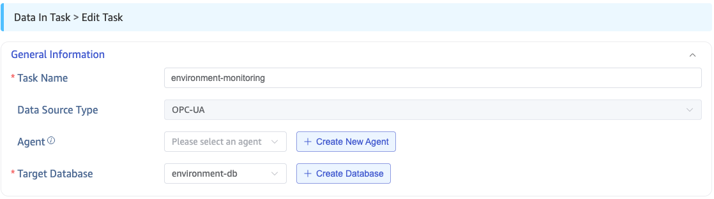
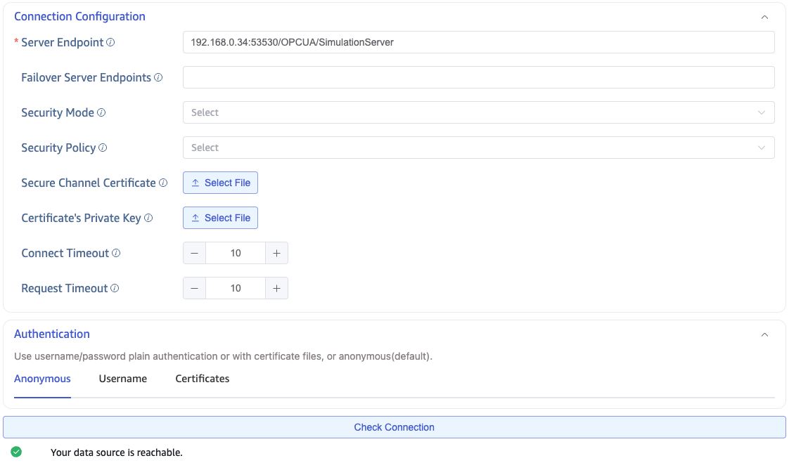
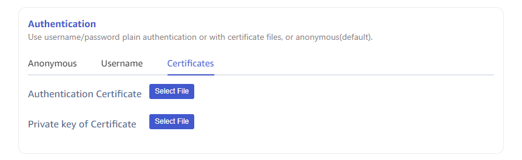
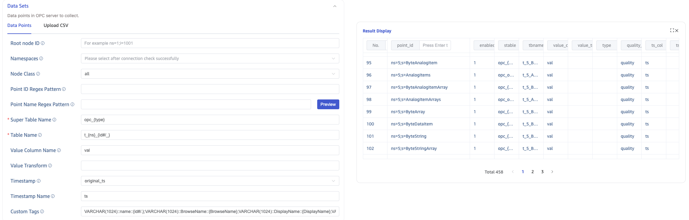
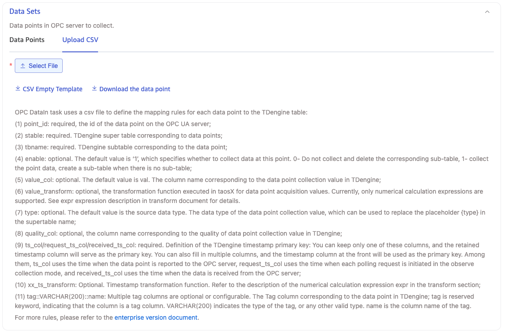
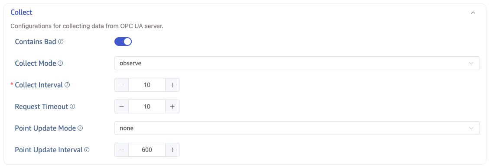
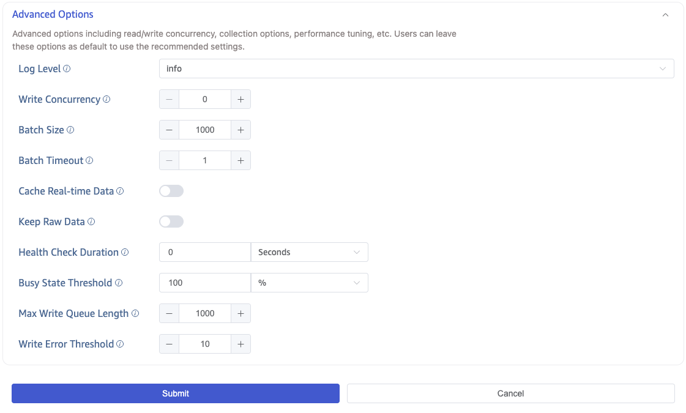
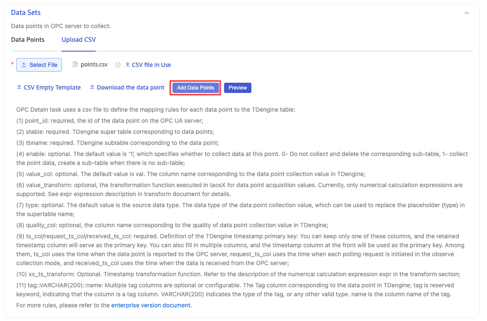
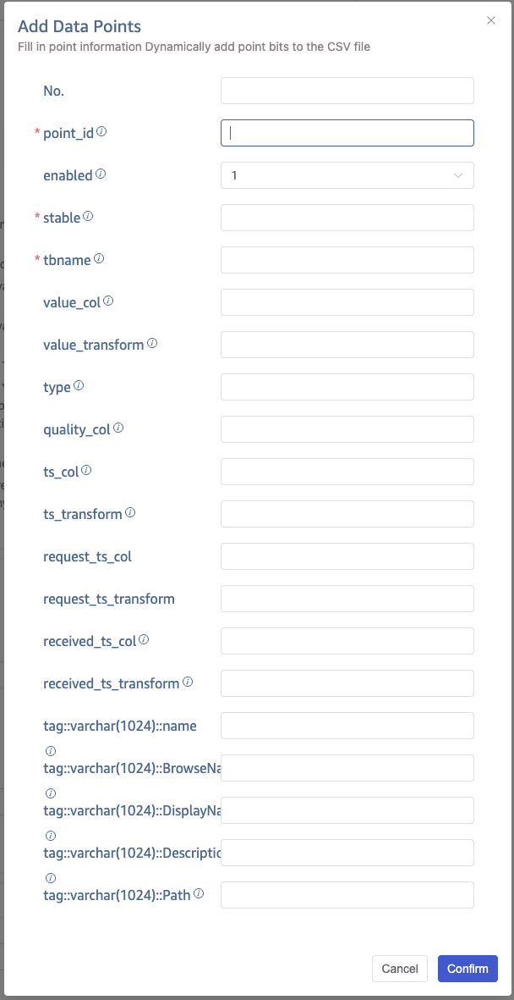

import { AddDataSource, Enterprise } from '../../../assets/resources/_resources.mdx';

<Enterprise/>

This section describes how to create data migration tasks through the Explorer interface to synchronize data from an OPC UA server to the current TDengine cluster.

## Overview

OPC is one of the interoperability standards for securely and reliably exchanging data in the field of industrial automation and other industries.

OPC UA is the next-generation standard of the classic OPC specifications, a platform-independent, service-oriented architecture specification that integrates all the functionalities of the existing OPC Classic specifications, providing a path to a more secure and scalable solution.

TDengine can efficiently read data from OPC UA servers and write it to TDengine, enabling real-time data ingestion.

## Procedure

### Add a Data Source

<AddDataSource connectorName="OPC UA"/>

### Configure General Information

**Agent** is optional. When taosX cannot reach the OPC UA Server directly over the network — for example the OPC UA Server lives in an isolated OT network, or taosX runs in the public cloud and cannot reach the on-premises network — deploy a taosx-agent on a host that **can** reach the OPC UA Server, and route the data through the agent. In this setup taosX only needs connectivity to the agent, and the agent only needs connectivity to the OPC UA Server. If taosX can already reach the OPC UA Server directly, leave **Agent** empty. When needed, pick an existing agent from the dropdown, or click **+ Create New Agent** on the right to create one.



### Configure Connection Information

In the **Connection Configuration** area, fill in the **OPC UA Service Address**, for example `192.168.1.66:53530/OPCUA/SimulationServer`, and configure the data transmission security mode. Three **security modes** are available:

- **None**: Communication data is transmitted in plaintext.
- **Sign**: Communication data is verified using a digital signature to protect data integrity.
- **SignAndEncrypt**: Communication data is verified using a digital signature and encrypted using encryption algorithms to ensure data integrity, authenticity, and confidentiality.

If the security mode is `Sign` or `SignAndEncrypt`, you must select a valid **security policy**. Security policies define how the encryption and verification mechanisms in the security mode are implemented, including the encryption algorithms used, key lengths, and digital certificates. The available security policies are:

- None: Only selectable when the security mode is `None`.
- Basic128Rsa15: Uses the RSA algorithm and a 128-bit key length to sign or encrypt communication data.
- Basic256: Uses the AES algorithm and a 256-bit key length to sign or encrypt communication data.
- Basic256Sha256: Uses the AES algorithm and a 256-bit key length, and encrypts digital signatures using the SHA-256 algorithm.
- Aes128Sha256RsaOaep: Uses the AES-128 algorithm to encrypt and decrypt communication data, encrypts digital signatures using the SHA-256 algorithm, and uses the RSA algorithm with OAEP mode to encrypt and decrypt symmetric communication keys.
- Aes256Sha256RsaPss: Uses the AES-256 algorithm to encrypt and decrypt communication data, encrypts digital signatures using the SHA-256 algorithm, and uses the RSA algorithm with PSS mode to encrypt and decrypt symmetric communication keys.



:::tip
When **Security Mode** is `Sign` or `SignAndEncrypt`, both **Secure Channel Certificate** and **Certificate's Private Key** are required. To produce them, see [Generate the taosX OPC UA Client Certificate](./01-client-certificate.md).
:::

Different OPC UA Server products use different endpoint formats, security policy combinations, and client-certificate trust workflows. If you are connecting to one of the servers below, **read the dedicated integration guide first** for verified settings and the server-side trust flow:

- [Ignition OPC UA Server Integration Guide](./03-ignition.md)
- [GE Cimplicity OPC UA Server Integration Guide](./04-ge-cimplicity.md)

For OPC UA Servers from other vendors, follow the generic steps in this section.

### Choose Authentication Method

As shown below, switch tabs to choose different authentication methods:

1. Anonymous
1. Username and Password
1. Certificate Access: Can be the same as the secure-channel certificate, or a different certificate.



After configuring the connection properties and authentication method, click the **Connectivity Check** button to check whether the data source is reachable. If you use a secure-channel certificate or an authentication certificate, the certificate must be trusted by the OPC UA server, otherwise the check will fail.

### Configure Points Set

**Points Set** can choose **Select Data Points** or **Upload CSV Configuration File**. Explorer shows the former by default.

#### Selecting Data Points



##### Filter Data Points

Filter points by configuring **Root Node ID**, **Namespaces**, **Node Class**, **Point ID Regex Pattern**, **Point Name Regex Pattern**, etc. Click **Preview** to preview OPC UA points that match the filter on the right.

##### Super Table Name

**Super Table Name** specifies the supertable into which data is written. The expression supports the following placeholder:

| Placeholder | Description                                                                                                                                                                                                                       |
| ----------- | --------------------------------------------------------------------------------------------------------------------------------------------------------------------------------------------------------------------------------- |
| `{type}`    | Replaced by the lowercase TDengine data type of the point's value column. The length is omitted for `varchar(N)` / `nchar(N)` (becoming `varchar` / `nchar`); other types containing spaces are joined with `_`, e.g. `tinyint_unsigned`, `int_unsigned`, `bigint_unsigned`. |

Possible values: `bool`, `tinyint`, `smallint`, `int`, `bigint`, `tinyint_unsigned`, `smallint_unsigned`, `int_unsigned`, `bigint_unsigned`, `float`, `double`, `timestamp`, `varchar`, `nchar`, `json`, `varbinary`, `decimal`, `blob`.

:::tip
Any `.` in the expression is automatically replaced with `_` to avoid producing illegal characters in the supertable name. For example `opc.{type}` becomes `opc_double` for a `Float64` point.
:::

For example, `opc_{type}` produces `opc_double` for a `Float64` point and `opc_varchar` for a `VARCHAR(64)` point.

##### Table Name

**Table Name** specifies the subtable into which data is written. An OPC UA point ID has the form `ns=<namespace>;<prefix>=<identifier>` (where `<prefix>` is `i` / `s` / `g` / `b`). The expression supports the following placeholders:

| Placeholder | Description                                                                                          | Example (point_id=`ns=2;s=Device/Type/Tag`) |
| ----------- | ---------------------------------------------------------------------------------------------------- | ------------------------------------------- |
| `{ns}`      | The namespace, i.e. the value after `ns=`                                                            | `2`                                         |
| `{id}`      | The identifier (after stripping the `s=` / `i=` / `g=` / `b=` prefix)                                | `Device/Type/Tag`                           |
| `{id#/_}`   | All `/` in `{id}` replaced with `_`, then leading/trailing `_` trimmed                               | `Device_Type_Tag`                           |
| `{id#-_}`   | All `-` in `{id}` replaced with `_`, then leading/trailing `_` trimmed                               | (if id contains `-`) `A_B_C`                |

:::tip

- After substitution, any remaining `.` and backticks `` ` `` in the subtable name are replaced with `_` to avoid producing illegal table names.
- If the point ID does not contain a semicolon (so `ns` / `id` cannot be parsed), `{ns}` becomes an empty string and `{id}` becomes `Objects`.
- The expression can be freely combined with static text, e.g. `t_{ns}_{id#/_}`.

:::

##### Value Column Name & Value Transform

- **Value Column Name**: the column name written to TDengine for this point's value, default `val`. When multiple points map into the same supertable, they all share the same **Value Column Name**.
- **Value Transform**: an optional secondary computation on the original value, written as a [Rhai](https://rhai.rs/) expression. Leave empty to disable. The original value is referenced via the **Value Column Name**, e.g. when the column name is `val`:

  | Expression                       | Effect                              |
  | -------------------------------- | ----------------------------------- |
  | `val * 1.8 + 32`                 | Celsius → Fahrenheit                |
  | `val / 1000`                     | Unit conversion (millis → seconds)  |
  | `val + 0.5`                      | Offset correction                   |
  | `if val < 0 { 0 } else { val }`  | Clamp negative values to 0          |

  Numeric values are uniformly converted to `f64` before being passed into the expression, so floating-point arithmetic can be used freely. Boolean, string, and binary types do not support value transforms at this time.

##### Timestamp

- **Timestamp**: choose `origin_ts`, `request_ts`, or `received_ts`.

  - `origin_ts`: use the original timestamp of the OPC point as the TDengine timestamp column.
  - `request_ts`: use the request timestamp of the data as the TDengine timestamp column.
  - `received_ts`: use the reception timestamp of the data as the TDengine timestamp column.

- **Timestamp Name**: the name of the TDengine timestamp column, default `ts`.

##### Custom Tags

**Custom Tags** attach extra tag columns to subtables. Each tag has three parts; multiple tags are separated by `;`:

```text
<DataType>::<TagName>::<Pattern>
```

- `<DataType>`: TDengine data type, e.g. `VARCHAR(1024)`, `NCHAR(64)`, `INT`, `BIGINT`, `DOUBLE`.
- `<TagName>`: the tag column name.
- `<Pattern>`: the tag value, either static text or one of the dynamic placeholders below.

###### OPC node attribute placeholders

| Placeholder     | Description                                       |
| --------------- | ------------------------------------------------- |
| `{BrowseName}`  | The OPC node's BrowseName attribute               |
| `{DisplayName}` | The OPC node's DisplayName attribute              |
| `{Description}` | The OPC node's Description attribute              |
| `{Path}`        | The OPC node's full path in the address space     |

Only these four attributes are supported; `NodeClass`, `ParentId`, etc. are not available in the expression. Empty attributes are replaced with the empty string.

###### Attribute character substitution `{Attr#XY}`

For `BrowseName` / `DisplayName` / `Description` / `Path`, the `{Attr#XY}` syntax replaces every occurrence of character `X` with character `Y` in the attribute value, and trims `Y` from the start/end of the result:

| Placeholder        | Attribute value         | Result                |
| ------------------ | ----------------------- | --------------------- |
| `{DisplayName#_.}` | `zs_p1_unit1_float`     | `zs.p1.unit1.float`   |
| `{BrowseName#-.}`  | `zs-p1-unit1`           | `zs.p1.unit1`         |
| `{Path#/_}`        | `/Objects/Plant/Area1/` | `Objects_Plant_Area1` |
| `{DisplayName#./}` | `.Device.Type.Tag.`     | `Device/Type/Tag`     |

:::note
`{Attr#XY}` has higher priority than plain `{Attr}`; the engine processes `{Attr#XY}` first, then `{Attr}`.
:::

###### Point ID placeholders

In addition to node attributes, the `<Pattern>` of a custom tag also supports placeholders derived from the point ID (OPC UA). All examples below use `ns=6;s=Device/Type/TagName`:

| Placeholder | Description                                          | Example                              |
| ----------- | ---------------------------------------------------- | ------------------------------------ |
| `{ns}`      | Namespace                                            | `6`                                  |
| `{id}`      | Identifier (with the `s=` / `i=` / `g=` / `b=` prefix stripped) | `Device/Type/TagName`     |
| `{id.}`     | id with the last `.` and its suffix removed          | (if id=`A.B.C`) `A.B`                |
| `{id/}`     | id with the last `/` and its suffix removed          | `Device/Type`                        |
| `{id_}`     | id with the last `_` and its suffix removed          | (similar logic)                      |
| `{id..}`    | id with the last two `.`-separated segments removed  | (if id=`A.B.C.D`) `A.B`              |
| `{..id.}`   | The second-to-last `.`-separated segment of id       | (if id=`A.B.C`) `B`                  |
| `{id#/.}`   | All `/` → `.`, then trim leading/trailing `.`        | `Device.Type.TagName`                |
| `{id#-.}`   | All `-` → `.`, then trim leading/trailing `.`        | (if id contains `-`) `A.B.C`         |
| `{id#/_}`   | All `/` → `_`, then trim leading/trailing `_`        | `Device_Type_TagName`                |
| `{id#-_}`   | All `-` → `_`, then trim leading/trailing `_`        | (if id contains `-`) `A_B_C`         |
| `{id/#/.}`  | Apply `{id/}` first, then `/` → `.`                  | `Device.Type`                        |
| `{id_#_.}`  | Apply `{id_}` first, then `_` → `.`                  | (if id=`A_B_C`) `A.B`                |

###### Example

```text
VARCHAR(1024)::name::{id#/.};VARCHAR(1024)::browse::{BrowseName};VARCHAR(200)::location::{Path#/_};INT::version::1
```

The configuration above defines four tags:

- `name`: point ID with `/` → `.`, e.g. `Device.Type.TagName`.
- `browse`: the node's BrowseName.
- `location`: the node's Path with `/` → `_`.
- `version`: the constant `1`.

Placeholders may be freely combined with static text, e.g. `prefix_{id#/.}_suffix`, `{BrowseName}({Description})`, `ns{ns}_{id}`.

#### Upload CSV Configuration File

You can download the CSV blank template and configure the point information according to the template, then upload the CSV configuration file to configure points; or download data points according to the configured filter conditions, and download in the format specified by the CSV template.



Core CSV rules:

- **File encoding**: UTF-8 (with or without BOM).
- **Header**: first line; must contain at least `point_id`, `stable`, `tbname`; `point_id` is unique within the task; at least one of `ts_col` / `request_ts_col` / `received_ts_col` must be present as the timestamp column.
- **Row**: one OPC data point per row; when `point_id` contains commas (string Node IDs), wrap the entire cell in double quotes.

The full column reference, recommended patterns and how to handle reserved characters such as commas inside `point_id` are documented in [OPC UA CSV Mapping File Reference](./02-csv-reference.md).

### Collection Configuration

In the collection configuration, configure the current task's collection mode, collection interval, collection timeout, etc.



As shown in the image above:

- **Collection Mode**: Can use `subscribe` or `observe` mode.
  - `subscribe`: Subscription mode, reports data changes and writes to TDengine.
  - `observe`: According to the `collection interval`, polls the latest value of the data point and writes to TDengine.
- **Collection Interval**: Default is 10 seconds, the interval for collecting data points, starting from the end of the last data collection, polls the latest value of the data point and writes to TDengine. Only configurable in `observe` **Collection Mode**.
- **Collection Timeout**: If the data from the OPC server is not returned within the set time when reading data points, the read fails, default is 10 seconds. Only configurable in `observe` **Collection Mode**.

When using **Selecting Data Points** in the **Data Point Set**, the collection configuration can configure **Data Point Update Mode** and **Data Point Update Interval** to enable dynamic data point updates. **Dynamic Data Point Update** refers to, during the task operation, after OPC Server adds or deletes data points, the data points that meet the conditions will automatically be added to the current task without needing to restart the OPC task.

- Data Point Update Mode: Can choose `None`, `Append`, `Update`.
  - None: Do not enable dynamic data point updates;
  - Append: Enable dynamic data point updates, but only append;
  - Update: Enable dynamic data point updates, append or delete;
- Data Point Update Interval: Effective when "Data Point Update Mode" is `Append` and `Update`. Unit: seconds, default value is 600, minimum value: 60, maximum value: 2147483647.

### Advanced Options



As shown in the image above, configure advanced options for more detailed optimization of performance, logs, etc.

**Log Level** defaults to `info`, with options `error`, `warn`, `info`, `debug`, `trace`.

In **Maximum Write Concurrency**, set the maximum concurrency limit for writing to taosX. Default value: 0, meaning auto, automatically configures concurrency.

In **Batch Size**, set the batch size for each write, i.e., the maximum number of messages sent at one time.

In **Batch Delay**, set the maximum delay for a single send (in seconds), when the timeout ends, as long as there is data, it is sent immediately even if it does not meet the **Batch Size**.

When **Cache Realtime Data** is enabled, data consumed from OPC is first written to a local file; a background task continuously reads from the file and sends data to the downstream consumer. This is intended for traffic shaping when the OPC data rate is high enough that downstream cannot keep up and would otherwise drop messages. Once the backlog is consumed, the file is cleaned up automatically. Disabled by default.

In **Cache Storage Directory**, you can enter the directory where the cache files are stored. It defaults to the data directory configured at taosX startup, but can be overridden. This option only takes effect when **Cache Realtime Data** is enabled.

In **Save Raw Data**, choose whether to save raw data. Default value: No.

When saving raw data, the following 2 parameters are effective.

In **Maximum Retention Days**, set the maximum retention days for raw data.

In **Raw Data Storage Directory**, set the path for saving raw data. If using Agent, the storage path refers to the path on the server where the Agent is located, otherwise it is on the taosX server. The path can use placeholders `$DATA_DIR` and `:id` as part of the path.

- On Linux platform, `$DATA_DIR` is `/var/lib/taos/taosx`, by default the storage path is `/var/lib/taos/taosx/tasks/<task_id>/rawdata`.
- On Windows platform, `$DATA_DIR` is `C:\TDengine\data\taosx`, by default the storage path is `C:\TDengine\data\taosx\tasks\<task_id>\rawdata`.

### Completion

Click the **Submit** button to complete the creation of the OPC UA to TDengine data synchronization task. Return to the **Data Source List** page to view the status of the task execution.

## Add Data Points

While the task is running, click **Edit** and then **Add Data Points** to append a new OPC UA data-point rule into the CSV configuration. Adding data points does not require restarting the task and does not cause data loss.



In the pop-up form, fill in the information for the data point.



Click **Confirm** to complete the addition.
