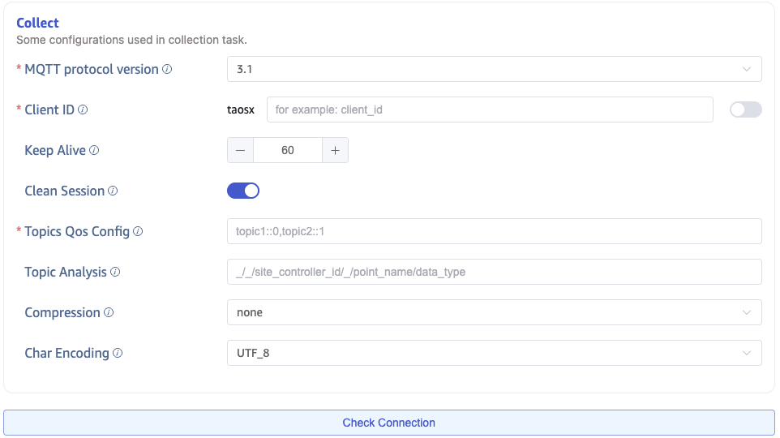

This section explains how to create a data migration task through the Explorer interface to migrate data from MQTT to the current TDengine cluster.

## Overview

MQTT stands for Message Queuing Telemetry Transport. It is a lightweight messaging protocol, easy to implement and use.

TDengine can use the MQTT connector to subscribe to data from an MQTT broker and write it to TDengine to enable real-time data ingestion.

## Creating a Task

### 1. Add Data Source

On the Data Ingestion page, click the **+Add Data Source** button to go to the Add Data Source page.


### 2. Configure Basic Information

Enter the task name in the **Name** field, such as "test_mqtt".

Select **MQTT** from the **Type** dropdown list.

The agent is optional. If needed, you can select an agent from the dropdown list, or click the **+Create New Agent** button.

Select a target database from the **Target Database** dropdown list, or click the **+Create Database** button on the right.


### 3. Configure Connection and Authentication Information

In the **MQTT Address** field, enter the address of the MQTT broker, for example: `192.168.1.42`.

In the **MQTT Port** field, enter the port of the MQTT broker, for example: `1883`.

In the **User** field, enter the username for the MQTT broker.

In the **Password** field, enter the password for the MQTT broker.


### 4. Configure SSL Certificates

If the MQTT broker uses SSL certificates, upload the certificate file in the **SSL Certificate** field.


### 5. Configure Collection Information

In the **Collection Configuration** section, enter the relevant parameters for the collection task.

Select the MQTT protocol version from the **MQTT Protocol** dropdown list. There are three options: `3.1`, `3.1.1`, and `5.0`. The default is 3.1.

In the **Client ID** field, enter the client identifier. This will generate a client ID with the `taosx` prefix (for example, if you enter "foo", the generated client ID will be `taosxfoo`). If the switch at the end is enabled, the task ID will be appended after `taosx` before the entered identifier (the generated client ID will be like `taosx100foo`). All client IDs connected to the same MQTT address must be unique.

In the **Keep Alive** field, enter the keep-alive interval. If the broker does not receive any messages from the client within this interval, it will assume the client has disconnected and close the connection. The keep-alive interval is the negotiated time between the client and the broker to detect if the client is active. If no messages are sent within this interval, the broker will disconnect the client.

In the **Clean Session** field, choose whether to clean the session. The default value is true.

In the **Subscription Topics and QoS Configuration** field, enter the Topic names to consume, using the following format: `topic1::0,topic2::1`.

Click the **Connectivity Check** button to test if the data source is available.



### 6. Configure MQTT Payload Parsing

In the **MQTT Payload Parsing** section, enter the configuration parameters related to parsing the Payload.

taosX can use a JSON extractor to parse the data and allows users to specify the data model in the database, including specifying table names, supertable names, setting regular columns, and tag columns.

#### 6.1 Parsing

There are three ways to obtain sample data:

Click the **Retrieve from Server** button to get sample data from MQTT.

Click the **File Upload** button to upload a CSV file and get sample data.

Enter sample data from the MQTT message body in the **Message Body** field.

json data supports `JSONObject` or `JSONArray`. The following data can be parsed using the JSON parser:

```json
{"id": 1, "message": "hello-world"}
{"id": 2, "message": "hello-world"}
```

or

```json
[{"id": 1, "message": "hello-world"},{"id": 2, "message": "hello-world"}]
```

The parsing result is shown below:


Click the **Magnifier Icon** to preview the parsing result.


#### 6.2 Field Splitting

In the **Extract or Split from Column** section, enter the fields to extract or split from the message body. For example, to split the `message` field into `message_0` and `message_1`, select the `split` extractor, enter `-` as the separator, and `2` as the number.


Click **Delete** to remove the current extraction rule.

Click **Add more** to add more extraction rules.

Click the **Magnifier Icon** to preview the extraction/split results.


#### 6.3 Data Filtering

In the **Filter** section, enter filtering conditions. For example, entering `id != 1` will filter out data where the `id` is equal to `1`, and only data with `id` not equal to 1 will be written to TDengine.


Click **Delete** to remove the current filter rule.

Click the **Magnifier Icon** to preview the filtering results.


#### 6.4 Table Mapping

In the **Target Supertable** dropdown list, select a target supertable, or click the **Create Supertable** button to create a new one.

In the **Mapping** section, enter the mapping rule for the target table’s name. For example, enter `t_{id}`. Fill in the mapping rules according to your needs, and mapping supports setting default values.


Click **Preview** to view the mapping results.


### 7. Advanced Options

In the **Log Level** dropdown list, select the log level. There are five options: `TRACE`, `DEBUG`, `INFO`, `WARN`, and `ERROR`. The default is `INFO`.

When saving raw data, the following two parameters are enabled:

**Max Retention Days:** Set the maximum number of days to retain raw data.

**Raw Data Storage Directory:** Set the path for storing raw data. If an agent is used, this path refers to the server where the agent is located; otherwise, it refers to the server where taosX is running. You can use placeholders like `DATA_DIR` and `:id` as part of the path.


### 8. Completion

Click the **Submit** button to complete the creation of the MQTT to TDengine data synchronization task. Go back to the **Data Source List** page to monitor the task's execution status.
