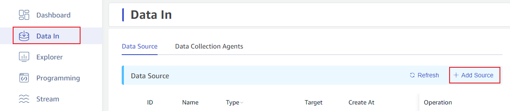
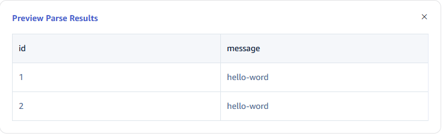
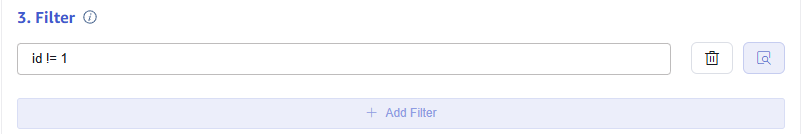
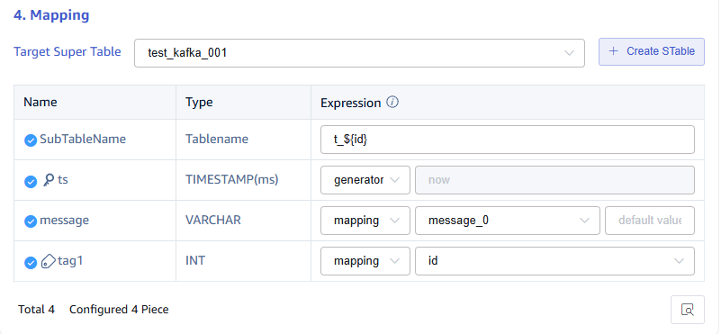
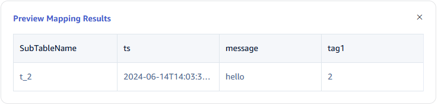

This section explains how to create a data migration task through the Explorer interface to migrate data from Kafka to the current TDengine cluster.

## Overview

Apache Kafka is an open-source distributed streaming platform for stream processing, real-time data pipelines, and large-scale data integration.

TDengine can efficiently read data from Kafka and write it into TDengine, enabling historical data migration or real-time data ingestion.

## Creating a Task

### 1. Add Data Source

On the Data Ingestion page, click the **+Add Data Source** button to go to the Add Data Source page.



### 2. Configure Basic Information

Enter the task name in the **Name** field, such as "test_kafka".

Select **Kafka** from the **Type** dropdown list.

The agent is optional. If needed, you can select an agent from the dropdown list, or click the **+Create New Agent** button.

Select a target database from the **Target Database** dropdown list, or click the **+Create Database** button on the right.


### 3. Configure Connection Information

Enter **bootstrap-server**, for example: `192.168.1.92`.

Enter **Port**, for example: `9092`.

For multiple broker addresses, add more pairs of bootstrap-server and ports by clicking the **Add Broker** button at the bottom right of the connection configuration section.


### 4. Configure SASL Authentication Mechanism

If the server has SASL authentication enabled, configure SASL and select the appropriate authentication mechanism. Currently, PLAIN/SCRAM-SHA-256/GSSAPI are supported.

#### 4.1. PLAIN Authentication

Select the `PLAIN` authentication mechanism and enter the username and password:


#### 4.2. SCRAM (SCRAM-SHA-256) Authentication

Select the `SCRAM-SHA-256` authentication mechanism and enter the username and password:


#### 4.3. GSSAPI Authentication

Select `GSSAPI`, which uses the [RDkafka client](https://github.com/confluentinc/librdkafka) to call GSSAPI for Kerberos authentication:


You will need to provide:

- Kerberos service name, typically `kafka`.
- Kerberos principal (authentication username), such as `kafkaclient`.
- Kerberos initialization command (optional).
- Kerberos keytab, a file that you must upload.

These details must be provided by the Kafka administrator.

You must also set up [Kerberos](https://web.mit.edu/kerberos/) authentication on your server. Install it using the following commands:

- On Ubuntu: `apt install krb5-user`
- On CentOS: `yum install krb5-workstation`

After configuring, you can use the [kcat](https://github.com/edenhill/kcat) tool to validate the Kafka topic consumption:

```bash
kcat <topic> \
  -b <kafka-server:port> \
  -G kcat \
  -X security.protocol=SASL_PLAINTEXT \
  -X sasl.mechanism=GSSAPI \
  -X sasl.kerberos.keytab=</path/to/kafkaclient.keytab> \
  -X sasl.kerberos.principal=<kafkaclient> \
  -X sasl.kerberos.service.name=kafka
```

If you get the error: "Server xxxx not found in kerberos database," ensure that the domain name for the Kafka node is configured properly and set `rdns = true` in the Kerberos client configuration file (`/etc/krb5.conf`).

### 5. Configure SSL Certificate

If SSL encryption authentication is enabled on the server, enable SSL here and configure the relevant details.


### 6. Configure Collection Information

In the **Collection Configuration** section, fill in the relevant parameters for the collection task.

Enter the **Timeout**. If Kafka does not provide any data within the timeout period, the data collection task will exit. The default is 0 ms, meaning it will wait indefinitely until data is available or an error occurs.

Enter the **Topic** name to consume. Multiple topics can be configured, separated by commas (e.g., `tp1,tp2`).

In the **Client ID** field, enter the client identifier. This will generate a client ID with the `taosx` prefix (e.g., if you enter "foo", the client ID will be `taosxfoo`). If you enable the switch at the end, the task ID will be appended to `taosx` before the entered identifier (e.g., `taosx100foo`). You should note that when using multiple taosX instances to subscribe to the same Topic for load balancing, you must provide a consistent Client ID to achieve the balancing effect.

In the **Consumer Group ID** field, enter the consumer group identifier. This will generate a consumer group ID with the `taosx` prefix (e.g., if you enter "foo", the consumer group ID will be `taosxfoo`). If you enable the switch at the end, the task ID will be appended to `taosx` before the entered identifier (e.g., `taosx100foo`).

From the **Offset** dropdown list, choose the offset to start consuming data. There are three options: `Earliest`, `Latest`, `ByTime(ms)`. The default is `Earliest`.

- Earliest: Requests the earliest offset.
- Latest: Requests the latest offset.

In the **Max Duration for Fetching Data**, set the maximum time to wait for data when the data is insufficient (in milliseconds). The default is 100ms.

Click the **Check Connectivity** button to check if the data source is available.


### 7. Configure Payload Parsing

In the **Payload Parsing** section, fill in the relevant parameters for payload parsing.

#### 7.1 Parsing

There are three ways to obtain sample data:

Click the **Fetch from Server** button to retrieve sample data from Kafka.

Click the **Upload File** button to upload a CSV file to obtain sample data.

In the **Message Body** field, enter a sample of the Kafka message body.

JSON data supports both `JSONObject` and `JSONArray`. Use the JSON parser to parse the following data:

```json
{"id": 1, "message": "hello-world"}
{"id": 2, "message": "hello-world"}
```

or

```json
[{"id": 1, "message": "hello-world"},{"id": 2, "message": "hello-world"}]
```

The parsed result is as follows:


Click the **Magnifying Glass Icon** to preview the parsed result.



#### 7.2 Field Splitting

In the **Extract or Split from Column** field, enter the fields to be extracted or split from the message body. For example, to split the `message` field into `message_0` and `message_1`, select the `split` extractor, set `separator` to `-`, and set `number` to `2`.

Click **Add** to add more extraction rules.

Click **Delete** to remove the current extraction rule.


Click the **Magnifying Glass Icon** to preview the extracted/split result.


#### 7.3 Data Filtering

In the **Filter** section, enter filtering conditions. For example, if you enter `id != 1`, only data where `id` is not equal to `1` will be written into TDengine.

Click **Add** to add more filtering rules.

Click **Delete** to remove the current filtering rule.



Click the **Magnifying Glass Icon** to preview the filtered result.


#### 7.4 Table Mapping

From the **Target Supertable** dropdown list, select a target supertable, or click the **Create Supertable** button on the right.

In the **Mapping** field, enter the name of the subtable in the target supertable, such as `t_{id}`. Based on the requirements, fill in the mapping rules. The mapping supports setting default values.



Click **Preview** to view the mapping result.



### 8. Configure Advanced Options

The **Advanced Options** section is collapsed by default. Click the right `>` to expand it, as shown below:


### 9. Complete the Creation

Click the **Submit** button to complete the Kafka to TDengine data synchronization task. Go back to the **Data Sources** page to view the task's status.
