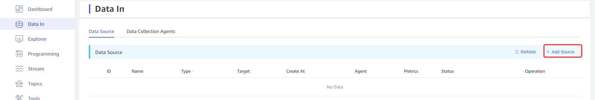
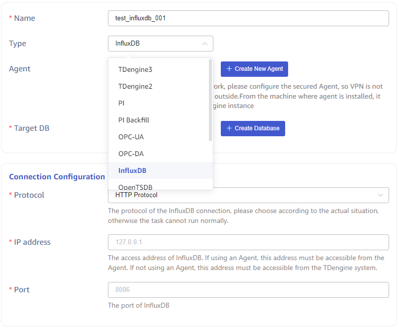
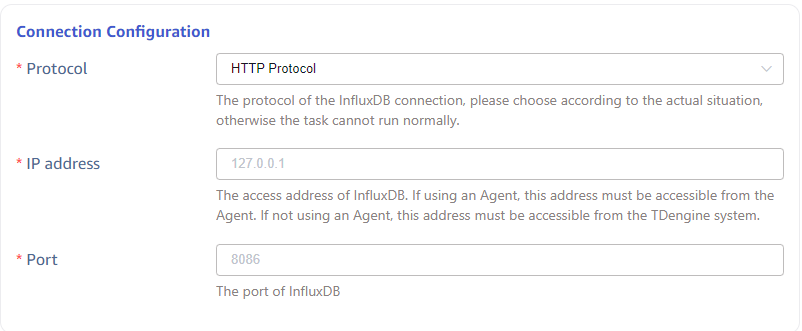
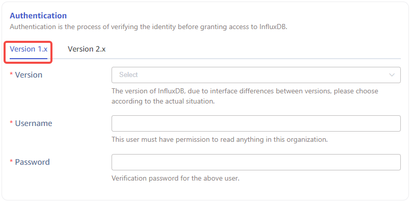
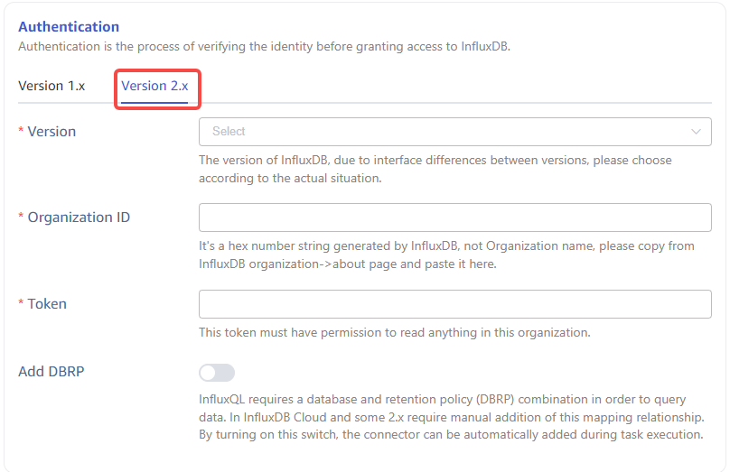
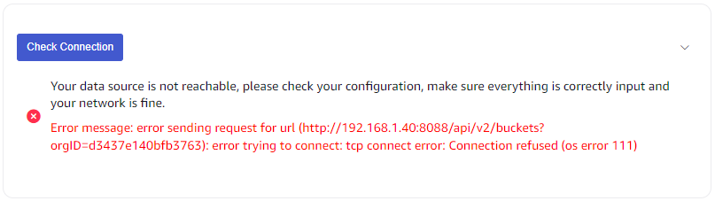
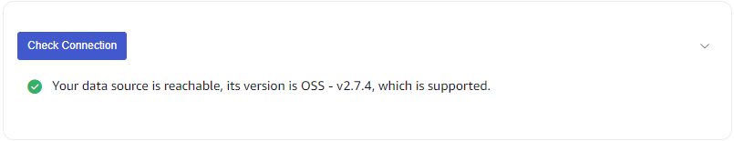
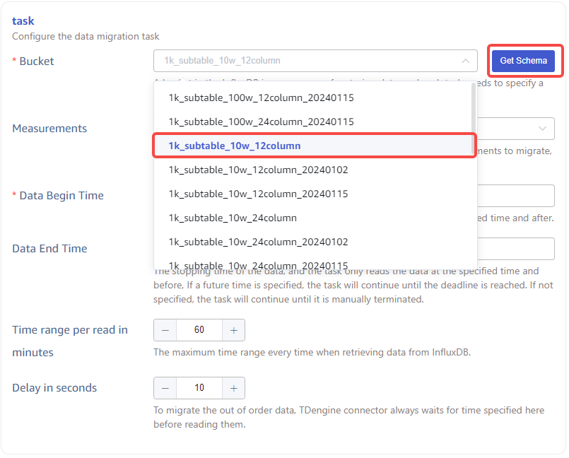
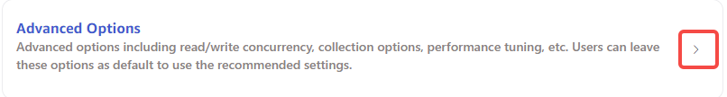
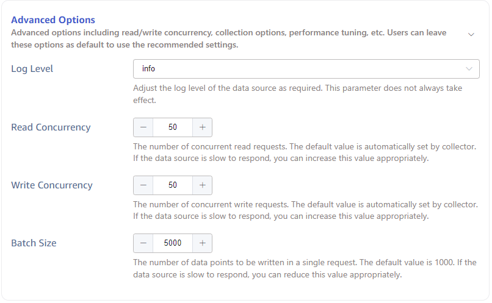

This section explains how to create a data migration task through the Explorer interface to migrate data from InfluxDB to the current TDengine cluster.

## Function Overview

InfluxDB is a popular open-source time series database optimized for handling large amounts of time series data. TDengine can efficiently read data from InfluxDB via the InfluxDB connector and write it into TDengine to achieve historical data migration or real-time data synchronization.

During task execution, progress information is saved to disk, so if the task is paused and restarted, or it recovers automatically from an error, the task will not start from the beginning. More options can be found by reading the descriptions of each form field on the task creation page.

## Creating a Task

### 1. Add a Data Source

Click the **+Add Data Source** button in the top left of the data writing page to enter the Add Data Source page, as shown below:

### 2. Configure Basic Information

In the **Name** field, enter a task name, such as *`test_influxdb_01`*.

Select *`InfluxDB`* from the **Type** dropdown box, as shown below (the fields on the page will change after selection).

The **Agent** field is optional. If needed, you can select a specified agent from the dropdown box, or click the **+Create New Agent** button on the right to create a new agent.

The **Target Database** is required. Since InfluxDB stores data in various time precisions such as seconds, milliseconds, microseconds, and nanoseconds, you need to select a *`nanosecond-precision database`*. You can also click the **+Create Database** button on the right to create a new database.

### 3. Configure Connection Information

In the **Connection Configuration** area, fill in the *`connection information of the source InfluxDB database`*, as shown below:

### 4. Configure Authentication Information

In the **Authentication** section, there are two tabs, *`1.x version`* and *`2.x version`*, as different versions of InfluxDB require different authentication parameters, and the APIs differ significantly. Please select based on your actual situation:  
  *`1.x version`*  
  **Version**: Select the version of the source InfluxDB database from the dropdown.  
  **User**: Enter the user for the source InfluxDB database, and the user must have read access in the organization.  
  **Password**: Enter the password for the above user in the source InfluxDB database.  
    
  *`2.x version`*  
  **Version**: Select the version of the source InfluxDB database from the dropdown.  
  **Organization ID**: Enter the organization ID of the source InfluxDB database, which is a string composed of hexadecimal characters, not the organization name. This can be obtained from the Organization->About page of the InfluxDB console.  
  **Token**: Enter the access token for the source InfluxDB database, which must have read access in the organization.  
  **Add Database Retention Policy**: This is a *`Yes/No`* toggle item. InfluxQL requires a combination of the database and retention policy (DBRP) to query data. Some 2.x versions and the InfluxDB Cloud version require manually adding this mapping. Turning on this switch allows the connector to automatically add this during task execution.  
  

Below the **Authentication** area, there is a **Connectivity Check** button. Users can click this button to check whether the information entered above can correctly retrieve data from the source InfluxDB database. The check results are shown below:  
  **Failure**  
    
  **Success**  
  

### 5. Configure Task Information

**Bucket**: In InfluxDB, a bucket is a namespace for storing data. Each task must specify a bucket. Users need to click the **Get Schema** button on the right to fetch the data structure information of the current source InfluxDB database and then select from the dropdown box, as shown below:

**Measurements**: This is optional. Users can select one or more measurements to synchronize. If not specified, all will be synchronized.

**Start Time**: This refers to the start time of the data in the source InfluxDB database. The time zone of the start time uses the time zone selected in the explorer. This field is required.

**End Time**: This refers to the end time of the data in the source InfluxDB database. If the end time is not specified, the synchronization of the latest data will continue; if the end time is specified, synchronization will only occur up to that point. The time zone of the end time uses the time zone selected in the explorer. This field is optional.

**Time Range per Read (minutes)**: This defines the maximum time range for a single read from the source InfluxDB database. This is an important parameter that users need to decide based on server performance and data storage density. If the range is too small, the synchronization task will execute slowly. If the range is too large, it may cause system failures in the InfluxDB database due to high memory usage.

**Delay (seconds)**: This is an integer between 1 and 30. To eliminate the impact of out-of-order data, TDengine always waits for the time specified here before reading the data.

### 6. Configure Advanced Options

The **Advanced Options** section is collapsed by default. Click the `>` on the right to expand it, as shown below:

### 7. Completion

Click the **Submit** button to complete the creation of the InfluxDB to TDengine data synchronization task. Go back to the **Data Sources List** page to view the execution status of the task.
