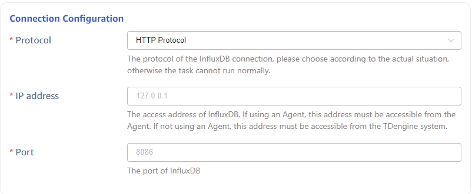
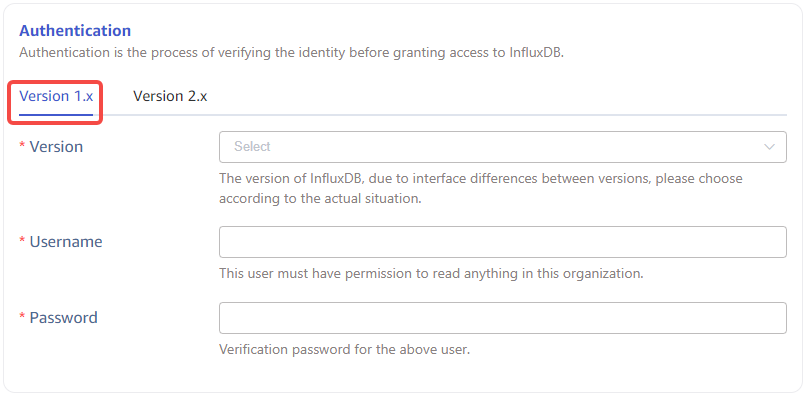
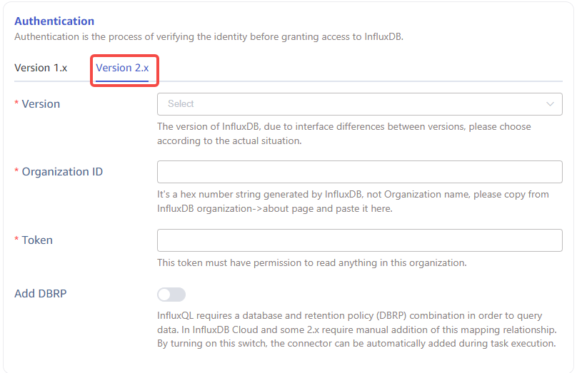
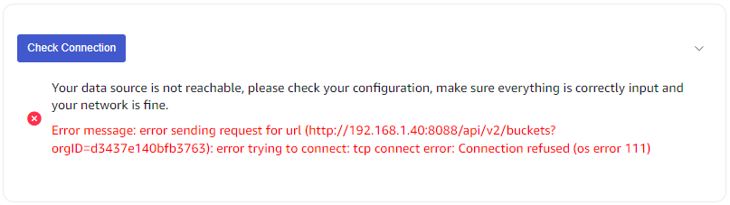
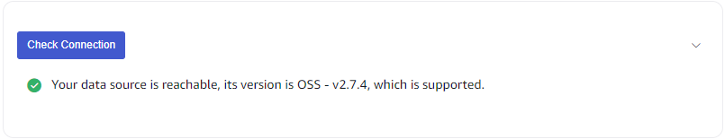
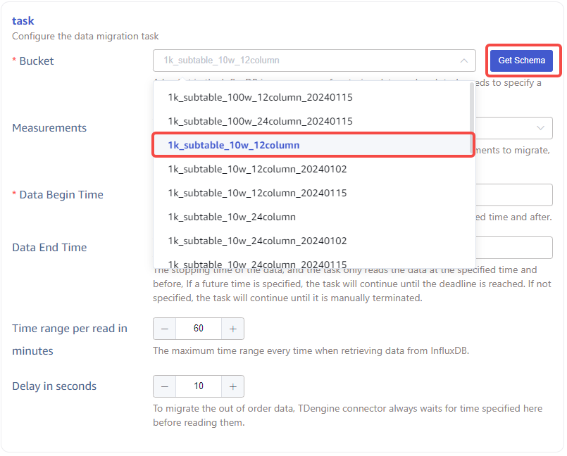
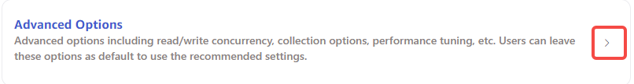
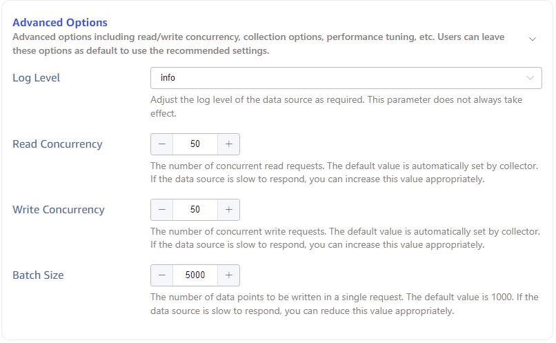

import { AddDataSource, Enterprise } from '../../assets/resources/_resources.mdx';

<Enterprise/>

This section describes how to create a data migration task through the Explorer interface to migrate data from InfluxDB to the current TDengine cluster.

## Feature Overview

InfluxDB is a popular open-source time-series database optimized for handling large volumes of time-series data. TDengine can efficiently read data from InfluxDB through the InfluxDB connector and write it into TDengine, enabling historical data migration or real-time data synchronization.

The task saves progress information to the disk during operation, so if the task is paused and restarted, or if it automatically recovers from an anomaly, it will not start over. For more options, it is recommended to read the explanations of each form field on the task creation page in detail.

## Procedure

### Add a Data Source

<AddDataSource connectorName="InfluxDB"/>

### Configure Connection Information

Fill in the *`connection information for the source InfluxDB database`* in the **Connection Configuration** area, as shown below:

### Configure Authentication Information

In the **Authentication** area, there are two tabs, *`1.x version`* and *`2.x version`*, due to different authentication parameters and significant API differences between different versions of InfluxDB databases. Please choose according to the actual situation:  
  *`1.x version`*  
  **Version** Select the version of the source InfluxDB database from the dropdown menu.  
  **User** Enter the user of the source InfluxDB database, who must have read permissions in that organization.  
  **Password** Enter the login password for the above user in the source InfluxDB database.

   

  *`2.x version`*  
  **Version** Select the version of the source InfluxDB database from the dropdown menu.  
  **Organization ID** Enter the organization ID of the source InfluxDB database, which is a string of hexadecimal characters, not the organization name, and can be obtained from the InfluxDB console's Organization->About page.  
  **Token** Enter the access token for the source InfluxDB database, which must have read permissions in that organization.  
  **Add Database Retention Policy** This is a *`Yes/No`* toggle. InfluxQL requires a combination of database and retention policy (DBRP) to query data. The cloud version of InfluxDB and some 2.x versions require manually adding this mapping. Turn on this switch, and the connector can automatically add it when executing tasks.  

   

Below the **Authentication** area, there is a **Connectivity Check** button. Users can click this button to check if the information filled in above can normally access the data of the source InfluxDB database. The check results are shown below:  

### Configure Task Information

**Bucket** is a named space in the InfluxDB database for storing data. Each task needs to specify a bucket. Users need to first click the **Get Schema** button on the right to obtain the data structure information of the current source InfluxDB database, and then select from the dropdown menu as shown below:

**Measurements** are optional. Users can select one or more Measurements to synchronize from the dropdown menu. If none are specified, all will be synchronized.

**Start Time** refers to the start time of the data in the source InfluxDB database. The timezone for the start time uses the timezone selected in explorer, and this field is required.

**End Time** refers to the end time of the data in the source InfluxDB database. If no end time is specified, synchronization of the latest data will continue; if an end time is specified, synchronization will only continue up to this end time. The timezone for the end time uses the timezone selected in explorer, and this field is optional.

**Time Range per Read (minutes)** is the maximum time range for the connector to read data from the source InfluxDB database in a single read. This is a very important parameter, and users need to decide based on server performance and data storage density. If the range is too small, the execution speed of the synchronization task will be very slow; if the range is too large, it may cause the InfluxDB database system to fail due to high memory usage.

**Delay (seconds)** is an integer between 1 and 30. To eliminate the impact of out-of-order data, TDengine always waits for the duration specified here before reading data.

### Configure Advanced Options

The **Advanced Options** area is collapsed by default. Click the `>` on the right to expand it, as shown below:

### Completion of Creation

Click the **Submit** button to complete the creation of the data synchronization task from InfluxDB to TDengine. Return to the **Data Source List** page to view the status of the task execution.
