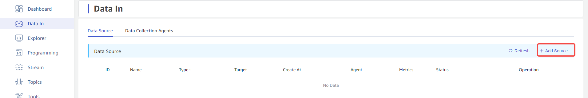

import Enterprise from '../../assets/resources/_enterprise.mdx';

<Enterprise/>

This section describes how to create a data migration task through the Explorer interface to migrate data from OpenTSDB to the current TDengine cluster.

## Overview

OpenTSDB is a real-time monitoring information collection and display platform built on the HBase system. TDengine can efficiently read data from OpenTSDB through the OpenTSDB connector and write it into TDengine, achieving historical data migration or real-time data synchronization.

During the operation, the task will save progress information to the disk, so if the task is paused and restarted, or automatically recovers from an anomaly, it will not start over. For more options, it is recommended to read the explanations of each form field on the task creation page in detail.

## Creating a Task

### 1. Add a Data Source

Click the **+ Add Data Source** button in the upper left corner of the data writing page to enter the add data source page, as shown below:

### 2. Configure Basic Information

Enter the task name in the **Name** field, for example *`test_opentsdb_01`*.

Select *`OpenTSDB`* from the **Type** dropdown menu, as shown below (the fields on the page will change after selection).

**Proxy** is optional. If needed, you can select a specific proxy from the dropdown menu, or click the **+ Create New Proxy** button on the right.

**Target Database** is required. Since OpenTSDB stores data with millisecond precision, you need to select a *`millisecond precision database`*, or click the **+ Create Database** button on the right.

### 3. Configure Connection Information

Fill in the *`connection information for the source OpenTSDB database`* in the **Connection Configuration** area, as shown below:

Below the **Connection Configuration** area, there is a **Connectivity Check** button. Users can click this button to check whether the information filled in above can normally access the data from the source OpenTSDB database. The check results are shown below:  

### 4. Configure Task Information

**Metrics** are the physical quantities in which data is stored in the OpenTSDB database. Users can specify multiple metrics to synchronize, or synchronize all data in the database if none are specified. If users specify metrics, they need to first click the **Get Metrics** button on the right to obtain all the metric information from the current source OpenTSDB database, and then select from the dropdown menu, as shown below:

**Start Time** refers to the start time of the data in the source OpenTSDB database, using the timezone selected in explorer, and this field is required.

**End Time** refers to the end time of the data in the source OpenTSDB database. If no end time is specified, the synchronization of the latest data will continue; if an end time is specified, synchronization will only continue up to this end time, using the timezone selected in explorer, and this field is optional.

**Time Range per Read (minutes)** is the maximum time range for the connector to read data from the source OpenTSDB database in a single operation. This is a very important parameter, and users need to decide based on server performance and data storage density. If the range is too small, the execution speed of the synchronization task will be very slow; if the range is too large, it may cause the OpenTSDB database system to fail due to excessive memory usage.

**Delay (seconds)** is an integer ranging from 1 to 30. To eliminate the impact of out-of-order data, TDengine always waits for the duration specified here before reading the data.

### 5. Configure Advanced Options

The **Advanced Options** area is collapsed by default. Click the `>` on the right to expand it, as shown in the following images:

### 6. Completion of Creation

Click the **Submit** button to complete the creation of the OpenTSDB to TDengine data synchronization task. Return to the **Data Source List** page to view the status of the task.
