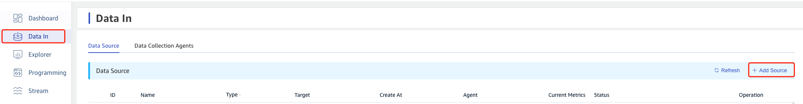
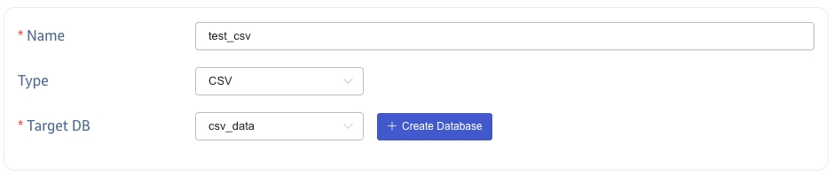
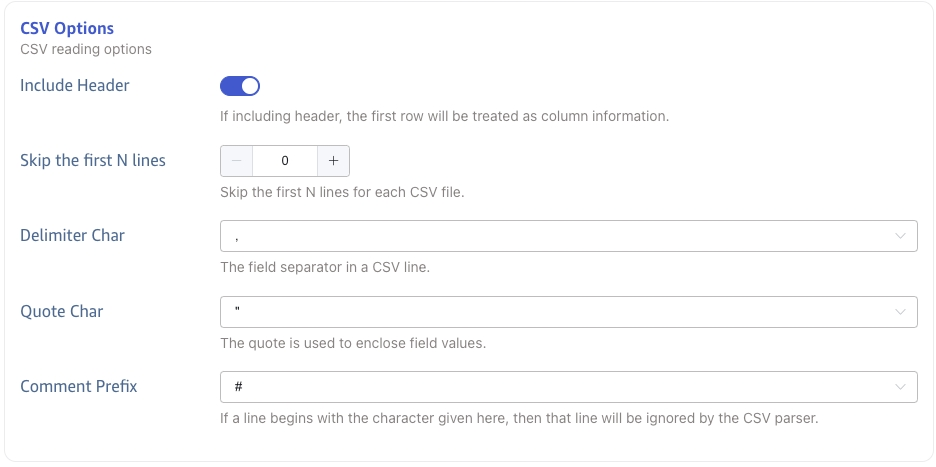
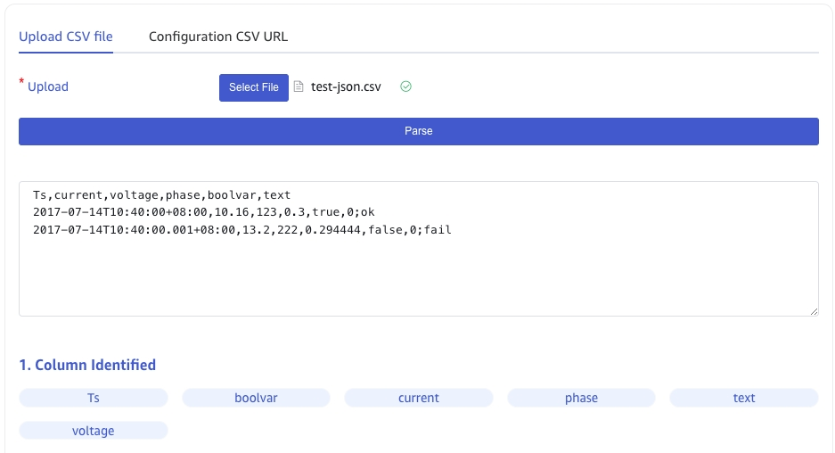
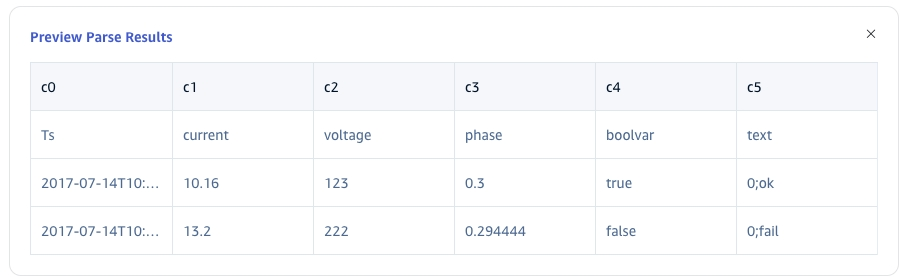
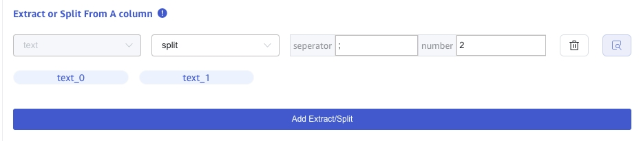
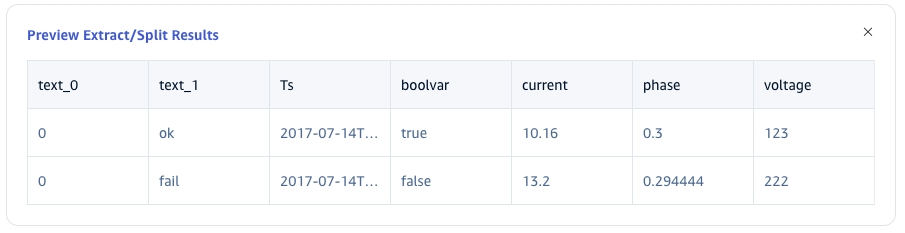
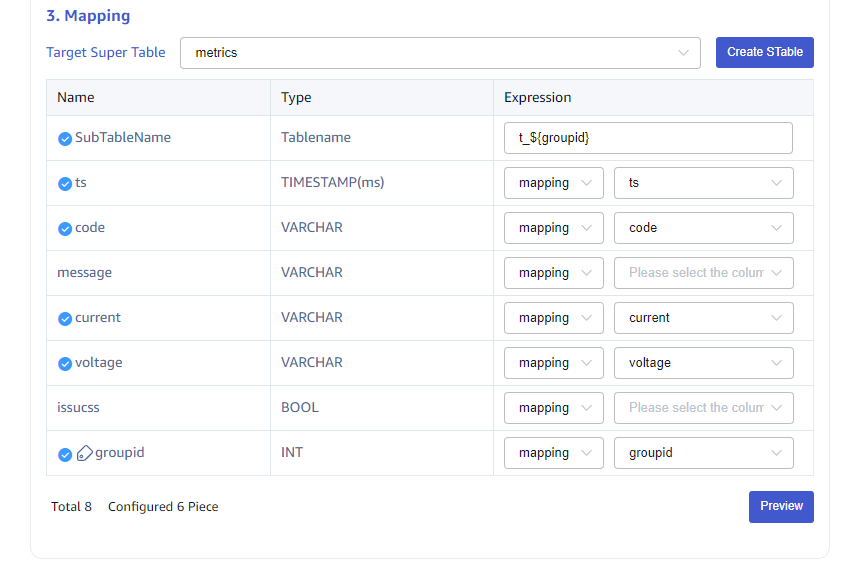
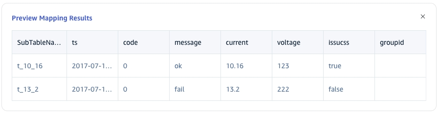

This section explains how to create a data migration task through the Explorer interface to migrate data from CSV to the current TDengine cluster.

## Function Overview

Import one or more CSV files into TDengine.

## Creating a Task

### 1. Add a Data Source

Click the **+Add Data Source** button on the data writing page to enter the Add Data Source page.

### 2. Configure Basic Information

In the **Name** field, enter a task name, such as: "test_csv";

Select **CSV** from the **Type** dropdown list.

In the **Target Database** dropdown list, select a target database, or click the **+Create Database** button on the right.

### 3. Configure CSV Options

In the **Contains Header** section, toggle to enable or disable; if it contains a header, the first row will be treated as column information.

In the **Ignore First N Rows** section, enter N to ignore the first N rows of the CSV file.

In the **Field Separator** section, select the separator between CSV fields; the default is ",".

In the **Field Quotation Character** section, select the character used to surround field content when the CSV field contains separators or newline characters to ensure the entire field is correctly identified; the default is `" "`.

In the **Comment Prefix Character** section, select the character; if any line in the CSV file begins with this character, that line will be ignored; the default is "#".

### 4. Configure CSV File Parsing

Upload the CSV file locally, for example: test-json.csv; this sample CSV file will then be used to configure extraction and filtering conditions.

#### 4.1 Parsing

After clicking **Select File**, choose test-json.csv, then click **Parse** to preview the identified columns.

**Preview Parsing Results**

#### 4.2 Field Splitting

In the **Extract or Split from Columns** section, enter the fields to extract or split from the message body. For example, split the message field into `text_0` and `text_1` using the split extractor; enter `-` as the separator and `2` for the number.

Click **Delete** to remove the current extraction rule.

Click **Add** to add more extraction rules.

Click the **Magnifying Glass Icon** to preview the extraction or splitting results.

<!-- In the **Filtering** section, enter filtering conditions, such as: `id != 1`, so that only data where id is not 1 will be written to TDengine.
Click **Delete** to remove the current filtering rule.

Click the **Magnifying Glass Icon** to preview the filtering results.

 -->

#### 4.3 Table Mapping

In the **Target Supertable** dropdown list, select a target supertable, or click the **Create Supertable** button on the right.

In the **Mapping** section, fill in the subtable name in the target supertable, for example: `t_${groupid}`.

Click **Preview** to see the mapping results.

### 5. Completion

Click the **Submit** button to complete the creation of the CSV to TDengine data synchronization task. Go back to the **Data Sources List** page to view the execution status of the task.
