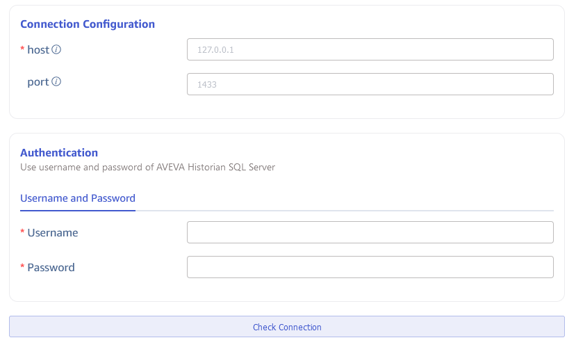
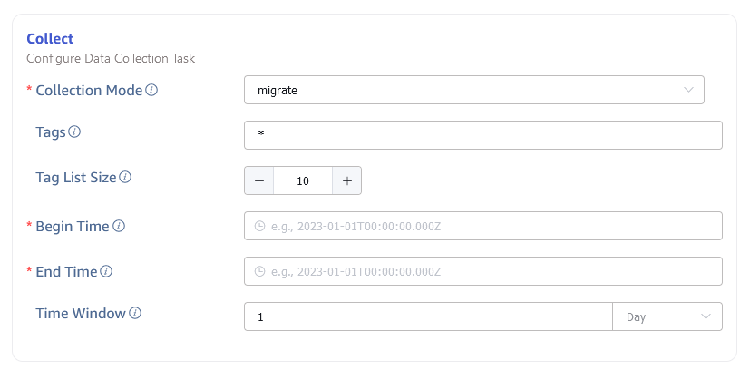
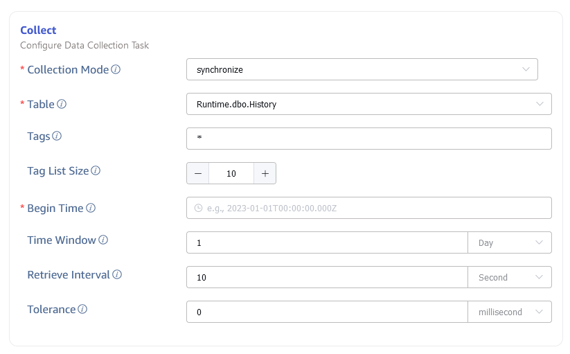
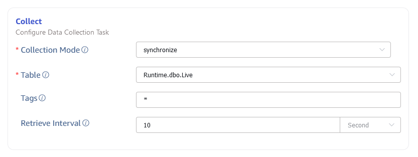
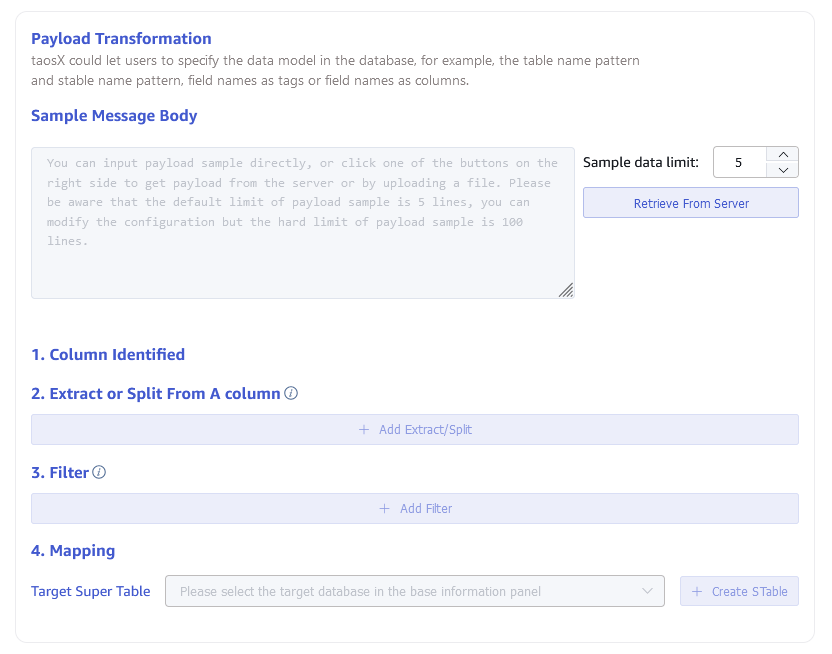
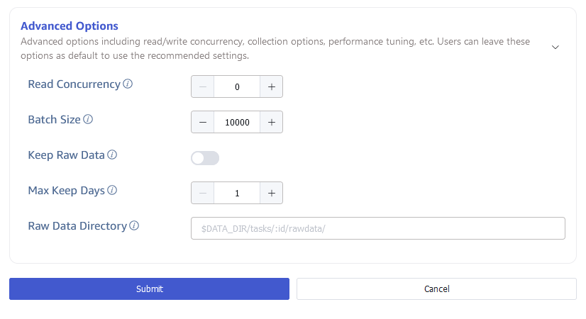

import { AddDataSource, Enterprise } from '../../assets/resources/_resources.mdx';

<Enterprise/>

This section describes how to create data migration/data synchronization tasks through the Explorer interface, migrating/synchronizing data from AVEVA Historian to the current TDengine cluster.

## Feature Overview

AVEVA Historian is an industrial big data analytics software, formerly known as Wonderware. It captures and stores high-fidelity industrial big data, unleashing constrained potential to improve operations.

TDengine can efficiently read data from AVEVA Historian and write it into TDengine, enabling historical data migration or real-time data synchronization.

## Procedure

### Add a Data Source

<AddDataSource connectorName="AVEVA Historian"/>

### Configure Connection Information

In the **Connection Configuration** area, fill in the **Server Address** and **Server Port**.

In the **Authentication** area, fill in the **Username** and **Password**.

Click the **Connectivity Check** button to check if the data source is available.

### Configure Collection Information

Fill in the collection task related configuration parameters in the **Collection Configuration** area.

#### Migrate Data

If you want to perform data migration, configure the following parameters:

Select **migrate** from the **Collection Mode** dropdown list.

In **Tags**, fill in the list of tags to migrate, separated by commas (,).

In **Tag Group Size**, fill in the size of the tag group.

In **Task Start Time**, fill in the start time of the data migration task.

In **Task End Time**, fill in the end time of the data migration task.

In **Query Time Window**, fill in a time interval, the data migration task will divide time windows according to this interval.

#### Synchronize Data from the History Table

If you want to synchronize data from the **Runtime.dbo.History** table to TDengine, configure the following parameters:

Select **synchronize** from the **Collection Mode** dropdown list.

In **Table**, select **Runtime.dbo.History**.

In **Tags**, fill in the list of tags to migrate, separated by commas (,).

In **Tag Group Size**, fill in the size of the tag group.

In **Task Start Time**, fill in the start time of the data migration task.

In **Query Time Window**, fill in a time interval, the historical data part will divide time windows according to this interval.

In **Real-time Synchronization Interval**, fill in a time interval, the real-time data part will poll data according to this interval.

In **Disorder Time Upper Limit**, fill in a time interval, data that enters the database after this time during real-time data synchronization may be lost.

#### Synchronize Data from the Live Table

If you want to synchronize data from the **Runtime.dbo.Live** table to TDengine, configure the following parameters:

Select **synchronize** from the **Collection Mode** dropdown list.

In **Table**, select **Runtime.dbo.Live**.

In **Tags**, fill in the list of tags to migrate, separated by commas (,).

In **Real-time Synchronization Interval**, fill in a time interval, the real-time data part will poll data according to this interval.

### Configure Data Mapping

Fill in the data mapping related configuration parameters in the **Data Mapping** area.

Click the **Retrieve from Server** button to fetch sample data from the AVEVA Historian server.

In **Extract or Split from Column**, fill in the fields to extract or split from the message body, for example: split the `vValue` field into `vValue_0` and `vValue_1`, select the split extractor, fill in the separator as `,`, and number as 2.

In **Filter**, fill in the filtering conditions, for example: enter `Value > 0`, then only data where Value is greater than 0 will be written to TDengine.

In **Mapping**, select the supertable in TDengine to which you want to map, as well as the columns to map to the supertable.

Click **Preview** to view the results of the mapping.

### Configure Advanced Options

Fill in the related configuration parameters in the **Advanced Options** area.

Set the maximum read concurrency in **Maximum Read Concurrency**. Default value: 0, which means auto, automatically configures the concurrency.

Set the batch size for each write in **Batch Size**, that is: the maximum number of messages sent at once.

In **Save Raw Data**, choose whether to save the raw data. Default value: No.

When saving raw data, the following two parameters are effective.

Set the maximum retention days for raw data in **Maximum Retention Days**.

Set the storage path for raw data in **Raw Data Storage Directory**.

### Completion of Creation

Click the **Submit** button to complete the creation of the task. After submitting the task, return to the **Data Writing** page to view the status of the task.
