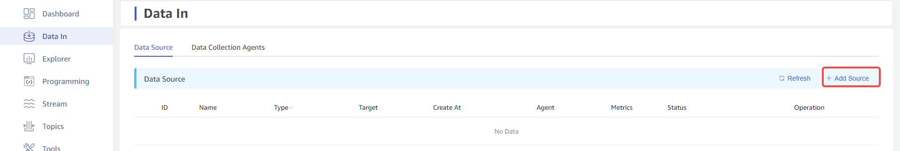
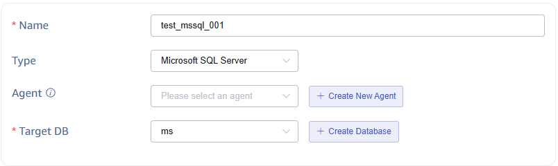
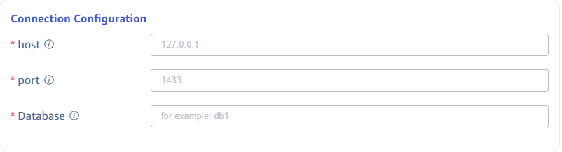
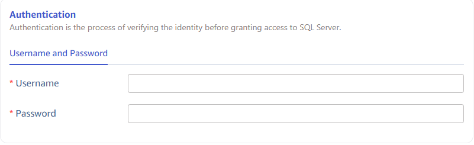
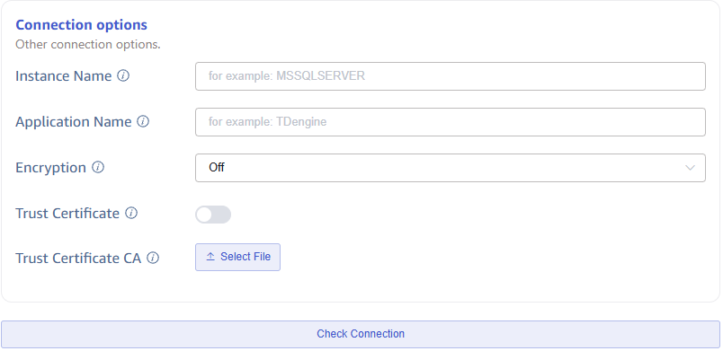
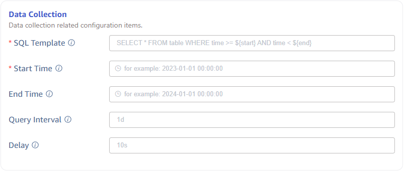
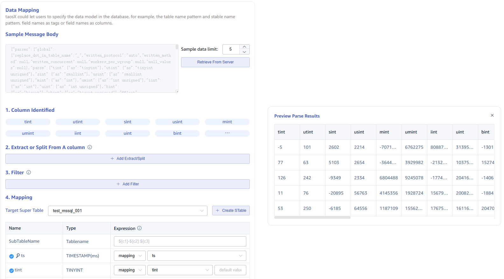
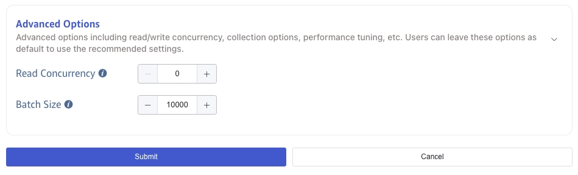

This section explains how to create data migration tasks through the Explorer interface to migrate data from Microsoft SQL Server to the current TDengine cluster.

## Function Overview

Microsoft SQL Server is one of the most popular relational databases. Many systems have used or are currently using Microsoft SQL Server databases to store data reported by IoT and industrial IoT devices. However, as the number of devices connected to the system increases and users' demands for real-time data feedback grow, Microsoft SQL Server can no longer meet business needs. Starting from TDengine Enterprise Edition 3.3.2.0, TDengine can efficiently read data from Microsoft SQL Server and write it to TDengine for historical data migration or real-time data synchronization, addressing the technical challenges faced by businesses.

## Creating a Task

### 1. Add a Data Source

Click the **+Add Data Source** button in the upper left corner of the data writing page to enter the Add Data Source page, as shown below:

### 2. Configure Basic Information

In the **Name** field, enter a task name, such as *`test_mssql_01`*.

Select *`Microsoft SQL Server`* from the **Type** dropdown list, as shown below (the fields on the page will change after selection).

The **Agent** field is optional; if needed, you can select a specified agent from the dropdown or click the **+Create New Agent** button on the right to create a new agent.

The **Target Database** field is required; you can first click the **+Create Database** button on the right to create a new database.

### 3. Configure Connection Information

In the **Connection Configuration** area, fill in the *`source Microsoft SQL Server database connection information`*, as shown below:

### 4. Configure Authentication Information

In the **User** field, enter the user for the source Microsoft SQL Server database; this user must have read permissions in the organization.

In the **Password** field, enter the login password for the user in the source Microsoft SQL Server database.

### 5. Configure Connection Options

In the **Instance Name** field, set the Microsoft SQL Server instance name (the instance name defined in SQL Browser, only available on Windows platforms; if specified, the port will be replaced by the value returned from SQL Browser).

In the **Application Name** field, set the application name used to identify the connecting application.

In the **Encryption** field, set whether to use an encrypted connection. The default value is Off. The options are Off, On, NotSupported, and Required.

In the **Trust Server Certificate** field, set whether to trust the server certificate; if enabled, the server certificate will not be validated and will be accepted as is (if trust is enabled, the **Trust Certificate CA** field below will be hidden).

In the **Trust Certificate CA** field, set whether to trust the server's certificate CA. If a CA file is uploaded, the server certificate will be verified against the provided CA certificate in addition to the system trust store.

Then click the **Check Connectivity** button; users can click this button to check if the information filled in above can successfully retrieve data from the source Microsoft SQL Server database.

### 6. Configure SQL Query

The **Subtable Fields** are used to split the subtable fields. It is a `select distinct` SQL statement that queries unique combinations of specified fields, typically corresponding to tags in the transform section:

This configuration is primarily aimed at solving the problem of data migration disorder and needs to be used in conjunction with the **SQL Template**; otherwise, the expected effect cannot be achieved. Here are usage examples:

1. Fill in the subtable fields with the statement `select distinct col_name1, col_name2 from table`, indicating that the fields col_name1 and col_name2 from the source table will be used to split the subtables of the target supertable.
2. In the **SQL Template**, add placeholders for the subtable fields, such as `${col_name1} and ${col_name2}` in `select * from table where ts >= ${start} and ts < ${end} and ${col_name1} and ${col_name2}`.
3. In the **transform** section, configure the tag mappings for `col_name1` and `col_name2`.

The **SQL Template** is an SQL statement template used for querying. The SQL statement must include time range conditions, and the start and end times must appear in pairs. The time range defined in the SQL statement template consists of a column representing time from the source database and the placeholders defined below.

SQL uses different placeholders to represent different time format requirements, specifically the following placeholder formats:

1. `${start}` and `${end}`: Represent RFC3339 formatted timestamps, e.g., 2024-03-14T08:00:00+0800
2. `${start_no_tz}` and `${end_no_tz}`: Represent RFC3339 strings without timezone: 2024-03-14T08:00:00
3. `${start_date}` and `${end_date}`: Represent only the date; however, only `datetime2` and `datetimeoffset` support using start/end queries, while `datetime` and `smalldatetime` can only use start_no_tz/end_no_tz queries, and `timestamp` cannot be used as a query condition.

To solve the problem of migration data disorder, sorting conditions should be added to the query statement, such as `order by ts asc`.

**Start Time** is the starting time for migrating data; this is a required field.

**End Time** is the end time for migrating data and can be left blank. If set, the migration task will complete automatically when it reaches the end time; if left blank, it will continuously synchronize real-time data, and the task will not automatically stop.

**Query Interval** is the time interval for segmenting queries. The default is 1 day. To avoid querying an excessive amount of data, a sub-task for data synchronization will query data by time segments according to the query interval.

**Delay Duration** is an integer range from 1 to 30; to avoid the loss of delayed written data in real-time synchronization scenarios, each synchronization task will read data before the specified delay duration.

### 7. Configure Data Mapping

In the **Data Mapping** area, fill in the parameters related to data mapping.

Click the **Retrieve from Server** button to get sample data from the Microsoft SQL Server.

In the **Extract or Split from Columns** section, fill in the fields to extract or split from the message body. For example, split the `vValue` field into `vValue_0` and `vValue_1` using the split extractor, specifying `,` as the separator and `2` for the number.

In the **Filtering** section, enter filtering conditions; for example, entering `Value > 0` means that only data where Value is greater than 0 will be written to TDengine.

In the **Mapping** section, select the supertable to map to TDengine and specify the columns to map to the supertable.

Click **Preview** to view the mapping results.

### 8. Configure Advanced Options

The **Advanced Options** area is folded by default; click the `>` button on the right to expand, as shown below:

**Maximum Read Concurrency** limits the number of connections to the data source or the number of reading threads. Modify this parameter when the default parameters do not meet your needs or when you need to adjust resource usage.

**Batch Size** is the maximum number of messages or rows sent at one time. The default is 10,000.

### 9. Completion

Click the **Submit** button to complete the creation of the data synchronization task from Microsoft SQL Server to TDengine. Return to the **Data Source List** page to view the task execution status.
