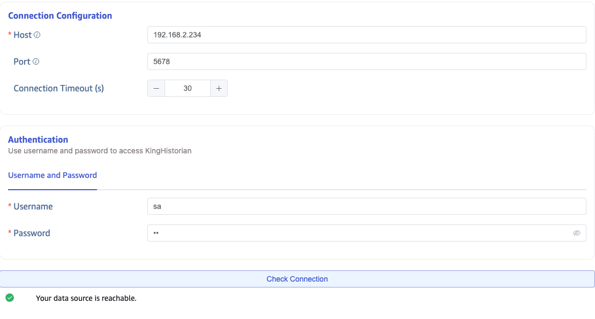
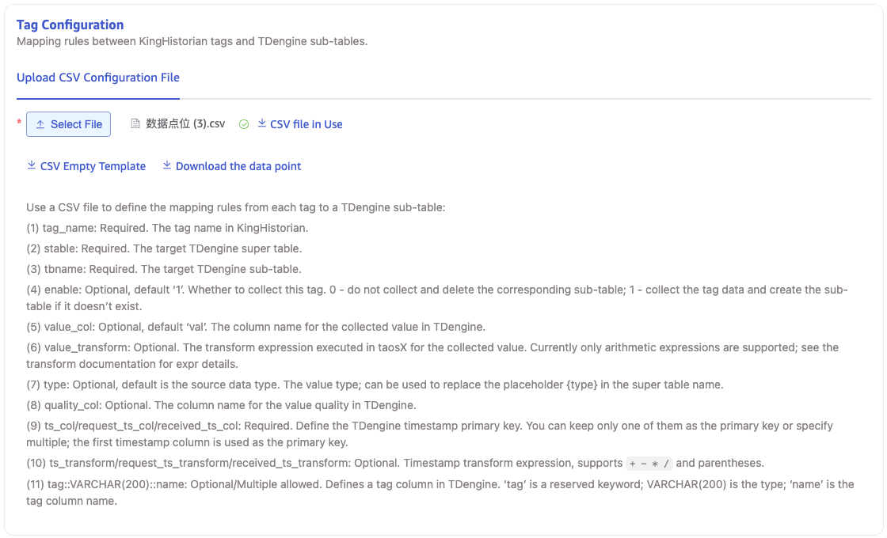
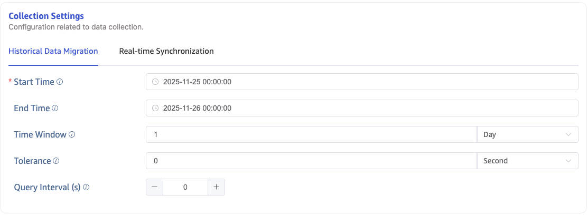
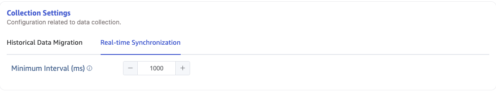

This section describes how to create data migration/data synchronization tasks through the Explorer interface to migrate/synchronize data from KingHistorian to the current TDengine TSDB cluster.

## Function Overview

TDengine TSDB can efficiently read data from KingHistorian and write it into TDengine TSDB to achieve historical data migration or real-time data synchronization.

## Create Task

### 1. Add Data Source

In the data writing page, click the **+Add Data Source** button to enter the Add Data Source page.

### 2. Configure Basic Information

Enter the task name in **Name**, e.g., "test_kinghistorian".

Select **KingHistorian** from the **Type** dropdown list.

**Proxy** is optional. If needed, you can select a specific proxy from the dropdown box or click the **+Create New Proxy** button on the right.

Select a target database from the **Target Database** dropdown list, or click the **+Create Database** button on the right.

### 3. Configure Connection Information

Fill in the **Server Address** and **Server Port** in the **Connection Configuration** area.

Fill in the **Username** and **Password** in the **Authentication** area.

Click the **Connectivity Check** button to check if the data source is available.

### 4. Configure Tags

In the **Upload CSV Configuration File**, click **Download Data Points**, then select the required **Point Group**, **Points**, and **Tags**. This action generates a CSV configuration and downloads it locally.
Modify the generated CSV configuration file as needed and re-upload it.

### 5. Configure Collection Information

Fill in the relevant configuration parameters for the collection task in the **Collection Configuration** area.

#### 5.1. Historical Data Migration

If you want to perform historical data migration, configure the following parameters:

Fill in the start time of the data migration task in **Task Start Time**.

Fill in the end time of the data migration task in **Task End Time**.

Fill in a time interval in **Query Window**. The data migration task will divide the time window according to this interval.

Fill in a time interval in **Out-of-Order**. Each query window will backtrack this interval.

Fill in a time interval in **Query Interval**. There will be a waiting interval between each query window.

#### 5.2. Real-Time Data Synchronization

If you want to perform real-time data synchronization, configure the following parameters:

Fill in a time interval in **Minimum Interval Time**, which is the minimum subscription interval time.

### 6. Configure Advanced Options

Configure any additional settings in the **Advanced Options** area as needed.

### 7. Completion

Click the **Submit** button to complete the task creation. After submitting the task, return to the **Data Writing** page to view the task status.
