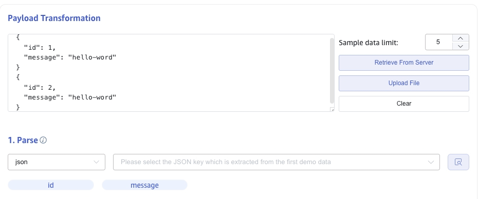
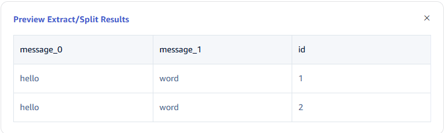
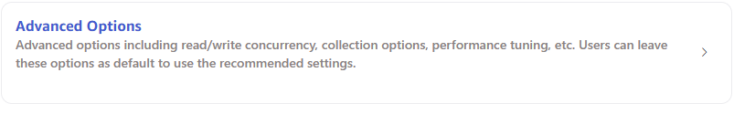
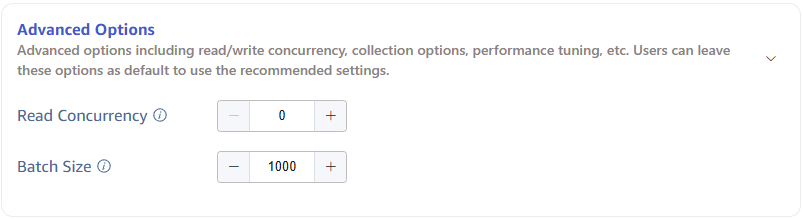

import Enterprise from '../../assets/resources/_enterprise.mdx';

<Enterprise/>

This section describes how to create a data migration task through the Explorer interface to migrate data from Pulsar to the current TDengine TSDB cluster.

## Feature Overview

Apache Pulsar is a cloud-native open-source distributed messaging and stream processing platform.

TDengine TSDB can efficiently read data from Pulsar and write it to TDengine TSDB to achieve historical data migration or real-time data ingestion.

## Creating a Task

### 1. Add a Data Source

In the data writing page, click the **+ Add Data Source** button to enter the add data source page.


### 2. Configure Basic Information

Enter the task name in **Name**, such as: "test_pulsar";

Select **Pulsar** in the **Type** dropdown list.

**Agent** is optional. If needed, you can select a specific agent in the dropdown box, or click the **+ Create New Agent** button on the right.

Select a target database in the **Target Database** dropdown list, or click the **+ Create Database** button on the right.


### 3. Configure Connection Information

**Broker Server**, for example: `192.168.2.131:6650`.

Only one valid broker server address needs to be filled in.


### 4. Authentication Mechanism

If the server has enabled authentication mechanisms, authentication information needs to be filled in here. Currently, four authentication mechanisms are supported: Basic Auth/JWT/mTLS/Custom Authentication. Please select according to the actual situation.

If authentication is not required, leave the authentication fields blank.

#### 4.1. Basic Auth Authentication

Select the `Basic-Auth` authentication mechanism and enter the username and password:


#### 4.2. JWT Authentication

Select the `JWT` authentication mechanism and enter the JWT token information:


#### 4.3. Configure mTLS Certificate Authentication

If the server has enabled mTLS encrypted authentication, you need to enable mTLS here and configure the relevant content.


#### 4.4. Custom Authentication

Select `Custom Authentication` and enter the custom authentication information provided by the server:


### 5. Configure Collection Information

Fill in the configuration parameters related to the collection task in the **Collection Configuration** area.

Fill in the timeout time in **Timeout**. When no data can be consumed from Pulsar for more than the timeout period, the data collection task will exit. The default value is 0 ms. When timeout is set to 0, it will wait indefinitely until data is available or an error occurs.

Fill in the Topic name to be consumed in **Topic**. Multiple Topics can be configured, separated by commas. For example: `persistent://public/default/tp1,persistent://public/default/tp2`.

Fill in the consumer identifier in **Consumer Name**. After filling, a consumer ID with the `taosx` prefix will be generated. If the switch at the end is turned on, the current task ID will be appended after `taosx` and before the input identifier.

Fill in the subscription name identifier in **Subscription Name**. After filling, a subscription ID with the `taosx` prefix will be generated. If the switch at the end is turned on, the current task ID will be appended after `taosx` and before the input identifier.

Select the position from which to start consuming data in the **Initial Position** dropdown list. There are two options: `Earliest`, `Latest`. The default value is Earliest.

- Earliest: Used to request the earliest position.
- Latest: Used to request the latest position.

In **Character Encoding**, configure the message body encoding format. When taosX receives a message, it uses the corresponding encoding format to decode the message body to obtain the original data. Options include UTF_8, GBK, GB18030, BIG5, with UTF_8 as the default.

Click the **Connectivity Check** button to check if the data source is available.


### 6. Configure Payload Parsing

Fill in the configuration parameters related to Payload parsing in the **Payload Parsing** area.

#### 6.1 Parsing

There are three methods to obtain sample data:

Click the **Retrieve from Server** button to get sample data from Pulsar.

Click the **File Upload** button to upload a CSV file and obtain sample data.

Enter sample data from the Pulsar message body in **Message Body**.

JSON data supports JSONObject or JSONArray, and the following data can be parsed using a JSON parser:

```json
{"id": 1, "message": "hello-world"}
{"id": 2, "message": "hello-world"}
```

or

```json
[{"id": 1, "message": "hello-world"},{"id": 2, "message": "hello-world"}]
```

The parsing results are shown as follows:



Click the **magnifying glass icon** to view the preview parsing results.


#### 6.2 Field Splitting

In **Extract or Split from Columns**, fill in the fields to extract or split from the message body, for example: split the message field into `message_0` and `message_1`, select the split extractor, fill in the separator as -, and number as 2.

Click **Add** to add more extraction rules.

Click **Delete** to delete the current extraction rule.


Click the **magnifying glass icon** to view the preview extraction/splitting results.


#### 6.3 Data Filtering

In **Filter**, fill in the filtering conditions, for example: enter `id != 1`, then only data with id not equal to 1 will be written to TDengine.

Click **Add** to add more filtering rules.

Click **Delete** to delete the current filtering rule.


Click the **magnifying glass icon** to view the preview filtering results.



#### 6.4 Table Mapping

In the **Target Supertable** dropdown, select a target supertable, or click the **Create Supertable** button on the right.

In the **Mapping** section, fill in the name of the subtable in the target supertable, for example: `t_{id}`. Fill in the mapping rules as required, where mapping supports setting default values.


Click **Preview** to view the results of the mapping.


### 7. Configure Advanced Options

The **Advanced Options** area is collapsed by default, click the `>` on the right to expand it, as shown below:





### 8. Completion of Creation

Click the **Submit** button to complete the creation of the Pulsar to TDengine data synchronization task. Return to the **Data Source List** page to view the status of the task execution.
