import Enterprise from '../../assets/resources/_enterprise.mdx';

<Enterprise/>

This section describes how to create a data migration task through the Explorer interface to migrate data from Pulsar-Tuya cluster to the current TDengine TSDB cluster.

## Feature Overview

Apache Pulsar is a cloud-native open-source distributed messaging and stream processing platform. Pulsar-Tuya is a cluster customized by Tuya based on the open-source Apache Pulsar.

TDengine TSDB can efficiently read data from Pulsar-Tuya and write it to TDengine TSDB to achieve historical data migration or real-time data ingestion.

## Creating a Task

### 1. Add a Data Source

In the data writing page, click the **+ Add Data Source** button to enter the add data source page.

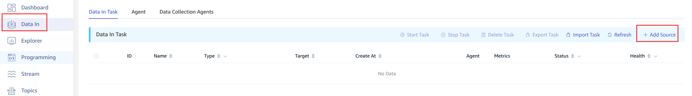

### 2. Configure Basic Information

Enter the task name in **Name**, such as: "test_tuya";

Select **Pulsar-Tuya** in the **Type** dropdown list.

**Agent** is optional. If needed, you can select a specific agent in the dropdown box, or click the **+ Create New Agent** button on the right.

Select a target database in the **Target Database** dropdown list, or click the **+ Create Database** button on the right.

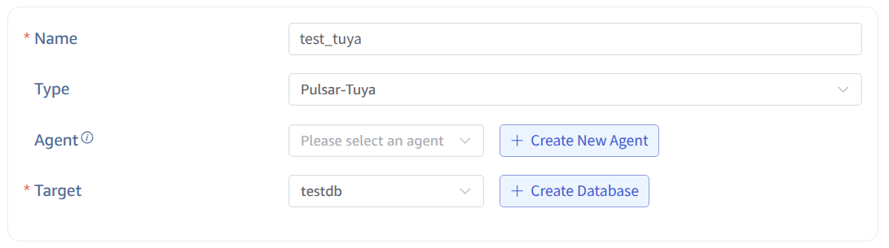

### 3. Configure Connection Information

**Broker Server**, for example: `mqe.tuyaus.com:6650`.

Only one valid broker server address needs to be filled in.

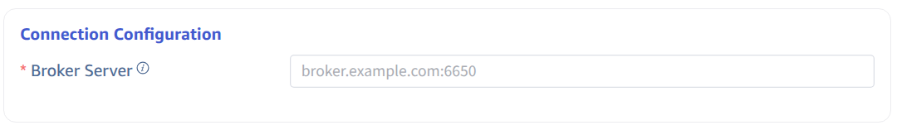

### 4. Authentication Mechanism

Here you need Tuya platform-specific authentication information. Fill in the Access Id and Access Key provided by the platform and select the corresponding execution environment.

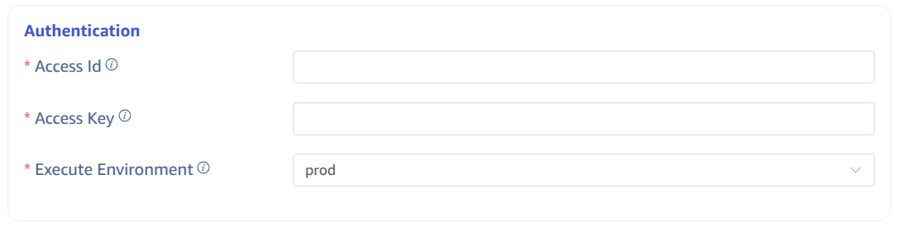

### 5. Configure Collection Information

Fill in the configuration parameters related to the collection task in the **Collection Configuration** area. The topics, consumer names, and subscription names required by Pulsar will be automatically generated based on the Access Id and Access Key provided by the Tuya platform. You only need to configure the following information:

Fill in the timeout time in **Timeout**. When no data can be consumed from Pulsar for more than the timeout period, the data collection task will exit. The default value is 0 ms. When timeout is set to 0, it will wait indefinitely until data is available or an error occurs.

Select the position from which to start consuming data in the **Initial Position** dropdown list. There are two options: `Earliest`, `Latest`. The default value is Earliest.

- Earliest: Used to request the earliest position.
- Latest: Used to request the latest position.

In **Character Encoding**, configure the message body encoding format. When taosX receives a message, it uses the corresponding encoding format to decode the message body to obtain the original data. Options include UTF_8, GBK, GB18030, BIG5, with UTF_8 as the default.

Click the **Connectivity Check** button to check if the data source is available.

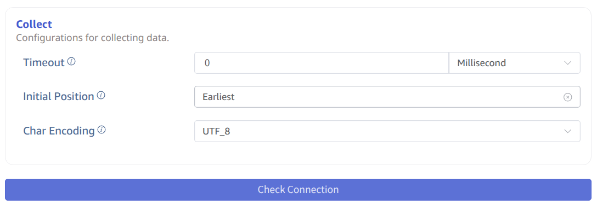

### 6. Configure Payload Parsing

Fill in the configuration parameters related to Payload parsing in the **Payload Parsing** area.

#### 6.1 Parsing

There are three methods to obtain sample data:

Click the **Retrieve from Server** button to get sample data from Pulsar-Tuya.

Click the **File Upload** button to upload a CSV file and obtain sample data.

Enter sample data from the Pulsar message body in **Message Body**.

JSON data supports JSONObject or JSONArray, and the following data can be parsed using a JSON parser:

```json
{"id": 1, "message": "hello-world"}
{"id": 2, "message": "hello-world"}
```

or

```json
[{"id": 1, "message": "hello-world"},{"id": 2, "message": "hello-world"}]
```

The parsing results are shown as follows:

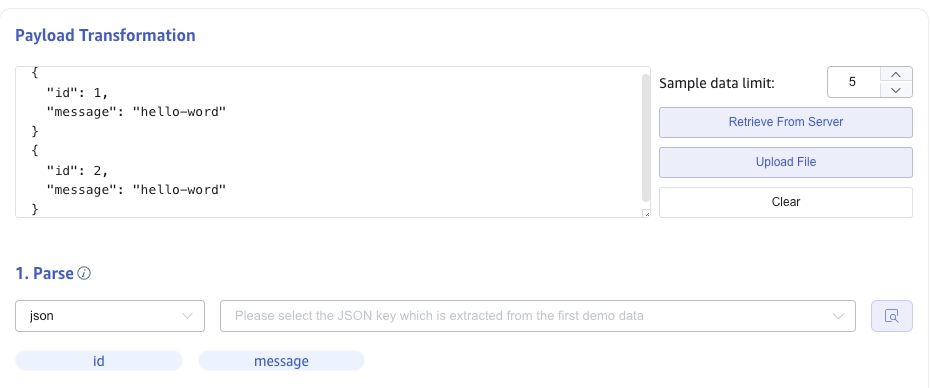

Click the **magnifying glass icon** to view the preview parsing results.

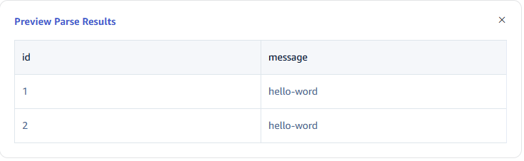

#### 6.2 Field Splitting

In **Extract or Split from Columns**, fill in the fields to extract or split from the message body, for example: split the message field into `message_0` and `message_1`, select the split extractor, fill in the separator as -, and number as 2.

Click **Add** to add more extraction rules.

Click **Delete** to delete the current extraction rule.

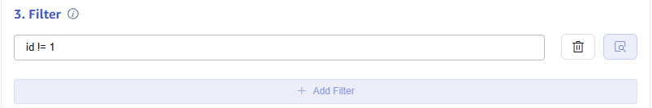

Click the **magnifying glass icon** to view the preview extraction/splitting results.

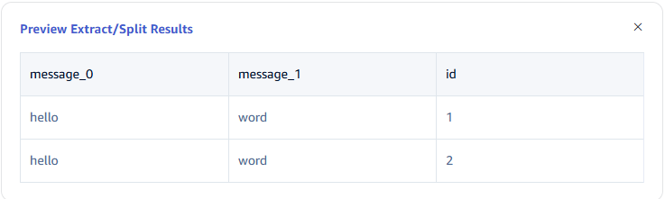

#### 6.3 Data Filtering

In **Filter**, fill in the filtering conditions, for example: enter `id != 1`, then only data with id not equal to 1 will be written to TDengine.

Click **Add** to add more filtering rules.

Click **Delete** to delete the current filtering rule.


Click the **magnifying glass icon** to view the preview filtering results.


#### 6.4 Table Mapping

In the **Target Supertable** dropdown, select a target supertable, or click the **Create Supertable** button on the right.

In the **Mapping** section, fill in the name of the subtable in the target supertable, for example: `t_{id}`. Fill in the mapping rules as required, where mapping supports setting default values.

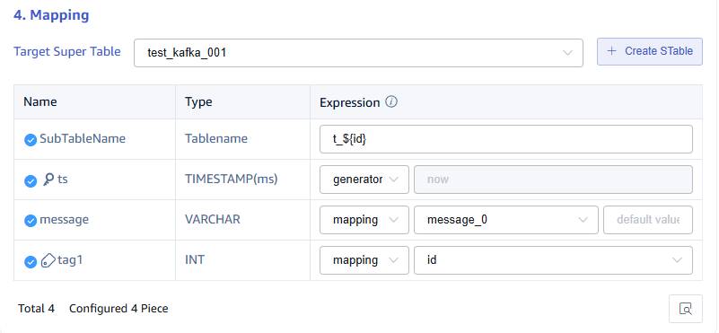

Click **Preview** to view the results of the mapping.

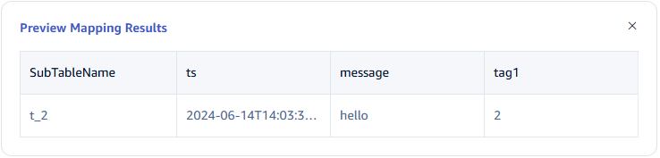

### 7. Configure Advanced Options

The **Advanced Options** area is collapsed by default, click the `>` on the right to expand it, as shown below:

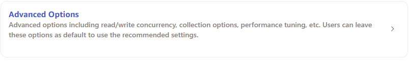

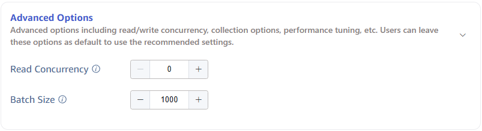

### 8. Completion of Creation

Click the **Submit** button to complete the creation of the Pulsar-Tuya to TDengine data synchronization task. Return to the **Data Source List** page to view the status of the task execution.
