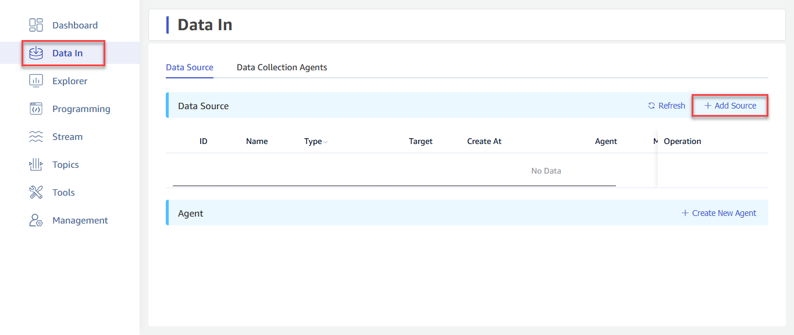
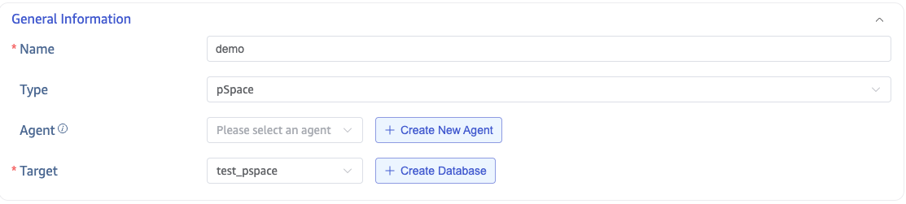
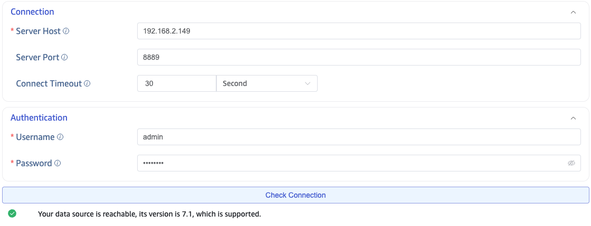
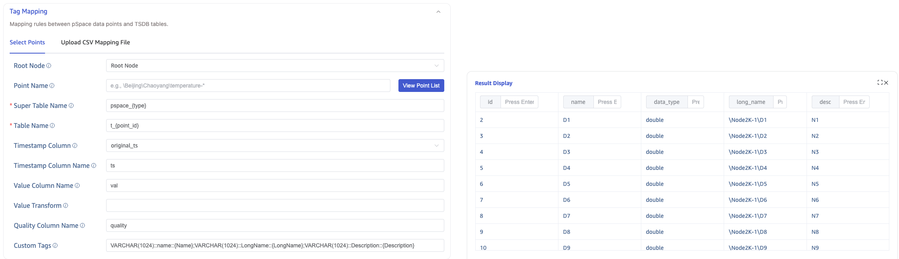
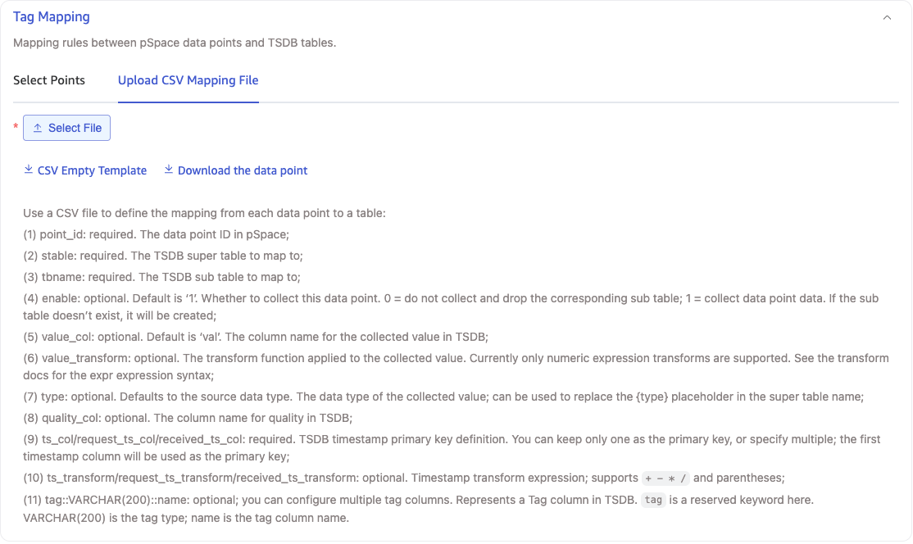
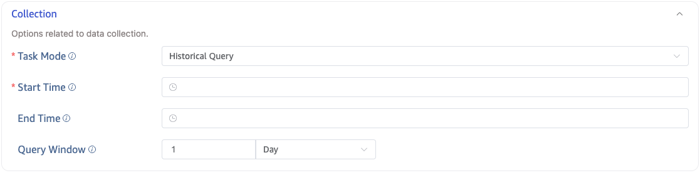
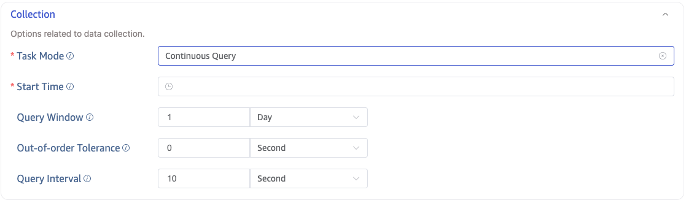

This section describes how to create data migration/data synchronization tasks through the Explorer UI to migrate/synchronize data from pSpace to the current TDengine TSDB cluster.

## Feature Overview

TDengine TSDB can efficiently read data from pSpace and write it to TDengine TSDB for historical data migration or real-time data synchronization.

## Create a Task

### 1. Add a New Data Source

On the Data In page, click **+ Add Data Source** to enter the Add Data Source page.

### 2. Configure Basic Information

In **Name**, enter a task name, for example: "test_pspace".

In the **Type** drop-down list, select **pSpace**.

**Proxy** is optional. If needed, select a proxy from the drop-down list, or click **+ Create New Proxy** on the right first.

In the **Target Database** drop-down list, select a target database, or click **+ Create Database** on the right first.

### 3. Configure Connection and Authentication Information

In the **Connection Configuration** section, fill in **Server Address** and **Server Port**.

In the **Authentication** section, fill in **Username** and **Password**.

Click **Connectivity Check** to verify whether the data source is available.

### 4. Configure Data Points

#### 4.1. Select Data Points

In **Data Points**, configure the following items:

1. **Root Node (root)**: The root node to start traversal from. Enter the LongName of the root node. For example: `\Beijing\Chaoyang\Wangjing` means traversal starts from `\Beijing\Chaoyang\Wangjing` and proceeds downward. By default, traversal starts from the root node.
2. **Data Point Name (point_name_pattern)**: Supports filtering by the LongName of data points. For example: `\Beijing\Chaoyang\Wangjing\temperature-*` means all data points under `\Beijing\Chaoyang\Wangjing` whose names start with "temperature-".
3. **Super Table Name (super_table_expression)**: Specifies the super table name for writing data points. Supports the `{type}` placeholder. Example: `pspace_{type}`.
4. **Table Name (child_table_expression)**: Specifies the subtable name for writing data points. Supports the `{point_id}` placeholder. Example: `t_{point_id}`.
5. **Timestamp Column (table_primary_key)**: Selects the source of the primary timestamp in the target table. Available values are `original_ts`, `request_ts`, and `received_ts`.
6. **Timestamp Column Name (table_primary_key_alias)**: Specifies the timestamp column name in the target table. Default is `ts`.
7. **Value Column Name (value_col)**: Specifies the column name for collected values in the target table. Default is `val`.
8. **Value Transform (value_transform)**: Applies an expression transform to values before writing. Example: `(val-32)/1.8`.
9. **Quality Column Name (quality_col)**: Specifies the data quality column name in the target table. Default is `quality`.
10. **Custom Tags (custom_tags)**: Configures tag mappings written to subtables. Supports static values and dynamic extraction from point attributes (for example, `{LongName}`).

After configuring **Root Node** and **Data Point Name**, click **View Data Point List** to view matching data points, then continue configuring the remaining mapping rules.

#### 4.2. Upload CSV Configuration File

In **Upload CSV Configuration File**, click **Download Data Points**, select the required **Root Node** and **Data Point Name**, and a CSV configuration file will be generated and downloaded locally. Modify the generated CSV file as needed and upload it again.

### 5. Configure Collection

In the **Collection Configuration** section, fill in collection-related parameters.

pSpace supports three collection modes: Historical Query, Real-time Subscription, and Query Sync.

- Historical Query: Batch query historical data within a time range. The task ends after the query completes.
- Real-time Subscription: Subscribes to real-time changes of data points and keeps running until canceled.
- Query Sync: Completes historical data migration first, then continuously polls new data at a fixed interval.

#### 5.1. Historical Query

Select **Historical Query** mode and configure: Start Time, End Time, and Query Window.

#### 5.2. Real-time Subscription

Select **Real-time Subscription** mode. No additional parameters are required.

#### 5.3. Query Sync

Select **Query Sync** mode and configure: Start Time, Query Window, Out-of-order Tolerance, and Query Interval.

### 6. Configure Advanced Options

In the **Advanced Options** section, configure other parameters as needed.

### 7. Complete Creation

Click **Submit** to complete task creation. After submitting, return to the **Data In** page to view the task status.
