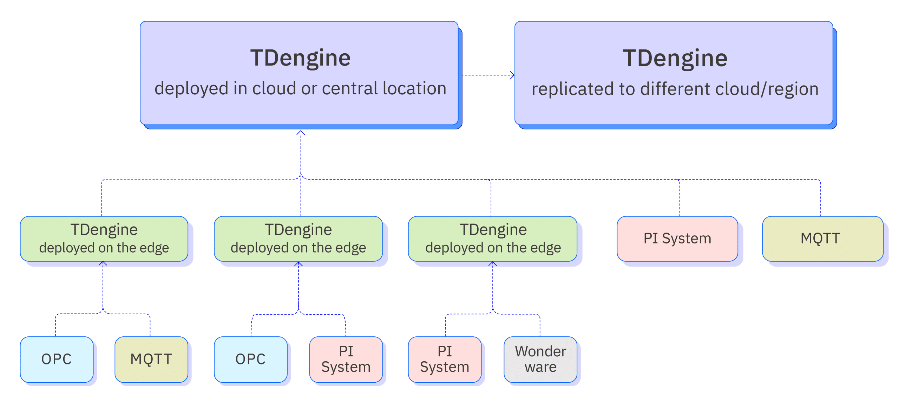
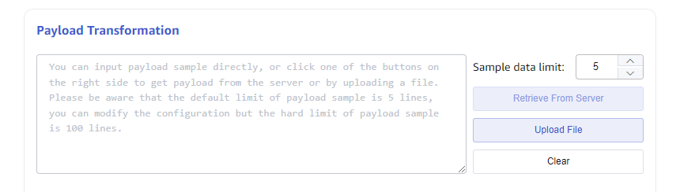
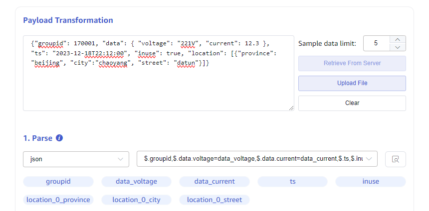
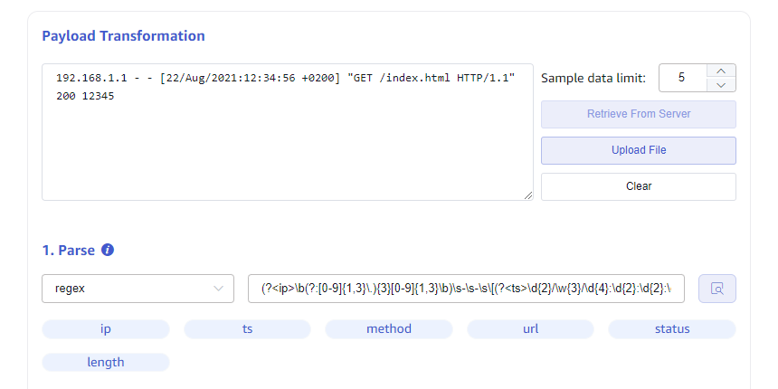
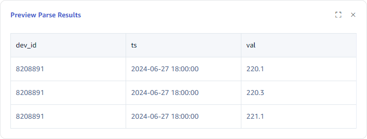
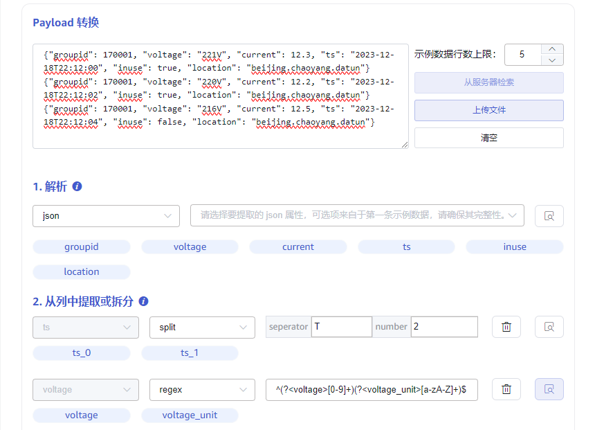

## Overview

TDengine Enterprise is equipped with a powerful visual data management tool—taosExplorer. With taosExplorer, users can easily configure tasks in their browsers to seamlessly import data from various sources into TDengine with zero code. During the import process, TDengine automatically extracts, filters, and transforms data to ensure its quality. This zero-code data source access approach has successfully transformed TDengine into an outstanding time-series big data aggregation platform. Users do not need to deploy additional ETL tools, significantly simplifying the overall architecture design and improving data processing efficiency.

The following figure illustrates the system architecture of the zero-code access platform.



## Supported Data Sources

Currently, TDengine supports the following data sources:

1. Aveva PI System: An industrial data management and analysis platform, formerly known as OSIsoft PI System, which can collect, integrate, analyze, and visualize industrial data in real-time, helping enterprises achieve intelligent decision-making and refined management.
2. Aveva Historian: An industrial big data analysis software, formerly known as Wonderware Historian, designed for industrial environments to store, manage, and analyze real-time and historical data from various industrial devices and sensors.
3. OPC DA/UA: OPC stands for Open Platform Communications, an open and standardized communication protocol used for data exchange between automation devices from different vendors. It was initially developed by Microsoft to address interoperability issues among different devices in the industrial control field. The OPC protocol was first released in 1996 as OPC DA (Data Access), primarily for real-time data collection and control. In 2006, the OPC Foundation released the OPC UA (Unified Architecture) standard, a service-oriented, object-oriented protocol with greater flexibility and scalability, which has become the mainstream version of the OPC protocol.
4. MQTT: Short for Message Queuing Telemetry Transport, a lightweight communication protocol based on a publish/subscribe model, designed for low-overhead, low-bandwidth instant messaging, widely used in IoT, small devices, mobile applications, and other fields.
5. Kafka: An open-source stream processing platform developed by the Apache Software Foundation, primarily used for processing real-time data and providing a unified, high-throughput, low-latency messaging system. It features high speed, scalability, persistence, and a distributed design, allowing it to handle hundreds of thousands of read and write operations per second, supporting thousands of clients while maintaining data reliability and availability.
6. OpenTSDB: A distributed and scalable time-series database based on HBase. It is mainly used to store, index, and provide metrics data collected from large-scale clusters (including network devices, operating systems, applications, etc.), making it easier to access and visualize this data.
7. CSV: Short for Comma Separated Values, a plain text file format that uses commas to separate values, typically used in spreadsheet or database software.
8. TDengine 2: Refers to instances of TDengine running version 2.x.
9. TDengine 3: Refers to instances of TDengine running version 3.x.
10. Relational databases such as MySQL, PostgreSQL, and Oracle.

## Data Extraction, Filtering, and Transformation

Since there can be multiple data sources, the physical units, naming conventions, and time zones may vary. To address this issue, TDengine has built-in ETL capabilities to parse and extract the necessary data from data packets and perform filtering and transformation to ensure the quality of the written data and provide a unified naming space. The specific functionalities are as follows:

1. Parsing: Use JSON Path or regular expressions to parse fields from raw messages.
2. Extracting or Splitting from Columns: Use split or regular expressions to extract multiple fields from a raw field.
3. Filtering: Only messages with a true expression value will be written to TDengine.
4. Transformation: Establish a conversion and mapping relationship between the parsed fields and TDengine supertable fields.

Below are detailed explanations of the data transformation rules.

### Parsing

This step is only required for unstructured data sources. Currently, MQTT and Kafka data sources use the provided rules to parse unstructured data and initially obtain structured data that can be represented as row and column data described by fields. In the explorer, you need to provide sample data and parsing rules to preview the structured data presented in a table format.

#### Sample Data



As shown in the figure, the textarea input box contains the sample data, which can be obtained in three ways:

1. Directly inputting sample data into the textarea.
2. Clicking the button on the right "Retrieve from Server" retrieves sample data from the configured server and appends it to the sample data textarea.
3. Uploading a file to append its content to the sample data textarea.

Each sample data entry ends with a newline character.

#### Parsing

Parsing involves converting unstructured strings into structured data through parsing rules. The current parsing rules for message bodies support JSON, Regex, and UDT.

##### JSON Parsing

JSON parsing supports JSONObject or JSONArray. The following JSON sample data can automatically parse the fields: `groupid`, `voltage`, `current`, `ts`, `inuse`, `location`.

```json
{"groupid": 170001, "voltage": "221V", "current": 12.3, "ts": "2023-12-18T22:12:00", "inuse": true, "location": "beijing.chaoyang.datun"}
{"groupid": 170001, "voltage": "220V", "current": 12.2, "ts": "2023-12-18T22:12:02", "inuse": true, "location": "beijing.chaoyang.datun"}
{"groupid": 170001, "voltage": "216V", "current": 12.5, "ts": "2023-12-18T22:12:04", "inuse": false, "location": "beijing.chaoyang.datun"}
```

Or

```json
[{"groupid": 170001, "voltage": "221V", "current": 12.3, "ts": "2023-12-18T22:12:00", "inuse": true, "location": "beijing.chaoyang.datun"},
{"groupid": 170001, "voltage": "220V", "current": 12.2, "ts": "2023-12-18T22:12:02", "inuse": true, "location": "beijing.chaoyang.datun"},
{"groupid": 170001, "voltage": "216V", "current": 12.5, "ts": "2023-12-18T22:12:04", "inuse": false, "location": "beijing.chaoyang.datun"}]
```

Subsequent examples will illustrate with JSONObject as an example.

The following nested JSON structure can automatically parse the fields `groupid`, `data_voltage`, `data_current`, `ts`, `inuse`, `location_0_province`, `location_0_city`, `location_0_datun`, and you can also choose which fields to parse and set aliases.

```json
{"groupid": 170001, "data": { "voltage": "221V", "current": 12.3 }, "ts": "2023-12-18T22:12:00", "inuse": true, "location": [{"province": "beijing", "city":"chaoyang", "street": "datun"}]}
```



##### Regex Regular Expression

You can use **named capture groups** in regular expressions to extract multiple fields from any string (text) field. As shown in the figure, this extracts the access IP, timestamp, and accessed URL from the nginx log.

```re
(?<ip>\b(?:[0-9]{1,3}\.){3}[0-9]{1,3}\b)\s-\s-\s\[(?<ts>\d{2}/\w{3}/\d{4}:\d{2}:\d{2}:\d{2}\s\+\d{4})\]\s"(?<method>[A-Z]+)\s(?<url>[^\s"]+).*(?<status>\d{3})\s(?<length>\d+)
```



##### UDT Custom Parsing Script

Custom Rhai syntax scripts can be used to parse input data (refer to `https://rhai.rs/book/`). The script currently only supports raw JSON data.

**Input**: The script can use the parameter data, which is the Object Map after parsing the raw JSON data.

**Output**: The output data must be an array.

For example, for data reporting three-phase voltage values, which are to be entered into three subtables, parsing is required.

```json
{
    "ts": "2024-06-27 18:00:00", 
    "voltage": "220.1,220.3,221.1", 
    "dev_id": "8208891"
}
```

You can use the following script to extract the three voltage data.

```rhai
let v3 = data["voltage"].split(",");

[
#{"ts": data["ts"], "val": v3[0], "dev_id": data["dev_id"]},
#{"ts": data["ts"], "val": v3[1], "dev_id": data["dev_id"]},
#{"ts": data["ts"], "val": v3[2], "dev_id": data["dev_id"]}
]
```

The final parsed result is as follows:



### Extracting or Splitting

The parsed data may not meet the requirements of the target table. For instance, the raw data collected from the smart meter is as follows (in JSON format):

```json
{"groupid": 170001, "voltage": "221V", "current": 12.3, "ts": "2023-12-18T22:12:00", "inuse": true, "location": "beijing.chaoyang.datun"}
{"groupid": 170001, "voltage": "220V", "current": 12.2, "ts": "2023-12-18T22:12:02", "inuse": true, "location": "beijing.chaoyang.datun"}
{"groupid": 170001, "voltage": "216V", "current": 12.5, "ts": "2023-12-18T22:12:04", "inuse": false, "location": "beijing.chaoyang.datun"}
```

The voltage parsed using the JSON rules is expressed as a string with units. Ultimately, it is hoped to store the voltage and current values as integers for statistical analysis, which requires further splitting of the voltage; in addition, the date is expected to be split into date and time for storage.

As shown in the figure, you can use the split rule on the source field `ts` to split it into date and time, and use regex to extract the voltage value and unit from the `voltage` field. The split rule requires setting the **delimiter** and **number of splits**, and the naming convention for the split fields is `{original_field_name}_{order_number}`, while the Regex rule is the same as in the parsing process, using **named capture groups** to name the extracted fields.



### Filtering

The filtering function allows you to set filtering conditions so that only rows of data meeting the conditions will be written to the target table. The result of the filtering condition expression must be of boolean type. Before writing filtering conditions, you must determine the type of the parsed fields, and based on the type, you can use judgment functions and comparison operators (`>`, `>=`, `<=`, `<`, `==`, `!=`) for judgment.

#### Field Types and Conversion

Only by clearly defining the type of each parsed field can you use the correct syntax for data filtering.

Fields parsed using JSON rules automatically set types based on their attribute values:

1. bool type: `"inuse": true`
2. int type: `"voltage": 220`
3. float type: `"current" : 12.2`
4. String type: `"location": "MX001"`

Data parsed using regex rules are all of string type.
Data extracted or split using split and regex rules are of string type.

If the extracted data type does not match the expected type, you can perform type conversion. Common type conversions involve converting strings to numeric types. The supported conversion functions are as follows:

|Function|From type|To type|e.g.|
|:----|:----|:----|:----|
| parse_int  | string | int | parse_int("56")  // Resulting integer 56 |
| parse_float  | string | float | parse_float("12.3")  // Resulting float 12.3 |

#### Judgment Expressions

Different data types have their respective ways of writing judgment expressions.

##### BOOL Type

You can use variables or the operator `!`. For example, for the field `"inuse": true`, you can write the following expressions:

> 1. inuse
> 2. !inuse

##### Numeric Types (int/float)

Numeric types support the comparison operators `==`, `!=`, `>`, `>=`, `<`, `<=`.

##### String Types

Use comparison operators to compare strings.

String Functions

|Function|Description|e.g.|
|:----|:----|:----|
| is_empty  | returns true if the string is empty | s.is_empty() |
| contains  | checks if a certain character or sub-string occurs in the string | s.contains("substring") |
| starts_with  | returns true if the string starts with a certain string | s.starts_with("prefix") |
| ends_with  | returns true if the string ends with a certain string | s.ends_with("suffix") |
| len  | returns the number of characters (not number of bytes) in the string，must be used with comparison operator | s.len == 5 Determines whether the string length is 5; len as an attribute returns int, different from the first four functions, which directly return bool. |

##### Composite Expressions

Multiple judgment expressions can be combined using logical operators (&&, ||, !).
For example, the following expression retrieves the data from smart meters installed in Beijing with a voltage greater than 200.

> location.starts_with("beijing") && voltage > 200

### Mapping

Mapping refers to matching the **source fields** parsed, extracted, and split to the **target table fields**. It can be done directly or calculated through some rules before mapping to the target table.

#### Selecting Target Supertable

After selecting the target supertable, all tags and columns of the supertable will be loaded.
Source fields automatically use mapping rules to map to the target supertable's tags and columns based on their names.
For example, there is preview data after parsing, extracting, and splitting as follows:

#### Mapping Rules

The supported mapping rules are shown in the table below:

|rule|description|
|:----|:----|
| mapping | Direct mapping, requires selecting the mapping source field.|
| value | Constant; you can input string constants or numeric constants, and the constant value will be directly stored.|
| generator | Generator, currently only supports timestamp generator now, which will store the current time.|
| join | String concatenator, can specify connection characters to concatenate multiple source fields.|
| format | **String formatting tool**, fill in the formatting string. For example, if there are three source fields year, month, day representing year, month, and day respectively, and you want to store the date in yyyy-MM-dd format, you can provide the formatting string as `${year}-${month}-${day}`. Here `${}` serves as a placeholder, which can be a source field or a function processing a string-type field.|
| sum | Select multiple numeric fields for addition.|
| expr | **Numeric operation expression**, can perform more complex function processing and mathematical operations on numeric fields.|

##### Supported String Processing Functions in Format

|Function|description|e.g.|
|:----|:----|:----|
| pad(len, pad_chars) | pads the string with a character or a string to at least a specified length | "1.2".pad(5, '0') // Resulting "1.200" |
|trim|trims the string of whitespace at the beginning and end|"  abc ee ".trim() // Resulting "abc ee"|
|sub_string(start_pos, len)|extracts a sub-string，two parameters:<br />1. start position, counting from end if < 0<br />2. (optional) number of characters to extract, none if ≤ 0, to end if omitted|"012345678".sub_string(5)  // "5678"<br />"012345678".sub_string(5, 2)  // "56"<br />"012345678".sub_string(-2)  // "78"|
|replace(substring, replacement)|replaces a sub-string with another|"012345678".replace("012", "abc") // "abc345678"|

##### expr Numeric Calculation Expressions

Basic mathematical operations support addition `+`, subtraction `-`, multiplication `*`, and division `/`.

For example, if the data source collects values in degrees, and the target database wants to store the temperature value in Fahrenheit, then the temperature data needs to be converted.

The source field parsed is `temperature`, and the expression `temperature * 1.8 + 32` should be used.

Numeric expressions also support mathematical functions, and the available mathematical functions are shown in the table below:

|Function|description|e.g.|
|:----|:----|:----|
|sin、cos、tan、sinh、cosh|Trigonometry|a.sin()   |
|asin、acos、atan、 asinh、acosh|arc-trigonometry|a.asin()|
|sqrt|Square root|a.sqrt()  // 4.sqrt() == 2|
|exp|Exponential|a.exp()|
|ln、log|Logarithmic|a.ln()   // e.ln()  == 1<br />a.log()  // 10.log() == 1|
|floor、ceiling、round、int、fraction|rounding|a.floor() // (4.2).floor() == 4<br />a.ceiling() // (4.2).ceiling() == 5<br />a.round() // (4.2).round() == 4<br />a.int() // (4.2).int() == 4<br />a.fraction() // (4.2).fraction() == 0.2|

#### Subtable Name Mapping

The subtable name is a string type, and you can define the subtable name using the string formatting format expression in the mapping rules.

## Task Creation

Taking the MQTT data source as an example, this section describes how to create an MQTT-type task to consume data from the MQTT Broker and write it into TDengine.

1. Log in to taosExplorer, then click on "Data Writing" in the left navigation bar to enter the task list page.
2. On the task list page, click "+ Add Data Source" to enter the task creation page.
3. After entering the task name, select the type as MQTT, and then you can create a new agent or select an existing agent.
4. Enter the IP address and port number of the MQTT broker, for example: 192.168.1.100:1883.
5. Configure authentication and SSL encryption:
   - If the MQTT broker has user authentication enabled, enter the username and password of the MQTT broker in the authentication section.
   - If the MQTT broker has SSL encryption enabled, you can turn on the SSL certificate switch on the page and upload the CA certificate, as well as the client certificate and private key files.
6. In the "Acquisition Configuration" section, you can choose the version of the MQTT protocol, currently supporting versions 3.1, 3.1.1, and 5.0. When configuring the Client ID, note that if you create multiple tasks for the same MQTT broker, the Client IDs must be different; otherwise, it will cause Client ID conflicts, preventing the tasks from running properly. When configuring topics and QoS, you need to use the format `<topic name>::<QoS>`, where two colons separate the subscribed topic from QoS, with QoS values being 0, 1, or 2, representing at most once, at least once, and exactly once, respectively. After completing the above configuration, you can click the "Check Connectivity" button to check the configuration. If the connectivity check fails, please modify it according to the specific error prompts returned on the page.
7. During the synchronization of data from the MQTT broker, taosX also supports extracting, filtering, and mapping fields in the message body. In the text box below "Payload Transformation", you can directly input sample messages or upload files. In the future, it will also support directly retrieving sample messages from the configured server.
8. Currently, there are two ways to extract fields from the message body: JSON and regular expressions. For simple key/value format JSON data, you can directly click the extract button to display the parsed field names. For complex JSON data, you can use JSON Path to extract the fields of interest. When using regular expressions to extract fields, ensure the correctness of the regular expressions.
9. After the fields in the message body are parsed, you can set filtering rules based on the parsed field names. Only data meeting the filtering rules will be written to TDengine; otherwise, the message will be ignored. For example, you can configure the filtering rule as voltage > 200, meaning only data with voltage greater than 200V will be synchronized to TDengine.
10. Finally, after configuring the mapping rules between the fields in the message body and those in the supertable, you can submit the task. Besides basic mapping, you can also convert the values of fields in the message, for example, you can use expressions (expr) to calculate power from the voltage and current in the original message body before writing them into TDengine.
11. Once the task is submitted, you will be automatically returned to the task list page. If the submission is successful, the task status will switch to "Running." If the submission fails, you can check the task's activity log to find the error cause.
12. For running tasks, clicking the metrics view button allows you to see detailed running metrics for the task. The pop-up window is divided into two tabs, displaying the accumulated metrics from multiple runs of the task and the metrics for the current run. These metrics will automatically refresh every two seconds.

## Task Management

On the task list page, you can also start, stop, view, delete, copy, and perform other operations on tasks, as well as check the running status of each task, including the number of records written, traffic, etc.

```mdx-code-block
import DocCardList from '@theme/DocCardList';
import {useCurrentSidebarCategory} from '@docusaurus/theme-common';

<DocCardList items={useCurrentSidebarCategory().items}/>
```
