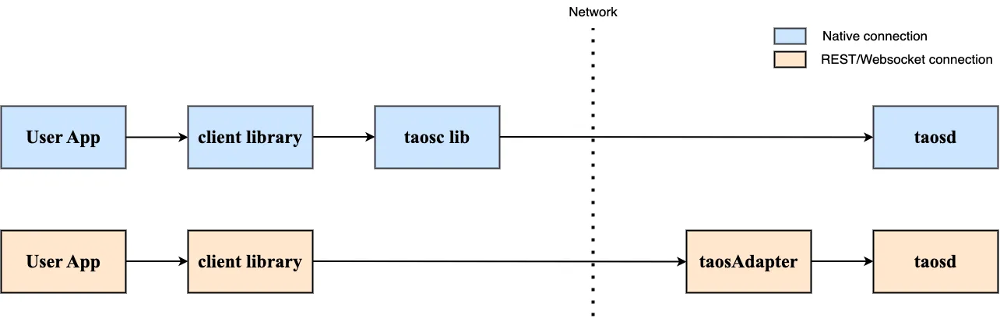

import Tabs from "@theme/Tabs";
import TabItem from "@theme/TabItem";
import ConnJava from "./_connect_java.mdx";
import ConnGo from "./_connect_go.mdx";
import ConnRust from "./_connect_rust.mdx";
import ConnNode from "./_connect_node.mdx";
import ConnPythonNative from "./_connect_python.mdx";
import ConnCSNative from "./_connect_cs.mdx";
import ConnC from "./_connect_c.mdx";
import ConnR from "./_connect_r.mdx";
import ConnPHP from "./_connect_php.mdx";
import InstallOnLinux from "../../08-client-libraries/_linux_install.mdx";
import InstallOnWindows from "../../08-client-libraries/_windows_install.mdx";
import InstallOnMacOS from "../../08-client-libraries/_macos_install.mdx";
import VerifyLinux from "../../08-client-libraries/_verify_linux.mdx";
import VerifyWindows from "../../08-client-libraries/_verify_windows.mdx";
import VerifyMacOS from "../../08-client-libraries/_verify_macos.mdx";

Any application running on any platform can access TDengine through the REST API provided by TDengine. For information, see [REST API](../../reference/rest-api/). Applications can also use the client libraries for various programming languages, including C/C++, Java, Python, Go, Node.js, C#, and Rust, to access TDengine. These client libraries support connecting to TDengine clusters using both native interfaces (taosc). Some client libraries also support connecting over a REST interface. Community developers have also contributed several unofficial client libraries, such as the ADO.NET, Lua, and PHP libraries.

## Establish Connection

There are three ways for a client library to establish connections to TDengine:

1. Native connection through the TDengine client driver (taosc).
2. REST connection through the REST API provided by the taosAdapter component.
3. Websocket connection provided by the taosAdapter component.



For these ways of connections, client libraries provide similar APIs for performing operations and running SQL statements on your databases. The main difference is the method of establishing the connection, which is not visible to users.

Key differences:

1. For a Native connection, the client driver taosc and the server TDengine version must be compatible.
2. For a REST connection, users do not need to install the client driver taosc, providing the advantage of cross-platform ease of use. However, functions such as data subscription and binary data types are not available. Additionally, compared to Native and Websocket connections, a REST connection has the worst performance.
3. For a Websocket connection, users also do not need to install the client driver taosc. However, compared to a Native connection, the performance is reduced by about 30%.
4. To connect to a cloud service instance, you need to use the REST connection or Websocket connection.
   
Normally we recommend using **Websocket connection**.

## Install Client Driver taosc

If you are choosing to use the native connection and the the application is not on the same host as TDengine server, the TDengine client driver taosc needs to be installed on the application host. If choosing to use the REST connection or the application is on the same host as TDengine server, this step can be skipped. It's better to use same version of taosc as the TDengine server.

### Install

<Tabs defaultValue="linux" groupId="os">
  <TabItem value="linux" label="Linux">
    <InstallOnLinux />
  </TabItem>
  <TabItem value="windows" label="Windows">
    <InstallOnWindows />
  </TabItem>
  <TabItem value="macos" label="MacOS">
    <InstallOnMacOS />
  </TabItem>
</Tabs>

### Verify

After the above installation and configuration are done and making sure TDengine service is already started and in service, the TDengine command-line interface `taos` can be launched to access TDengine.

<Tabs defaultValue="linux" groupId="os">
  <TabItem value="linux" label="Linux">
    <VerifyLinux />
  </TabItem>
  <TabItem value="windows" label="Windows">
    <VerifyWindows />
  </TabItem>
  <TabItem value="macos" label="MacOS">
    <VerifyMacOS />
  </TabItem>
</Tabs>

## Install Client Library

<Tabs groupId="lang">
<TabItem label="Java" value="java">

If `maven` is used to manage the projects, what needs to be done is only adding below dependency in `pom.xml`.

```xml
<dependency>
  <groupId>com.taosdata.jdbc</groupId>
  <artifactId>taos-jdbcdriver</artifactId>
  <version>3.2.8</version>
</dependency>
```

</TabItem>
<TabItem label="Python" value="python">

Install from PyPI using `pip`:

```
pip install taospy
```

Install from Git URL:

```
pip install git+https://github.com/taosdata/taos-connector-python.git
```

</TabItem>
<TabItem label="Go" value="go">

Just need to add `driver-go` dependency in `go.mod` .

```go-mod title=go.mod
module goexample

go 1.17

require github.com/taosdata/driver-go/v3 latest
```

:::note
`driver-go` uses `cgo` to wrap the APIs provided by taosc, while `cgo` needs `gcc` to compile source code in C language, so please make sure you have proper `gcc` on your system.

:::

</TabItem>
<TabItem label="Rust" value="rust">

Just need to add `taos` dependency in `Cargo.toml`.

```toml title=Cargo.toml
[dependencies]
taos = { version = "*"}
```

:::info
Rust client library uses different features to distinguish the way to establish connection. To establish Websocket connection, please enable `ws` feature.

```toml
taos = { version = "*", default-features = false, features = ["ws"] }
```

:::

</TabItem>
<TabItem label="Node.js" value="node">

Node.js client library provides different ways of establishing connections by providing different packages.

1. Install Node.js Native Client Library

```
npm install @tdengine/client
```

:::note
It's recommend to use Node whose version is between `node-v12.8.0` and `node-v13.0.0`.
:::

2. Install Node.js REST Client Library

```
npm install @tdengine/rest
```

</TabItem>
<TabItem label="C#" value="csharp">

Just need to add the reference to [TDengine.Connector](https://www.nuget.org/packages/TDengine.Connector/) in the project configuration file.

```xml title=csharp.csproj {12}
<Project Sdk="Microsoft.NET.Sdk">

  <PropertyGroup>
    <OutputType>Exe</OutputType>
    <TargetFramework>net6.0</TargetFramework>
    <ImplicitUsings>enable</ImplicitUsings>
    <Nullable>enable</Nullable>
    <StartupObject>TDengineExample.AsyncQueryExample</StartupObject>
  </PropertyGroup>

  <ItemGroup>
    <PackageReference Include="TDengine.Connector" Version="3.1.0" />
  </ItemGroup>

</Project>
```

Or add by `dotnet` command.

```
dotnet add package TDengine.Connector
```

:::note
The sample code below are based on dotnet6.0, they may need to be adjusted if your dotnet version is not exactly same.

:::

</TabItem>
<TabItem label="R" value="r">

1. Download [taos-jdbcdriver-version-dist.jar](https://repo1.maven.org/maven2/com/taosdata/jdbc/taos-jdbcdriver/3.0.0/).
2. Install the dependency package `RJDBC`:

```R
install.packages("RJDBC")
```

</TabItem>
<TabItem label="C" value="c">

If the client driver (taosc) is already installed, then the C client library is already available.
<br/>

</TabItem>
<TabItem label="PHP" value="php">

**Download Source Code Package and Unzip: **

```shell
curl -L -o php-tdengine.tar.gz https://github.com/Yurunsoft/php-tdengine/archive/refs/tags/v1.0.2.tar.gz \
&& mkdir php-tdengine \
&& tar -xzf php-tdengine.tar.gz -C php-tdengine --strip-components=1
```

> Version number `v1.0.2` is only for example, it can be replaced to any newer version.

**Non-Swoole Environment: **

```shell
phpize && ./configure && make -j && make install
```

**Specify TDengine Location: **

```shell
phpize && ./configure --with-tdengine-dir=/usr/local/Cellar/tdengine/3.0.0.0 && make -j && make install
```

> `--with-tdengine-dir=` is followed by the TDengine installation location.
> This way is useful in case TDengine location can't be found automatically or macOS.

**Swoole Environment: **

```shell
phpize && ./configure --enable-swoole && make -j && make install
```

**Enable The Extension:**

Option One: Add `extension=tdengine` in `php.ini`

Option Two: Specify the extension on CLI `php -d extension=tdengine test.php`

</TabItem>
</Tabs>

## Establish a connection

Prior to establishing connection, please make sure TDengine is already running and accessible. The following sample code assumes TDengine is running on the same host as the client program, with FQDN configured to "localhost" and serverPort configured to "6030".

<Tabs groupId="lang" defaultValue="java">
  <TabItem label="Java" value="java">
    <ConnJava />
  </TabItem>
  <TabItem label="Python" value="python">
    <ConnPythonNative />
  </TabItem>
  <TabItem label="Go" value="go">
      <ConnGo />
  </TabItem>
  <TabItem label="Rust" value="rust">
    <ConnRust />
  </TabItem>
  <TabItem label="Node.js" value="node">
    <ConnNode />
  </TabItem>
  <TabItem label="C#" value="csharp">
    <ConnCSNative />
  </TabItem>
  <TabItem label="R" value="r">
    <ConnR/>
  </TabItem>
  <TabItem label="C" value="c">
    <ConnC />
  </TabItem>
  <TabItem label="PHP" value="php">
    <ConnPHP />
  </TabItem>
</Tabs>

:::tip
If the connection fails, in most cases it's caused by improper configuration for FQDN or firewall. Please refer to the section "Unable to establish connection" in [FAQ](../../train-faq/faq).

:::
