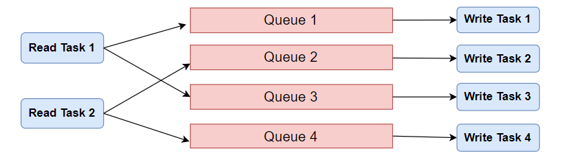

import Tabs from "@theme/Tabs";
import TabItem from "@theme/TabItem";

This section introduces how to efficiently write data to TDengine.

## Principles of Efficient Writing {#principle}

### From the Perspective of the Client Program {#application-view}

From the perspective of the client program, efficient data writing should consider the following factors:

1. The amount of data written at a time. Generally, the larger the batch size, the more efficient the writing (though the advantage may diminish beyond a certain threshold). When using SQL to write to TDengine, try to concatenate more data into a single SQL statement. Currently, the maximum length of a single SQL statement supported by TDengine is 1,048,576 (1MB) characters.
2. The number of concurrent connections. Generally, the more concurrent connections writing data simultaneously, the more efficient the writing (though performance may decline beyond a certain threshold, depending on server capacity).
3. The distribution of data across different tables (or subtables), i.e., the proximity of the data being written. Generally, writing data only to the same table (or subtable) in each batch is more efficient than writing to multiple tables (or subtables).
4. The method of writing. In general:
   - Parameter binding is more efficient than SQL writing because it avoids SQL parsing (though it increases the number of C interface calls, which can incur performance overhead).
   - SQL writing without automatic table creation is more efficient than with automatic table creation because the latter frequently checks for table existence.
   - SQL writing is more efficient than schema-less writing, as the latter automatically creates tables and supports dynamic changes to table structures.

The client program should fully and appropriately utilize these factors. In each writing operation, data should ideally only be written to the same table (or subtable), and the amount of data written per batch should be set to a value that is optimal for the current system's processing capacity based on testing and tuning. The number of concurrent write connections should also be set to an optimal value for the current system's processing capacity to achieve the best writing speed in the existing system.

### From the Perspective of the Data Source {#datasource-view}

Client programs typically need to read data from a data source and then write it to TDengine. From the data source perspective, the following scenarios necessitate a queue between the read and write threads:

1. Multiple data sources generate data at a rate that is significantly lower than the single-threaded write speed, but the overall data volume is considerable. In this case, the queue's role is to aggregate data from multiple sources to increase the amount of data written in a single operation.
2. A single data source generates data at a rate significantly higher than the single-threaded write speed. Here, the queue's role is to increase the write concurrency.
3. Data for a single table is scattered across multiple data sources. In this case, the queue's role is to aggregate data for the same table in advance, enhancing the proximity of data during writing.

If the data source for the writing application is Kafka, and the writing application itself is a Kafka consumer, the characteristics of Kafka can be leveraged for efficient writing. For example:

1. Write data for the same table to the same Topic's same Partition, increasing data proximity.
2. Aggregate data by subscribing to multiple Topics.
3. Increase write concurrency by adding more Consumer threads.
4. Increase the maximum data amount fetched each time to raise the maximum amount written in a single operation.

### From the Perspective of Server Configuration {#setting-view}

From the perspective of server configuration, it's important to set an appropriate number of vgroups when creating the database based on the number of disks in the system, their I/O capabilities, and processor capacity to fully utilize system performance. If there are too few vgroups, the system performance cannot be fully realized; if there are too many vgroups, unnecessary resource contention may occur. A general recommendation is to set the number of vgroups to twice the number of CPU cores, but tuning should still be based on the specific system resource configuration.

For more tuning parameters, refer to [Manage Databases](../../tdengine-reference/sql-manual/manage-databases/) and [taosd Reference](../../tdengine-reference/components/taosd/).

## Examples of Efficient Writing {#sample-code}

### Scenario Design {#scenario}

The following example program demonstrates how to efficiently write data, with the scenario designed as follows:

- The TDengine client program continuously reads data from other data sources, simulated in this example by generating mock data.
- A single connection cannot match the reading speed, so the client program starts multiple threads, each establishing a connection to TDengine with a dedicated fixed-size message queue.
- The client program hashes received data based on the associated table name (or subtable name) to determine the corresponding Queue index, ensuring that data belonging to a specific table (or subtable) is processed by a designated thread.
- Each sub-thread writes the data from its associated message queue to TDengine after emptying the queue or reaching a predefined data volume threshold, and continues processing the subsequently received data.



### Example Code {#code}

This part provides example code for the above scenario. The principles of efficient writing are the same for other scenarios, but the code needs to be modified accordingly.

This example code assumes that the source data belongs to different subtables of the same supertable (`meters`). The program creates this supertable in the `test` database before writing data. For subtables, they will be automatically created by the application based on the received data. If the actual scenario involves multiple supertables, simply modify the code for automatic table creation in the write task.

<Tabs defaultValue="java" groupId="lang">
<TabItem label="Java" value="java">

**Program Listing**

| Class Name             | Function Description                                                              |
| ---------------------- | --------------------------------------------------------------------------------- |
| FastWriteExample       | Main program                                                                      |
| ReadTask               | Reads data from the simulated source, hashes the table name to obtain the Queue index, and writes to the corresponding Queue |
| WriteTask              | Retrieves data from the Queue, composes a Batch, and writes to TDengine          |
| MockDataSource         | Simulates the generation of data for various meters subtables                     |
| SQLWriter              | Depends on this class for SQL concatenation, automatic table creation, SQL writing, and SQL length checking |
| StmtWriter             | Implements batch writing via parameter binding (not yet completed)                |
| DataBaseMonitor        | Monitors write speed and prints the current write speed to the console every 10 seconds |

Below is the complete code for each class and a more detailed function description.

<details>
<summary>FastWriteExample</summary>

The main program is responsible for:

1. Creating message queues
2. Starting write threads
3. Starting read threads
4. Monitoring write speed every 10 seconds

The main program exposes 4 parameters by default, which can be adjusted during each program start for testing and tuning:

1. The number of read threads. Default is 1.
2. The number of write threads. Default is 3.
3. The total number of simulated tables. Default is 1,000. This will be evenly distributed among the read threads. If the total number of tables is large, table creation will take longer, and the initial monitoring of write speed may be slower.
4. The maximum number of records to write in a single batch. Default is 3,000.

The queue capacity (`taskQueueCapacity`) is also a performance-related parameter that can be adjusted by modifying the program. Generally speaking, the larger the queue capacity, the lower the probability of being blocked during enqueuing, and the greater the throughput of the queue, although memory usage will also increase. The default value in the example program has been set sufficiently high.

```java
{{#include docs/examples/java/src/main/java/com/taos/example/highvolume/FastWriteExample.java}}
```

</details>

<details>
<summary>ReadTask</summary>

The read task is responsible for reading data from the data source. Each read task is associated with a simulated data source. Each simulated data source generates a limited amount of data for a table. Different simulated data sources generate data for different tables.

The read task uses a blocking method to write to the message queue. This means that once the queue is full, the write operation will block.

```java
{{#include docs/examples/java/src/main/java/com/taos/example/highvolume/ReadTask.java}}
```

</details>

<details>
<summary>WriteTask</summary>

```java
{{#include docs/examples/java/src/main/java/com/taos/example/highvolume/WriteTask.java}}
```

</details>

<details>
<summary>MockDataSource</summary>

```java
{{#include docs/examples/java/src/main/java/com/taos/example/highvolume/MockDataSource.java}}
```

</details>

<details>
<summary>SQLWriter</summary>

The `SQLWriter` class encapsulates the logic for SQL concatenation and data writing. Note that none of the tables are created in advance; they are batch-created using the supertable as a template when a table-not-found exception occurs, and the INSERT statement is then re-executed. For other exceptions, the SQL statement executed at that time is simply logged, and you can log more clues for error diagnosis and fault recovery.

```java
{{#include docs/examples/java/src/main/java/com/taos/example/highvolume/SQLWriter.java}}
```

</details>

<details>
<summary>DataBaseMonitor</summary>

```java
{{#include docs/examples/java/src/main/java/com/taos/example/highvolume/DataBaseMonitor.java}}
```

</details>

**Execution Steps**

<details>
<summary>Running the Java Example Program</summary>

Before running the program, configure the environment variable `TDENGINE_JDBC_URL`. If the TDengine Server is deployed locally and the username, password, and port are the default values, configure it as follows:

```shell
TDENGINE_JDBC_URL="jdbc:TAOS://localhost:6030?user=root&password=taosdata"
```

**Running the Example Program in a Local IDE**

1. Clone the TDengine repository

   ```shell
   git clone git@github.com:taosdata/TDengine.git --depth 1
   ```

2. Open the `docs/examples/java` directory in the IDE.
3. Configure the environment variable `TDENGINE_JDBC_URL` in the development environment. If you have already set a global environment variable for `TDENGINE_JDBC_URL`, you can skip this step.
4. Run the class `com.taos.example.highvolume.FastWriteExample`.

**Running the Example Program on a Remote Server**

To run the example program on a server, follow these steps:

1. Package the example code. Execute the following in the directory `TDengine/docs/examples/java`:

   ```shell
   mvn package
   ```

2. Create an `examples` directory on the remote server:

   ```shell
   mkdir -p examples/java
   ```

3. Copy the dependencies to the specified directory on the server:
   - Copy the dependency packages (only do this once)

     ```shell
     scp -r ./target/lib <user>@<host>:~/examples/java
     ```

   - Copy the jar file for this program (need to copy each time the code is updated)

     ```shell
     scp -r ./target/javaexample-1.0.jar <user>@<host>:~/examples/java
     ```

4. Configure the environment variable.
   Edit `~/.bash_profile` or `~/.bashrc` to add the following content, for example:

   ```shell
   export TDENGINE_JDBC_URL="jdbc:TAOS://localhost:6030?user=root&password=taosdata"
   ```

   The above uses the default JDBC URL for a locally deployed TDengine Server. You need to modify it according to your actual situation.

5. Use the Java command to start the example program with the command template:

   ```shell
   java -classpath lib/*:javaexample-1.0.jar com.taos.example.highvolume.FastWriteExample <read_thread_count> <write_thread_count> <total_table_count> <max_batch_size>
   ```

6. Terminate the test program. The test program will not automatically end. After achieving a stable write speed under the current configuration, press <kbd>CTRL</kbd> + <kbd>C</kbd> to terminate the program.
   Below is an actual run log output, with a machine configuration of 16 cores + 64G + SSD.

   ```shell
   root@vm85$ java -classpath lib/*:javaexample-1.0.jar com.taos.example.highvolume.FastWriteExample 2 12
   18:56:35.896 [main] INFO  c.t.e.highvolume.FastWriteExample - readTaskCount=2, writeTaskCount=12 tableCount=1000 maxBatchSize=3000
   18:56:36.011 [WriteThread-0] INFO  c.taos.example.highvolume.WriteTask - started
   18:56:36.015 [WriteThread-0] INFO  c.taos.example.highvolume.SQLWriter - maxSQLLength=1048576
   18:56:36.021 [WriteThread-1] INFO  c.taos.example.highvolume.WriteTask - started
   18:56:36.022 [WriteThread-1] INFO  c.taos.example.highvolume.SQLWriter - maxSQLLength=1048576
   18:56:36.031 [WriteThread-2] INFO  c.taos.example.highvolume.WriteTask - started
   18:56:36.032 [WriteThread-2] INFO  c.taos.example.highvolume.SQLWriter - maxSQLLength=1048576
   18:56:36.041 [WriteThread-3] INFO  c.taos.example.highvolume.WriteTask - started
   18:56:36.042 [WriteThread-3] INFO  c.taos.example.highvolume.SQLWriter - maxSQLLength=1048576
   18:56:36.093 [WriteThread-4] INFO  c.taos.example.highvolume.WriteTask - started
   18:56:36.094 [WriteThread-4] INFO  c.taos.example.highvolume.SQLWriter - maxSQLLength=1048576
   18:56:36.099 [WriteThread-5] INFO  c.taos.example.highvolume.WriteTask - started
   18:56:36.100 [WriteThread-5] INFO  c.taos.example.highvolume.SQLWriter - maxSQLLength=1048576
   18:56:36.100 [WriteThread-6] INFO  c.taos.example.highvolume.WriteTask - started
   18:56:36.101 [WriteThread-6] INFO  c.taos.example.highvolume.SQLWriter - maxSQLLength=1048576
   18:56:36.103 [WriteThread-7] INFO  c.taos.example.highvolume.WriteTask - started
   18:56:36.104 [WriteThread-7] INFO  c.taos.example.highvolume.SQLWriter - maxSQLLength=1048576
   18:56:36.105 [WriteThread-8] INFO  c.taos.example.highvolume.WriteTask - started
   18:56:36.107 [WriteThread-8] INFO  c.taos.example.highvolume.SQLWriter - maxSQLLength=1048576
   18:56:36.108 [WriteThread-9] INFO  c.taos.example.highvolume.WriteTask - started
   18:56:36.109 [WriteThread-9] INFO  c.taos.example.highvolume.SQLWriter - maxSQLLength=1048576
   18:56:36.156 [WriteThread-10] INFO  c.taos.example.highvolume.WriteTask - started
   18:56:36.157 [WriteThread-11] INFO  c.taos.example.highvolume.WriteTask - started
   18:56:36.158 [WriteThread-10] INFO  c.taos.example.highvolume.SQLWriter - maxSQLLength=1048576
   18:56:36.158 [ReadThread-0] INFO  com.taos.example.highvolume.ReadTask - started
   18:56:36.158 [ReadThread-1] INFO  com.taos.example.highvolume.ReadTask - started
   18:56:36.158 [WriteThread-11] INFO  c.taos.example.highvolume.SQLWriter - maxSQLLength=1048576
   18:56:46.369 [main] INFO  c.t.e.highvolume.FastWriteExample - count=18554448 speed=1855444
   18:56:56.946 [main] INFO  c.t.e.highvolume.FastWriteExample - count=39059660 speed=2050521
   18:57:07.322 [main] INFO  c.t.e.highvolume.FastWriteExample - count=59403604 speed=2034394
   18:57:18.032 [main] INFO  c.t.e.highvolume.FastWriteExample - count=80262938 speed=2085933
   18:57:28.432 [main] INFO  c.t.e.highvolume.FastWriteExample - count=101139906 speed=2087696
   18:57:38.921 [main] INFO  c.t.e.highvolume.FastWriteExample - count=121807202 speed=2066729
   18:57:49.375 [main] INFO  c.t.e.highvolume.FastWriteExample - count=142952417 speed=2114521
   18:58:00.689 [main] INFO  c.t.e.highvolume.FastWriteExample - count=163650306 speed=2069788
   18:58:11.646 [main] INFO  c.t.e.highvolume.FastWriteExample - count=185019808 speed=2136950
   ```

</details>

:::note

When using Python connectors for multi-process connections to TDengine, there is a limitation: connections cannot be established in the parent process; all connections must be created in the child processes. If a connection is established in the parent process, and then connections are created in the child processes, it will cause a blockage. This is a known issue.

:::

</TabItem>
</Tabs>
