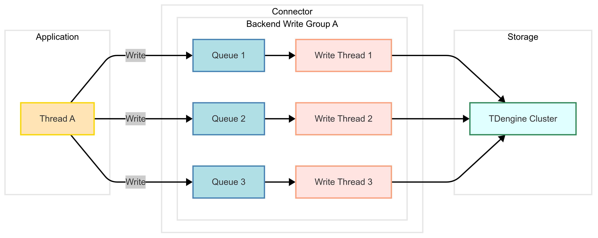

import Tabs from "@theme/Tabs";
import TabItem from "@theme/TabItem";

To help users easily build data ingestion pipelines with million-level throughput, the TDengine connector provides a high-performance write feature. When this feature is enabled, the TDengine connector automatically creates write threads and dedicated queues, caches data sharded by sub-tables, and sends data in batches when the data volume threshold is reached or a timeout condition occurs. This approach reduces network requests and increases throughput, allowing users to achieve high-performance writes without needing to master multithreaded programming knowledge or data sharding techniques.

## Usage of Efficient Writing {#usage}

The following introduces the usage methods of the efficient writing feature for each connector:

<Tabs defaultValue="java" groupId="lang">
<TabItem label="Java" value="java">

### Introduction to the JDBC Efficient Writing Feature

Starting from version `3.6.0`, the JDBC driver provides an efficient writing feature over WebSocket connections. The JDBC driver's efficient writing feature has the following characteristics:

- It supports the JDBC standard parameter binding interface.
- Under the condition of sufficient resources, the writing capacity is linearly related to the configuration of the number of writing threads.
- It supports the configuration of the writing timeout, the number of retries, and the retry interval after a connection is disconnected and re - established.
- It supports calling the `executeUpdate` interface to obtain the number of written data records. If there is an exception during writing, it can be caught at this time.

The following details its usage method. This section assumes that the user is already familiar with the JDBC standard parameter binding interface (refer to [Parameter Binding](https://docs.oracle.com/javase/8/docs/api/java/sql/PreparedStatement.html) for reference).

### How to Enable the Efficient Writing Feature

For the JDBC connector, there are two ways to enable the efficient writing feature:

- Setting `PROPERTY_KEY_ASYNC_WRITE` to `stmt` in the connection properties or adding `asyncWrite = stmt` to the JDBC URL can enable efficient writing on this connection. After enabling the efficient writing feature on the connection, all subsequent `PreparedStatement` objects created will use the efficient writing mode.
- When using parameter binding to create a `PreparedStatement`, using `ASYNC_INSERT INTO` instead of `INSERT INTO` in the SQL statement can enable efficient writing for this parameter - bound object.

### How to Check if the Writing is Successful

The client application uses the `addBatch` method of the JDBC standard interface to add a record and `executeBatch` to submit all added records. In the efficient writing mode, the **executeUpdate** method can be used to synchronously obtain the number of successfully written records. If there is a data writing failure, calling `executeUpdate` will catch an exception at this time.

### Important Configuration Parameters for Efficient Writing

- `TSDBDriver.PROPERTY_KEY_BACKEND_WRITE_THREAD_NUM`: The number of background writing threads in the efficient writing mode. It only takes effect when using a WebSocket connection. The default value is 10.
- `TSDBDriver.PROPERTY_KEY_BATCH_SIZE_BY_ROW`: The batch size of the written data in the efficient writing mode, with the unit of rows. It only takes effect when using a WebSocket connection. The default value is 1000.
- `TSDBDriver.PROPERTY_KEY_CACHE_SIZE_BY_ROW`: The size of the cache in the efficient writing mode, with the unit of rows. It only takes effect when using a WebSocket connection. The default value is 10000.

- `TSDBDriver.PROPERTY_KEY_ENABLE_AUTO_RECONNECT`: Whether to enable automatic reconnection. It only takes effect when using a WebSocket connection. `true` means enable, `false` means disable. The default is `false`. It is recommended to enable it in the efficient writing mode.
- `TSDBDriver.PROPERTY_KEY_RECONNECT_INTERVAL_MS`: The retry interval for automatic reconnection, with the unit of milliseconds. The default value is 2000. It only takes effect when `PROPERTY_KEY_ENABLE_AUTO_RECONNECT` is `true`.
- `TSDBDriver.PROPERTY_KEY_RECONNECT_RETRY_COUNT`: The number of retry attempts for automatic reconnection. The default value is 3. It only takes effect when `PROPERTY_KEY_ENABLE_AUTO_RECONNECT` is `true`.

For other configuration parameters, please refer to [Efficient Writing Configuration](../../tdengine-reference/client-libraries/java/#properties).

### Instructions for Using JDBC Efficient Writing

The following is a simple example of using JDBC efficient writing, which illustrates the relevant configurations and interfaces for efficient writing.

<details>
<summary>Sample of Using JDBC Efficient Writing</summary>
```java
{{#include docs/examples/java/src/main/java/com/taos/example/WSHighVolumeDemo.java:efficient_writing}}
```
</details>

</TabItem>
</Tabs>

## Efficient Writing Example {#sample-code}

### Scenario Design {#scenario}

The following sample program demonstrates how to efficiently write data, with the scenario designed as follows:  

- The TDengine client program continuously reads data from other data sources. In the sample program, simulated data generation is used to mimic data source reading, while also providing an example of pulling data from Kafka and writing it to TDengine.
- To improve the data reading speed of the TDengine client program, multi-threading is used for reading. To avoid out-of-order issues, the sets of tables read by multiple reading threads should be non-overlapping.
- To match the data reading speed of each data reading thread, a set of write threads is launched in the background. Each write thread has an exclusive fixed-size message queue.

### Sample Code {#code}

This section provides sample code for the above scenario. The principle of efficient writing is the same for other scenarios, but the code needs to be modified accordingly.

This sample code assumes that the source data belongs to different subtables of the same supertable (meters). The program has already created this supertable in the test database before starting to write data. For subtables, they will be automatically created by the application according to the received data. If the actual scenario involves multiple supertables, only the code for automatic table creation in the write task needs to be modified.

<Tabs defaultValue="java" groupId="lang">
<TabItem label="Java" value="java">

Program Listing:

| Class Name         | Functional Description                                                                                                                                       |
| ------------------ | ------------------------------------------------------------------------------------------------------------------------------------------------------------ |
| FastWriteExample   | The main program responsible for command-line argument parsing, thread pool creation, and waiting for task completion.                                       |
| WorkTask           | Reads data from a simulated source and writes it using the JDBC standard interface.                                                                          |
| MockDataSource     | Simulates and generates data for a certain number of `meters` child tables.                                                                                  |
| DataBaseMonitor    | Tracks write speed and prints the current write speed to the console every 10 seconds.                                                                       |
| CreateSubTableTask | Creates child tables within a specified range for invocation by the main program.                                                                            |
| Meters             | Provides serialization and deserialization of single records in the `meters` table, used for sending messages to Kafka and receiving messages from Kafka.    |
| ProducerTask       | A producer that sends messages to Kafka.                                                                                                                     |
| ConsumerTask       | A consumer that receives messages from Kafka, writes data to TDengine using the JDBC efficient writing interface, and commits offsets according to progress. |
| Util               | Provides basic functionalities, including creating connections, creating Kafka topics, and counting write operations.                                        |

Below are the complete codes and more detailed function descriptions for each class.

<details>
<summary>FastWriteExample</summary>

Introduction to Main Program Command-Line Arguments:

```shell
   -b,--batchSizeByRow <arg>             Specifies the `batchSizeByRow` parameter for Efficient Writing, default is 1000  
   -c,--cacheSizeByRow <arg>             Specifies the `cacheSizeByRow` parameter for Efficient Writing, default is 10000  
   -d,--dbName <arg>                     Specifies the database name, default is `test`  
      --help                             Prints help information  
   -K,--useKafka                         Enables Kafka mode, creating a producer to send messages and a consumer to receive messages for writing to TDengine. Otherwise, uses worker threads to subscribe to simulated data for writing.  
   -r,--readThreadCount <arg>            Specifies the number of worker threads, default is 5. In Kafka mode, this parameter also determines the number of producer and consumer threads.  
   -R,--rowsPerSubTable <arg>            Specifies the number of rows to write per child table, default is 100  
   -s,--subTableNum <arg>                Specifies the total number of child tables, default is 1000000  
   -w,--writeThreadPerReadThread <arg>   Specifies the number of write threads per worker thread, default is 5  
```

JDBC URL and Kafka Cluster Address Configuration:

1. The JDBC URL is configured via an environment variable, for example:  

   ```shell
   export TDENGINE_JDBC_URL="jdbc:TAOS-WS://localhost:6041?user=root&password=taosdata"
   ```

2. The Kafka cluster address is configured via an environment variable, for example:  

   ```shell
   export KAFKA_BOOTSTRAP_SERVERS=localhost:9092
   ```

Usage:

```shell
1. Simulated data writing mode:  
   java -jar highVolume.jar -r 5 -w 5 -b 10000 -c 100000 -s 1000000 -R 1000  
2. Kafka subscription writing mode:  
   java -jar highVolume.jar -r 5 -w 5 -b 10000 -c 100000 -s 1000000 -R 100 -K  
```

Responsibilities of the Main Program:

1. Parses command-line arguments.  
2. Creates child tables.  
3. Creates worker threads or Kafka producers and consumers.  
4. Tracks write speed.  
5. Waits for writing to complete and releases resources.

```java
{{#include docs/examples/JDBC/highvolume/src/main/java/com/taos/example/highvolume/FastWriteExample.java}}
```

</details>

<details>
<summary>WorkTask</summary>

The worker thread is responsible for reading data from the simulated data source. Each read task is associated with a simulated data source, which can generate data for a specific range of sub-tables. Different simulated data sources generate data for different tables.  
The worker thread uses a blocking approach to invoke the JDBC standard interface `addBatch`. This means that if the corresponding efficient writing backend queue is full, the write operation will block.

```java
{{#include docs/examples/JDBC/highvolume/src/main/java/com/taos/example/highvolume/WorkTask.java}}
```

</details>

<details>
<summary>MockDataSource</summary>

A simulated data generator that produces data for a certain range of sub-tables. To mimic real-world scenarios, it generates data in a round-robin fashion, one row per subtable.

```java
{{#include docs/examples/JDBC/highvolume/src/main/java/com/taos/example/highvolume/MockDataSource.java}}
```

</details>

<details>
<summary>CreateSubTableTask</summary>

Creates sub-tables within a specified range using a batch SQL creation approach.

```java
{{#include docs/examples/JDBC/highvolume/src/main/java/com/taos/example/highvolume/CreateSubTableTask.java}}
```

</details>

<details>
<summary>Meters</summary>

A data model class that provides serialization and deserialization methods for sending data to Kafka and receiving data from Kafka.

```java
{{#include docs/examples/JDBC/highvolume/src/main/java/com/taos/example/highvolume/Meters.java}}
```

</details>

<details>
<summary>ProducerTask</summary>

A message producer that writes data generated by the simulated data generator to all partitions using a hash method different from JDBC efficient writing.

```java
{{#include docs/examples/JDBC/highvolume/src/main/java/com/taos/example/highvolume/ProducerTask.java}}
```

</details>

<details>
<summary>ConsumerTask</summary>

A message consumer that receives messages from Kafka and writes them to TDengine.

```java
{{#include docs/examples/JDBC/highvolume/src/main/java/com/taos/example/highvolume/ConsumerTask.java}}
```

</details>

<details>
<summary>StatTask</summary>

Provides a periodic function to count the number of written records.

```java
{{#include docs/examples/JDBC/highvolume/src/main/java/com/taos/example/highvolume/StatTask.java}}
```

</details>

<details>
<summary>Util</summary>

A utility class that provides functions such as creating connections, creating databases, and creating topics.

```java
{{#include docs/examples/JDBC/highvolume/src/main/java/com/taos/example/highvolume/Util.java}}
```

</details>

Execution Steps:

<details>
<summary>Execute the Java Example Program</summary>

Execute the example program in a local integrated development environment:

1. Clone the TDengine repository

   ```shell
   git clone git@github.com:taosdata/TDengine.git --depth 1
   ```

2. Open the `TDengine/docs/examples/JDBC/highvolume` directory with the integrated development environment.
3. Configure the environment variable `TDENGINE_JDBC_URL` in the development environment. If the global environment variable `TDENGINE_JDBC_URL` has already been configured, you can skip this step.
4. If you want to run the Kafka example, you need to set the environment variable `KAFKA_BOOTSTRAP_SERVERS` for the Kafka cluster address.
5. Specify command-line arguments, such as `-r 3 -w 3 -b 100 -c 1000 -s 1000 -R 100`.
6. Run the class `com.taos.example.highvolume.FastWriteExample`.

Execute the example program on a remote server:

To execute the example program on a server, follow these steps:

1. Package the sample code. Navigate to the directory `TDengine/docs/examples/JDBC/highvolume` and run the following command to generate `highVolume.jar`:

   ```shell
   mvn package
   ```

2. Copy the program to the specified directory on the server:
  
   ```shell
   scp -r .\target\highVolume.jar <user>@<host>:~/dest-path
   ```

3. Configure the environment variable.
   Edit `~/.bash_profile` or `~/.bashrc` and add the following content for example:

   ```shell
   export TDENGINE_JDBC_URL="jdbc:TAOS-WS://localhost:6041?user=root&password=taosdata"
   ```

   The above uses the default JDBC URL for a locally deployed TDengine Server. Modify it according to your actual environment.
   If you want to use Kafka subscription mode, additionally configure the Kafka cluster environment variable:

   ```shell
   export KAFKA_BOOTSTRAP_SERVERS=localhost:9092
   ```

4. Start the sample program with the Java command. Use the following template (append `-K` for Kafka subscription mode):

   ```shell
   java -jar highVolume.jar -r 5 -w 5 -b 10000 -c 100000 -s 1000000 -R 1000
   ```

5. Terminate the test program. The program does not exit automatically. Once a stable write speed is achieved under the current configuration, press <kbd>CTRL</kbd> + <kbd>C</kbd> to terminate it.
Below is a sample log output from an actual run on a machine with a 40-core CPU, 256GB RAM, and SSD storage.

```text
   ---------------$ java -jar highVolume.jar -r 2 -w 10 -b 10000 -c 100000 -s 1000000 -R 100
   [INFO ] 2025-03-24 18:03:17.980 com.taos.example.highvolume.FastWriteExample main 309 main readThreadCount=2, writeThreadPerReadThread=10 batchSizeByRow=10000 cacheSizeByRow=100000, subTableNum=1000000, rowsPerSubTable=100
   [INFO ] 2025-03-24 18:03:17.983 com.taos.example.highvolume.FastWriteExample main 312 main create database begin.
   [INFO ] 2025-03-24 18:03:34.499 com.taos.example.highvolume.FastWriteExample main 315 main create database end.
   [INFO ] 2025-03-24 18:03:34.500 com.taos.example.highvolume.FastWriteExample main 317 main create sub tables start.
   [INFO ] 2025-03-24 18:03:34.502 com.taos.example.highvolume.FastWriteExample createSubTables 73 main create sub table task started.
   [INFO ] 2025-03-24 18:03:55.777 com.taos.example.highvolume.FastWriteExample createSubTables 82 main create sub table task finished.
   [INFO ] 2025-03-24 18:03:55.778 com.taos.example.highvolume.FastWriteExample main 319 main create sub tables end.
   [INFO ] 2025-03-24 18:03:55.781 com.taos.example.highvolume.WorkTask run 41 FW-work-thread-2 started
   [INFO ] 2025-03-24 18:03:55.781 com.taos.example.highvolume.WorkTask run 41 FW-work-thread-1 started
   [INFO ] 2025-03-24 18:04:06.580 com.taos.example.highvolume.StatTask run 36 pool-1-thread-1 numberOfTable=1000000 count=12235906 speed=1223590
   [INFO ] 2025-03-24 18:04:17.531 com.taos.example.highvolume.StatTask run 36 pool-1-thread-1 numberOfTable=1000000 count=31185614 speed=1894970
   [INFO ] 2025-03-24 18:04:28.490 com.taos.example.highvolume.StatTask run 36 pool-1-thread-1 numberOfTable=1000000 count=51464904 speed=2027929
   [INFO ] 2025-03-24 18:04:40.851 com.taos.example.highvolume.StatTask run 36 pool-1-thread-1 numberOfTable=1000000 count=71498113 speed=2003320
   [INFO ] 2025-03-24 18:04:51.948 com.taos.example.highvolume.StatTask run 36 pool-1-thread-1 numberOfTable=1000000 count=91242103 speed=1974399

```

</details>

</TabItem>

</Tabs>

## Key Factors for Write Performance {#key-factors}  

### From the Client Application Perspective {#application-view}  

From the client application's perspective, the following factors should be considered for efficient data writing:  

1. **Batch Writing**: Generally, larger batch sizes improve efficiency (but the advantage diminishes beyond a certain threshold). When using SQL to write to TDengine, include as much data as possible in a single SQL statement.  
2. **Multithreaded Writing**: Before system resource bottlenecks are reached, increasing the number of write threads can improve throughput (performance may decline due to server-side processing limitations beyond the threshold). It is recommended to assign independent connections to each write thread to reduce connection resource contention.  
3. **Write Locality**: The distribution of data across different tables (or sub-tables), i.e., the locality of data to be written. Writing to a single table (or sub-table) in each batch is more efficient than writing to multiple tables (or sub-tables).  
4. **Pre-Creating Tables**: Pre-creating tables improves write performance as it eliminates the need to check table existence and allows omitting tag column data during writing.  
5. **Write Methods**:  
   - Parameter binding writes are more efficient than raw SQL writes, as they avoid SQL parsing.  
   - SQL writes without automatic table creation are more efficient than those with automatic table creation, as the latter requires frequent table existence checks.  
   - SQL writes are more efficient than schema-less writes, as schema-less writes enable automatic table creation and dynamic schema changes.  
6. **Order Preservation**: Data for the same sub-table must be submitted in ascending order of timestamps. Out-of-order data causes additional sorting operations on the server, impacting write performance.  
7. **Enabling Compression**: When network bandwidth is a bottleneck or there is significant data duplication, enabling compression can effectively improve overall performance.  

Client applications should fully and appropriately utilize these factors. For example, choosing parameter binding, pre-creating sub-tables, writing to a single table (or sub-table) in each batch, and configuring batch size and concurrent thread count through testing to achieve the optimal write speed for the current system.  

### From the Data Source Perspective {#datasource-view}  

Client applications usually need to read data from a data source before writing it to TDengine. From the data source's perspective, the following situations require adding a queue between the reading and writing threads:

1. There are multiple data sources, and the data generation speed of a single data source is much lower than the writing speed of a single thread, but the overall data volume is relatively large. In this case, the role of the queue is to aggregate data from multiple sources to increase the amount of data written at once.
2. The data generation speed of a single data source is much greater than the writing speed of a single thread. In this case, the role of the queue is to increase the concurrency of writing.
3. Data for a single table is scattered across multiple data sources. In this case, the role of the queue is to aggregate the data for the same table in advance, improving the adjacency of the data during writing.

If the data source for the writing application is Kafka, and the writing application itself is a Kafka consumer, then Kafka's features can be utilized for efficient writing. For example:

1. Write data from the same table to the same Topic and the same Partition to increase data adjacency.
2. Aggregate data by subscribing to multiple Topics.
3. Increase the concurrency of writing by increasing the number of Consumer threads.
4. Increase the maximum amount of data fetched each time to increase the maximum amount of data written at once.

### From the Server Configuration Perspective {#setting-view}  

First, consider several important performance-related parameters in the database creation options:  

1. **vgroups**: When creating a database on the server, reasonably set the number of vgroups based on the number of disks, disk I/O capability, and processor capacity to fully unleash system performance. Too few vgroups will underutilize performance, while too many will cause unnecessary resource contention. It is recommended to keep the number of tables per vgroup within 1 million, and within 10,000 under sufficient hardware resources for better results.  
2. **buffer**: Refers to the write memory size allocated for a vnode, with a default of 256 MB. When the actual written data in a vnode reaches about 1/3 of the buffer size, a data flush to disk is triggered. Increasing this parameter appropriately can cache more data for batch flushing, improving write efficiency. However, an excessively large value will prolong recovery time in case of a system crash.  
3. **cachemodel**: Controls whether to cache the latest data of sub-tables in memory. Enabling this feature affects write performance as it updates each table's `last_row` and each column's `last` value during writing. Reducing the impact by changing the option from `both` to `last_row` or `last_value`.  
4. **stt_trigger**: Controls the TSDB data flush policy and the number of files triggering background file merging. The default for the enterprise edition is 2, while the open-source edition can only be configured to 1. `stt_trigger = 1` is suitable for scenarios with few tables and high write frequency; `stt_trigger > 1` is better for scenarios with many tables and low write frequency.  

For other parameters, refer to [Database Management](../../tdengine-reference/sql-manual/manage-databases/).  

Next, consider performance-related parameters in the `taosd` configuration:  

1. **compressMsgSize**: Enabling RPC message compression improves performance when bandwidth is a bottleneck.  
2. **numOfCommitThreads**: Number of background flush threads on the server, default 4. More threads do not always mean better performance, as they can cause disk write contention. Servers with multiple disks can consider increasing this parameter to utilize concurrent I/O capabilities.  
3. **Log Level**: Parameters like `debugFlag` control log output levels. Higher log levels increase output pressure and impact write performance, so the default configuration is recommended.  

For other parameters, refer to [Server Configuration](../../tdengine-reference/components/taosd/).  

## Implementation Principle of Efficient Writing {#implement-principle}  

From the factors affecting write performance discussed above, developing high-performance data writing programs requires knowledge of multithreaded programming and data sharding, posing a technical threshold. To reduce user development costs, the TDengine connector provides the **efficient writing feature**, allowing users to leverage TDengine's powerful writing capabilities without dealing with underlying thread management and data sharding logic.  

Below is a schematic diagram of the connector's efficient writing feature implementation:



### Design Principles  

- **Automatic Thread and Queue Creation**:  
  The connector dynamically creates independent write threads and corresponding write queues based on configuration parameters. Each queue is bound to a sub-table, forming a processing chain of "sub-table data - dedicated queue - independent thread".  
- **Data Sharding and Batch Triggering**:  
  When the application writes data, the connector automatically shards the data by sub-table and caches it in the corresponding queue. Batch sending is triggered when either of the following conditions is met:  
  1. The queue data volume reaches the preset threshold.  
  2. The preset waiting timeout is reached (to avoid excessive latency).

  This mechanism significantly improves write throughput by reducing the number of network requests.  

### Functional Advantages  

- **Single-Thread High-Performance Writing**:  
  The application layer only needs to call the write interface via a single thread. The connector's underlying layer automatically handles multithreaded concurrency, achieving performance close to traditional client multithreaded writing while hiding all underlying thread management complexity.  
- **Reliability Enhancement Mechanisms**:  
  1. **Synchronous Validation Interface**: Provides synchronous methods to ensure traceability of write success status for submitted data.  
  2. **Connection Self-Healing**: Supports automatic reconnection after disconnection, combined with configurable timeout retry policies (retry count and interval) to ensure no data loss.  
  3. **Error Isolation**: Exceptions in a single queue or thread do not affect data writing for other sub-tables, improving system fault tolerance.  

:::note  
The connector's efficient writing feature only supports writing to supertables, not ordinary tables.  
:::
