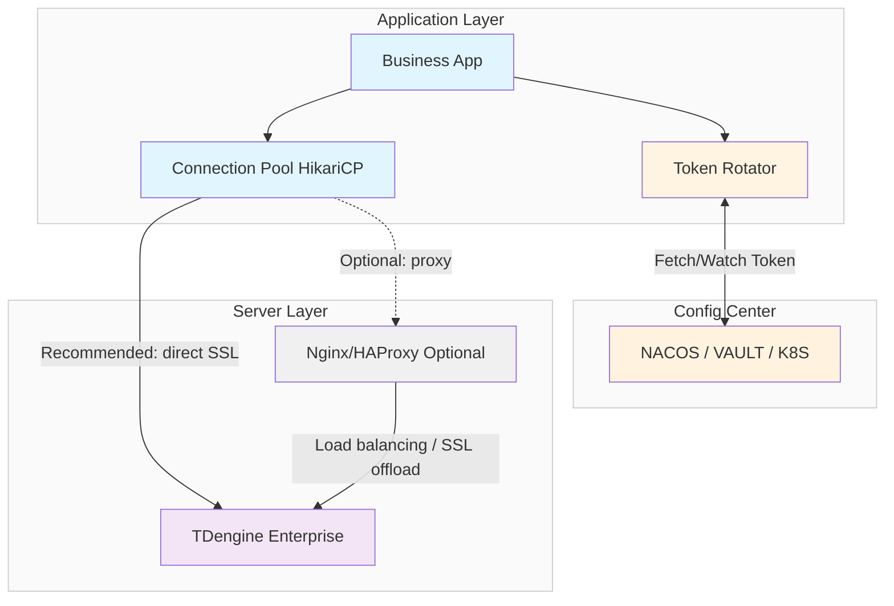
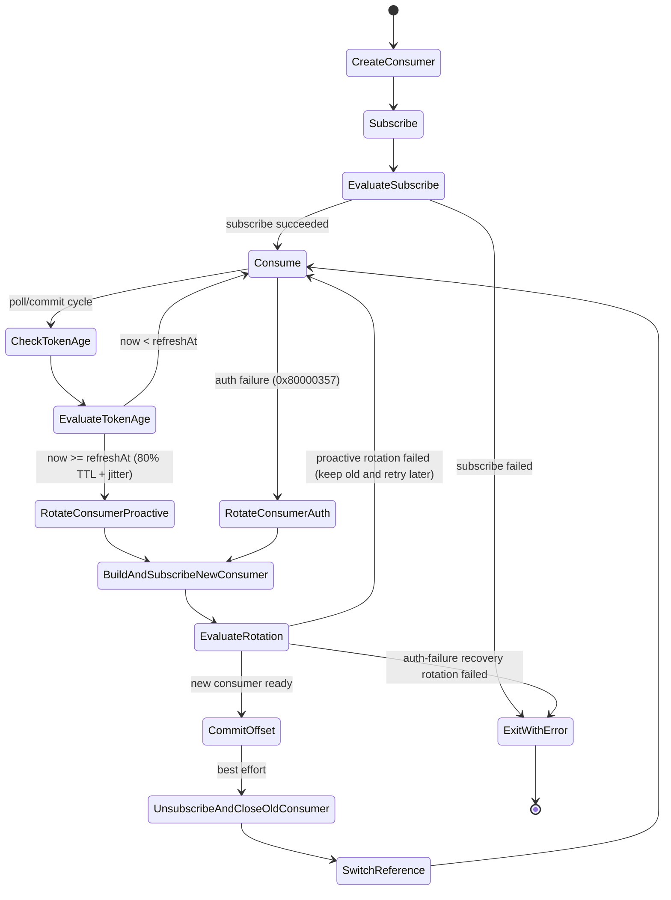

import Tabs from "@theme/Tabs";
import TabItem from "@theme/TabItem";

# Connector Security Best Practices

This guide describes security best practices for TDengine connectors, including token authentication, SSL/TLS client configuration, dynamic token rotation, and implementation examples across different language connectors.

---

## 1. Security Architecture Design

### 1.1 Why a Security Architecture Is Required

#### Security Threats

In untrusted network environments, TDengine connections face these threats:

- **Data leakage**: Sensitive time-series data can be intercepted in transit.
- **Man-in-the-middle attacks**: Attackers can impersonate server or client to steal or tamper with data.
- **Credential leakage**: Hard-coded username/password can leak and are hard to revoke quickly.
- **Replay attacks**: Captured legitimate requests can be replayed for unauthorized operations.

#### Design Goals

Security architecture goals for TDengine connectors:

- **Confidentiality**: Encrypt all data in transit.
- **Integrity**: Prevent tampering during transport.
- **Availability**: Maintain business continuity with token rotation.
- **Auditability**: Track and audit access via independent tokens.
- **Least privilege**: Use different tokens for different applications.

### 1.2 Three-Layer Component Architecture

The TDengine connector security architecture contains three layers:

1. **Application layer**: Business applications manage connection pools and token lifecycle, including SQL execution, parameter binding, schemaless writes, subscriptions, pool management (for example HikariCP), and token rotators that listen to config-center changes.

2. **Configuration center**: Centralized storage/distribution of tokens via Nacos, Vault, or Kubernetes Secrets, with dynamic token push and shared configuration across instances.

3. **Server layer**: TDengine Enterprise validates token legitimacy and handles encrypted requests, with optional load balancing by Nginx/HAProxy.

### 1.3 Overall Architecture Diagram



### 1.4 Core Design Principles

#### 1. WebSocket + Token + SSL

The recommended TDengine connector security baseline is:

- **WebSocket connection**: Cross-platform, stable, and supports SSL/TLS.
- **Token authentication**: Replaces username/password, supports TTL and proactive revocation, and enables dynamic rotation.
- **SSL/TLS encryption**: Client verifies server certificate to prevent MITM attacks and encrypt all traffic.

#### 2. Prefer Direct Connector Access Over Nginx Forwarding

| Dimension | Option A: Nginx Forwarding | Option B: Direct Connector Access (Recommended) |
|------|-------------------|-------------------------|
| **Load balancing** | Nginx/HAProxy | Built-in connector strategy |
| **SSL handling** | SSL offload at Nginx | End-to-end SSL at client |
| **Failover** | 5-10s health detection | **Auto reconnect with minimal impact** |
| **Performance** | Extra network hop | **Lower latency / better throughput** |
| **Certificate management** | Centralized | Per-node configuration |
| **TMQ stability** | Potential instability | **More stable** |
| **Operations complexity** | Extra component required | **Simpler setup** |

**Recommendation:**

- Prefer **Option B (direct connector access)**.
- Choose **Option A (Nginx forwarding)** only when you need centralized ingress/governance or strict integration with existing infrastructure.

#### 3. Dynamic Token Rotation for Continuity

Tokens have TTL (typically 24 hours). After expiration, connections fail. Dynamic token rotation ensures:

- Automatic rotation before expiration (for example at 80% TTL)
- Transparent switchover
- Automatic rollback on failure

---

## 2. SSL/TLS Configuration

Enabling SSL/TLS ensures confidentiality and integrity in data transport.

:::info Responsibility Split

- **Server-side configuration**: Certificate generation and taosAdapter SSL setup (`taosadapter.toml`), see [SSL Configuration Guide](./ssl-configuration-guide.md)
- **Client-side configuration**: TrustStore and SSL connection parameters, covered in this section
:::

### 2.1 Certificate Validation Principles

When establishing SSL/TLS, clients verify server certificates with:

1. **Certificate chain validation**: Whether cert chain is issued by trusted CA.
2. **Hostname validation**: Whether CN/SAN matches the target host or IP.
3. **Validity period validation**: Whether certificate is currently valid.
4. **Revocation validation**: Optional OCSP/CRL checks.

### 2.2 Client SSL/TLS Configuration

<Tabs defaultValue="java" groupId="lang">
<TabItem value="java" label="Java">

Java stores trusted certificates in a `truststore`. Use a dedicated truststore whenever possible to avoid polluting the system default truststore.

**Import server certificate:**

```bash
# Option 1: Import into JVM system truststore (requires JAVA_HOME)
sudo keytool -import -alias tdengine-server \
  -file /etc/taos/server.crt \
  -keystore $JAVA_HOME/lib/security/cacerts \
  -storepass changeit -noprompt

# Option 2 (recommended): Use a dedicated truststore
keytool -import -alias tdengine-server \
  -file server.crt \
  -keystore ./tdengine-truststore.jks \
  -storepass tdengine -noprompt

# Verify import
keytool -list -keystore ./tdengine-truststore.jks -storepass tdengine
```

**Specify truststore when running Java application:**

```bash
java -Djavax.net.ssl.trustStore=/path/to/tdengine-truststore.jks \
     -Djavax.net.ssl.trustStorePassword=tdengine \
     -jar your-app.jar
```

**Verify SSL connection:**

```bash
openssl s_client \
  -connect td1.internal.taosdata.com:6041 \
  -servername td1.internal.taosdata.com \
  -CAfile ./server.crt \
  -verify_hostname td1.internal.taosdata.com \
  -verify_return_error < /dev/null

# Expected output
Verify return code: 0 (ok)
```

</TabItem>

<TabItem label="Python" value="python">

Python is recommended to use the `taosws` WebSocket connector. Using `wss://` enables SSL/TLS automatically.

```python
import taosws

# Option 1: SSL/TLS only
conn = taosws.connect(
    url="wss://td1.internal.taosdata.com:6041/mydb"
)

# Option 2: SSL/TLS + Bearer Token
conn = taosws.connect(
    url="wss://td1.internal.taosdata.com:6041/mydb",
    bearer_token="your_token_here"
)
```

- `wss://`: WebSocket Secure with SSL/TLS
- `ws://`: Unencrypted connection

</TabItem>

<TabItem label="Go" value="go">

Go is recommended to use the `taosWS` driver. `wss(...)` enables SSL/TLS automatically.

**Basic connection:**

```go
package main

import (
    "database/sql"
    _ "github.com/taosdata/driver-go/v3/taosWS"
)

func main() {
    dsn := "root:taosdata@wss(td1.internal.taosdata.com:6041)/mydb"
    db, err := sql.Open("taosWS", dsn)
    if err != nil {
        panic(err)
    }
    defer db.Close()

    // Bearer Token takes precedence over username/password
    dsn = "wss://td1.internal.taosdata.com:6041/mydb?bearerToken=your_token_here"
    _, _ = sql.Open("taosWS", dsn)
}
```

- `wss(host:port)`: WebSocket Secure with SSL/TLS
- `ws(host:port)`: Unencrypted connection

</TabItem>

<TabItem value="rust" label="Rust">

:::info
Rust SSL configuration examples will be added in a later revision.
:::

</TabItem>

<TabItem value="nodejs" label="Node.js">

Node.js connector currently uses WebSocket. `wss://` enables SSL/TLS automatically.

```javascript
const taos = require('@tdengine/websocket');

let dsn = 'wss://localhost:6041';
async function createConnect() {
    let conf = new taos.WSConfig(dsn);
    conf.setUser('root');
    conf.setPwd('taosdata');
    conf.setDb('test');
    return await taos.sqlConnect(conf);
}
```

**Bearer Token authentication:**

```javascript
let dsn = 'wss://localhost:6041/test?bearerToken=your_token_here';
```

**Validate configuration:**

```bash
openssl s_client -connect localhost:6041 -showcerts
```

</TabItem>

<TabItem value="csharp" label="C#">

Use TDengine.Connector 3.2.0+ (WebSocket) when possible.

```csharp
using TDengine.Driver;
using TDengine.Connection;

var connectionString = "protocol=WebSocket;" +
                       "host=localhost;" +
                       "port=6041;" +
                       "useSSL=true;" +
                       "username=root;" +
                       "password=taosdata";

var client = new TDengineClient(connectionString);
```

**Bearer Token authentication (3.1.10+):**

```csharp
var connectionString = "protocol=WebSocket;" +
                       "host=localhost;" +
                       "port=6041;" +
                       "useSSL=true;" +
                       "bearerToken=your_token_here";

var client = new TDengineClient(connectionString);
```

</TabItem>

<TabItem value="c" label="C">

:::info
C client SSL configuration examples will be added in a later revision.
:::

</TabItem>

<TabItem value="rest" label="REST API">

**Use curl over HTTPS:**

```bash
curl -L -H "Authorization: Bearer your_token_here" --cacert /etc/taos/server.crt -d "show databases;" https://localhost:6041/rest/sql
```

</TabItem>
</Tabs>

## 3. Token Authentication

### 3.1 Why Use Tokens

Token authentication in TDengine Enterprise is a lightweight authentication mechanism with advantages over username/password:

- **Time-bounded validity**: TTL-based automatic expiration.
- **Revocability**: Tokens can be revoked immediately.
- **Least privilege**: Different scopes for different applications.
- **Audit-friendliness**: Token-level activity tracking.

### 3.2 Create a Token

```sql
-- Create a token with 1-day TTL
CREATE TOKEN my_app_token FROM USER root ENABLE 1 PROVIDER 'root' TTL 1;

-- Query tokens created by current user
SHOW TOKENS;
```

### 3.3 Connect with Tokens

**Token authentication is the recommended method** and is generally more secure than username/password.

When using token authentication, only the token parameter is required. **Do not set username/password at the same time.**

---

## 4. Dynamic Token Rotation

### 4.1 Rotation Scenario Overview

Tokens expire (typically after 24 hours). Dynamic rotation keeps services running continuously.

**Two rotation scenarios:**

1. **Regular connections** (SQL execution, parameter binding, schemaless writes)
   - Relies on connection pool lifecycle (`maxLifetime` in HikariCP)
   - New connections use new token, old connections age out naturally
   - Business logic remains transparent

2. **Data subscription** (TMQ consumer)
   - Requires proactive consumer rebuild
   - Must commit offsets before switching
   - Graceful switch avoids message loss

### 4.2 Rotation for Regular Connections

#### Rotation Principle

Physical connections in the pool have a lifecycle (`maxLifetime`). Rotation reuses this mechanism:

Config center token update -> listener receives change -> update token in pool configuration -> new connections use new token -> old connections expire at `maxLifetime` -> transparent switchover.

#### Rotation Strategy

**Pre-rotation:** rotate before expiration at 80% TTL. For TTL=24h, trigger around hour 19-20. Keep old token valid for 5 more minutes as grace period.

**Canary validation:** validate new token on a small set of connections before full rollout. If validation fails, rollback automatically.

**Rollback mechanism:** log error, send alert, rollback to old token, retry after 1 hour.

#### Config-Center Integration: Nacos

**Deploy Nacos server:**

```bash
# Download and start Nacos in standalone mode (cluster mode is recommended for production)
cd /tmp
wget https://github.com/alibaba/nacos/releases/download/2.3.2/nacos-server-2.3.2.zip
unzip nacos-server-2.3.2.zip
cd nacos/bin
./startup.sh -m standalone

# Verify startup
curl http://localhost:8848/nacos/v1/ns/instance/list?serviceName=nacos
```

**Write token to Nacos:**

```bash
# Create config
curl -X POST "http://localhost:8848/nacos/v1/cs/configs" \
  -d "dataId=tdengine-credential" \
  -d "group=DEFAULT_GROUP" \
  -d "content=token=your_new_token_here"
```

**Read token from Nacos:**

```java
import com.alibaba.nacos.api.NacosFactory;
import com.alibaba.nacos.api.config.ConfigService;
import com.alibaba.nacos.api.config.listener.Listener;

// Create Nacos config service
ConfigService nacos = NacosFactory.createConfigService("localhost:8848");

// Read token
String config = nacos.getConfig("tdengine-credential", "DEFAULT_GROUP", 5000);
if (config == null || config.isEmpty()) {
    throw new IllegalStateException("Nacos config is empty");
}
String token = "";
for (String line : config.split("\n")) {
    line = line.trim();
    if (line.startsWith("token=")) {
        token = line.substring("token=".length()).trim();
        break;
    }
}
if (token.isEmpty()) {
    throw new IllegalStateException("token= not found in Nacos config");
}
```

**Add listener to rotate pool automatically when token changes:**

```java
{{#include docs/examples/JDBC/JDBCDemo/src/main/java/com/taos/example/security/NacosSecurityDemo.java:nacos-listener}}
```

### 4.3 Rotation for Data Subscription

#### Rotation Principle

TMQ consumers must be rebuilt during token rotation:

Create consumer -> subscribe -> consume. If subscribe fails, exit early with error.

During consumption, periodically check whether current time reaches `refreshAt` (computed as `80% TTL + random jitter up to 10% TTL`). When reached, rotate with this sequence: **build and subscribe new consumer first** -> best-effort commit on old consumer -> unsubscribe and close old consumer -> switch to new consumer.

#### Rotation Workflow

**TMQ Token Rotation State Machine:**



#### Implementation Key Points

**Rotation triggers in this state machine:** periodic `now >= refreshAt` (`80% TTL + jitter`) and auth failure (`0x80000357`).

**Initial subscribe failure handling:** if initial `subscribe` fails, exit without entering the consume loop.

**Offset commit timing:** commit old offsets after the new consumer is ready; commit is best-effort to avoid auth-expired deadlocks.

**Graceful switchover:** fetch new token -> create and subscribe new consumer -> commit old offsets (best effort) -> unsubscribe and close old consumer -> switch references.

**Rotation failure handling by trigger source:** proactive rotation failure keeps old consumer and retries later; auth-failure recovery rotation failure exits.

### 4.4 Reliability and Resource Cleanup Requirements

Production-grade rotation depends on strict lifecycle management. Use these rules as baseline:

1. **Reuse listener executors**: `getExecutor()` must return a shared executor, never create a new executor per callback.
2. **Always remove listeners**: call `removeListener` when app exits or demo step ends.
3. **Bidirectional pool cleanup**: close old pool after successful recovery; close new unswitched pool on recovery failure.
4. **Close TMQ consumer in skip path**: if `buildConsumer` succeeds but `subscribe` fails (for example topic unavailable), close consumer immediately.
5. **Unified shutdown in `finally`**: scheduler, listener executor, pool, and consumer should be closed idempotently with logs.

---

## 5. Connector Implementations

This section provides complete implementation examples.

### 5.1 Basic Connection (Token + SSL)

<Tabs defaultValue="java" groupId="lang">
<TabItem value="java" label="Java">

```java
{{#include docs/examples/JDBC/JDBCDemo/src/main/java/com/taos/example/security/SecurityPoolDemo.java:basic-connect}}
```

**Key parameters:**

- `bearerToken`: Bearer Token (WebSocket-only)
- `useSSL`: Enable SSL/TLS

</TabItem>
<TabItem label="Go" value="go">

```go
package main

import (
    "database/sql"
    "fmt"
    "log"    
    _ "github.com/taosdata/driver-go/v3/taosWS"
)

func main() {
    dsn := "wss://td1.internal.taosdata.com:6041/mydb?bearerToken=your_token_here"

    db, err := sql.Open("taosWS", dsn)
    if err != nil {
        log.Fatal(err)
    }
    defer db.Close()

    var version string
    err = db.QueryRow("SELECT SERVER_VERSION()").Scan(&version)
    if err != nil {
        log.Fatal(err)
    }
    fmt.Println("Server version:", version)
}
```

**Key parameters:**

- `wss://`: WebSocket Secure protocol with SSL/TLS
- `bearerToken`: Bearer Token authentication

</TabItem>
<TabItem label="Python" value="python">

```python
import taosws

conn = taosws.connect(
    url="wss://td1.internal.taosdata.com:6041/mydb",
    bearer_token="your_token_here"
)

cursor = conn.cursor()
cursor.execute("SELECT SERVER_VERSION()")
result = cursor.fetchone()
print(f"Server version: {result[0]}")

cursor.close()
conn.close()
```

**Key parameters:**

- `url`: Use `wss://` to enable SSL/TLS
- `bearer_token`: Bearer Token authentication

</TabItem>
</Tabs>

### 5.2 Token Rotation for Regular Connections

<Tabs defaultValue="java" groupId="lang">
<TabItem value="java" label="Java">

**Connection pool configuration** (`maxLifetime` = Token TTL / 2, so old connections expire naturally and new connections use latest token):

```java
{{#include docs/examples/JDBC/JDBCDemo/src/main/java/com/taos/example/security/SecurityPoolDemo.java:pool-config}}
```

**Token rotation** (called when Nacos listener receives a new token, switch to new pool then close old pool):

```java
{{#include docs/examples/JDBC/JDBCDemo/src/main/java/com/taos/example/security/SecurityPoolDemo.java:token-refresh}}
```

**Nacos listener integration:**

```java
{{#include docs/examples/JDBC/JDBCDemo/src/main/java/com/taos/example/security/NacosSecurityDemo.java:nacos-listener}}
```

</TabItem>
</Tabs>

### 5.3 Token Rotation for Data Subscription

<Tabs defaultValue="java" groupId="lang">
<TabItem value="java" label="Java">

**Consumer build** (WebSocket + SSL + token parameters):

```java
{{#include docs/examples/JDBC/JDBCDemo/src/main/java/com/taos/example/security/SecurityTmqDemo.java:consumer-build}}
```

**Consume loop** (proactive rotation + fallback on auth failure):

```java
{{#include docs/examples/JDBC/JDBCDemo/src/main/java/com/taos/example/security/SecurityTmqDemo.java:tmq-rotation}}
```

</TabItem>
</Tabs>

---

## 6. Advanced Topics

### 6.1 Performance Optimization

#### SSL/TLS Optimization

##### Certificate selection

| Certificate Type | Key Length | Performance | Security | Recommended Use |
|---------|----------|------|--------|----------|
| **RSA** | 2048 bits | Medium | High | General purpose |
| **RSA** | 4096 bits | Low | Very high | High-security workloads |
| **ECC** | 256 bits | High | High | **Recommended (best performance)** |
| **ECC** | 384 bits | Medium | Very high | Compatibility-first deployments |

**Recommendation:** prefer ECC certificates (for example ECDSA P-256). Compared with RSA 4096:

- 50-70% less handshake time
- ~60% lower CPU usage
- Smaller certificates

##### TLS session resumption

Enable session resumption to reduce full handshakes:

```ini
# TDengine server-side configuration (if supported)
sslSessionCache     internal
sslSessionCacheSize 10000
sslSessionTimeout   3600
```

Expected effect:

- First handshake: ~100ms
- Session resumption: ~10ms (about 90% reduction)

##### Cipher suite tuning

Disable weak ciphers and prioritize efficient ciphers:

```ini
# Recommended priority
1. TLS_AES_128_GCM_SHA256       (TLS 1.3, fastest)
2. TLS_CHACHA20_POLY1305_SHA256 (optimized for ARM)
3. TLS_AES_256_GCM_SHA384       (strong compatibility)
```

#### Connection Pool Optimization

##### HikariCP recommendations

| Parameter | Recommended Value | Description |
|------|--------|------|
| `maximumPoolSize` | 10-20 | Tune by CPU cores and concurrency |
| `minimumIdle` | 2-5 | Keep minimum idle connections to avoid cold start |
| `maxLifetime` | **Token TTL / 2** | Critical: avoid connections outliving token |
| `connectionTimeout` | 30000 | 30s timeout when acquiring connection |
| `keepaliveTime` | 60000 | 1-minute keepalive to detect dead connections |
| `connectionTestQuery` | unset | If unset, JDBC `isValid` is used |

### 6.2 Certificate Management Best Practices

#### 1. Wildcard certificates

Using wildcard certificates (for example `*.yourdomain.com`) can reduce certificate management complexity and update frequency. Limitation: only one subdomain level is covered, and private-key leakage has larger blast radius.

#### 2. Automated certificate distribution

```bash
# 1. Generate certificates automatically with CFSSL or cert-manager
cfssl gencert -ca ca.crt -ca-key ca.key \
    -config ca-config.json \
    -hostname="td1.example.com,td2.example.com" \
    -profile=server server-csr.json | cfssljson -bare server

# 2. Deploy automatically to TDengine servers
ansible-playbook deploy-ssl.yml --extra-vars "host=td1.example.com"

# 3. Restart service automatically
systemctl restart taosd
```

#### 3. Certificate monitoring

```bash
# Periodically check certificate expiry time
for host in td1 td2 td3; do
    expiry=$(echo | openssl s_client -connect $host.example.com:6041 2>/dev/null \
        | openssl x509 -noout -enddate | cut -d= -f2)
    echo "$host: $expiry"
done

# Integrate with monitoring systems (Prometheus/Zabbix)
# Alert 30 days before expiration
```

---

## 7. Security Checklist

Before production rollout, verify the following controls:

### Transport Encryption

- [ ] **Enable SSL/TLS**: all JDBC/REST/TMQ connections use encrypted transport (`useSSL=true` or equivalent).
- [ ] **Certificate validation**: do not skip certificate verification in production.
- [ ] **Strong ciphers**: TLS >= 1.2 and weak ciphers disabled (for example RC4, DES).

### Token Management

- [ ] **Least privilege**: grant only required permissions.
- [ ] **Reasonable TTL**: not more than 7 days; 24 hours recommended.
- [ ] **No plaintext storage**: avoid storing tokens in plaintext in code/config.
- [ ] **Secret management**: use KMS/Vault or equivalent.
- [ ] **Regular rotation**: rotate automatically before expiration.

### Operations Security

- [ ] **Audit logs**: record token creation/use/revocation.
- [ ] **Monitoring and alerts**: token expiration, rotation failure, and connection anomalies.
- [ ] **Incident response**: be able to revoke leaked tokens quickly.
- [ ] **Exposure isolation**: use separate tokens per application.

### Code Security

- [ ] **Log masking**: avoid printing full tokens in logs.
- [ ] **Pool isolation**: isolate pools by tenant/service where required.
- [ ] **Exception handling**: fail gracefully on token invalidation without leaking sensitive details.

---

## 8. Troubleshooting

### 8.1 Common Error Quick Reference

| Error Message | Root Cause | Solution |
|---------|------|----------|
| `SSLHandshakeException: PKIX path building failed` | Certificate not trusted | Import CA certificate into truststore:<br/>`keytool -import -alias tdengine -file ca.crt -keystore truststore.jks` |
| `SSLHandshakeException: hostname in certificate didn't match` | Certificate CN/SAN does not match target host | 1. Regenerate certificate with correct CN/SAN<br/>2. Or connect with matching host |
| `SSLException: Connection reset by peer` | taosAdapter SSL is disabled or misconfigured | 1. Check `[ssl] enable = true` in `taosadapter.toml`<br/>2. Check logs: `journalctl -u taosadapter -n 100` |
| `SQLException: Token expired` | Token expired | 1. Create new token:<br/>`CREATE TOKEN new_token FROM USER root TTL 1`<br/>2. Configure auto rotation |
| `auth failure: Invalid password length` | Wrong token parameter name | For WebSocket use `bearerToken`, not `token` |

### 8.2 Debug Commands

**Verify SSL connectivity:** use `openssl s_client -connect td1.internal.taosdata.com:6041 -showcerts`. Expected: `Verify return code: 0 (ok)`, successful TLS handshake, and CN/SAN matching hostname.

**Test token connectivity:** use `curl -v "http://td1.internal.taosdata.com:6041/rest/sql/%22SELECT%20SERVER_VERSION()%22" -H "Authorization: Bearer your_token_here"` for REST token authentication.

**Check Nacos config:** use `curl -X GET "http://localhost:8848/nacos/v1/cs/configs?dataId=tdengine-credential&group=DEFAULT_GROUP"`. Expected output contains `token=your_actual_token`.

---

## 9. FAQ

### 1. Token connection failed with `auth failure: Invalid password length`

**Cause:** wrong parameter name. For WebSocket connections, use `bearerToken`, not `token`.

**Fix:**

```java
// Wrong
String url = "jdbc:TAOS-WS://host:6041/db?token=xxx";

// Correct
String url = "jdbc:TAOS-WS://host:6041/db?bearerToken=xxx";
```

### 2. SSL connection failed with `certificate verify failed`

**Cause:** client cannot validate the server certificate.

**Checklist:** verify server SSL with `openssl s_client -connect host:port -showcerts`, confirm CN/SAN matches target hostname, and confirm CA certificate is imported into client truststore.

### 3. Nacos listener is not effective

**Cause:** `ConfigService` is not initialized correctly or listener registration failed.

**Checklist:** ensure Nacos service is running (`curl http://localhost:8848/nacos/v1/ns/instance/list`), verify `dataId`/`group`, and verify network/firewall accessibility.

---

## 10. Reference Documents

- [SSL Configuration Guide](./ssl-configuration-guide.md) - Server certificate generation and configuration
- [Java Connector Documentation](../14-reference/05-connector/14-java.md) - Complete JDBC driver parameter reference
- [TMQ Subscription Documentation](./07-tmq.md) - Detailed message subscription usage
- [REST API Documentation](../14-reference/05-connector/60-rest-api.md) - REST token authentication usage
